# 前言

#### 靶场介绍

**WestWild 1.1** 是一台发布于 VulnHub 平台的入门级渗透测试靶机，适合正在备考 OSCP 或初学渗透测试的学习者练习。靶机模拟了一个存在信息泄露和权限配置不当的 Linux 环境，完整复现了从信息收集、SMB 匿名访问、凭据获取到纵向提权的攻击链路。

整个渗透流程不依赖复杂的漏洞利用，核心考察点在于：

- 服务枚举与 SMB 匿名访问
- 敏感文件的发现与凭据提取
- Linux 本地提权中的可写文件枚举与 sudo 权限滥用

---
#### 靶场信息

| 项目    | 内容                                                                                                                   |
| ----- | -------------------------------------------------------------------------------------------------------------------- |
| 靶机名称  | WestWild 1.1                                                                                                         |
| 靶机 IP | 192.168.200.157                                                                                                      |
| 难度等级  | 入门（Beginner）                                                                                                         |
| 靶机官网  | [https://www.vulnhub.com/entry/westwild-11,338/](https://www.vulnhub.com/entry/westwild-11,338/)                     |
| 镜像下载  | [https://download.vulnhub.com/westwild/West-Wild-v1.1.ova](https://download.vulnhub.com/westwild/West-Wild-v1.1.ova) |
| 目标    | 获取 Flag1 + Root 权限                                                                                                   |

---
# 1. 信息收集

## 1.1 Nmap 信息扫描

### 端口扫描

对目标进行端口扫描，发现开放了四个端口：

```bash
PORT    STATE SERVICE
22/tcp  open  ssh
80/tcp  open  http
139/tcp open  netbios-ssn
445/tcp open  microsoft-ds
```

SSH 和 HTTP 是常见服务，139/445 端口说明目标开启了 SMB 服务，是重点关注对象。

---

### 服务版本探测

SMB 允许 guest 匿名访问，且 message signing 未启用，是重点突破口。

```bash
Nmap scan report for 192.168.200.157
Host is up (0.00031s latency).

PORT    STATE SERVICE     VERSION
22/tcp  open  ssh         OpenSSH 6.6.1p1 Ubuntu 2ubuntu2.13 (Ubuntu Linux; protocol 2.0)
| ssh-hostkey: 
|   1024 6f:ee:95:91:9c:62:b2:14:cd:63:0a:3e:f8:10:9e:da (DSA)
|   2048 10:45:94:fe:a7:2f:02:8a:9b:21:1a:31:c5:03:30:48 (RSA)
|   256 97:94:17:86:18:e2:8e:7a:73:8e:41:20:76:ba:51:73 (ECDSA)
|_  256 23:81:c7:76:bb:37:78:ee:3b:73:e2:55:ad:81:32:72 (ED25519)
80/tcp  open  http        Apache httpd 2.4.7 ((Ubuntu))
|_http-server-header: Apache/2.4.7 (Ubuntu)
|_http-title: Site doesn't have a title (text/html).
139/tcp open  netbios-ssn Samba smbd 3.X - 4.X (workgroup: WORKGROUP)
445/tcp open  netbios-ssn Samba smbd 4.3.11-Ubuntu (workgroup: WORKGROUP)
MAC Address: 00:0C:29:A8:7A:D8 (VMware)
Warning: OSScan results may be unreliable because we could not find at least 1 open and 1 closed port
Device type: general purpose
Running: Linux 3.X|4.X
OS CPE: cpe:/o:linux:linux_kernel:3 cpe:/o:linux:linux_kernel:4
OS details: Linux 3.2 - 4.14, Linux 3.8 - 3.16
Network Distance: 1 hop
Service Info: Host: WESTWILD; OS: Linux; CPE: cpe:/o:linux:linux_kernel

Host script results:
| smb-security-mode: 
|   account_used: guest
|   authentication_level: user
|   challenge_response: supported
|_  message_signing: disabled (dangerous, but default)
| smb-os-discovery: 
|   OS: Windows 6.1 (Samba 4.3.11-Ubuntu)
|   Computer name: westwild
|   NetBIOS computer name: WESTWILD\x00
|   Domain name: \x00
|   FQDN: westwild
|_  System time: 2026-05-06T08:20:37+03:00
|_clock-skew: mean: -1h00m00s, deviation: 1h43m55s, median: 0s
| smb2-security-mode: 
|   3:1:1: 
|_    Message signing enabled but not required
| smb2-time: 
|   date: 2026-05-06T05:20:37
|_  start_date: N/A
|_nbstat: NetBIOS name: WESTWILD, NetBIOS user: <unknown>, NetBIOS MAC: <unknown> (unknown)
```

---

### 漏洞扫描

漏洞扫描发现 HTTP 存在 Slowloris DoS 风险（CVE-2007-6750），SMB 存在 regsvc DoS 漏洞，但均为 DoS 类型，对本次渗透意义不大，不作为利用方向。

```bash
Nmap scan report for 192.168.200.157
Host is up (0.00023s latency).

PORT    STATE SERVICE
22/tcp  open  ssh
80/tcp  open  http
|_http-dombased-xss: Couldn't find any DOM based XSS.
| http-slowloris-check: 
|   VULNERABLE:
|   Slowloris DOS attack
|     State: LIKELY VULNERABLE
|     IDs:  CVE:CVE-2007-6750
|       Slowloris tries to keep many connections to the target web server open and hold
|       them open as long as possible.  It accomplishes this by opening connections to
|       the target web server and sending a partial request. By doing so, it starves
|       the http server's resources causing Denial Of Service.
|       
|     Disclosure date: 2009-09-17
|     References:
|       https://cve.mitre.org/cgi-bin/cvename.cgi?name=CVE-2007-6750
|_      http://ha.ckers.org/slowloris/
|_http-csrf: Couldn't find any CSRF vulnerabilities.
|_http-stored-xss: Couldn't find any stored XSS vulnerabilities.
139/tcp open  netbios-ssn
445/tcp open  microsoft-ds
MAC Address: 00:0C:29:A8:7A:D8 (VMware)

Host script results:
| smb-vuln-regsvc-dos: 
|   VULNERABLE:
|   Service regsvc in Microsoft Windows systems vulnerable to denial of service
|     State: VULNERABLE
|       The service regsvc in Microsoft Windows 2000 systems is vulnerable to denial of service caused by a null deference
|       pointer. This script will crash the service if it is vulnerable. This vulnerability was discovered by Ron Bowes
|       while working on smb-enum-sessions.
|_          
|_smb-vuln-ms10-054: false
|_smb-vuln-ms10-061: false
```


---

## 1.2 Web 探测

访问目标 Web 服务，页面内容简单，查看源码未发现有效信息，仅发现一张背景图片。

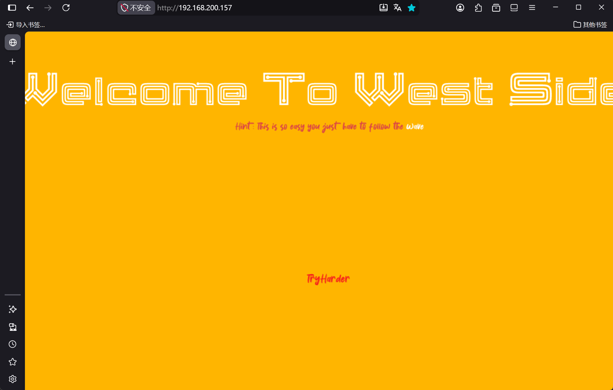

网页源码：

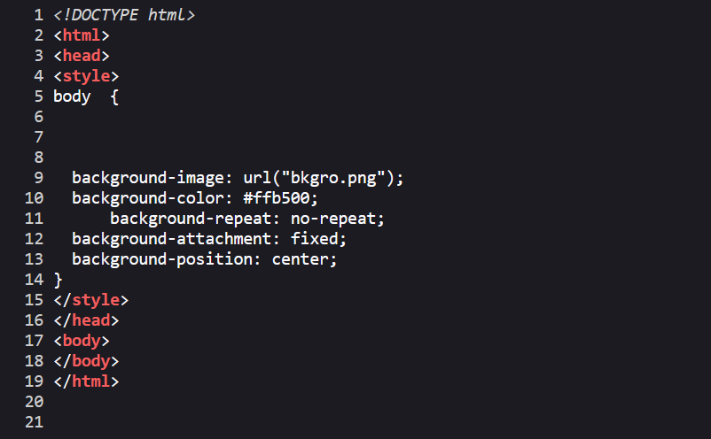

背景图片地址：`http://192.168.200.157/bkgro.png`，下载检查后未发现隐写信息。

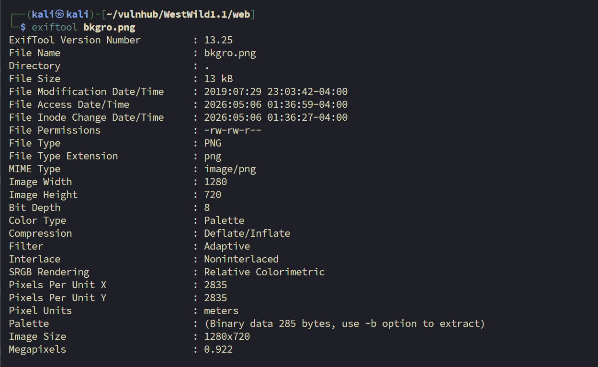

对 Web 服务进行目录枚举，未发现有效路径。

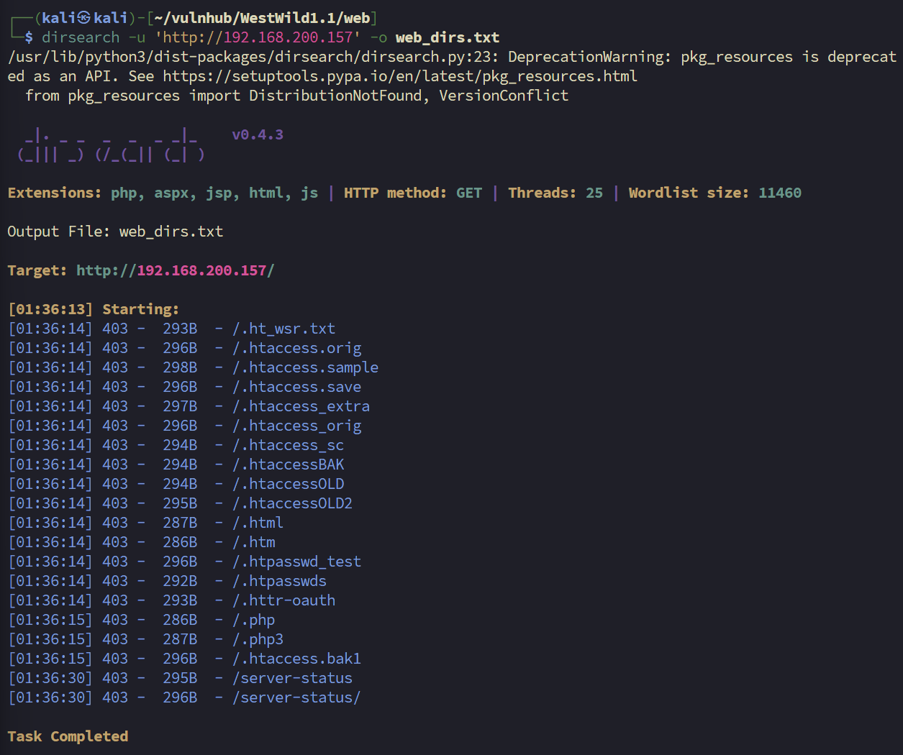

Web 方向暂无突破口，转向 SMB 服务继续枚举。

---
## 1.3 SMB 探测

由于 Nmap 已确认 SMB 允许 guest 匿名访问，使用 `smbclient` 列出共享目录：

```bash
$ smbclient -L //192.168.200.157
Password for [WORKGROUP\kali]:

        Sharename       Type      Comment
        ---------       ----      -------
        print$          Disk      Printer Drivers
        wave            Disk      WaveDoor
        IPC$            IPC       IPC Service (WestWild server (Samba, Ubuntu))
Reconnecting with SMB1 for workgroup listing.

        Server               Comment
        ---------            -------

        Workgroup            Master
        ---------            -------
        WORKGROUP     
```

发现名为 `wave` 的共享目录，使用 guest 身份匿名连接并列出文件：

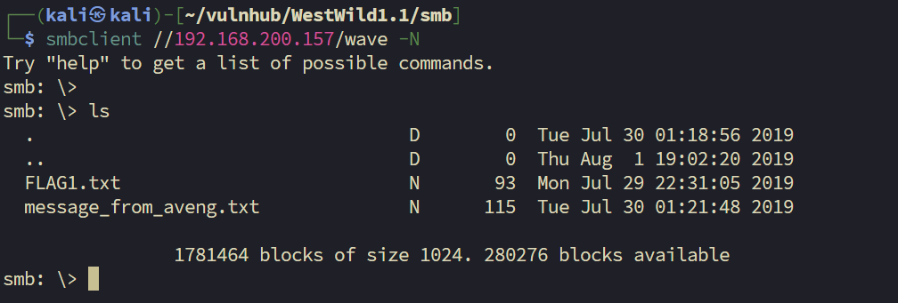

目录下存在两个文件，分别下载并分析。

#### SMB 常用命令参考：

```bash
# 连接共享（guest 用户）
smbclient //192.168.200.157/共享名 -N

# 指定连接用户
smbclient //192.168.200.157/共享名 -U 用户名

# 进入后的常用命令：
ls                        # 查看文件列表
cd 目录名                  # 进入目录
get 文件名                 # 下载单个文件
get 文件名 /本地/保存路径   # 下载到指定位置
mget *.txt                # 批量下载（支持通配符）
```

#### 查看文件

**FLAG1.txt**

文件内容为一段字符串：

```text
RmxhZzF7V2VsY29tZV9UMF9USEUtVzNTVC1XMUxELUIwcmRlcn0KdXNlcjp3YXZleApwYXNzd29yZDpkb29yK29wZW4K
```

hash-identifier 没有找到，看格式猜测是 Base64，使用 Base64 解码：

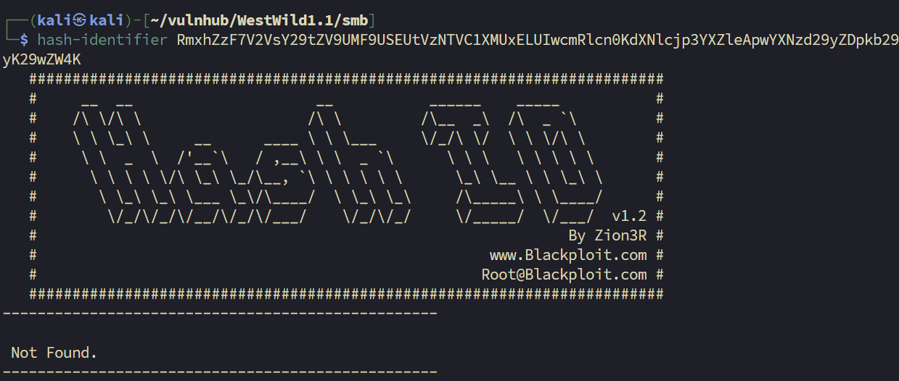

这似乎是一个用户的账户和密码，欸是不是SSH等下我们可以试试。

```text
Flag1{Welcome_T0_THE-W3ST-W1LD-B0rder}
user:wavex
password:door+open
```

**message_from_aveng.txt**

```
Dear Wave ,
Am Sorry but i was lost my password ,
and i believe that you can reset  it for me . 
Thank You 
Aveng 
```

这封信说明系统中存在另一个用户 `aveng`，且其密码已丢失，为后续提权阶段埋下伏笔。

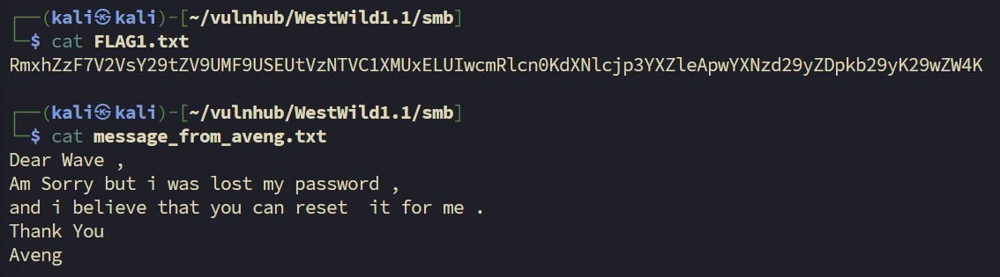

# 2. 权限立足

不是哥们这就拿下了？？？ 那我们直接可以跳到提权部分了。

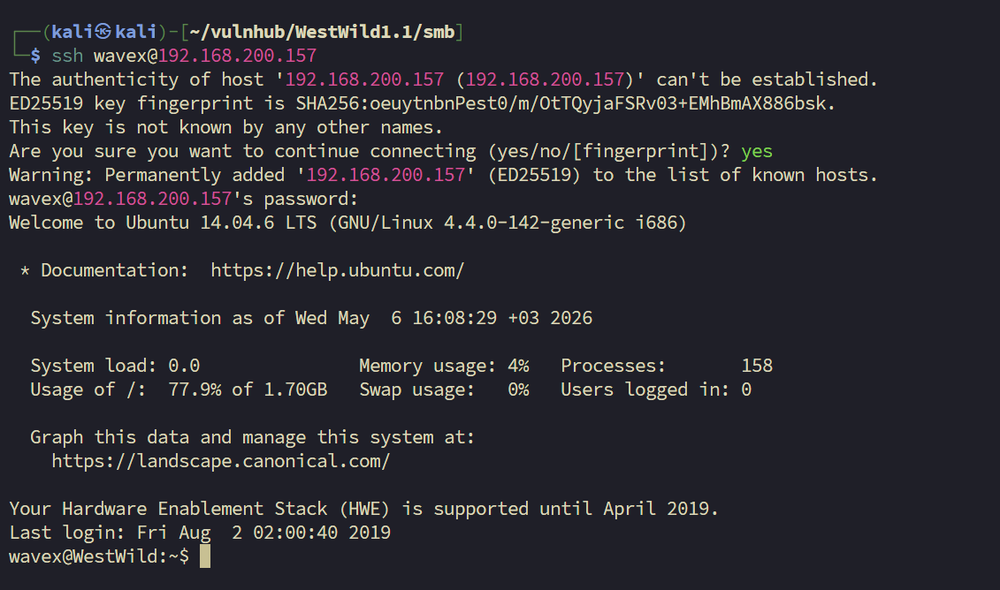

# 3. 提权

### 3.1 信息枚举

登入 `wavex` 用户后，首先进行基础信息收集，了解当前系统环境。

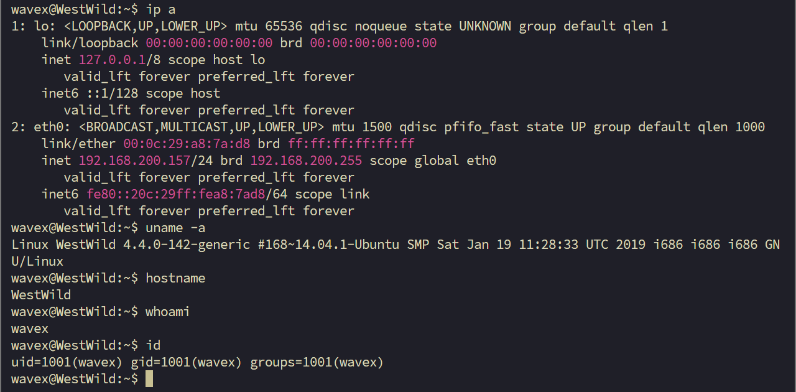

确认当前用户为 `wavex`，系统为 Ubuntu 14.04，内核版本 4.4.0-142，32 位架构。 

接着检查 sudo 权限、计划任务及 SUID 文件，均未发现可利用点：

```bash
# sudo 权限
wavex@WestWild:~$ sudo -l
[sudo] password for wavex: 
Sorry, user wavex may not run sudo on WestWild.


# 计划任务
wavex@WestWild:~$ cat /etc/crontab 
# /etc/crontab: system-wide crontab

SHELL=/bin/sh
PATH=/usr/local/sbin:/usr/local/bin:/sbin:/bin:/usr/sbin:/usr/bin

# m h dom mon dow user  command
17 *    * * *   root    cd / && run-parts --report /etc/cron.hourly
25 6    * * *   root    test -x /usr/sbin/anacron || ( cd / && run-parts --report /etc/cron.daily )
47 6    * * 7   root    test -x /usr/sbin/anacron || ( cd / && run-parts --report /etc/cron.weekly )
52 6    1 * *   root    test -x /usr/sbin/anacron || ( cd / && run-parts --report /etc/cron.monthly )

# SUID 文件 
wavex@WestWild:~$ find / -perm -u=s -type f 2>/dev/null
```

以上路径均无可利用项，转向文件权限枚举。

---
### 3.2 发现敏感文件

枚举当前用户可写的文件，寻找潜在的敏感信息：

```bash
wavex@WestWild:~$ find / -writable -type f ! -path '/proc/*' 2>/dev/null
/sys/fs/cgroup/systemd/user/1001.user/3.session/tasks
/sys/fs/cgroup/systemd/user/1001.user/3.session/cgroup.procs
/sys/fs/cgroup/systemd/user/1001.user/4.session/tasks
/sys/fs/cgroup/systemd/user/1001.user/4.session/cgroup.procs
/sys/kernel/security/apparmor/policy/.remove
/sys/kernel/security/apparmor/policy/.replace
/sys/kernel/security/apparmor/policy/.load
/sys/kernel/security/apparmor/.remove
/sys/kernel/security/apparmor/.replace
/sys/kernel/security/apparmor/.load
/sys/kernel/security/apparmor/.ns_name
/sys/kernel/security/apparmor/.ns_level
/sys/kernel/security/apparmor/.ns_stacked
/sys/kernel/security/apparmor/.stacked
/sys/kernel/security/apparmor/.access
/usr/share/av/westsidesecret/ififoregt.sh   # <-- 重点关注
/home/wavex/.cache/motd.legal-displayed
/home/wavex/wave/FLAG1.txt
/home/wavex/wave/message_from_aveng.txt
/home/wavex/.bash_history
/home/wavex/.profile
/home/wavex/.bashrc
/home/wavex/.viminfo
/home/wavex/.bash_logout
```

在结果中发现一个位于非常规路径下的可疑脚本文件：
>`/usr/share/av/westsidesecret/ififoregt.sh`。

文件名 `ififoregt`（"if I forget"）暗示这是一个密码备忘脚本，查看其内容：

```bash
wavex@WestWild:~$ cat /usr/share/av/westsidesecret/ififoregt.sh
#!/bin/bash
figlet "if i foregt so this my way"
echo "user:aveng"
echo "password:kaizen+80"
```

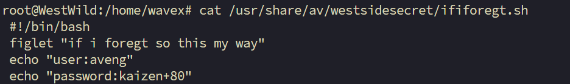

文件中明文存储了另一个用户 `aveng` 的登录凭据：

| 字段  | 值         |
| --- | --------- |
| 用户名 | aveng     |
| 密码  | kaizen+80 |

---
### 3.3 横向移动 & 垂直提权

利用获取到的凭据切换至 `aveng` 用户，并检查其 sudo 权限：

```bash
wavex@WestWild:~$ su aveng
Password:          # 输入 kaizen+80
aveng@WestWild:/home/wavex$ sudo -l
[sudo] password for aveng:
Matching Defaults entries for aveng on WestWild:
    env_reset, mail_badpass,
    secure_path=/usr/local/sbin\:/usr/local/bin\:/usr/sbin\:/usr/bin\:/sbin\:/bin\:/snap/bin

User aveng may run the following commands on WestWild:
    (ALL : ALL) ALL
```

`aveng` 用户具备完整的 sudo 权限（`ALL:ALL`），直接提权至 root：

```bash
aveng@WestWild:/home/wavex$ sudo su
root@WestWild:/home/wavex# id
uid=0(root) gid=0(root) groups=0(root)
root@WestWild:/home/wavex# whoami
root
```

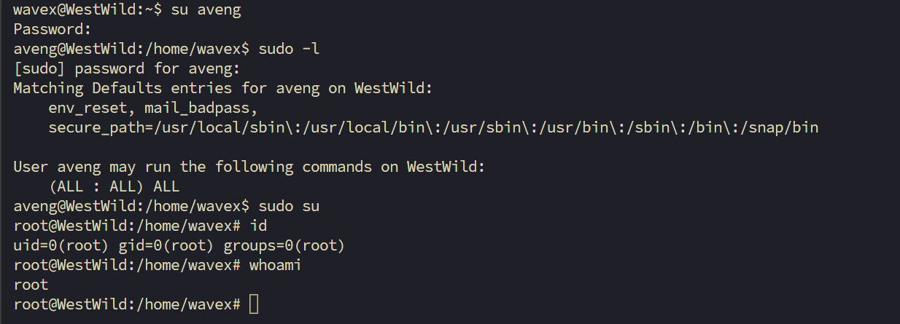

---
### 3.4 提权链总结

本次提权路径清晰，分为两个阶段：

```text
wavex（低权限用户）
    ↓  find / -writable 枚举可写文件
    ↓  发现 /usr/share/av/westsidesecret/ififoregt.sh
    ↓  读取文件，获得 aveng 用户明文凭据
aveng（普通用户）
    ↓  sudo -l 发现 (ALL:ALL) ALL
    ↓  sudo su
root ✓
```

|阶段|技术手法|说明|
|---|---|---|
|信息收集|`find / -writable`|枚举当前用户可写文件|
|横向移动|明文凭据|从脚本文件中读取 aveng 密码|
|垂直提权|sudo 滥用|aveng 拥有无限制 sudo 权限|

# 4. 总结

超级超级简单的一台机器，不过我还是在提权阶段卡了一下。但是，又学到新的知识点（好开心），下次在提权的时候又多了一条需要找的内容，寻找当前用户可以写权限的文件。


